# 如何构建非地理地图#2

> 原文：<https://towardsdatascience.com/how-to-build-a-non-geographical-map-2-340256ad9f16?source=collection_archive---------14----------------------->

## 或者如何将散点图变成交互式地图(使用传单和 JavaScript)

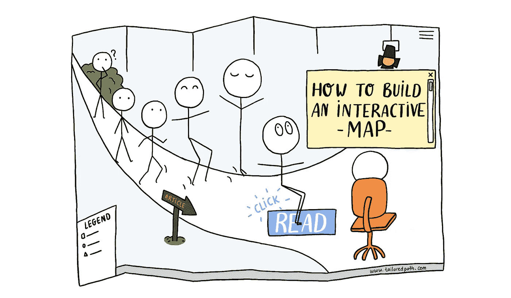

This guy’s body may seem odd and his chair disproportionate, but aren’t maps a distortion of reality, anyway? :)

地图是数据可视化的强大设计对象。他们强调元素之间的空间关系和变量的比较。在非地理数据的背景下，web 地图可以增强传统的散点图。

*🔗链接到*[*#第 1 部分:如何用降维映射相似性*](/how-to-build-a-non-geographical-map-1-8d3373e83d6c)

# #第 2 部分:从散点图到交互式地图

数据可视化的核心是通信。将吓人的桌子变成引人入胜的故事的能力。通常，最终目标是推动解决问题或决策的洞察力。在大多数情况下，用户不会玩弄数据，而是采取被动的态度。但是，如果你想授权给你的观众，激发他们的好奇心，并允许他们探索数据呢？

我们用地图来探索未知。他们给了我们走出人迹罕至的道路的信心。我们偏离了最初的路线，在一家咖啡馆停下来，或者绕道经过一个博物馆。这也是我们使用网络的方式。我们进行搜索，一个链接指向另一个，最终我们对一些我们点击几下之前甚至不知道存在的东西产生了兴趣。

我们能以同样偶然的方式传递数据吗？

在本系列的第一部分[中，我们使用了降维技术来绘制 2D 空间中的相似性。我们最终得到了一个新的坐标系统，使我们能够在散点图中可视化我们的数据(见](/how-to-build-a-non-geographical-map-1-8d3373e83d6c)[图(Plotly)](https://plot.ly/~fanny_kassapian/1/#/) )。

在本文中，我们将把它转换成一个交互式地图，包括一个搜索栏和一个侧面板。我们将使用传单和一些额外的 JavaScript。

> **无论数据类型如何，本文可能对任何想要构建 web 地图的人都有用。如果是这种情况，请跳到第 2 步。**

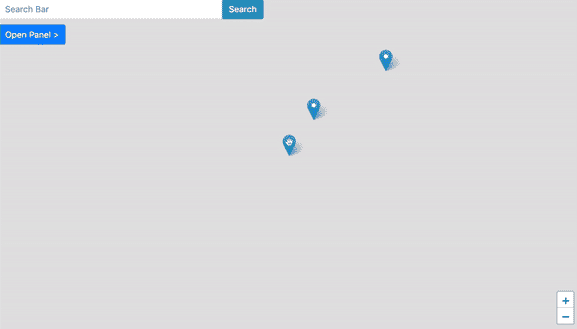

>> [See code & end result (CodePen)](https://codepen.io/fannykassapian/pen/qJOvbB)

# 第一步。建立一个坐标的 JSON

如果您遵循非地理数据映射的，您现在有一个嵌入——一个(非常非常长的)Numpy 坐标数组，代表您在 2D 的数据。

***为了在传单地图上绘制所有这些数据点，我们需要将它们存储到一个 JavaScript 对象中。***

为此，我们可以将 DataFrame 转换成 JSON 字符串，并用 JavaScript 处理它。

如果您只有几个数据点要绘制，那么您可能想跳过这一步，手动将它们存储在您的 JavaScript 中。

另外，请记住，每个用户每次打开页面时都会“加载”整个 JSON。这会影响你网站的表现。根据您拥有的数据量和流量，您可能更喜欢从数据库中动态加载内容。

**1/创建一个数据帧**

在本例中，我将使用:

*   基于技能和知识相似性的职业映射产生的[嵌入](/how-to-build-a-non-geographical-map-1-8d3373e83d6c)和
*   [ONET 开放数据库](https://www.onetcenter.org/database.html)。

我们的 JSON 必须包含每个标记的坐标和一些数据，比如它的标题和描述，我们将用它们来更新面板的内容。

下面是我创建数据框所遵循的步骤的简要描述。你可以在这里找到[完整笔记本(Github)](https://github.com/fannykassapian/python_json_coordinates/blob/master/UMAP.ipynb) :

*   从 O*NET 加载了 [Occupation Data.xlsx](https://www.onetcenter.org/dictionary/23.1/excel/occupation_data.html) 文件后，我创建了两个系列。我使用 O*NET SOC 代码作为他们的公共索引，使用职业头衔和描述作为他们各自的值。然后，我将它们组合成一个单一的数据帧。
*   最后，我创建了一个所有职业标题及其各自坐标数组的字典(基于 UMAP 嵌入)，并将其映射到数据框的标题列。

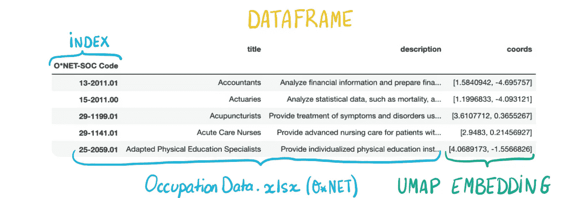

This is what your DataFrame should look like.

**2/转换成 JSON**

*   Pandas 有一个内置函数，可以将对象转换为 JSON 字符串:

```
yourdataframe.to_json('newfile.json', orient='index')
```

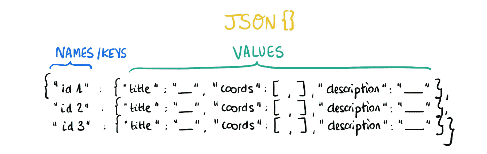

This is what the JSON looks like.

更多详情可以在这里找到[完整笔记本(Github)](https://github.com/fannykassapian/python_json_coordinates/blob/master/UMAP.ipynb) 。

# 第二步。用传单创建地图


[Leaflet.js](https://leafletjs.com/) is an open-source JavaScript library for responsive & interactive maps. It offers wonderful features and a beautiful default design.

创建这张地图需要 [**传单**](https://leafletjs.com/download.html) **，** [**自举**](https://getbootstrap.com/docs/4.1/getting-started/introduction/) **，**[**jQuery**](https://code.jquery.com/)**和**[**jQuery-ui**](https://cdnjs.com/libraries/jqueryui)。确保在您的代码中包含指向它们的 CSS 和 JS 库的链接。

**1/创建地图**

在这篇文章中，我将只使用非常基本的传单设置，并侧重于面板与地图的交互性。然而，你可以用传单做很多令人惊奇的事情，值得一看。

下面是一个快速设置。或者，你可以遵循他们的[快速入门指南](https://leafletjs.com/examples/quick-start/)。

*   在您的 HTML 中，创建一个空容器:`<div id="mapDemo"> </div>`
*   地图容器必须具有定义的高度。在这里，我将其设置为 100%的查看器屏幕:`#mapDemo {width: 100vw; height: 100vh;}`
*   在你的 JS 中，创建地图:`map = L.map('mapDemo');`。因为我们在左边有一个面板，所以我们把缩放控件放在屏幕的右下角:`map.zoomControl.setPosition('bottomright');`

**2/地块标记**

数据存储在一个 JSON 文件中，其结构与 JavaScript 字典相同。请注意，我的 [codePen 示例](https://codepen.io/fannykassapian/pen/qJOvbB)基于一个只有 3 个元素和 3 个特性(“标题”、“坐标”和“描述”)的 JavaScript 字典。

*   首先，将 JSON 文件存储在 JavaScript 字典`var markers = {}`中:

```
var markers = $.getJSON("map_data.json");
```

*   然后，遍历字典，将每个标记的特征存储在`markerOptions`下。用`addTo(map)`绘制它们:

```
$.each(markers, function(key, val) {
  var markerOptions = {markerId: key,
                       markerTitle: val['title'],
                       markerText: val['description']}; var marker = L.marker(val['coords'], markerOptions).addTo(map);
});
```

*   要查看标记，请在数据坐标范围内设置地图视图:

```
var bounds = [[-10,-10], [10,10]];
map.fitBounds(bounds);
```

# 第三步。奠定基础

在处理交互性之前，让我们先把 HTML 和 CSS 放在一边。

**1/ HTML**

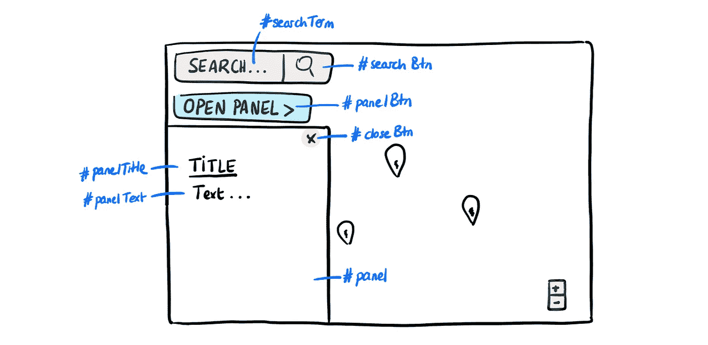

Main elements and their ids. >> [See CodePen](https://codepen.io/fannykassapian/pen/qJOvbB)

*   在 HTML 的`<body>`中，创建一个带有表单控件(`#searchTerm`)和按钮(`#searchBtn`)的输入组。
*   下面，添加一个按钮(`#panelBtn`)。它将允许用户随时打开/关闭面板。
*   对于面板，添加一个带有关闭按钮(`#closeBtn`)的`<div>`和将用标记数据更新的内容(如标题和段落)。

**2/ CSS**

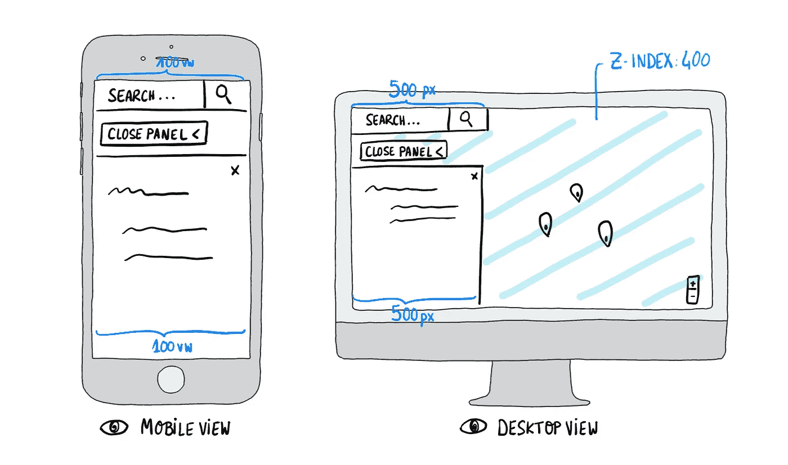

This map is mobile first. I only included a media query for screens that are 500px wide and above, but you may want to refine that.

*   在你的 CSS 中，确保所有应该位于地图顶部的元素都有一个大于 400 的`z-index`(400 是地图的`z-index`)。
*   默认情况下，`#panel`是隐藏的，只有在`.active`时才显示。将`left`属性设置为与`#panel`元素宽度相同的大小以隐藏它，当`#panel.active`时切换为 0(显示它)。
*   对于面板高度，使用`top`和`bottom`属性定义元素的开始和结束位置。请注意，如果您没有设置`bottom`，而是定义了一个`height`，滚动将不会像您预期的那样工作。`#panel`将继续位于可见屏幕的“外部”(尽管有`overflow-y:scroll;`)。
*   在移动和小屏幕上，面板和输入组占据整个宽度。所以，我设置了`width:100vw;`，但是对于超过 500 像素宽的屏幕，我把它改成了`width:500px;`。

你可以在这里找到[完整代码(codePen)](https://codepen.io/fannykassapian/pen/qJOvbB) 。

3/数据结构

我们必须向前跳一点，考虑我们需要访问哪些数据来显示正确的输出。

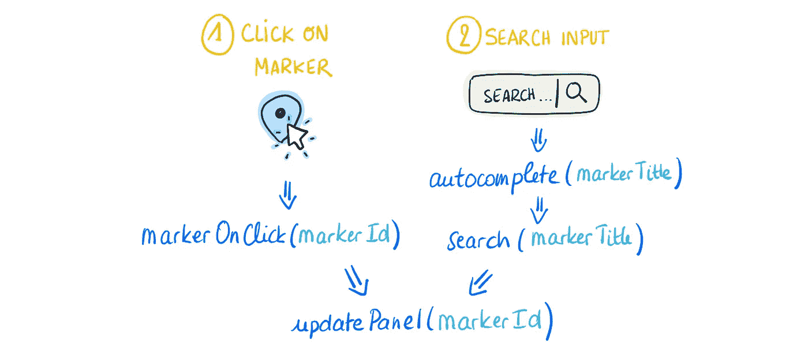

Overview of the events that require access to markers’ data. In blue are the functions and in turquoise their respective arguments.

## 字典

让我们将点击标记时调用的函数称为`markerOnClick()`，将进入搜索后调用的函数称为`search()`(通过点击建议的标记标题或点击搜索按钮)。

这些功能有许多共同的步骤。为了避免两次编写相同的代码，我们将这些步骤包含在`updatePanel()`函数中。

为了用附加到每个`markerId`的标题和文本更新面板，`updatePanel()`必须能够访问一些其他标记特征。同样，`search()`是`markerTitle`的一个函数，但是需要访问`markerId`来调用`updatePanel()`。

为了让函数能够访问这些特性，我们需要字典。

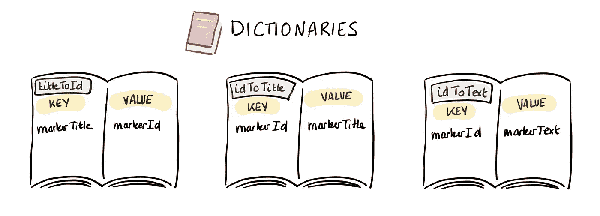

These are the key-value pairs that we need.

*   创建 3 个字典:`var titleToId = {}; var idToTitle = {}; var idToText = {};`
*   然后，在遍历`markers{}`字典时追加它们:

```
$.each(markers, function(key, val) {
...
  titleToId[val['title']] = key;
  idToTitle[key] = val['title'];  
  idToText[key] = val['description'];
...
});
```

## 目录

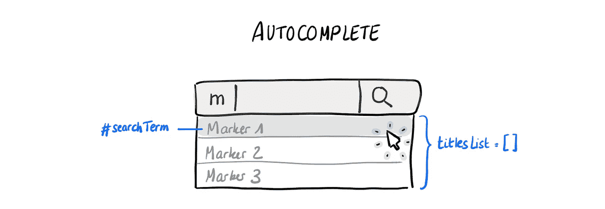

当用户输入一个搜索时，它调用`autocomplete()`，根据用户输入给出所有可能的标记标题。因此，此函数的数据源必须是标记标题列表:

*   创建您在标记循环中附加的标记标题`var titlesList =[];`列表:

```
$.each(markers, function(key, val) {
...
titlesList.push(val['title']);
...
});
```

# 第四步。协调互动

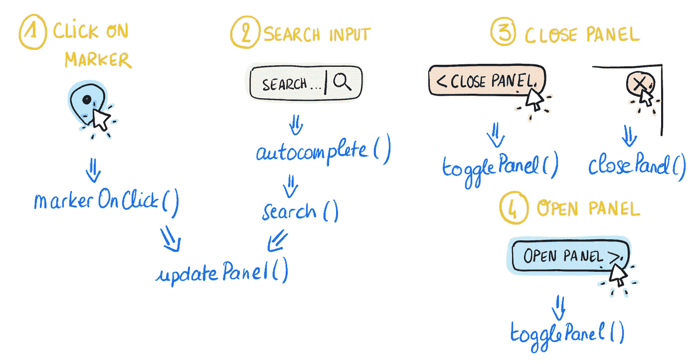

Overview of the functions associated with panel interactivity.

**1/点击标记**


When a marker is clicked: the search bar is updated with the marker’s title, the “open panel” button changes to “close panel”, and the panel opens and displays some content attached to that marker.

*   *定义`updatePanel()`:*

```
*var updatePanel = function(mId){
  $('#panel').addClass('active');
  $("#panelBtn").text('< Close Panel');
  var markerTitle = idToTitle[mId];
  var markerText = idToText[mId];
  $('#panelTitle').text(markerTitle);
  $('#panelText').text(markerText);
};*
```

## ****marker onclick()****

*   *并在`markerOnClik()`内呼叫`updatePanel()`:*

```
*var markerOnClick = function(){
  var mId = this.options.markerId;
  var markerTitle = idToTitle[mId];
  $('#searchTerm').val(markerTitle);
  updatePanel(mId);
};*
```

*   *在循环中，将 onClick 事件添加到所有标记中。设置弹出选项(popupContent)并将弹出绑定到标记单击:*

```
*$.each(markers, function(key, val) {
...
  marker.on('click', markerOnClick);
  var popupContent = val['title'];
  marker.bindPopup(popupContent);
...
});*
```

*现在，当用户点击一个标记时，相应的弹出窗口就会打开。*

***2/搜索输入***

*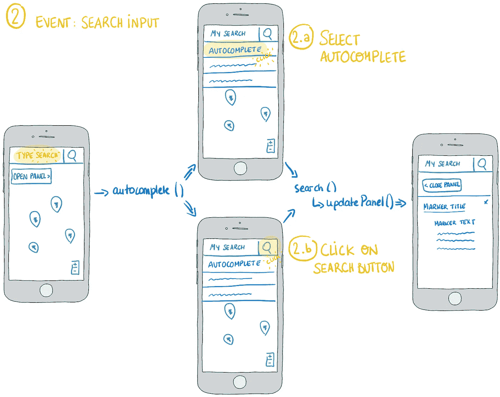*

*When the user types in the search bar, the autocomplete suggests a few marker titles. From there, the user can either select one of those suggestions or confirm her search. Either way, the output is the same as when a user clicks on a marker (see 1/ Click on marker).*

## ****autocomplete()****

*   *这里，我们定义了 autocomplete()的选项。同样，当从自动完成中选择一个条目时，我们将其值存储在`#searchTerm`中并调用`search()`:*

```
*$(function() {
   $("#searchTerm").autocomplete({
     source: titlesList,
     minLength: 1,
     select: function(event, ui) { 
       $("#searchTerm").val(ui.item.label);
       console.log(ui.item.label);
       search();
     }
   });
 });*
```

## ****搜索()****

*现在，如果用户点击一个建议的`markerTitle`，就会调用`search()`和`updatePanel()`。但是，如果没有实际点击标记，弹出窗口就不会显示。*

*一种解决方案是给每个标记附加不同的层。然后我们可以将 fleet 的 openPopup()方法应用于`search()`函数中的层。*

*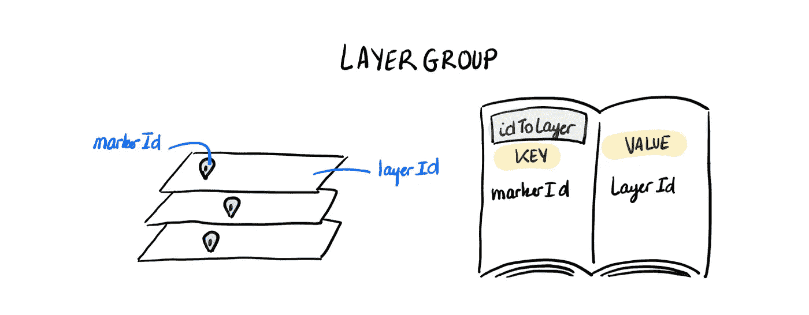*

*LayerGroup is a method from the Layer class used to group several layers and handle them as one >> see [documentation](https://leafletjs.com/reference-1.4.0.html#layergroup)*

*   *创建一组图层`var layers = L.layerGroup().addTo(map);`并在标记循环`layers.addLayer(marker)`中更新*
*   *每个标记都有一个层，但是我们需要一个字典来允许我们根据标记的`markerId` : `var idToLayer = {};`检索标记的层:*

```
*$.each(fgLayers._layers, function(key,val){
  idToLayer[val.options.markerId] = key;
});*
```

*   *我们终于可以定义`search()`函数了。它从搜索字段中获取`markerTitle`，找到它对应的标记，打开它的弹出窗口并调用`updatePanel()`:*

```
*var search = function(){
 $("#searchTerm").blur(); 
 var markerTitle = $("#searchTerm").val();
 var markerId = titleToId[markerTitle];
 var layerId = idToLayer[markerId];
 var layer = layers._layers[layerId];
 layer.openPopup(); updatePanel(markerId);
}*
```

***3/打开-关闭面板***

*在用户进行搜索或点击标记后，我们希望他们能够关闭面板并随时返回地图。我们还想让他们直接从地图上重新打开面板。*

*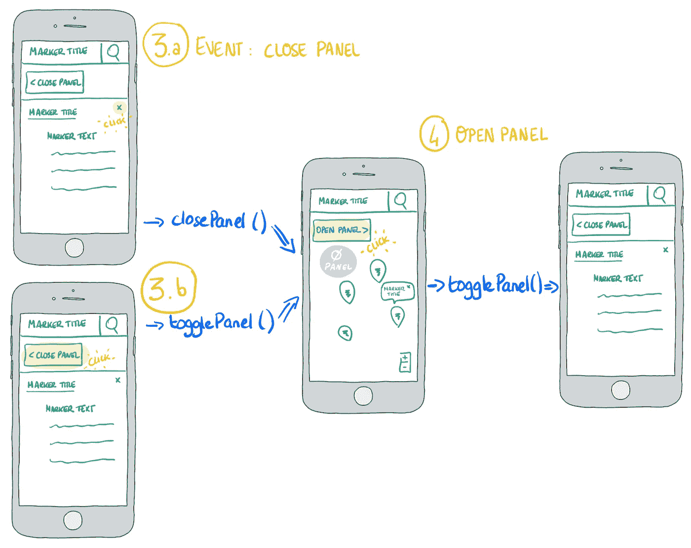*

*To close the panel, the user can either click the close button of the panel or click the “close panel” button on the map.*

## *togglePanel()*

*`#panelBtn`按钮允许用户连续打开或关闭面板。它的内容应该根据它允许用户接下来做的动作(打开或关闭)而改变。我们可以通过使用 jQuery 的 toggleClass 方法来实现这一点。*

*   *给按钮添加一个 onClick 事件:`<button onClick = "togglePanel()";>`并定义`togglePanel()`:*

```
*var togglePanel = function() {
  $('#panel').toggleClass('active');             
  $("#panelBtn").text(($("#panelBtn").text() == 'Open Panel >') ? '< Close Panel' : 'Open Panel >'); 
}*
```

## *关闭面板()*

*`#closeBtn`按钮允许用户在面板打开时关闭面板，并更新`#panelBtn`内部 HTML。*

*   *给按钮添加一个 onClick 事件:`<button onClick = "closePanel()";>`并定义`closePanel()`:*

```
*var closePanel = function() {
  $('#panel').removeClass('active');
  $('#panelBtn').text('Open Panel >');
}*
```

# *包裹*

## *感谢您的阅读😃*

*在本系列中，我们介绍了如何使用降维来构建散点图，该散点图使用距离作为相似性的代理，并将其转换为交互式地图。*

*我在撰写这些文章和为它们配插图的过程中获得了很多乐趣，并在此过程中学到了很多东西。我希望你已经发现它是有用的，并且我期待在那里看见更多令人惊奇的地图。*

## *🔗链接到[#第 1 部分:如何通过降维映射相似性](/how-to-build-a-non-geographical-map-1-8d3373e83d6c)*

## *👉看看我是如何在实践中使用它的:[www.tailoredpath.com](http://www.tailoredpath.com)*