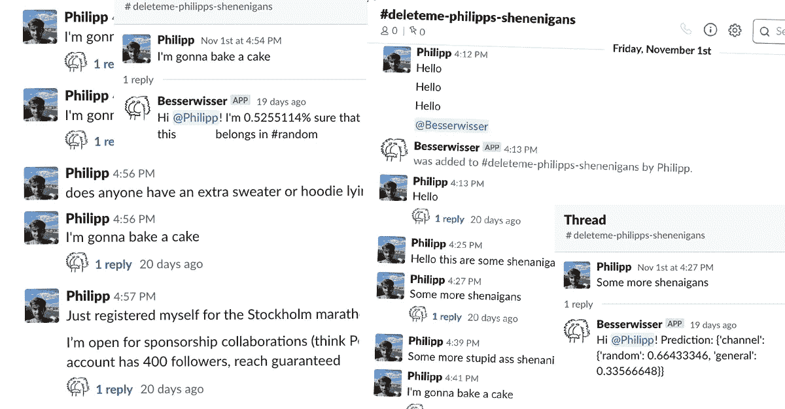
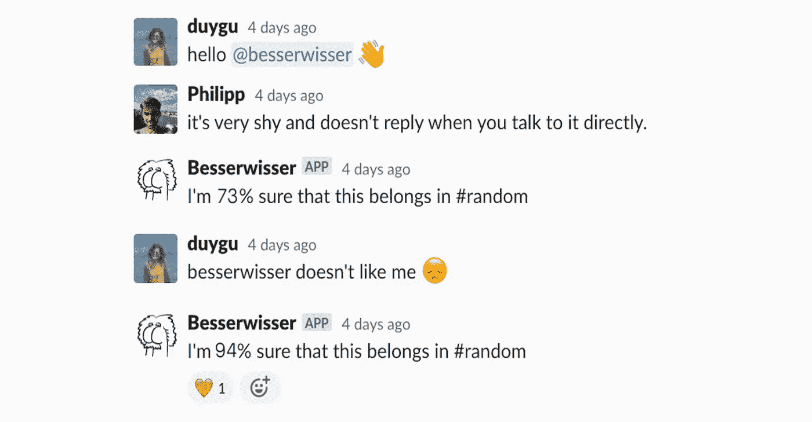

# 如何为松弛消息建立一个具有 BERT 文本分类的 AI Besserwisser

> 原文：<https://towardsdatascience.com/how-to-build-a-real-besserwisser-with-bert-text-classification-for-slack-messages-b4a13d7ca822?source=collection_archive---------14----------------------->

当别人在电子邮件中不应该“回复所有人”时，或者有人在不属于它的频道上写了一条松散的消息时，我总是被人们的愤怒逗乐。

有鉴于此，我决定在 Peltarion 平台上玩一玩新发布的预训练 BERT(来自变压器的双向编码器表示)块，看看我是否可以建立一个识别松弛消息模式的模型，以便告诉人们何时消息被发布在错误的松弛通道上，并建议它属于哪里。

所以让我们建造一个机器人，也就是真正的无所不知者，它可以自动完成这项工作😈。

Image of Besserwisser via [buttsss.com](https://www.google.com/url?q=http://buttsss.com&sa=D&ust=1574738895243000&usg=AFQjCNFSCdE4ft5FyHDAOpadeBvryevXMQ) by Pablo Stanley.

在我工作的 Peltarion，我们有许多不同的休闲频道，用于各种目的。我们有自己的“官方”渠道，但也有很多其他更小的渠道。一些相当模糊的，因为人们有许多不同的兴趣。我们有#general(官方声明)、#random(不在 general 之列的东西)、#climbing、#music、#boardgames、#壁球……应有尽有。

总的来说，我确实认为人们很善于决定什么属于哪个频道。因此，我的直觉是，有某种东西可以区分来自不同渠道的信息，这是一个模型应该能够学习的。但是让我们来看看。

为了给我们的模型一个公平的机会，我们需要每个通道有相当数量的消息。看起来似乎大多数“问题”都是在一条消息被发布在#general 中时出现的，而实际上它应该被发布在#random 中。所以，我决定开始使用这两个渠道。使用 [Slack 的 Python API 客户端](https://github.com/slackapi/python-slackclient)，从这两个渠道获取消息，然后将它们上传到 [Peltarion 平台](https://peltarion.com/?utm_medium=blogreferral%20&utm_source=medium&utm_campaign=blogpost_buildabesserwisserbot&utm_content=page_homepage&utm_term=link)(基于云的深度学习平台)非常容易。

## **建立模型**

*下一步:构建模型。*这部分可能会比较棘手，尤其是如果你之前没有那么多构建 AI/深度学习模型的经验。但老实说，这可能是整个项目中最简单的部分，因为我可以将预先训练好的 BERT 模块插入到我的模型中。我尝试了一些不同的超参数，可以在两分钟内开始训练——通常我需要花更长的时间来决定 GitHub repo 的名称🤔。

构建、微调和部署花了我大约 30 分钟的时间。我运行了几个不同的实验(3-4)，选择了一个准确率最高的实验(72%；不太好，但对这个小玩具项目来说足够好了)。然后，训练需要大约半小时到一小时来完成。

## 现在，让我们看看这位模特在野外的表现吧！

为此，我构建了一个非常简单的 Slackbot(简单得近乎愚蠢),它可以仔细检查消息并决定它们属于哪个通道。现在，无论何时有人在错误的渠道发布消息，你不必非得是*那个*同事告诉他们。相反，让你自己的私人贝塞威斯为你照顾它。*任务完成！*

**…以下是如何将 Besserwisser 应用于其他真实用例的方法**

对我来说，创建这个 BERT 应用程序只是一种有趣的方式，可以玩玩预先训练好的模型，并在我的日常生活中部署它。如果我在这上面多花一些时间，我会继续微调它，以获得更高的精度。使用来自两个以上 Slack 通道的数据来获得一个更有用的 Slackbot 也是很有趣的，它可以给出更多关于消息归属的建议。

如果你想亲自尝试，这里有一个由我的同事 Calle 创建的循序渐进的教程。

同样的模型也可以应用到其他领域，也许是更多的“现实生活”用例。假设你在一家公司工作，有大量的客户支持任务要处理。日复一日，信息不断涌入，从客户那里发来，希望得到迅速的答复(最好是尽快)。根据问题的不同，这些消息需要由组织中不同的人来回答。构建和部署一个与我的 Slackbot 应用程序中使用的模型类似的模型，可以允许根据主题/应该重定向给谁来对所有消息进行分类。通过这种方式，门票可以最终到达正确的人手中，并更快地得到处理。

*如果你喜欢贝塞维瑟的 Slack icon，去看看巴勃罗·斯坦利的*[*buttsss.com*](https://www.buttsss.com/)*(他也有很多其他的好东西)。*