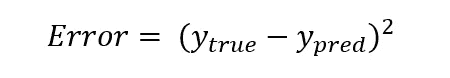

# 如何为星巴克搭建推荐引擎

> 原文：<https://towardsdatascience.com/how-to-build-a-recommendation-engine-for-starbucks-662a982df0c2?source=collection_archive---------14----------------------->

The Embarcadero, San Francisco, CA

咖啡对我们生活和文化的影响怎么强调都不为过。2018 年，64%的 18 岁或以上的美国人说他们前一天喝了一杯咖啡，而星巴克约占美国咖啡连锁行业的 40%。

在这篇文章中，我们将探索不同的方法来建立一个推荐引擎，推荐 10 种未指定的星巴克产品。这些优惠可以是*买一送一* (BOGO)，折扣或信息。共有 10 个优惠，它们在难度、持续时间和奖励方面各不相同。

对于每一种方法，我们将用数学公式抽象出问题，解释它如何应用到方法中，并用 python 代码解释它。

# 获取数据

Photo by [Nathan Dumlao](https://unsplash.com/@nate_dumlao?utm_source=medium&utm_medium=referral) on [Unsplash](https://unsplash.com?utm_source=medium&utm_medium=referral)

用户的[数据](https://github.com/NadimKawwa/starbucks/tree/master/data)已经被清理，在 [GitHub](https://github.com/NadimKawwa/starbucks/blob/master/03_Starbucks_Capstone_notebook_RecommendationEngine.ipynb) 上有 python 的详细实现。虽然没有在这篇文章中讨论，但是[清洗过程](/a-z-feature-engineering-with-starbucks-b40c47462de9)在设置中注入了一些变化，并且影响了我们的输出。

任何数据科学项目的症结都在于数据收集、争论以及在此过程中做出的许多假设。这个项目绝不是一个例外。当我们讨论不同的方法时，请记住数据的质量是支持我们结论的基石。

第一条信息是用户特征矩阵，其中行是 Starbucks 用户 id，列是关于这些用户的属性。我们总共有大约 17，000 个用户和 23 个功能，有些是直接观察到的，例如:

*   收到的报价数量
*   报价类型(电子邮件、社交媒体等)
*   收入

其他的来源于用户抄本，例如:

*   回应或完成报价的平均时间
*   每次出价的平均奖励
*   因为出价而花费的总金额

下面是用户数据框架的示例截图:

User-Feature Matrix

还有一份抄本的样本:

Transcript of User Behavior

第三个数据帧是一个用户项目矩阵，其中行是用户，列是报价 id，这也是一个非常稀疏的矩阵。我们的条目将是多少次，如果有的话，用户已经查看了报价。如果没有收到报价，我们输入一个 [NaN](https://en.wikipedia.org/wiki/NaN) 值，因为我们无法衡量未被请求的参与度。

User-Item Matrix

# 推荐什么最受欢迎

Photo by [Toa Heftiba](https://unsplash.com/@heftiba?utm_source=medium&utm_medium=referral) on [Unsplash](https://unsplash.com?utm_source=medium&utm_medium=referral)

美国最受欢迎的咖啡饮料是拿铁，美国人在 2017 年 6 月至 2018 年 6 月期间喝了超过 [67，000，000](https://squareup.com/us/en/townsquare/coffee-day-2018) 杯拿铁。我们应该总是建议喝杯拿铁吗？

第一种方法是最简单的:建议什么是最流行的。人们的假设是，受大众欢迎的东西也受个人欢迎。

出现的一个问题是，我们如何定义流行度，在这种情况下，我们提出两种方法:

*   浏览量最多的出价
*   每次观看回报率最高的报价

最受欢迎视图的实现方式如下:

这种方法在新颖性和用户的意外收获方面有所欠缺。它还可以通过已经流行的方式使项目变得流行。

然而，这是一个稳健的解决方案，这也意味着我们总是有地方开始，并且不受冷启动问题的影响。此外，将这个工具放在用户手中也很有用，他们可以选择“最流行”或“最近”的项目。这是一个基于[知识的](https://en.wikipedia.org/wiki/Knowledge-based_recommender_system)方法的例子。

当我们探索其他方法时，我们的基本假设是视图会带来更多的用户参与和金钱回报。

# 协同过滤:用户-用户相似性

Photo by [Nani Williams](https://unsplash.com/@nanihana?utm_source=medium&utm_medium=referral) on [Unsplash](https://unsplash.com?utm_source=medium&utm_medium=referral)

我们的消费习惯经常受到身边人的行为影响。我们向朋友询问他们最喜欢的商品，或者在网上寻找评论。

下一种方法是利用用户之间的相似性来提出建议。这里的假设是，无论我们如何定义相似性，相似的人都会喜欢相似的东西。随着那些相似的邻居被识别，我们向我们的原始用户建议我们的邻居喜欢的新奇物品。

这种方法被称为[协同过滤](https://en.wikipedia.org/wiki/Collaborative_filtering)，我们给出了三种实现方法。我们首先创建一个简单的函数来收集单个用户看到的报价。

然后，我们可以构建一个字典来存储用户看到的报价。

我们现在可以着手测量用户之间的相似性。

## 欧几里德距离

如果我们把用户想象成空间中的点，那么我们可以认为占据同一个邻域的用户非常相似。因此，如果我们取一个用户，k 个最近邻居应该是最相似的。如果这听起来很熟悉，那是因为它确实是[K-最近邻](https://en.wikipedia.org/wiki/K-nearest_neighbors_algorithm)算法。

对于两个向量 **x** 和 **y** ，我们计算欧几里德距离为:

在 python 代码中:

和 KNN 一样，欧几里得距离对比例很敏感。或者，我们可以用[曼哈顿距离](https://en.wikipedia.org/wiki/Taxicab_geometry) ( *L1 范数*)来度量相似性。

## 相互关系

[皮尔逊相关系数](https://en.wikipedia.org/wiki/Pearson_correlation_coefficient)返回一个介于-1 和+1 之间的值，其中+1 表示非常强的正相关，而-1 表示非常强的负相关。

相关系数 *ρ* 由下式给出:

到这样的程度

*   cov(X，Y)=[X 和 Y 的协方差](https://en.wikipedia.org/wiki/Covariance)
*   *σ* = [方差](https://en.wikipedia.org/wiki/Variance)

在 python 代码中:

虽然还有其他方法，如 [Kendall](https://en.wikipedia.org/wiki/Spearman's_rank_correlation_coefficient) 的 Tau 和 [Spearman 的等级相关性](https://en.wikipedia.org/wiki/Spearman%27s_rank_correlation_coefficient)，但选择正确的方法取决于数据分布。

皮尔逊系数的一个关键优势是它对缩放比例不变。然而，它对异常值并不鲁棒，并且对底层数据分布做出假设。

如果数据按照各自变量的样本均值移动，也就是说减去均值，皮尔逊相关就是两个变量之间夹角的余弦值，我们接下来将讨论这个问题。

## 余弦相似性

测量相似性的最后一种方法是测量两个向量之间的余弦。对于两个矢量 *X* 和 *Y* ，由下式给出:

使得 *||X||* 和 *||Y||* 是向量的[范数](https://en.wikipedia.org/wiki/Norm_(mathematics))。回想一下，零的余弦等于 1，这意味着两个向量具有相同的方向。我们可以用 scipy 实现这一点:

# 矩阵分解

Photo by [nousnou iwasaki](https://unsplash.com/@nousnou?utm_source=medium&utm_medium=referral) on [Unsplash](https://unsplash.com?utm_source=medium&utm_medium=referral)

实际上，我们想知道客户对我们的产品有什么反应。请记住，发出要约是有成本的。在我们的例子中，我们想要测量用户参与度:如果我们提出一些建议，用户真的会看到吗？

假设检验似乎很有吸引力，因为这是衡量成功的一个好方法。如果我们可以离线测试我们的推荐会怎么样？如果我们还可以预测还没看过的项目的评分呢？我们将在本节中尝试回答这些问题。

奇异值分解( [SVD](https://en.wikipedia.org/wiki/Singular_value_decomposition) )是一个实数或复数矩阵的因式分解，让我们看到[无法直接观察到的潜在特征](https://en.wikipedia.org/wiki/Latent_variable)。它将一个 *mxn* 矩阵分解成:

*   U: [酉矩阵](https://en.wikipedia.org/wiki/Unitary_matrix)，显示用户与潜在因素的关系
*   ∑: [对角矩阵](https://en.wikipedia.org/wiki/Diagonal_matrix#Rectangular_diagonal_matrices)以值降序排列，条目为潜在因素
*   v:酉矩阵，显示项目如何与潜在因素相关

这三个矩阵通过以下方式与原始用户项矩阵相关联:

*   n =用户数量
*   k =潜在特征的数量
*   m =项目数量

我们将只使用 SVD 的属性，不会深入研究它的工作原理。为了更好的解释，我们推荐[斯坦福 CS246](http://infolab.stanford.edu/~ullman/mmds/ch11.pdf) 和这个[麻省理工学院教程](http://web.mit.edu/be.400/www/SVD/Singular_Value_Decomposition.htm)。

∑ ( *sigma* )矩阵告诉我们许多关于用户项目矩阵中的原始可变性有多少被每个潜在特征所捕获。要解释的可变性总量是对角线元素的平方之和。

此外，由第一个分量解释的可变性的量是对角线上第一个值的平方，第二个值也是如此，以此类推。这意味着我们可以选择较少数量的潜在特征( *k* )并捕捉原始矩阵的几乎所有可变性，这是一个有助于节省计算的特性。

在我们拥有的真实用户条目矩阵中，许多值都丢失了。这意味着 SVD 不起作用。在 Netflix 颁奖期间，一个名叫西蒙·芬克的用户开发了 T2·芬克 SVD，作为一种计算缺失数据的方法。我们将通过这个算法的一个小例子，并推广到数据集。

初始化两个填充了随机值的矩阵 *U* 和 *V.T* 。我们转到原始的用户项矩阵，搜索第一个非缺失值。然后，我们取与用户相关的行和与电影相关的列的点积。

在我们的例子中，我们看到 *person 0* 的第一个值是 *offer_id* 4。以此为例，我们计算点积如下:

从这里我们可以计算出误差:

对于真实值 1，我们的误差是 4.24。我们的目标是通过改变每个矩阵中的权重来最小化所有已知值的误差，我们可以通过[梯度下降](https://en.wikipedia.org/wiki/Gradient_descent)来实现。

在用户矩阵中，我们取误差相对于每个值 *ui* 的导数。

在电影矩阵中，我们对每个值 *vi* 取误差的导数。

然后，我们通过向渐变的相反方向移动来更新高亮显示的值:

我们对用户项目矩阵中的所有已知评级进行相同的计算，并对设定数量的时期重复。

用 python 实现这一点:

我们现在想建立一种方法来验证我们的预测。我们在训练和验证中拆分数据，使 FunkSVD 适合训练数据，并在验证数据中为用户做出预测:

让我们用直方图和[混淆矩阵](https://en.wikipedia.org/wiki/Confusion_matrix)来看看我们的预测。

我们可以看到 w 在某些方面是错误的，但是能够预测看不见的项目是一个非常有用的特性。我们也可以使用[网格搜索](https://en.wikipedia.org/wiki/Hyperparameter_optimization#Grid_search)来调整我们的超参数。改进这种方法的研究正在进行中，如赵等人[的论文](https://www.hindawi.com/journals/mpe/2015/380472/)。

# 结论

我们看到有多种方法可以提供建议，每种方法都有其优势。没有明确的答案，通常使用混合方法的项目可能是最好的解决方案。

与大多数数据科学项目一样，我们拥有的高质量数据越多，结果就越好。希望你喜欢这篇文章！

*鸣谢:帮助撰写本文的咖啡因是由三号**[*菲尔茨在福尔松*](https://goo.gl/maps/aNBha9XBEZDWRvZh6) *和* [*Illy on Battery 的*](https://goo.gl/maps/mAoCp2icg4Y1uv1L8) [*星巴克的了不起的咖啡师准备的。*](https://goo.gl/maps/5MkcTTEUhZAmkFdp9) *特别感谢*[*uda city*](https://www.udacity.com)*和星巴克提供这些数据！**