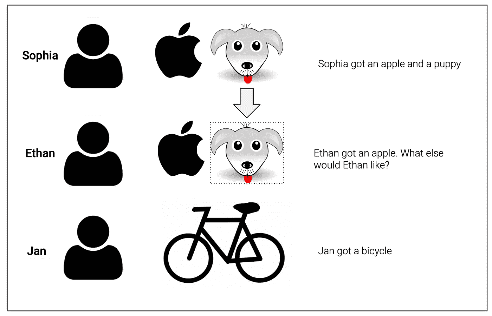
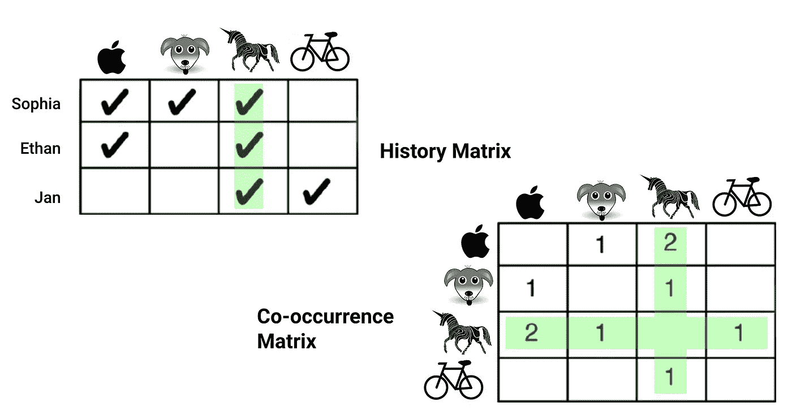
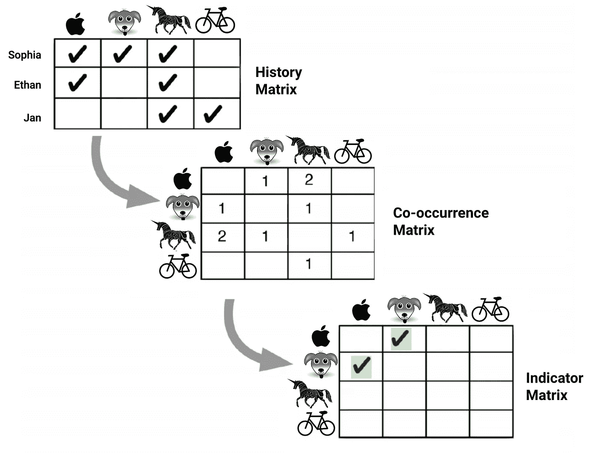
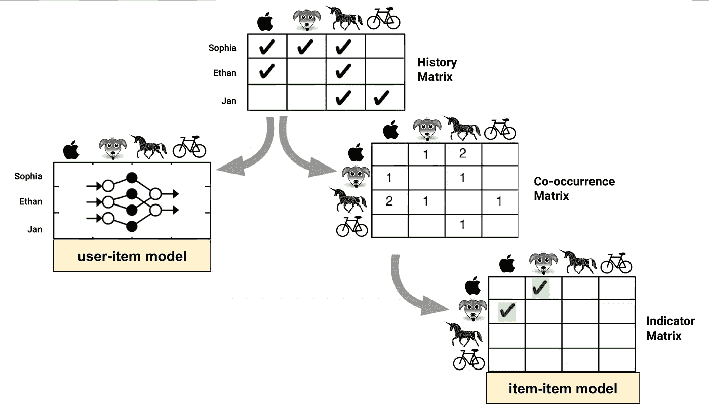
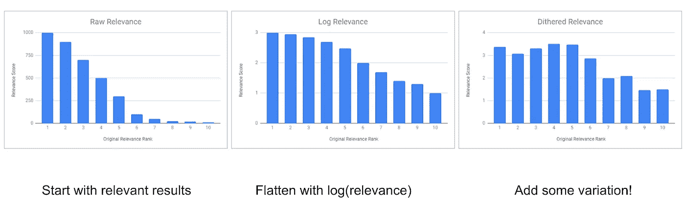
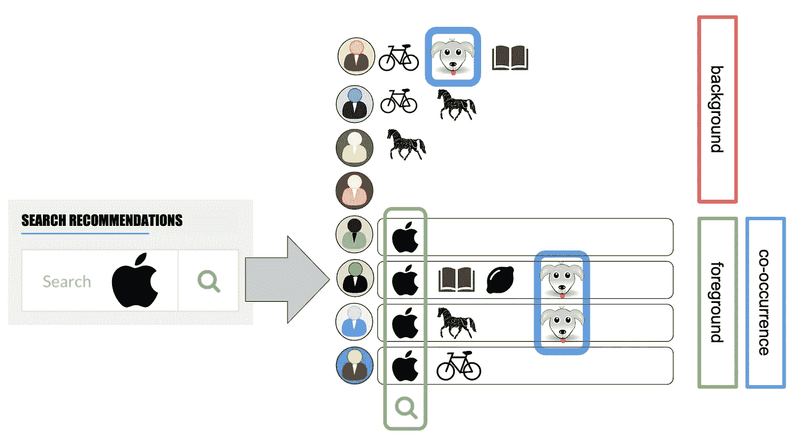
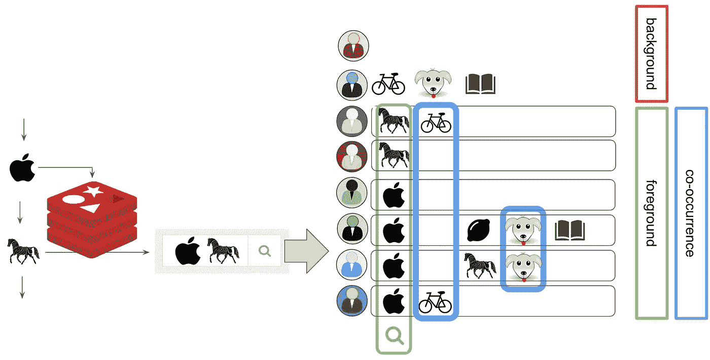
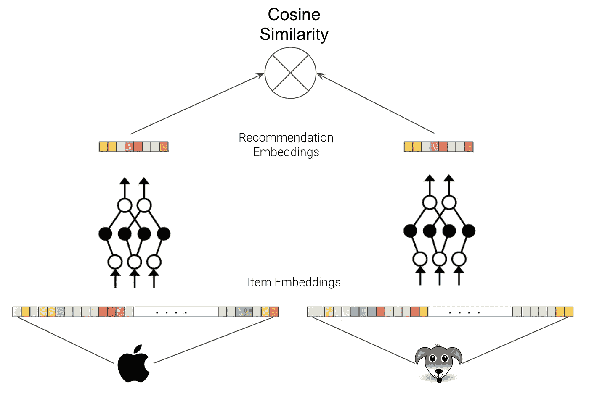

# 如何快速简单地构建推荐引擎

> 原文：<https://towardsdatascience.com/how-to-build-a-recommendation-engine-quick-and-simple-aec8c71a823e?source=collection_archive---------0----------------------->

## 第 1 部分:介绍，如何在一周内投入生产，之后去哪里


Recreation of Rina Piccolo’s cartoon (Cartoonist Group)

这篇文章是对这个主题的一个简单介绍，并且提供了在一周内让你进入推荐引擎生产的第一步。我还会告诉你从基础到相当高级的步骤。

我们还不会走在前沿，但也不会太远。

当快速和简单不再足够时，请阅读第 2 部分以了解更高级的用例:

[](/advanced-use-cases-for-recommendation-engines-4a420b14ab4e) [## 推荐引擎的高级用例

### 第 2 部分:当快速和简单不再足够好时，如何构建您的下一个推荐引擎。

towardsdatascience.com](/advanced-use-cases-for-recommendation-engines-4a420b14ab4e) 

推荐系统无处不在，对于许多在线平台来说，他们的推荐引擎就是真正的业务。这就是亚马逊大的原因:他们非常擅长向你推荐该读哪些书。还有许多其他公司都是围绕推荐系统建立的:YouTube、网飞、Spotify、社交媒体平台。与此同时，消费者开始期待个性化的体验和复杂的推荐系统来找到相关的产品和内容，这一切都是为了节省消费者的时间和金钱。

但是如何构建推荐引擎呢？

# 背景

推荐引擎已经存在了一段时间，有一些重要的经验可以利用:

1.  用户的行为是用户意图的最佳指示器。评级和反馈往往非常偏颇，而且音量较低。
2.  过去的行为和购买推动新的购买，与他人的购买和行为重叠是一个很好的预测。

推荐系统通常寻找重叠或**同现**来进行推荐。就像下面这个例子，我们基于 Ethan 和 Sophia 的相似性推荐 Ethan 一只小狗:



Recreation of illustration in “Practical Machine Learning, Ted Dunning & Ellen Friedman, O’Reilly 2014

在实践中，推荐引擎从事件和动作的**历史矩阵**中计算出**同现矩阵**。这很简单，但是在现实世界的场景中有很多挑战需要克服。如果每个人都想要独角兽呢？下面这个例子中独角兽的高共现是不是很好的推荐？



Recreation of illustration in “Practical Machine Learning, Ted Dunning & Ellen Friedman, O’Reilly 2014

在推荐系统已经计算了同现矩阵之后，我们必须应用统计来过滤掉足够异常的**信号**作为推荐。



Recreation of illustration in “Practical Machine Learning, Ted Dunning & Ellen Friedman, O’Reilly 2014

能够从共现矩阵中提取出**相关指标**的算法和统计是一个好的推荐系统的基础。创建项目到项目指标矩阵的路径称为**项目到项目模型**。显然还有一个**用户项模型:**



为了创建用户项目模型，我们可以应用简单的矩阵分解或训练神经网络来预测用户项目输入的分数。通常，当我们不在特征工程和模型调整等方面投入更多时，项目-项目模型更健壮，并产生更好的结果。

然而，一个好的推荐系统还需要克服一些挑战。反复推荐同样的东西**无聊**。更糟糕的是，推荐同样的东西会产生**坏数据**并导致**内容疲劳**。


Spotify wouldn’t produce such a result set! Their search and recommendation engines are top notch! This example needed editing. ❤ Spotify

提高推荐价值的两个简单直观的策略是

1.  反泛滥:如果第二个和第三个推荐与第一个推荐具有相同的相似性得分，则惩罚它们。
2.  抖动:添加一个通配符推荐，为推荐系统创建有趣的新数据点，以不断了解其他内容。



这些步骤确保了有趣的用户体验和替代推荐的新数据。

# 数据和要求

推荐系统最适合不带偏见的明确用户反馈，比如购买产品、看视频或听歌。如果你运气好，有这样一个数据集，即使是一个简单的方法也能很好地工作。然而，在许多用例中，你主要有隐性反馈，如页面浏览量、点击量或搜索查询量。不幸的是，这些数据也有很大的偏差，例如点击率很大程度上取决于内容在页面上的位置。隐式反馈也往往表现不佳，例如，点击搜索结果可能只是告诉你标题或 CTA 的点击量，而不是实际内容的相关性。这导致在最初的高点击率之后的高跳出率(一个非常普遍的情况！)

像协同过滤这样的简单方法需要项目之间的共现。这意味着协同过滤是合适的，并且如果

*   你的产品目录不要太大，条目的寿命很长，可以很容易地被多个用户交互。让我们以陷入困境的 Zoopla 为例:[Zoopla.co.uk](http://www.zoopla.co.uk)是一个房地产门户网站，在任何时间点都有超过 130 万个房源。伦敦的出租清单是非常短暂的，在一处房产被租出并退出市场之前，可能只需要几天时间。很明显，你不能同时向多人出租或出售公寓！以 Zoopla 目录的规模，即使在 Zoopla 的流量下，也很难产生大量的同现。
*   你不依靠推荐来发现新产品。因为协同过滤需要同现来产生信号，所以该算法有一个大的冷启动问题。产品目录中的任何新项目都不会同时出现，并且在用户没有与新项目进行一些初始互动的情况下无法推荐。如果你的企业大量使用 CRM 和市场营销作为推广新产品的策略，这是可以接受的。

# 协作过滤快速简单

一种选择是使用 Spark 和交替最小二乘(ALS)算法([链接](https://spark.apache.org/docs/2.2.0/ml-collaborative-filtering.html))，这是一种用于模型训练的简单解决方案，但不提供用于部署和评分的即时解决方案。我推荐一种不同的方法来开始:


事实证明，搜索和推荐问题的数学原理惊人地相似。最重要的是，良好的用户体验在搜索和推荐方面几乎是不可区分的。基本上，如果我们能够将推荐表述为搜索查询，那么搜索结果就是推荐。这是一个理想的解决方案，因为许多网站和企业已经在其后端运行搜索引擎，我们可以利用现有的基础设施来建立我们的推荐系统。Elasticsearch 可很好地扩展，并作为完全托管的部署存在，例如在 AWS 上。如果您想快速将您的推荐引擎部署到生产环境中，这是最安全的选择！

如何用搜索引擎创建推荐？



1.  我们将所有用户项目交互存储在一个搜索索引中。
2.  当用户在苹果的页面上时，我们会在 elasticsearch 中搜索所有拥有苹果的用户。这定义了我们的前景人口。
3.  我们在给我们小狗的前景中寻找同现。
4.  我们在背景人群中寻找小狗。
5.  我们为我们的小狗推荐计算某种分数。

好消息是:Elasticsearch 在一个查询中为我们实现了所有 5 个步骤！

如果我们在弹性搜索中存储用户-项目交互，如下所示

```
{
  "_id": "07700f84163df9ee23a4827fd847896c",
  "user": "user_1",
  "products": ["apple", "book", "lemon", "puppy"]
}
```

使用这样的文档映射:

```
{
  "user": {"type": "keyword"},
  "products": {"type": "keyword"}
}
```

那么产生一些建议所需要的就是下面的查询，例如使用 Python:

```
from elasticsearch import Elasticsearch, RequestsHttpConnection
from aws_requests_auth.boto_utils import BotoAWSRequestsAuthes = Elasticsearch(
  host=host, port=port, 
  connection_class=RequestsHttpConnection,
  http_auth=BotoAWSRequestsAuth(),
  scheme=scheme
)es.search(
  index=index, doc_type=doc_type,
  body={
    "query": {
      "bool": {
        "must": {
          "term": {"products": "apple"}
        }
      }
    },
    "aggs": {
      "recommendations": {
        "significant_terms": {
          "field": "products",
          "exclude": "apple",
          "min_doc_count": 100
        }
      }
    }
  }
)
```

默认情况下，Elasticsearch 将返回带有 **JLH** 分数的推荐，但是有一个可用的分数范围([文档](https://www.elastic.co/guide/en/elasticsearch/reference/current/search-aggregations-bucket-significantterms-aggregation.html))。

```
{
 ...
 "aggregations": {
    "recommendations": {
        "doc_count": 12200,
        "bg_count": 130000,
        "buckets": [
            {
                "key": "puppy",
                "doc_count": 250,
                "score": 0.15,
                "bg_count": 320,
            }           
         ]
      }
   }
}
```

在我们的示例中，搜索 apple 返回了 12，200 个用户的前景人群和 130，000 个在其产品中没有任何 apple 的用户的背景人群。小狗在前台共出现 250 次，在后台共出现 320 次。JLH 分数是背景集合与由**(fg _ percentage-BG _ percentage)*(fg _ percentage/BG _ percentage)**给出的本地搜索结果之间的变化的简单幅度，其给出 0.15 的分数

由于 JLH 分数是一个数量级的变化，重要的是要记住跳蚤跳得比大象高，JLH 分数对于小数据集来说非常不稳定。您可以调整查询中的`min_doc_count`参数，以保证您的推荐结果的质量。

这就是它，一个简单但强大的推荐引擎的第一次迭代，它可以在一周或更短的时间内上线！重要的是，任何版本 1 都不应该比这更复杂。生产时间在早期阶段更为重要。**通常，你的第一个推荐引擎需要一些迭代来优化用户界面和 UX，而不是数学。**

# 后续步骤

Elasticsearch 不仅仅是一个非常强大的推荐后台，它还非常灵活！在保持 elasticsearch 后端的同时，有很多方法可以改进我们的推荐系统。赢了！

当快速和简单不再足够时，请阅读第 2 部分以了解更高级的用例:

[](/advanced-use-cases-for-recommendation-engines-4a420b14ab4e) [## 推荐引擎的高级用例

### 第 2 部分:当快速和简单不再足够好时，如何构建您的下一个推荐引擎。

towardsdatascience.com](/advanced-use-cases-for-recommendation-engines-4a420b14ab4e) 

**第一步:**

我们可以使用 ALS 等更复杂的算法来为我们的推荐创建指标，并将这些指标放入 elasticsearch。这将推荐评分简化为一个简单的查找，因为我们在培训阶段进行繁重的工作，例如使用 Spark。这样，elasticsearch 只是我们为相关推荐提前计算的指标的一个性能表示层。您可以轻松地将它作为新的元数据添加到现有的产品目录中。

**第二步:**

目前，我们在产品数组中使用二进制标志，这意味着产品数组中的每个产品对 JLH 得分的贡献是相等的。如果没有太多的变化，我们可以使用一些指标来对产品事件本身进行评分，以捕捉更丰富的信号。我们可以用点击计数。或者更好的是，我们可以通过产生点击的页面位置的平均预期点击率来标准化点击，从而使用点击分数。例如，在搜索结果列表中，我们可以计算位于第一位置、第二位置等的项目的预期 CTR。然后，我们可以从项目度量分数的总和而不是它们的简单计数来计算 JLH 量级的变化。

**第三步:**

用户通常会生成一系列与推荐相关的事件，例如，点击多个商品或将多个产品添加到一个购物篮中。值得为您的推荐引擎添加一个用户交互缓存:( 1)使用一系列事件创建更复杂的搜索查询;( 2)在更新 elasticsearch 索引的批处理 ETL 过程和自上次更新推荐引擎以来发生的用户交互之间创建一个增量。



使用事件序列来产生推荐可以有助于(1)创建更相关的结果，以及(2)在低流量或非常大的目录的情况下，增加前景群体来生成更大数量的同现。只需要对 elasticsearch 查询做一点小小的修改，就可以切换到一个`should`查询:

```
es.search(
  index=index, doc_type=doc_type,
  body={
    "query": {
      "bool": {
        **"should": [**
          {"term": {"products": "apple"}},
          {"term": {"products": "pony"}},
        **],**
        **"minimum_should_match": 1,
**      }
    },
    "aggs": {
      "recommendations": {
        "significant_terms": {
          "field": "products",
          "exclude": ["apple", "pony"],
          "min_doc_count": 10
        }
      }
    }
  }
)
```

`minimum_should_match`参数允许您在增加前景人口规模或通过增加相似性匹配用户使结果更相关之间进行优化。

**第四步:**

目前，我们的搜索是对项目的精确查找。这带来了一些后果:我们从用户交互中学习到的关于共现的一切都与它们的特定项目绑定在一起。当一件商品从产品目录中删除时，我们就失去了从它身上学到的一切。我们也不能将任何事物概括为相似的项目，例如，红苹果和绿苹果是不同的项目，同现仅限于红苹果或绿苹果的精确匹配。为了克服这一点，我们需要用数学方法描述项目，以计算项目之间的相似性。这被称为嵌入。阅读我以前的博文，我创建了一个嵌入了 T5 的 T4 地理区域。创建嵌入的其他选项是如上所述的用户项目模型中的自动编码器或矩阵分解。在我们将一个简单的 product_id 转化为嵌入之后，我们可以使用概率或模糊搜索来找到我们的前景群体和/或同现。

这应该能让你从推荐开始。当您从产品反馈中学习时，它也给了您充分的机会来构建您的第一个迭代。

> 推荐的早期步骤好坏更多地取决于用户界面和 UX，而不是数学的简单性。

# 超越弹性搜索

通常，产品有我们应该使用的大量元数据，例如价格、描述、图片、评论评级、季节性、标签和类别。在我们将丰富的元数据集转换成描述我们产品的嵌入之后，我们可以训练神经网络将输入嵌入映射成推荐嵌入，该推荐嵌入具有(1)较低的维度和(2)合适推荐的余弦相似性的期望行为是高的。一个很好的解决方案是连体神经网络。



输入是产品元数据的级联嵌入的高维向量。神经网络的输出是更紧凑的推荐嵌入向量。误差函数由输出向量的余弦相似性给出。我们可以使用协同过滤数据来为应该相似或不相似的组合创建我们的监督学习标签。重要的是，在连体神经网络中，两个网络的权重总是相同的，这就是它们的名字。这种推荐引擎将不再有冷启动问题！最后，产生推荐可以通过对输出推荐嵌入的 k-最近邻搜索来完成。

您可以在后续文章中了解更多后续步骤:

[](/advanced-use-cases-for-recommendation-engines-4a420b14ab4e) [## 推荐引擎的高级用例

### 第 2 部分:当快速和简单不再足够好时，如何构建您的下一个推荐引擎。

towardsdatascience.com](/advanced-use-cases-for-recommendation-engines-4a420b14ab4e) 

Jan 是公司数据转型方面的成功思想领袖和顾问，拥有将数据科学大规模应用于商业生产的记录。他最近被 dataIQ 评为英国 100 位最具影响力的数据和分析从业者之一。

**在 LinkedIn 上连接:**[**【https://www.linkedin.com/in/janteichmann/】**](https://www.linkedin.com/in/janteichmann/)

**阅读其他文章:**[**https://medium.com/@jan.teichmann**](https://medium.com/@jan.teichmann)