# 如何利用潜在因素协同过滤构建餐厅推荐系统

> 原文：<https://towardsdatascience.com/how-to-build-a-restaurant-recommendation-system-using-latent-factor-collaborative-filtering-ffe08dd57dca?source=collection_archive---------2----------------------->


Image Designed by Freepik

# 介绍

我通常在工作间隙看 youtube。我承诺自己只看 5 到 10 分钟的 Youtube，让我的大脑休息一下。通常情况是这样的，在我看完一个视频后，下一个视频会从 Youtube 推荐中弹出，我会点击那个视频。当我再次看手表的时候，发现我已经看了一个多小时的 Youtube 了！:')

Youtube 的推荐系统是最强大和最复杂的推荐系统之一，可以让其用户连续几个小时观看 Youtube 视频。许多初创公司巨头，如网飞、Youtube 和亚马逊的收入主要来自他们建立的推荐系统。

本文主要讨论如何使用潜在因素协同过滤从零开始构建一个餐馆推荐系统。

## 什么是推荐系统？

推荐系统或推荐系统是简单的算法，旨在通过从庞大的信息库中过滤有用的东西，向用户*(客户、访客、应用程序用户、读者)*提供最相关和最准确的项目*(产品、电影、事件、文章)*。推荐引擎通过学习消费者的选择来发现数据集中的数据模式，并产生与其需求和兴趣相关的结果。

想象一个实体服装店。好的商家知道顾客的个人喜好。她/他的高质量推荐让客户满意，增加利润。当你去其他国家或城市旅行时，在选择一家餐馆吃午餐或晚餐的情况下，通常你会问你住在那个国家或城市的朋友镇上最好的餐馆是什么。问题是你没有任何朋友住在那个镇上。你的个人推荐可以由一个人造朋友产生:推荐系统。

## 矩阵分解或潜在因素协同过滤

有各种类型的推荐系统，但我建立的这个餐馆推荐系统。我侧重于使用矩阵分解或潜在因素协同过滤。让我们从因式分解这个术语开始。

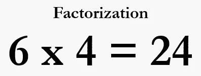

当我们考虑因式分解时，它是一个类似于六乘四等于二十四的概念。24 是一个很大的数字，但是我们把它表示成两个小数字 6 和 4 的乘积，所以我们设法把一个大数字分解成两个小数字的乘积。类似的概念也适用于矩阵分解。

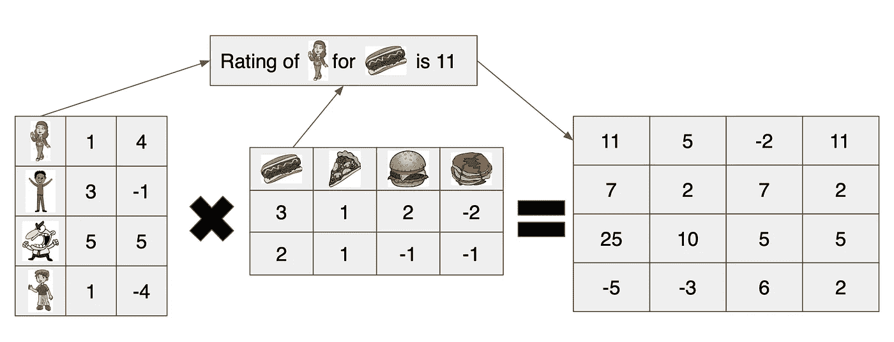

推荐系统是一个信息过滤系统，它试图预测用户对项目(在本例中是一家餐馆)的评分。我们可以将来自用户和项目的大矩阵分解成两个更小的用户特征和项目特征矩阵。例如，用户 A 喜欢吃热狗，但不喜欢吃比萨饼，而餐馆 P 有很棒的热狗，我们用点积乘矩阵，结果就是评分(在上面的例子中是 11)。

# 餐厅推荐系统

让我们开始使用上面讨论的技术建立一个餐馆推荐系统，它应该能够推荐最适合你的餐馆。

我们将使用 [Yelp](https://www.yelp.com/) 餐厅数据，这些数据可以从[这里](https://drive.google.com/file/d/1IFW2NOWNytFgzImzl_8q2laesbhaLysi/view?usp=sharing)下载。


Yelp 是一个商业目录服务和众包评论论坛。该公司开发、托管和营销 Yelp.com 网站和 Yelp 移动应用程序，这些应用程序发布关于企业的众包评论。它还运营一项名为 Yelp Reservations 的在线预订服务。

Yelp 试图解决这个问题“我应该吃什么？”这很快扩大到包括其他业务，以回答其他问题。这可以最好地表示为“我在[城镇]。我在哪里可以得到[最好的/最快的/最便宜的/最容易的][食物/服务/等]？”如果你没有偏好，你朋友的推荐可能对你去哪里有最大的影响。Yelp 为不可用或不可信的情况提供服务。

## 让我们开始构建机器学习模型

让我们从导入笔记本中需要的所有包开始。

```
import numpy as np
import pandas as pd
import matplotlib.pyplot as plt
import seaborn as sns
from sklearn.model_selection import train_test_split
from sklearn.feature_extraction.text import TfidfVectorizer
from nltk.corpus import stopwords 
from nltk.tokenize import WordPunctTokenizer
```

现在我们导入数据集，我们使用审查数据集和业务数据集。

```
df = pd.read_csv('yelp_review_arizona.csv')
df_business = pd.read_csv('yelp_business.csv')
df.head()
```

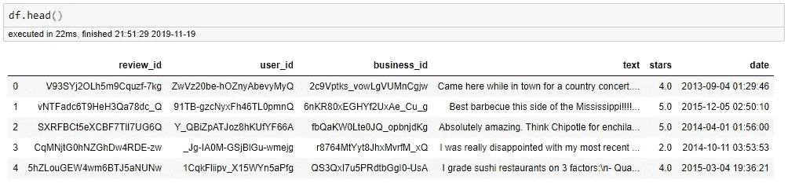

我们首先需要清理文本，我们需要删除所有的标点符号和所有的停用词(重复的我们不需要的词，如 have，do，I，you，he 等)。我们使用 nltk.corpus 中的库来查找停用词。

我们只为数据选择星星和文本，并导入我们将使用的库。

```
#Select only stars and text
yelp_data = df[['business_id', 'user_id', 'stars', 'text']]import string
from nltk.corpus import stopwords
stop = []
for word in stopwords.words('english'):
    s = [char for char in word if char not in string.punctuation]
    stop.append(''.join(s))
```

现在让我们通过创建一个函数来清理文本。

```
def text_process(mess):
    """
    Takes in a string of text, then performs the following:
    1\. Remove all punctuation
    2\. Remove all stopwords
    3\. Returns a list of the cleaned text
    """
    # Check characters to see if they are in punctuation
    nopunc = [char for char in mess if char not in string.punctuation]# Join the characters again to form the string.
    nopunc = ''.join(nopunc)

    # Now just remove any stopwords
    return " ".join([word for word in nopunc.split() if word.lower() not in stop])yelp_data['text'] = yelp_data['text'].apply(text_process)
```

为了将文本用于矩阵分解推荐系统，我们将遵循下面的架构来从评论文本中提取特征。

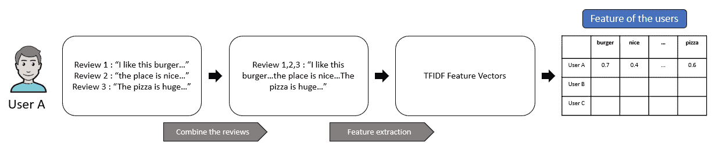

User feature extraction

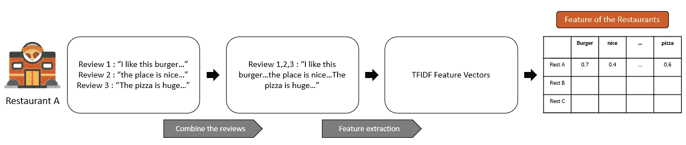

Business feature extraction

对于每个用户，将所有评论组合起来形成一个段落，在我们将所有评论组合起来之后，我们应用 TFIDF 矢量器从文本中提取特征。每个餐馆都有类似的方法，我们需要给 max_feature 匹配矩阵的维数。

```
userid_df = yelp_data[['user_id','text']]
business_df = yelp_data[['business_id', 'text']]
```

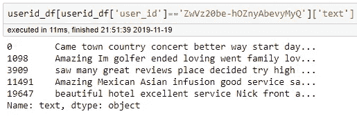

Reviews of user ‘ZwVz20be-hOZnyAbevyMyQ’

```
userid_df = userid_df.groupby('user_id').agg({'text': ' '.join})
business_df = business_df.groupby('business_id').agg({'text': ' '.join})
```

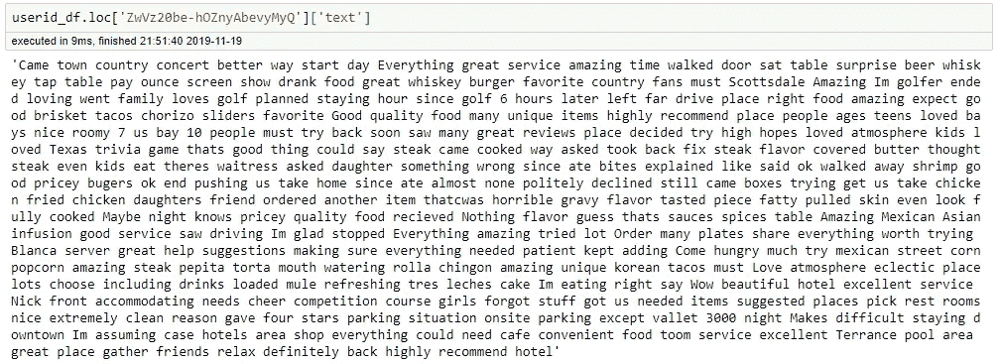

Combined reviews of user ‘ZwVz20be-hOZnyAbevyMyQ’

现在我们应用 TFIDF 矢量器从文本中提取特征。

```
from sklearn.feature_extraction.text import TfidfVectorizer#userid vectorizer
userid_vectorizer = TfidfVectorizer(tokenizer = WordPunctTokenizer().tokenize, max_features=5000)
userid_vectors = userid_vectorizer.fit_transform(userid_df['text'])#Business id vectorizer
businessid_vectorizer = TfidfVectorizer(tokenizer = WordPunctTokenizer().tokenize, max_features=5000)
businessid_vectors = businessid_vectorizer.fit_transform(business_df['text'])
```

然后，我们用评级创建一个用户和企业矩阵。

```
userid_rating_matrix = pd.pivot_table(yelp_data, values='stars', index=['user_id'], columns=['business_id'])
```

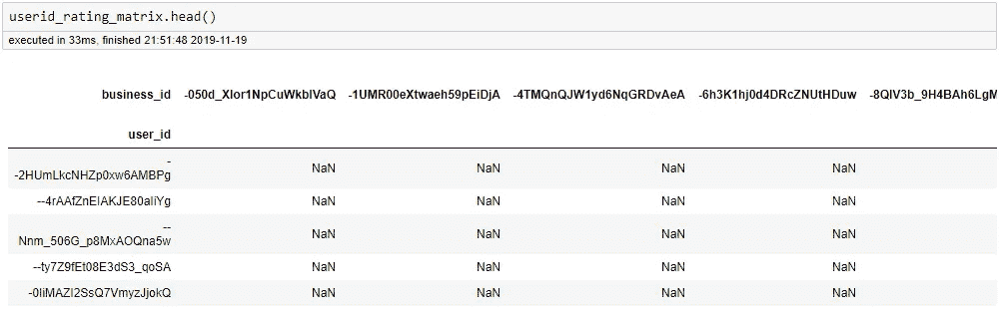

## 潜在因素协同过滤优化

让我们回到我们使用的推荐系统的类型，这是潜在的因素协同过滤。我们已经有两个矩阵(用户特征，商业特征)，我们可以相乘来预测用户给餐馆的评分。下一步，我们需要根据误差更新两个矩阵的特征值。

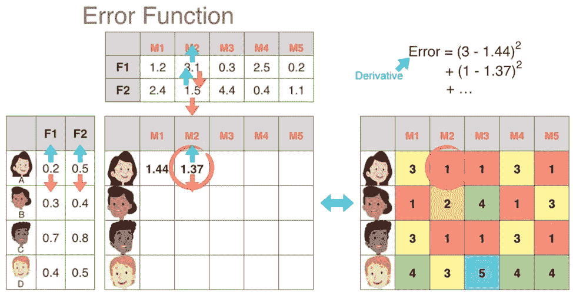

The image can be found in this [link](https://www.youtube.com/watch?v=ZspR5PZemcs&t=551s)

为了优化预测，我们需要使用下面的函数计算误差。

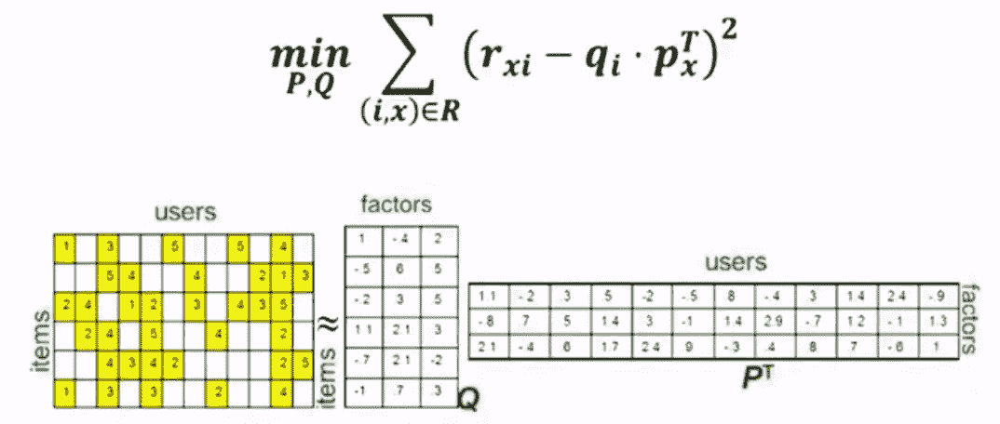

假设 P 是用户特征矩阵，Q 是商业特征矩阵。如果我们用预测收视率(P.Q)减去实际收视率(r ),然后求平方，就得到 LSE(最小平方误差)。在餐馆评论的情况下，我们有只给 10 家餐馆评论的用户，但是我们也有给超过 200 家餐馆评论的用户。为了避免我们的模型过度拟合，我们必须将正则化添加到我们的 LSE 公式中，它将成为下面的公式。

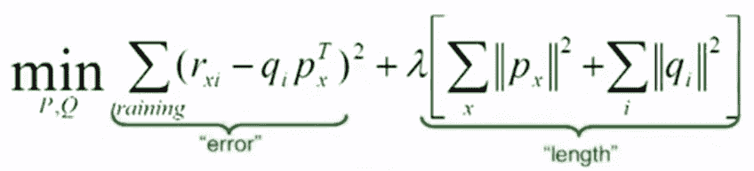

我们应用该方程来最小化误差，使用梯度下降来更新矩阵 P 和矩阵 q 中每个特征的值。

```
def matrix_factorization(R, P, Q, steps=25, gamma=0.001,lamda=0.02):
    for step in range(steps):
        for i in R.index:
            for j in R.columns:
                if R.loc[i,j]>0:
                    eij=R.loc[i,j]-np.dot(P.loc[i],Q.loc[j])
                    P.loc[i]=P.loc[i]+gamma*(eij*Q.loc[j]-lamda*P.loc[i])
                    Q.loc[j]=Q.loc[j]+gamma*(eij*P.loc[i]-lamda*Q.loc[j])
        e=0
        for i in R.index:
            for j in R.columns:
                if R.loc[i,j]>0:
                    e= e + pow(R.loc[i,j]-np.dot(P.loc[i],Q.loc[j]),2)+lamda*(pow(np.linalg.norm(P.loc[i]),2)+pow(np.linalg.norm(Q.loc[j]),2))
        if e<0.001:
            break

    return P,QP, Q = matrix_factorization(userid_rating_matrix, P, Q, steps=25, gamma=0.001,lamda=0.02)
```

现在我们已经更新了两个矩阵。是时候预测餐厅推荐了。

```
words = "i want to have dinner with beautiful views"
test_df= pd.DataFrame([words], columns=['text'])
test_df['text'] = test_df['text'].apply(text_process)
test_vectors = userid_vectorizer.transform(test_df['text'])
test_v_df = pd.DataFrame(test_vectors.toarray(), index=test_df.index, columns=userid_vectorizer.get_feature_names())predictItemRating=pd.DataFrame(np.dot(test_v_df.loc[0],Q.T),index=Q.index,columns=['Rating'])
topRecommendations=pd.DataFrame.sort_values(predictItemRating,['Rating'],ascending=[0])[:7]for i in topRecommendations.index:
    print(df_business[df_business['business_id']==i]['name'].iloc[0])
    print(df_business[df_business['business_id']==i]['categories'].iloc[0])
    print(str(df_business[df_business['business_id']==i]['stars'].iloc[0])+ ' '+str(df_business[df_business['business_id']==i]['review_count'].iloc[0]))
    print('')
```

通过输入“我想吃有美丽风景的晚餐”,模型将推荐这些餐馆。

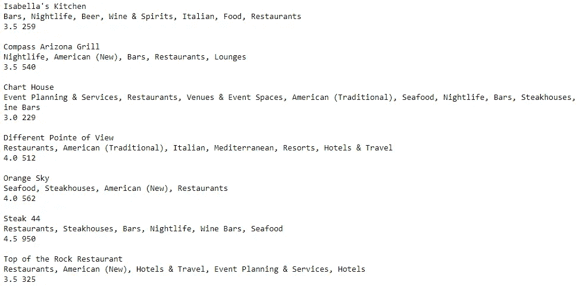

让我们来看看上面列出的其中一家餐馆。例如，让我们在 Yelp 中打开 Compas Arizona Grill 来查看我们的推荐系统的结果。

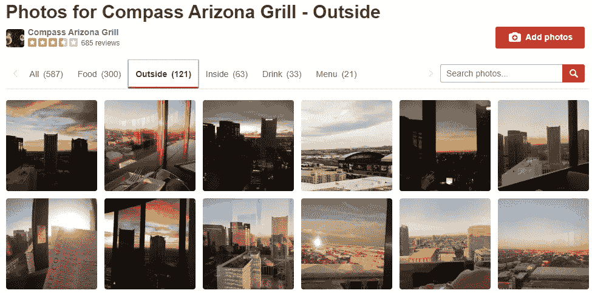

它看起来像餐馆有相当美丽的景色和美丽的日落。你可以带你的配偶去那里吃一顿浪漫的晚餐(如果你有一个:D 的话)。

恭喜您创建了一个餐厅推荐系统！

要查看数据集和完整版本的代码，请访问下面的链接在 Github 中查看。

[https://github . com/theo Jeremiah/Restaurant-Recommendation-System](https://github.com/TheoJeremiah/Restaurant-Recommendation-System)