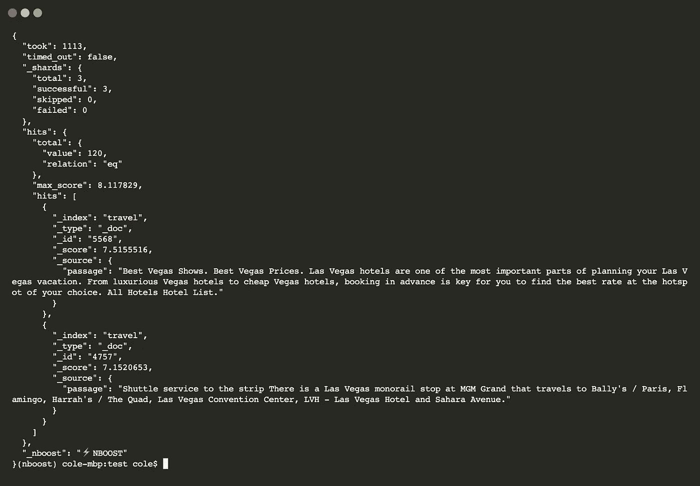

# 如何在 3 分钟内建立一个语义搜索引擎

> 原文：<https://towardsdatascience.com/how-to-build-a-semantic-search-engine-in-3-minutes-9e579da92913?source=collection_archive---------17----------------------->

## 与标准 TF-IDF 相比，搜索相关性提高 80%

合著者 [Jack Pertschuk](https://medium.com/u/a97c68c557df?source=post_page-----9e579da92913--------------------------------)


本教程是用 [Elasticsearch](https://www.elastic.co/) 和 [NBoost](https://github.com/koursaros-ai/nboost) 建立语义搜索引擎的快速指南。本指南不作为语义搜索的介绍。查看[这篇文章](https://medium.com/koursaros-ai/boost-search-api-performance-e-g-410868e82b22)了解背景。

# 在 3 分钟内设置一个神经代理来进行弹性搜索

在这个例子中，我们将在客户端和 Elasticsearch 之间设置一个代理来提高搜索结果。

## 使用 tensorflow 安装 NBoost

如果您想在 GPU 上运行该示例，请确保您有 tensor flow 1.14–1.15(带 CUDA)来支持建模功能。但是，如果你只是想在 CPU 上运行，就不用担心了。对于这两种情况，只需运行:

```
pip install nboost[tf]
```

## 设置 Elasticsearch 服务器

> *🔔如果你已经有一个 Elasticsearch 服务器，你可以跳过这一步！*

如果你没有 Elasticsearch，不用担心！你可以使用 docker 建立一个本地的 Elasticsearch 集群。首先，通过运行以下命令获取 ES 映像:

```
docker pull elasticsearch:7.4.2
```

一旦有了图像，您就可以通过以下方式运行 Elasticsearch 服务器:

```
docker run -d -p 9200:9200 -p 9300:9300 -e "discovery.type=single-node" elasticsearch:7.4.2
```

## 部署代理

现在我们准备好部署我们的神经代理了！做到这一点非常简单，只需运行:

```
nboost --uport 9200
```

> *📢*`*--uhost*`*`*--uport*`*应该和上面的 Elasticsearch 服务器一样！Uhost 和 uport 是 upstream-host 和 upstream-port(指上游服务器)的简称。**

*如果你收到这个消息:`Listening: <host>:<port>`，那么我们可以走了！*

## *索引一些数据*

*NBoost 内置了一个方便的索引工具(`nboost-index`)。出于演示的目的，我们将通过 NBoost 索引[一组关于旅游和酒店的段落](https://microsoft.github.io/TREC-2019-Deep-Learning/)。您可以通过运行以下命令将索引添加到您的 Elasticsearch 服务器:*

> *`*travel.csv*`T24 自带 NBoost*

```
*nboost-index --file travel.csv --name travel --delim ,*
```

*现在让我们来测试一下！点击弹性搜索:*

```
*curl "http://localhost:8000/travel/_search?pretty&q=passage:vegas&size=2"*
```

*如果 Elasticsearch 结果中有`_nboost`标签，那么恭喜它成功了！*

**

## *刚刚发生了什么？*

*让我们来看看 NBoost 前端。转到您的浏览器并访问 [localhost:8000/nboost](http://localhost:8000/nboost) 。*

> **如果您无法访问浏览器，您可以* `*curl http://localhost:8000/nboost/status*` *获取相同的信息。**

**

*前端记录了发生的一切:*

1.  *NBoost 收到了对 2 个搜索结果的请求。 *(0.32 毫秒)**
2.  *NBoost 连接到服务器。 *(0.13 毫秒)**
3.  *NBoost 向服务器发送了 10 个搜索结果的请求。 *(0.12 毫秒)**
4.  *NBoost 从服务器收到了 10 个搜索结果。 *(120.33 毫秒)**
5.  *这个模型挑选了最好的两个搜索结果。 *(300 毫秒)**
6.  *NBoost 将搜索结果返回给客户端。 *(0.10 毫秒)**