# 如何建立一个简单的带标签的电影推荐系统

> 原文：<https://towardsdatascience.com/how-to-build-a-simple-movie-recommender-system-with-tags-b9ab5cb3b616?source=collection_archive---------11----------------------->

## 基于内容的查找相似电影的方法


Photo by [Denise Jans](https://unsplash.com/@dmjdenise?utm_source=medium&utm_medium=referral) on [Unsplash](https://unsplash.com?utm_source=medium&utm_medium=referral)

# **简介**

让我们假设你正在推出下一个伟大的订阅视频点播(SVOD)流媒体服务，并且你已经获得了播放过去 100 年发行的所有主要电影的权利。祝贺这个不可思议的壮举！

现在有很多电影。如果没有某种[推荐系统](https://en.wikipedia.org/wiki/Recommender_system)，你会担心用户可能会被他们不关心的电影淹没。这可能会导致客户流失，这是你最不想看到的！

所以你决定建立一个电影推荐系统。因为你的服务是新的，你还没有足够的数据说明哪些用户在看什么电影。这就是所谓的[冷启动问题](https://en.wikipedia.org/wiki/Cold_start_(computing))，它阻止你仅仅基于用户的历史收视率来推荐电影。

幸运的是，即使没有足够的收视率数据，我们仍然可以用电影元数据构建一个不错的推荐系统。这就是电影镜头的用武之地。MovieLens 为每部电影提供了一个带有关键字标签的[公共数据集](https://grouplens.org/datasets/movielens/)。这些标签信息丰富。例如，查看下面的顶级社区标签，寻找[善意](https://www.imdb.com/title/tt0119217/)。

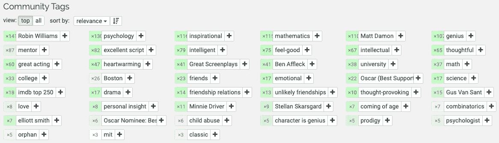

Screenshot taken from the MovieLens website

在这篇文章的剩余部分，我将回答三个商业问题，这三个问题对于使用 MovieLens 的标签构建一个简单的基于内容的推荐系统至关重要:

1.  每部电影我们需要多少个标签？
2.  我们如何用标签来衡量电影之间的相似度？
3.  我们如何使用标签为用户生成电影推荐？

> **摘自维基百科关于基于内容的推荐系统的页面:**
> 
> 基于内容的过滤方法是基于对项目的描述和用户偏好的描述。这些方法最适合于已知项目数据(名称、位置、描述等)的情况。)，但不在用户身上。基于内容的推荐器将推荐视为特定于用户的分类问题，并根据产品特征学习用户喜欢和不喜欢的分类器。”

这种分析的代码可以在[这里](https://github.com/JohnsonKuan/movie-rec-tags)与数据和康达环境 YAML 文件一起找到，便于您轻松重现结果。

# **1)每部电影我们需要多少个标签？**

在 MovieLens 标签基因组数据集中有大约 10K 独特的电影和 1K 独特的标签。每部电影的每个标签都有一个相关性分数，因此大约有 1000 万个电影标签对。相关性分数的范围是从 0 到 1。

不是每个标签都与电影相关，所以我们只需要保留最相关的标签。首先，我们可以根据相关性分数对每部电影的标签进行排序。例如，在[的前 10 个标签下面，记住泰坦](https://www.imdb.com/title/tt0210945/)。请注意，相关性分数远高于 0.9，这表明它们是非常相关的标签。

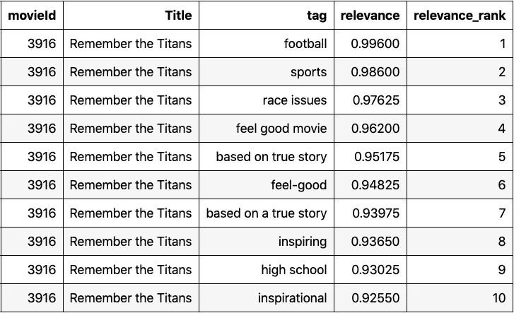

Top 10 tags based on relevance score (descending order)

接下来，我们在下面的图表中确认，电影的排名较高的标签往往具有较高的中值相关性分数。电影中排名第一的标签具有几乎为 1 的中值相关性分数。我们可以看到，随着我们下降到第 50 位，中值相关性分数逐渐降低。

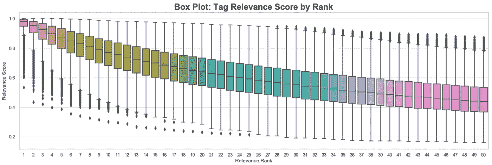

为了找到与电影最相关的标签，我们可以根据相关性分数保留电影的前 **N** 个标签。在这里，我们需要仔细挑选 **N** 。如果 **N** 很小，我们有非常相关但很少的标签。如果 **N** 很大，我们有很多标签，但其中很多可能是不相关的。

下图显示了从排名第 1 位到第 100 位的标签，中值相关性分数的百分比变化。当相关性分数开始变得更加稳定时，我们在第 50 个排名附近看到一个拐点。因此，我们可以选择 **N** = 50 作为为每部电影保留的标签的合理数量。请注意，这是一个非常简单的“肘方法”风格的方法，可以在以后进行优化。

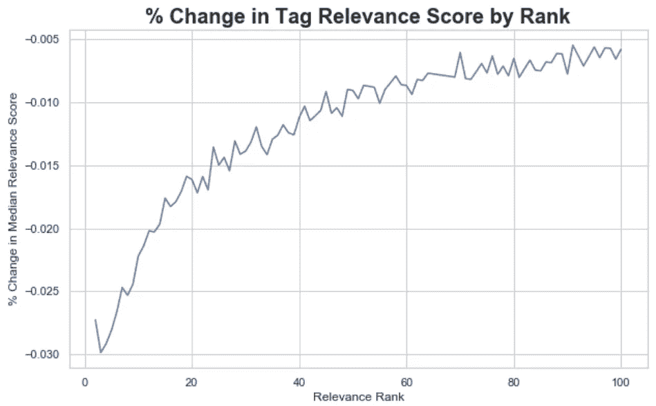

现在，我们可以获得每部电影的前 50 个标签的列表，我们将在下一节中使用。例如，在[玩具总动员](https://www.imdb.com/title/tt0114709/)的前 50 个标签下面。

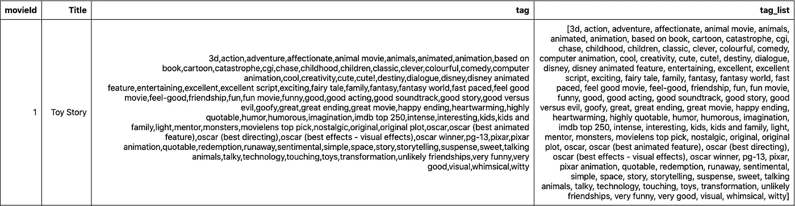

# 2)我们如何用标签来衡量电影之间的相似度？

在为用户生成电影推荐之前，我们需要一种方法来根据电影的前 50 个标签来衡量电影之间的相似性。在基于内容的推荐系统中，用户将被推荐与他们已经看过的电影相似的电影。

在这里，我将演示两种度量相似性的方法:

1.  [两套电影标签的 Jaccard 索引](https://en.wikipedia.org/wiki/Jaccard_index)
2.  [基于标签的电影向量(又名内容嵌入)的余弦相似度](https://en.wikipedia.org/wiki/Cosine_similarity)

**Jaccard 指数**

使用 Jaccard 指数的第一种方法测量两个集合 **A** 和 **B** 之间的相似性，即交集的大小除以并集的大小。当测量电影之间的相似性时，我们可以为两组电影标签计算这个指数。

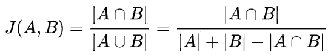

Taken from wikipedia

例如，假设我们有以下三部电影及其前三个标签:

*   电影 **A** 标签=(动作、空间、友情)
*   电影 **B** 标签=(冒险、太空、友谊)
*   电影 **C** 标签=(浪漫、喜剧、成人)

直观上，我们可以看到电影 **A** 比**C**更类似于 **B** 这是因为电影 **A** 和 **B** 共享两个标签(空间，友谊)，而电影 **A** 和 **C** 不共享任何标签**。**

根据 Jaccard 指数，以下 10 部电影类似于《心灵捕手》。对于有良好意愿的观众来说，这些看起来是合理的建议。请注意，我在列表中包括了《心灵捕手》,以表明在比较电影本身时，Jaccard 指数= 1。

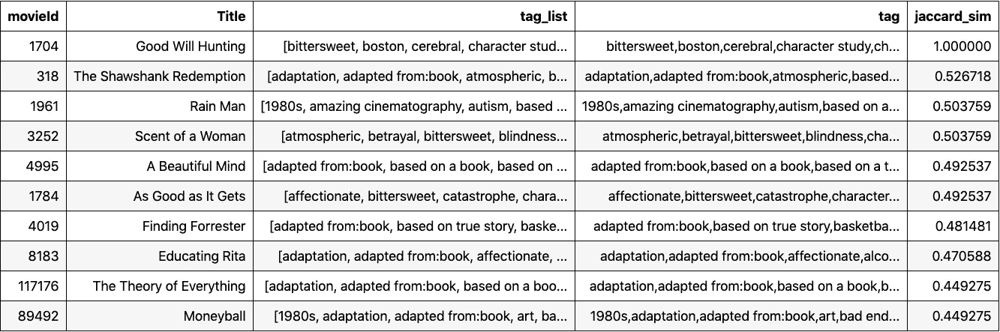

Movies similar to Good Will Hunting based on Jaccard Index of tag sets

以下是基于 Jaccard 指数的类似于[星际](https://www.imdb.com/title/tt0816692/)的前 10 部电影。对于《星际穿越》的观众来说，这些看起来也是合理的推荐。

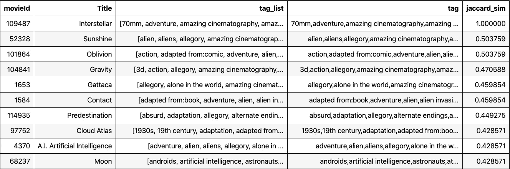

Movies similar to Interstellar based on Jaccard Index of tag sets

为了进一步说明 Jaccard 索引的有效性，请参见下面基于类似于《星际穿越》的电影的标签频率的词云。在这里，我们可以看到哪些标签在相似度计算中更突出(例如，科幻小说、伟大的结局、反主题未来、哲学、大脑)。

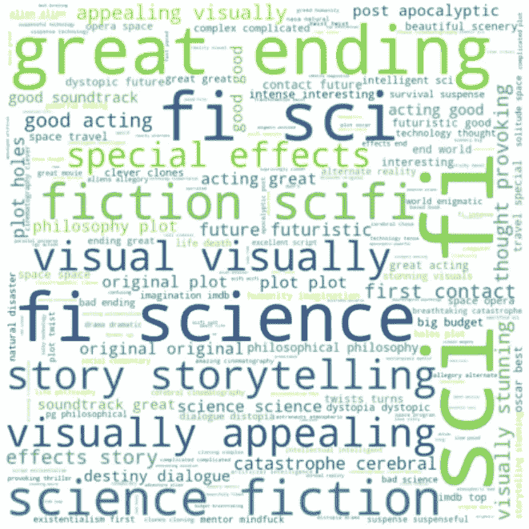

Word cloud based on tag frequency from movies similar to Interstellar

**电影向量的余弦相似度(又名内容嵌入)**

Jaccard Index 的第一种方法帮助我们建立了一种直觉，即与标签相似意味着什么。余弦相似度的第二种方法有点复杂。它要求我们把我们的电影表现为一个向量。在这里，向量只是一组数字。

例如，我们可以将之前的相同电影表示为一组三个实数:

*   电影 **A** = (1.1，2.3，5.1)
*   电影 **B** = (1.3，2.1，4.9)
*   电影 **C** = (5.1，6.2，1.1)

直观地，我们可以再次看到电影 **A** 比**c**更类似于 **B** 这是因为电影 **A** 和 **B** 在每个维度上具有更接近的数字(例如在第一维度上 1.1 比 1.3)。

为了找到一个好的电影矢量表示，我使用了这篇[论文](https://cs.stanford.edu/~quocle/paragraph_vector.pdf)中的 Doc2Vec (PV-DBOW)技术，它获取一部电影(文档)并根据其标签(文档中的单词)学习到潜在的 **K** 维矢量空间的映射。这里我就不细说了，但是这就是我们如何把电影表示成一个基于标签的向量。

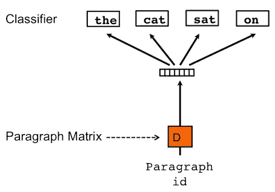

Visual of the PV-DBOW technique from the Doc2Vec paper; for each paragraph ID (movie) we’re training a model to predict the occurrence of a word (movie tag) in that paragraph

一旦我们可以将每部电影表示为一个向量，我们就可以计算向量之间的余弦相似度，以找到相似的电影。我不会在这里深入讨论余弦相似度的细节，但是在高层次上，它告诉我们电影向量彼此有多相似，我们可以用它来生成推荐。

下面我用 [UMAP](https://umap-learn.readthedocs.io/en/latest/) 可视化 2D 的电影向量，这是一种流行的非线性降维技术。我们可以看到，在这个向量空间中靠得更近的电影更相似(例如《玩具总动员》和《怪物公司》)。

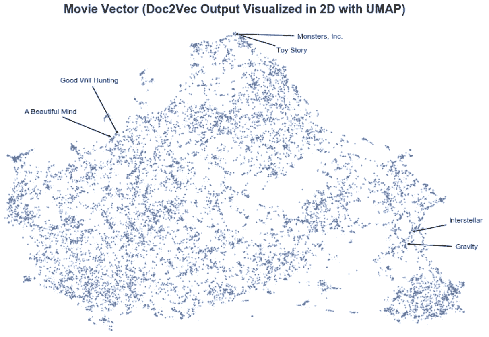

Movie vectors learned from corpus of movie tags

# 3)我们如何使用标签为用户生成电影推荐？

现在我们可以用标签来衡量电影之间的相似性，我们可以开始向用户推荐电影。

记住，在基于内容的推荐系统中，用户会被推荐与他们已经看过的电影相似的电影。如果用户只看过一部电影(例如《心灵捕手》)，我们可以像以前一样简单地使用 Jaccard 索引(或余弦相似度)来生成相似电影的列表进行推荐。

更实际的情况是，用户已经观看了一系列电影，我们需要根据这些电影的综合属性来生成推荐。

一个简单的方法是计算用户向量，作为他们看过的电影向量的平均值。这些用户向量可以表示用户的电影偏好简档。

例如，如果用户只看过下面的电影 **A** 和 **B** :

*   电影 **A** = (1，2，3)
*   电影 **B** = (7，2，1)
*   用户向量=电影 **A** 和 **B** 的平均值= (4，2，2)

以下是我喜欢看的电影。我们如何使用这些电影的标签来生成电影推荐？

> 《星际穿越》、《心灵捕手》、《差点成名》、《肖申克的救赎》、《明日边缘》、《杰里·马奎尔》、《阿甘正传》、《回到未来》

我的用户向量是上面九部电影的平均向量。我可以拿我的用户向量，找到最相似的我还没看过的电影(基于余弦相似度)。以下是我的电影推荐，考虑到我们这里只使用电影标签，这些推荐出奇的好！请随意使用笔记本，并生成您自己的建议。

```
The Theory of Everything
Cast Away
Dead Poets Society
Charly
Rain Man
Groundhog Day
Pay It Forward
A Beautiful Mind
E.T. the Extra-Terrestrial
Mr. Holland's Opus
On Golden Pond
It's a Wonderful Life
Children of a Lesser God
The Curious Case of Benjamin Button
Star Trek II: The Wrath of Khan
Cinema Paradiso
Mr. Smith Goes to Washington
The Terminal
Her
The World's Fastest Indian
The Truman Show
Star Trek: First Contact
The Family Man
```

下面总结了我们的基于内容的推荐系统。请注意，如果我们将系统部署为 API，我们可以在批处理过程中预先计算用户向量和相似性得分，以加快推荐服务的速度。

*   **输入:**用户向量(从标签学习的电影向量的平均值)
*   **输出:**基于用户和电影向量的余弦相似度，列出与用户相似的电影