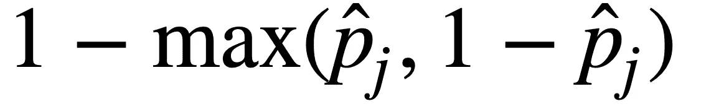
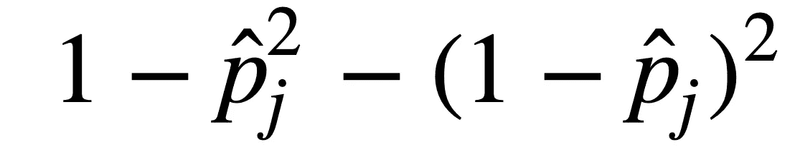
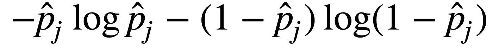
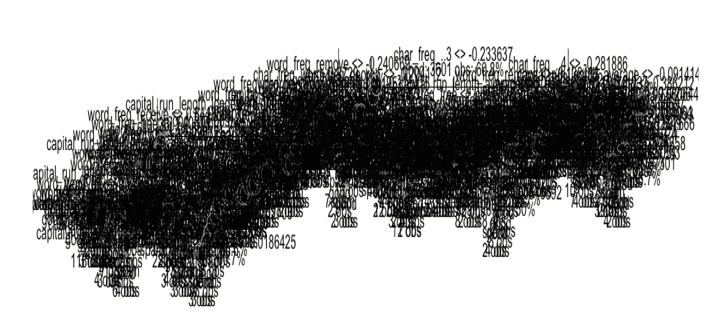
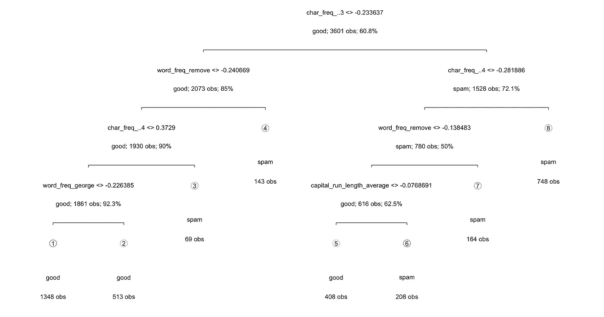
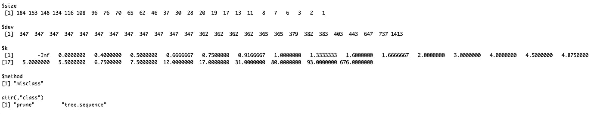
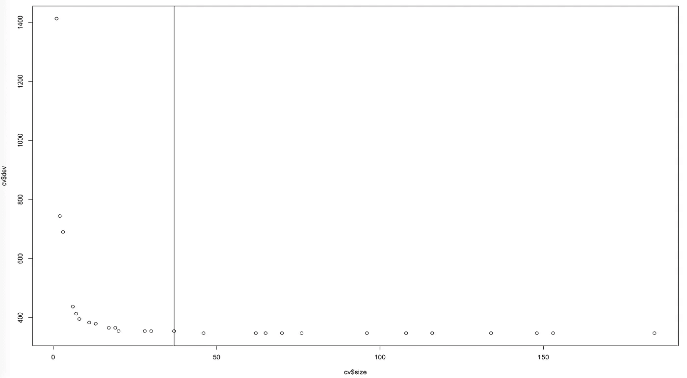
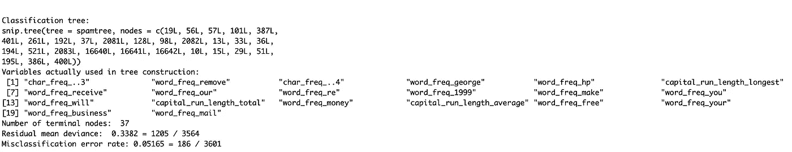

# 如何使用决策树构建垃圾邮件分类器

> 原文：<https://towardsdatascience.com/how-to-build-a-spam-classifier-using-decision-tree-b75d0c7f25e?source=collection_archive---------13----------------------->

## 机器学习:监督学习

## 越简单的模型越好！


[NASA/JPL/Cornell University, Maas Digital LLC](https://commons.wikimedia.org/wiki/File:NASA_Mars_Rover.jpg)

> "像鸭子一样走路，像鸭子一样游泳，像鸭子一样嘎嘎叫，大概，它是一只鸭子！"

# 数据科学投诉

在监督学习领域，有大量的分类器，包括逻辑回归( [logit 101](/machine-learning-101-predicting-drug-use-using-logistic-regression-in-r-769be90eb03d) 和 [logit 102](/machine-learning-102-logistic-regression-with-polynomial-features-98a208688c17) )、LDA、朴素贝叶斯、SVM、[、KNN](/beginners-guide-to-k-nearest-neighbors-in-r-from-zero-to-hero-d92cd4074bdb) 、随机森林、神经网络，每天都有更多的分类器出现！

所有数据科学家都应该问自己的真正问题是:

> 我们是否选择了正确的方法？
> 
> 或者，
> 
> 我们选的是花式模特吗？

*关于 5 个最流行的 ML 分类器的快速比较和分步说明，请参考我的另一篇* [*帖子*](/classifying-rare-events-using-five-machine-learning-techniques-fab464573233) *:*

[](/classifying-rare-events-using-five-machine-learning-techniques-fab464573233) [## 脖子上的痛:使用 5 种机器学习方法预测罕见事件

### 哪一种最适合不平衡数据？有什么权衡吗？

towardsdatascience.com](/classifying-rare-events-using-five-machine-learning-techniques-fab464573233) 

如下面这条推文所示，

一个简单的回归就够了，建立 10 层深度学习模型还有什么意义？

让我们面对现实吧。我们，数据科学家，有时可能是以自我为中心的毒枭，更关心炫耀技能，而不听取客户的需求。

无论是面向内部的 DS 角色(例如**人员分析**)还是面向外部的 DS 角色(例如**统计顾问**)，他们都需要提供非技术同事和客户能够立即理解和应用的快速解决方案。请不要将它们与 DS 术语、行话、系数解释或任何其他不必要的麻烦混淆。如果 ML 模型太难而没有用，那绝对没有附加值。

考虑到这一点，我们在这篇文章中学习如何使用可解释的 ML 分类器**决策树**来构建一个简单的垃圾邮件分类器(UCI 机器学习数据库托管数据集，可以在[这里](https://archive.ics.uci.edu/ml/datasets/spambase)访问)。


[AndyPandy](https://pixabay.com/users/AndyPandy-43058/?utm_source=link-attribution&utm_medium=referral&utm_campaign=image&utm_content=940526) from [Pixabay](https://pixabay.com/?utm_source=link-attribution&utm_medium=referral&utm_campaign=image&utm_content=940526)

# 决策图表

决策树是一种监督学习方法，它将结果空间分割成 J 个区域 R(1)，R(2)，…，R(J)，并预测每个区域 R 的响应

使用**递归二进制分裂**，我们通过四个简单的步骤构建 DT 模型:

1.  基于变量 X(i)分割区域 R(j)
2.  设置截止点 s，并将 R(j)分成两个区域，如果

*   {X|X(i)
*   ~~{X|X(i)> s} = R(类别 2)~~

~~3.对下一个区域重复前两步~~

~~4.继续下去，直到我们用完了所有可用的单元，或者每个叶节点中只剩下少量的单元。~~

~~用日常俗人的话来说，DT 就是找到空间的最佳分割方式，让空间在每次分割后变得“更纯粹”。有三种方法可以测量空间的纯净度或不纯净度:~~

1.  ~~**分类错误率**~~

~~~~

~~**2。基尼指数**~~

~~~~

~~**3。熵**~~

~~~~

## ~~**如何选择最佳分割？**~~

1.  ~~对于区域 j，计算先前杂质 **I(分割前)**和变量 **I(分割后)**的分割后杂质。~~
2.  ~~选择导致 **I(分割前)**和 **I(分割后)之间最大减少的变量 v。**~~

~~理想情况下，完美的 ML 分类器会一直分裂，直到每个单元都有自己的叶子，也就是 aka。然而，这导致过拟合，这使得它不太适合其他数据集。简单地说，过度拟合意味着我们将 ML 模型与我们正在使用的数据集拟合得太紧，如果我们想推广到其他情况，这就不太实际了。~~

~~为了解决这个问题，我们需要**修剪**模型，并在算法每次想要进行另一次分割时设置惩罚。~~

~~修剪减少了总的错误分类错误，同时保持较小的树。它可以表示如下:~~

~~**成本=总误分类误差+ αJ**~~

*   ~~α:调谐参数~~
*   ~~αJ:惩罚项~~

~~顺便提一下，这是构建损失函数的一种非常常见的形式，你可能会在其他场景中看到。~~

# ~~r 实现~~

## ~~1.r 包、库和加载数据~~

```
library(tidyverse)
library(dplyr)
library(tree)
library(maptree)spam <- read_table2("spambase.tab", guess_max=2000)
spam <- spam %>%
  mutate(y = factor(y, levels=c(0,1), labels=c("good","spam"))) %>%
  mutate_at(.vars=vars(-y), .funs=scale)colnames(spam)
```

## ~~2.数据分割:训练和测试~~

```
#set.seed() for version control
set.seed(1)#sample the dataset
test.indices = sample(1:nrow(spam), 1000) #create train and test sets
spam.train=spam[-test.indices,]
spam.test=spam[test.indices,]
YTrain = spam.train$y
XTrain = spam.train %>% select(-y)
YTest = spam.test$y
XTest = spam.test %>% select(-y)
```

~~接下来，我们使用 10 重交叉验证。关于简历的 6 步总结，请参考我的另一篇帖子( [**KNN**](/beginners-guide-to-k-nearest-neighbors-in-r-from-zero-to-hero-d92cd4074bdb) )。~~

```
nfold = 10
set.seed(1)
folds = seq.int(nrow(spam.train)) %>% # sequential observations IDs
  cut(breaks = nfold, labels=FALSE) %>% # sequential fold IDs
  sample
```

~~让我们创建一个函数 **calc_error_rate** 来计算分类误差。~~

```
calc_error_rate <- function(predicted.value, true.value){
  return(mean(true.value!=predicted.value)) 
}
```

~~有趣的部分来了:构建一个简单的 DT 模型。~~

```
# the number = the row numbers of the spam.train 
nobs = nrow(spam.train)# a DT model
# please check the official R documents for the parameters
spamtree = tree(y~., data= spam.train,
     na.action = na.pass, 
     control = tree.control(nobs, mincut =2, minsize = 5, mindev = 1e-5))
summary(spamtree)# plot the original unpruned DT model
draw.tree(prune, nodeinfo=TRUE)
```

~~~~

~~Figure 1~~

~~通常情况下，我们不绘制未修剪的 DT 模型，因为有太多的叶片难以解释。**这是个坏例子！我这么做是出于教学原因。**~~

~~3.**修剪**~~

~~为了让情节更漂亮，更简单，更容易理解，让我们把 DT 模型剪成只剩下 8 片叶子。~~

```
prune =prune.tree(spamtree, best=8)
summary(prune) # plot the pruned model
draw.tree(prune, nodeinfo=TRUE)
```

~~~~

~~Figure 2~~

~~与之前的填充图相比，图 2 在各方面都要好得多。我们知道最重要的变量是什么。我们知道每个类别中有多少观察值。~~

~~此外，我们可以使用交叉验证来寻找最佳的修剪次数。幸运的是，*树*包包括一个默认的 CV 函数， **cv.tree** ，以最小化错误分类率。~~

```
set.seed(3)
cv = cv.tree(spamtree,FUN=prune.misclass, K=10)
cv
```

~~~~

```
plot(cv$size,cv$dev)
abline(v=37,lty=1)
```

~~~~

~~Figure 3~~

~~最佳分裂数为 37。我们根据树的大小绘制错误分类图。设置叶子的数量= 37，我们建立一个新的树模型叫做 **spamtree.pruned** 。~~

```
spamtree.pruned<-prune.misclass(spamtree, best=37)
summary(spamtree.pruned)
```

~~~~

```
# training and test errors of spamtree.pruned
# **set type = "class"** because we are predicting the categorypred.train = predict(spamtree.pruned, spam.train, **type=”class”**)
pred.test = predict(spamtree.pruned, spam.test, **type=”class”**)# training error
DT_training_error <- calc_error_rate(predicted.value=pred.train, true.value=YTrain)
DT_training_error[1] 0.05165232# test error
DT_test_error <- calc_error_rate(predicted.value=pred.test, true.value=YTest)
DT_test_error[1] 0.072
```

~~仅此而已！伙计们，我们已经通过 3 个简单的步骤学会了一个超级简单但有用的 ML 分类器。~~

~~在这篇文章中，我们已经了解了什么是 DT，它的优点和 R 实现。以下是一些关键要点:~~

*   ~~行业需要快速简单的解决方案。~~
*   ~~决策树快速、简单且有用。~~
*   ~~DT 是可视化的，可解释的。~~

> ~~喜欢读这本书吗？~~
> 
> ~~如果有，请查看我其他关于机器学习和编程的帖子。~~

~~[](/beginners-guide-to-k-nearest-neighbors-in-r-from-zero-to-hero-d92cd4074bdb) [## R 中 K-最近邻初学者指南:从零到英雄

### 使用各种度量标准在 R 中构建 KNN 模型的管道

towardsdatascience.com](/beginners-guide-to-k-nearest-neighbors-in-r-from-zero-to-hero-d92cd4074bdb) [](/machine-learning-101-predicting-drug-use-using-logistic-regression-in-r-769be90eb03d) [## 机器学习 101:使用逻辑回归预测 R

### 基础、链接功能和图

towardsdatascience.com](/machine-learning-101-predicting-drug-use-using-logistic-regression-in-r-769be90eb03d) 

在 [LinkedIn](https://www.linkedin.com/in/leihuaye/) 和 [Twitter](https://twitter.com/leihua_ye) 找到我。~~