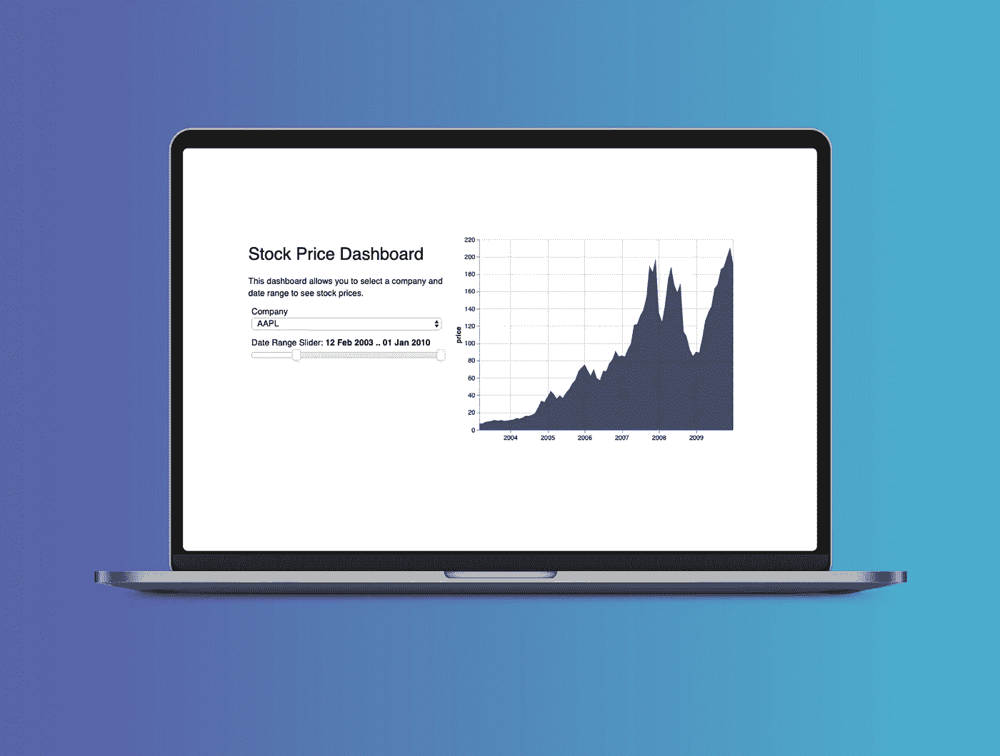
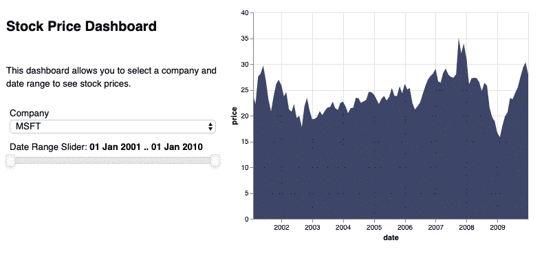
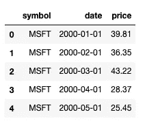

# 如何用 Python 构建一个简单的时间序列仪表板，包括面板、Altair 和一个 Jupyter 笔记本

> 原文：<https://towardsdatascience.com/how-to-build-a-time-series-dashboard-in-python-with-panel-altair-and-a-jupyter-notebook-c0ed40f02289?source=collection_archive---------3----------------------->

## 两个过滤器+一个交互式面积图，大约 25 行代码。



我使用 [Altair](https://altair-viz.github.io) 已经一年多了，它已经很快成为我在 Python 中的首选图表库。我喜欢剧情的内置交互性，以及语法建立在图形的[语法之上的事实。](/a-comprehensive-guide-to-the-grammar-of-graphics-for-effective-visualization-of-multi-dimensional-1f92b4ed4149)

Altair 甚至通过使用 Vega 小部件提供了一些内置的交互性。然而，我发现这有时是有限制的，它不允许我像创建仪表板那样创建布局。

然后我找到了[面板](https://panel.pyviz.org/index.html)。Panel 自称为“Python 的高级应用和仪表板解决方案”，它是由 Anaconda 管理的 [HoloViz 生态系统](http://holoviz.org)的一部分。我以前听说过 HoloViz(这是一个相对概述网站，PyViz，但从来没有真正花时间深入了解这个景观。所以我们开始吧！

乍一看，我喜欢 Panel 的地方在于它与绘图库无关——它支持几乎所有的可视化库。所以在这篇文章中，你不必成为一个忠实的 Altair 用户来学习一些关于制作仪表板的知识。也就是说，与 Panel 示例库中的其他代码示例相比，我认为与 Altair 的集成非常直观。

以下是 Panel 的其他一些非常好的地方:

*   是**反应式**(自动更新！)
*   这是**声明性的**(可读代码)
*   支持**不同布局**(灵活)
*   完全**可部署**到服务器(可共享)
*   **Jupyter 笔记本**兼容(但不依赖……不过牛郎星*是*依赖 Jupyter。所以我不建议在别的地方尝试这个教程。)

# **让我们用面板制作一个仪表板**

下面是我们将要构建的:最简单的小仪表板，由一个面积图和两个过滤器组成。我们还将添加一个标题和副标题。所有这些都在 Jupyter 笔记本里。



The dashboard!

本教程将把代码分成几个块，一点一点地浏览，但是如果你只想深入完整的代码(带注释)，Github repo 在这里是。

现在是代码！

首先，像往常一样，导入那些依赖库。这是你需要的:

```
import panel as pn
import altair as alt
from altair import datum
import pandas as pd
from vega_datasets import data
import datetime as dt
```

*8 月 27 日更新:请确保您的 Altair 包是版本 3.2 或以上，否则您会得到一些数据格式错误。*

然后我们需要添加两行特殊的代码，一行用于 Altair，一行用于 Panel。第一个命令告诉 Altair 将 Vega-Lite 渲染到 Jupyter Notebook(如果您使用 Jupyter Lab，请查看 [Altair 文档](https://altair-viz.github.io/user_guide/troubleshooting.html)以获得替代方法)。第二行告诉 Panel 接受 Vega(它支持 Altair)作为扩展。您可以在面板文档的[组件部分了解更多关于扩展如何工作的信息。](https://panel.pyviz.org/user_guide/Components.html)

```
alt.renderers.enable(‘default’)
pn.extension(‘vega’)
```

由于我们使用了来自 vega_datasets 包的一些样本数据，让我们预览一下我们的数据框架。



the “stocks” dataframe from vega_datasets

现在有趣的部分是:让我们做一些部件！我们将制作一个下拉列表和一个日期范围滑块来过滤我们的数据。

dropdown 小部件有两个参数:小部件的标题和“选项”。

```
# create list of company names (tickers) to use as options
tickers = [‘AAPL’, ‘GOOG’, ‘IBM’, ‘MSFT’]# this creates the dropdown widget
ticker = pn.widgets.Select(name=’Company’, options=tickers)
```

然后我们将创建日期范围滑块。您可以使用相同的 pn.widgets 方法来访问它。范围滑块有四个参数:开始日期、结束日期、默认开始日期和默认结束日期。

```
# this creates the date range slider
date_range_slider = pn.widgets.DateRangeSlider(
name=’Date Range Slider’,
start=dt.datetime(2001, 1, 1), end=dt.datetime(2010, 1, 1),
value=(dt.datetime(2001, 1, 1), dt.datetime(2010, 1, 1))
)
```

小部件完成！现在，让我们添加一个标题和副标题，这样其他人就可以清楚这个仪表板是关于什么的了。面板使用 Markdown，因此很容易指定标题。

```
title = ‘### Stock Price Dashboard’subtitle = ‘This dashboard allows you to select a company and date range to see stock prices.’
```

注意，此时我们只是在用*声明*变量。什么都没建。但是现在，我们开始进入仪表板建设的东西。

要创建一个反应式仪表板，我们需要告诉我们的面板对象“依赖”什么。这有效地告诉 Panel 监听小部件中的变化，然后重新加载图表。这一行将作为函数的装饰:在我们的`get_plot()`函数中使用`ticker.param.value`和`date_range_slider.param.value`，特别是 Altair 位来操作图表。

```
@pn.depends(ticker.param.value, date_range_slider.param.value)
```

我们是被动的。现在是时候在这条线的正下方创建图*了。让我们写一个函数来完成所有的绘制工作。这将包含所有的数据整形/操作以及创建牛郎星图表的代码。我们将使用注释将这段代码分成三个部分:1)格式化数据，2)创建 pandas 过滤器，3)创建 Altair 对象。*

```
def get_plot(ticker, date_range): # Load and format the data
     df = source # define df
     df[‘date’] = pd.to_datetime(df[‘date’]) # create date filter using values from the range slider
     # store the first and last date range slider value in a var
     start_date = date_range_slider.value[0] 
     end_date = date_range_slider.value[1]     # create filter mask for the dataframe
     mask = (df[‘date’] > start_date) & (df[‘date’] <= end_date)
     df = df.loc[mask] # filter the dataframe # create the Altair chart object
     chart = alt.Chart(df).mark_line().encode(x=’date’, y=‘price’,      tooltip=alt.Tooltip([‘date’,’price’])).transform_filter(
(datum.symbol == ticker) # this ties in the filter 
) return chart
```

快到了！现在我们需要创建最终的面板对象。面板对象可以由行和列组成。由于这是一个简单的小仪表板，我们将只使用两列。

首先，我们创建单行。然后，我们用两列的内容填充它。我们的第一列将包含 1)标题，2)副标题，3)下拉框和 4)日期滑块。第二列将显示图表。

```
dashboard = pn.Row(pn.Column(title, subtitle, ticker, date_range_slider),
get_plot # our draw chart function!
)
```

我们完事了。只需调用您的 dashboard 变量，就可以看到您的小应用程序的所有优点。

# 部署您的仪表板

Panel 的另一个很酷的地方是它能够通过散景服务器部署应用。现在，我们将简单地使用我们的仪表板，并将其添加为 Bokeh 的“可服务”本地应用程序，以便我们可以测试我们的仪表板功能。有关部署的所有细节，请查看广泛的[部署和导出](https://panel.pyviz.org/user_guide/Deploy_and_Export.html)面板页面和运行散景服务器的[上的散景文档。](https://bokeh.pydata.org/en/latest/docs/user_guide/server.html)

添加这行代码:

```
dashboard.servable()
```

将使您的仪表板可被散景服务器发现。现在我们需要弹出到命令行来启动我们的服务器。运行以下代码以本地主机身份启动您的服务器。“— show”命令只是告诉 Bokeh 在服务器准备就绪时，在浏览器中弹出一个新标签，显示您的应用程序。您可以将这一行复制/粘贴到终端中:

```
panel serve --show panel-altair-demo.ipynb
```

就在那里！我们的小股票价格应用程序。当然，这是使用标准的演示数据集。但是，希望您可以开始看到如何插入数据集并创建更有用的应用程序。将数据框的三列简单地视为占位符:

*   符号→ *<你的分类变量>*
*   日期→ *<您的日期和/或时间>*
*   价格→ *<你的价值观>*

更好的是，您可以创建一个包含多个图表的仪表板。这一切都离不开你舒适的 Jupyter 笔记本。

我迫不及待地深入 Panel，开始制作更复杂的仪表盘、快速原型、内部工具等。编码快乐！

## 喜欢吗？还有更多。《数据好奇》是一份每周时事通讯，分享像这样的很酷的教程，还有有趣的数据文章可以阅读，数据集可以分析，数据可以激发灵感。[在这里报名](https://mailchi.mp/7029eac7f34a/data-curious-signup)。

*面板文档中有一个* [*奇妙图库的示例*](https://panel.pyviz.org/gallery/index.html) *来帮助您入门，所以请直接查看还有哪些可能。本教程在很大程度上依赖于* [*牛郎星示例*](https://panel.pyviz.org/gallery/apis/stocks_altair.html#gallery-stocks-altair) *，但我已经修改了代码，我觉得这是一个更干净的版本，应该有助于适应不同的数据集和图表类型。我还添加了日期范围滑块作为新的小部件。ICYMI 完整注释代码在* [*本回购*](https://github.com/bendoesdata/panel-altair-dashboard) *。*