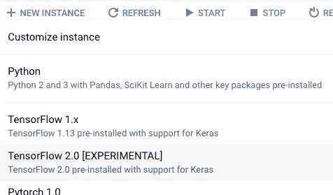

# 如何在 TensorFlow 2.0 中使用 Keras 建立宽深模型

> 原文：<https://towardsdatascience.com/how-to-build-a-wide-and-deep-model-using-keras-in-tensorflow-2-0-2f7a236b5a4b?source=collection_archive---------16----------------------->

## 在 Keras 函数式 API 中使用特性列

在 TensorFlow 2.0 中，Keras 支持要素列，从而能够使用嵌入、分桶和要素交叉等标准要素工程技术来表示结构化数据。在本文中，我将首先向您展示一个使用 Functional API 构建使用 features 列的模型的简单示例。然后，我将更新代码来构建一个完整的宽而深的模型。


为了使文章简短，我只关注模型，但是你可以在 GitHub 上看到[完整的笔记本](https://github.com/GoogleCloudPlatform/data-science-on-gcp/blob/master/updates/cloudml/flights_model_tf2.ipynb)(包括使用 tf.data 读取数据)。

## 1.如有必要，安装 TensorFlow 2.0

这里的代码假设您使用的是 TensorFlow 2.0。pip 在 Colab 中安装它，使用:

```
!pip install -q tensorflow==2.0.0-alpha0`
```

或者使用云 AI 平台(CAIP)笔记本获得 TensorFlow 2.0 Jupyter 实例:



Use TensorFlow 2.0 to try out this code

## 2.创建功能列

为输入中的每个字段创建要素列:

```
real = {
    colname : fc.numeric_column(colname) \
          for colname in \
            (’dep_delay,taxiout,distance’).split(’,’)
}
sparse = {
      'origin' : fc.categorical_column_with_hash_bucket(’origin’, hash_bucket_size=1000),
      'dest'   : fc.categorical_column_with_hash_bucket(’dest’, hash_bucket_size=1000)
}
```

这里，我为浮点型字段创建数字列，为分类字段创建哈希分类列。

## 3.创建模型的输入

对于每个输入，还要创建一个 Keras 输入图层，确保为每个输入字段设置 dtype 和名称:

```
inputs = {
    colname : tf.keras.layers.Input(name=colname, shape=(), dtype='float32') \
          for colname in real.keys()
}
inputs.update({
    colname : tf.keras.layers.Input(name=colname, shape=(), dtype='string') \
          for colname in sparse.keys()
})
```

## 4.做嵌入，一热编码等。

为了在深度学习模型中使用分类变量，我们必须对其进行编码。稀疏变量必须是嵌入式的或一键编码的。所以，让我们双管齐下:

```
embed = {
       'embed_{}'.format(colname) : fc.embedding_column(col, 10) \
          for colname, col in sparse.items()
}
real.update(embed)# one-hot encode the sparse columns
sparse = {
    colname : fc.indicator_column(col) \
          for colname, col in sparse.items()
}
```

## 5.使用函数式 API 构建 DNN 模型

关键是创建一个 DenseFeatures 图层来使用要素列转换输入:

```
deep = tf.keras.layers.DenseFeatures(real.values())(inputs)
deep = tf.keras.layers.Dense(64, activation='relu')(deep)
deep = tf.keras.layers.Dense(16, activation='relu')(deep)
output = tf.keras.layers.Dense(1, activation='sigmoid')(deep)
model = tf.keras.Model(inputs, output)
```

就是这样！调用 model.fit()等。像往常一样。

## 6.使用 Keras Functional API 构建广泛而深入的网络

如果要构建一个宽而深的网络，需要将稀疏要素直接连接到输出结点，但要通过一组密集图层传递真实要素。这里有一个模型架构可以做到这一点:

```
def wide_and_deep_classifier(inputs, linear_feature_columns, dnn_feature_columns, dnn_hidden_units):
    deep = tf.keras.layers.DenseFeatures(dnn_feature_columns)(inputs)
    for numnodes in dnn_hidden_units:
        deep = tf.keras.layers.Dense(numnodes, activation='relu')(deep)        
    wide = tf.keras.layers.DenseFeatures(linear_feature_columns)(inputs)
    both = tf.keras.layers.concatenate([deep, wide])
    output = tf.keras.layers.Dense(1, activation='sigmoid')(both)
    model = tf.keras.Model(inputs, output)
    model.compile(optimizer='adam',
                  loss='binary_crossentropy',
                  metrics=['accuracy'])
    return modelmodel = wide_and_deep_classifier(inputs, sparse.values(), real.values(), [64, 16])
```

当然，这是 Keras，你可以很容易地加入 dropout、batch normalization 等。到模型中。

尽情享受吧！

## 资源:

1.  参见 GitHub 上的[完整笔记本](https://github.com/GoogleCloudPlatform/data-science-on-gcp/blob/master/09_cloudml/flights_model_tf2.ipynb)。
2.  阅读我关于在 GCP 做[数据科学](http://shop.oreilly.com/product/0636920057628.do)的书