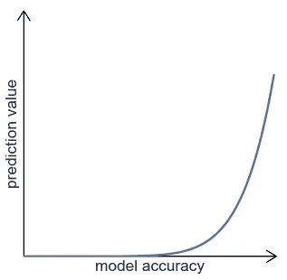
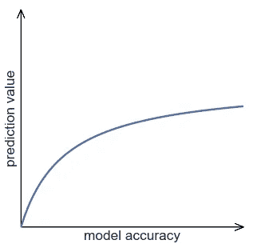
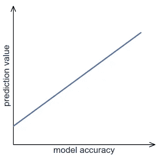
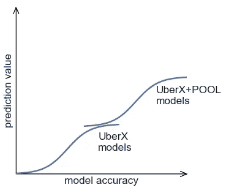

# 如何构建人工智能护城河

> 原文：<https://towardsdatascience.com/how-to-build-an-ai-moat-386c81a79900?source=collection_archive---------18----------------------->

## 打造更好的模型和更好的产品之间的联系

陈佳瑞介绍了“[智能系统](https://news.greylock.com/the-new-moats-53f61aeac2d9)*”*到的概念，解释了由人工智能和数据驱动的产品如何帮助公司建立深深的护城河，以保护他们的利润和市场份额免受竞争对手的影响:

> 这里成功的公司可以建立一个良性的数据循环，因为你用你的产品产生和训练的数据越多，你的模型就越好，你的产品就越好。

这是一个重要的见解，但不是全部。更好的模型并不能自动保证更好的产品。而没有这两者的联系，你就不会有护城河。弄清楚如何创造这种良性循环是产品战略和数据战略的交汇点。这就是本帖的主题。

## 型号、产品、价值

让我们从一个简单的问题开始:机器学习模型的商业价值是什么？

本身就是零。在市场中创造价值的是产品，而不是模式。

换句话说，模型只能作为产品的一部分产生价值。它可能是自动化日常工作流程，检测网络流量中的异常，或者提供个性化的建议。在每种情况下，模型的价值都是在它所支持的产品的环境中衡量的。

If a model makes a prediction and no product is around to use it, does it create value? (Photo: [Jachan DeVol](https://unsplash.com/@jachan_devol?utm_source=medium&utm_medium=referral))

## 量化预测值

量化模型的潜在商业价值的一种方法是假设模型是 100%准确的。这会对您的业务产生什么影响？答案可以是美元、点击量、转化率或任何其他可量化的商业指标。我把这个叫做模型的*预测值*。

例如，一家保险公司可能希望使用机器学习来自动化索赔处理。模型将从每个索赔中提取信息，并决定是否批准它。一个 100%准确的模型将减少代理成本，减少处理时间，并使公司更有效地扩大规模，因此其预测价值非常高。

不是每个模型都有潜力变得如此有价值。一些初创公司推销基于人工智能的解决方案，这些解决方案根本没有足够的可寻址市场。如果不创造商业价值，你的神经网络 100%准确也没关系。

让我们继续思想实验。现实中，没有一个模型是 100%准确的。那么，如果模型达到 99%的准确率，预测值会怎么样呢？

再考虑一下保险公司，少数欺诈性或未承保的索赔可能会被批准。如果这些索赔非常昂贵，那么自动处理其他 99%的索赔所节省的费用就会化为乌有。

从产品战略的角度来看，这是一个明显的挑战，因为建立高度精确的模型需要大量的时间、资源，尤其是数据。在这种情况下，有一个直截了当的解决方案:对自动索赔的价值设定上限。这是一个简单的例子，说明了[产品和数据洞察如何协同](https://hackernoon.com/the-product-data-fit-strategy-9d34bc8183ca)加速价值创造。稍后我会回到这个话题，但现在让我们继续思想实验。

## 模型值图

99%的准确率问题为我们提供了一些有用的见解，但它仍然过于乐观。实际上，你建立的第一个模型会不太准确。准确到什么程度？那是[事先不知道的事情](https://hackernoon.com/the-challenge-of-product-data-fit-92543078551b)。这取决于许多因素，主要是数据量和问题类型。

即使你不知道你的模型的准确性将是 60%还是 90%，你仍然可以评估这些不同场景下的预测值。你不需要实际建立任何模型来回答这些问题。其实你连机器学习都不需要了解多少！

让我们将这个思想实验的结果绘制在一个图表上，精确度在 *x* 轴上，预测值在 *y* 轴上。这就是*车型价值图*。对于保险公司来说，它可能是这样的:

图表趋势向上，因为预测值总是随着模型精度的提高而提高。但是，由于任何错误的高成本，该模型只能在非常高的精确度下产生重大价值。这种模式在容错能力较低的许多情况下很常见。

## 收益递减

让我们考虑另一个例子。当你给优步打电话时，你会得到司机到达的估计时间。这是机器学习模型的预测输出。例如，预测值可以通过预订行程数量的增加和取消行程数量的减少来衡量。

这个模型的模型值图是什么样的？即使不准确的 ETA 对乘客仍然有些用处，导致正面的预测值。准确的预计到达时间当然更有用，但在某些时候你会遇到收益递减:知道精确的到达时间不会对旅行次数产生太大影响。换句话说，模型价值图处于平稳状态:

这种平稳状态也是一种常见的模式。这种情况比保险示例中的情况安全得多，因为即使模型不是非常准确，它也会产生很好的价值。

## 断裂的环节

但是具有稳定价值的模型代表了一个错过的战略机会，因为它们没有创建一个很深的护城河。

机器学习模型不是静态的。他们可以接受再培训和提高。当优步刚刚开始的时候，ETA 预测不是很准确。但随着越来越多的乘客出行，该公司收集了越来越多的数据，模型变得更加准确。

产品也变好了吗？模型价值图告诉了我们答案。当图表处于平稳状态时，这意味着对于这个特定的模型来说，收集更多的数据或使用更复杂的建模技术没有太多的机会。更好的模型和更好的产品之间的联系断裂了。

平台期也意味着竞争对手可以快速赶上并创造类似的价值，即使它的数据少得多。如果模型只是你产品中一个很好的特性，这可能是可以接受的，但如果它是价值生成的核心引擎，这就不是了。这也是为什么仅仅依靠数据或深层技术很难建立一条可防御的护城河的原因之一。

## 如何构建人工智能护城河

那么如何用数据和 AI 构建一个可防御的护城河呢？以下是您希望模型价值图看起来的样子:

这意味着你的模型将会产生价值，即使最初它的准确性可能很低。然后，随着您收集更多数据并改进模型，预测值会增加。

这种模式建立了更好的模型和更好的产品之间的良性循环，并确保拥有更少数据的竞争对手将处于明显的劣势。

## 从更好的模型到更好的产品

在实践中，单一模型很难符合这个模型。但是一个成功的人工智能产品并不仅仅依赖于一个机器学习模型。相反，它利用了模型生态系统之间的协同作用，随着更多数据的生成，这些模型会共同改进。

再想想优步。除了 ETA 预测，我之前讨论的优步服务 UberX 也由预测乘客需求和出行模式的模型驱动。单独来看，这些模型中的每一个都可能达到稳定状态，但是总体来看，它们的预测值可以在更长的一段时间内保持增长。

随着您生成越来越多的数据，您的每个模型都会变得更加准确。随着时间的推移，之前预测值较低的模型(如保险公司的案例)可以得到足够的改进，从而产生实质性的价值。最终，您可能会释放潜力，利用这些新的模型来推动新产品，创造更多的价值和更深的壕沟。

## 人工智能 S 曲线

以优步拼车为例，这是一种较新的优步服务，允许相似路线的乘客拼车并分摊费用。除了 UberX 模型，POOL 还依赖一系列要求更高准确性和复杂性的模型，例如预测是否会有额外的乘客加入正在进行的旅行。该模型具有相对较低的误差容限，因为错误的预测可能导致公司的损失。

作为一种产品，POOL 打开了一个更注重价格的新市场。这对优步来说显然是非常有价值的，这意味着 POOL 的模型具有很高的预测价值。

让我们一起绘制 UberX 模型和 POOL 模型的模型值图。

在 ETA 预测的例子中，支持 UberX 的模型开始以相对较低的精度产生值，并迅速扩展，然后趋于平稳。这导致了 S 形曲线。一旦准确度足够高，池模型就会发挥作用，并与 UberX 模型一起继续扩大预测值。一起追踪所有模型的预测值揭示了在优步深深的人工智能护城河背后预测值的稳定增长。

这种模式类似于[创新 S 曲线](http://ideagenius.com/the-s-curve-pattern-of-innovation-a-full-analysis/)，它确定了一项技术成熟和一项新技术刚刚开始出现之间的创新和破坏机会。类似地，我们案例中的关键战略问题是如何识别一批新的高价值模型的潜力何时出现，以及如何在产品创新中利用它。我将在以后的文章中继续探讨这个话题。

## 底线

人工智能和数据有潜力创造深度防御护城河。关键是建立更好的模型和更好的产品之间的联系。随着生成的数据越来越多，模型变得越来越好，但是任何单个模型的预测值都趋于稳定。通过战略性地利用新的更强大的模型群和它们释放的产品机会，成功的公司可以扩大从他们的数据中产生的商业价值，并建立一个深刻的人工智能护城河。