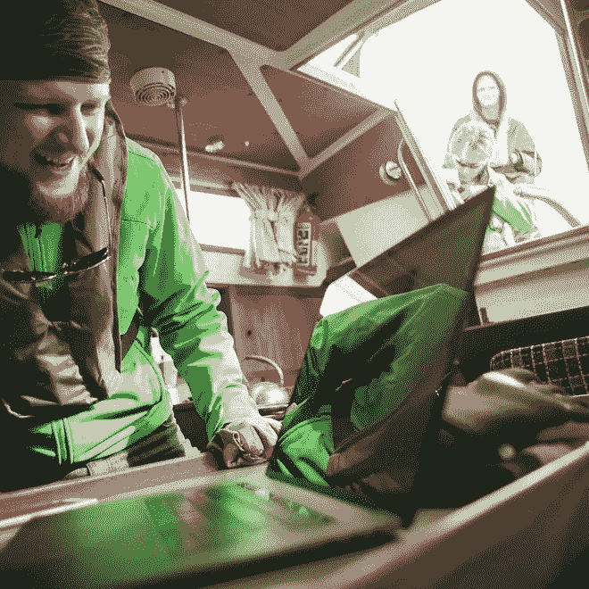

# 使用机器学习建造一艘自主帆船

> 原文：<https://towardsdatascience.com/how-to-build-an-autonomous-sailboat-using-machine-learning-d112e33ca9e0?source=collection_archive---------3----------------------->

## 我们以一种相当另类的方式教授机器学习:让参与者将一艘真正的帆船变成一个帆船竞赛机器人。

在这篇博文中，我们将分解这个挑战，专注于第一个子任务:使用机器学习来寻找帆船比赛中的最佳航向。

您将学习如何赢得帆船比赛，以及完成这项任务所需的基本机器学习概念。

Another day at the office

# 从“为什么”开始

问“我们为什么要这样做？”应该是我们在任何机器学习项目中提出的第一个问题。我们多次看到项目失败，最终是因为错误的原因开始的，所以:

> 为什么我们要制造一艘自主帆船？

简而言之:它提供了一个学习如何应用机器学习的绝佳环境。

这不是因为人们厌倦了自己驾驶帆船，也不是因为我们想用我们新的超级智能驾驶系统赢得美洲杯。不，这个挑战包含了一些非常适合学习的因素:

1.  **帆船比赛是一种游戏** 这种所谓的“对抗性”设置意味着我们不仅要考虑自己的行动，还要考虑一个或多个对手的行动。这增加了一层全新的复杂性，从而提供了一个非常具有挑战性的学习环境。
2.  **环境是真实的**
    设定不是人为的，而是真实的，无情的。有许多因素需要考虑:风、波浪、船的状况等。这些是大多数算法在现实世界中工作时面临的现实。
3.  **知识会粘得更好**
    人类在运用所有感官的时候学得更好。在帆船上可以刺激他们所有人，并带来更丰富的学习经历。这有助于你更深层次地理解这些概念。

# 具体胜过抽象

在我们的课程中，我们采取了与大多数其他人工智能课程不同的方法。我们不会从基本概念开始，直到我们能够解决这个难题。我们将走一条不同的路线，立即瞄准大奖。通过不断牢记主要目标(创造一艘自主帆船)，你会在前进的道路上保持更多的参与和动力。

# 目标

让我们稍微细化一下我们的目标。创建一艘自主帆船听起来很合理，但并不真正聪明(具体、可测量、可实现、相关、有时间限制)，是吗？

我们可以将我们的目标定义如下:

> **为帆船创建一个自动驾驶仪(操舵装置),使其能够以竞争的方式参加帆船比赛。**

不过，这似乎是一个相当大的难题。将一个问题分解成我们可以单独解决的小问题通常会有所帮助。类似这样的内容可能会有所帮助:

> **目标 1:** 考虑风向和风速，找到最佳航向
> 
> **目标 2:** 让船沿着最佳路线行驶
> 
> **目标 3** :运用竞赛战术，这样我们可以选择最大化我们获胜机会的行动

哇，目标 1 现在看起来实际多了。我们可以问一些非常具体的问题，比如:给定风向和风速，帆船的最佳航向是什么？

我很高兴你问了…让我们开始吧！

# 目标 1:找到最佳路线

在我们可以用机器学习做一些事情之前，我们首先需要学习一两件关于航海的事情。这种“*领域知识*”对于机器学习项目的成功至关重要。除了错误的动机，缺乏领域知识是许多机器学习项目失败的第二个原因。要么我们解决了错误的问题，要么我们解决了错误的问题。

考虑图 1 中的场景。假设我们需要到达顶部的标记，风是直接从上面吹来的。你可能知道:我们不能直接逆风航行(见[这段视频](https://youtu.be/5DpsiSim1KU)了解一些背景信息)。但是如果风从侧面吹来，我们永远也不会击中目标。所以这两个极端之间存在一个最优。找到这个最优值是我们的目标。

**Figure 1: the upwind ladder (wind comes from top)**

风向角、风速和船速之间的关系通常由水手显示在极坐标图中。图 2 显示了这样一个图表的例子。

**Figure 2: A polar diagram**

粗黑线表示在特定风向角(相对于船)和速度下的船速。针对 6、8、10、12 和 20 节的风速绘制了不同的曲线。船速通常以节为单位，1 节≈ 1，85 公里/小时。现在，读取船速变得非常容易，例如:110 度风角下的 10 节风速(答案是大约 7 节)。更重要的是，这个图表有助于我们找到最佳的 VMG(见视频: [Velocity Made Good](https://youtu.be/84hwn8gPxNc) )。

简单对吗？我们不需要机器学习。除了我们没有每艘船的极坐标图。通常，船只设计师会提供一些理论极坐标，但专业团队需要创建自己的极坐标以获得最佳性能。

现在我们可以将第一个目标重新定义为更具体的东西:

> **给定风速和风向，预测某个方向的船速。**

有了这样一个模型，我们可以很容易地预测最大 VMG 的路线。现在让我们继续，看看我们如何使用机器学习来实现这一点！

# 永远记住目标

在课程中，我们将使用除了自主帆船以外的例子。当我们引入新概念时，我们会使用这样的插页将它们与我们的目标联系起来:

> **目标**:寻找最佳路线

# 什么是机器学习？

那么，什么是机器学习呢？让我们首先定义学习本身。谷歌网络的定义告诉我们:

> ***学习*** *:通过学习、体验或被教导而获得知识或技能*

这适用于计算机，也适用于人类。稍后我们将会看到:人类和计算机以非常相似的方式学习。

在机器中，获得的知识存在于所谓的模型中。该模型在训练阶段学习，并将在以后用于执行其在应用程序中的最终任务。比如做预测。

> *模型:系统对世界的看法，包含系统所学的内容*

# 机器学习的类型

根据上面的学习定义，有三大类机器学习:

*   监督学习(被教授)
*   强化学习(体验)
*   无监督学习(研究)

# 监督学习

目前，这是最常见的机器学习形式。我们知道结果一定是什么，我们通过提供数据的好的和坏的例子来“教”机器更接近。

更具体地说:我们希望我们的模型能够将给定的输入(通常命名为 X)转换成特定的输出(通常命名为 y)。我们通过输入相应的输出示例来训练模型。这被称为训练集。

**Figure 3: Inputs, Outputs and Model**

另一种定义它的方法是把它写成一个数学公式:

> y = f(X)

这里 f 是将输入转化为输出的函数(模型)。

# 强化学习

这在技术上是一种监督学习的形式，只不过老师不是人。该系统通过反复试验从其环境中学习。

该模型仍然有输入和输出，但我们没有带有示例的训练集。相反，我们有一个奖励函数，这个模型试图最大化这个函数。

# 无监督学习

即使没有老师，机器也可以学习在接收到的数据中寻找结构。例如:'*聚类*'和'*降维*'。见下面的降维示例*。*系统找到看起来相似的照片示例。

**Figure 4: Example of the t-SNE dimensionality reduction, original from:** [**https://lvdmaaten.github.io/tsne/**](https://lvdmaaten.github.io/tsne/)

> **目标——寻找最佳路线**
> 
> **问题**
> 什么样的机器学习类型最适合我们的目标？
> 
> **回答**
> 我们有一个已标记的数据集可用，所以我们可以使用监督学习。

# 问题的类型

在监督学习中，我们可以解决两种主要类型的问题。类型取决于所需的输出。

假设您想要确定某个图像包含一只狗还是一只猫。这将是一个分类的例子。

> ***分类*** *:目标是预测一个类或类别*

另一个例子:假设我们想根据天气预报和季节来预测北京的烟雾量。这将是一个回归问题。

> ***回归*** *:目标是预测一个实数*

> **目标——找到最佳路线**
> 
> **问题** 我们的目标是分类还是回归型问题？
> 
> **回答** 显然这是一个回归问题，因为我们想要预测船速，而船速是一个实数。

# 特征

现在，我们来看看机器学习系统的输入数据。模型需要知道我们想要了解的事物的属性。这些特性或属性被称为*特征*。

我们以水果为例:水果的重量和颜色都是特征。

**Figure 5: Different features of oranges and kiwis**

该模型可以使用这些特征来预测我们正在观察的水果的种类。这就是分类。

试图根据重量和颜色预测直径是一个回归问题。

> **目标——寻找最佳路线**
> 
> **问题** 对于我们的目标来说，该模型的特点是什么？
> 
> **回答** 风的角度和风速

# 培训模型

好的，但是我们如何从特征到预测呢？首先我们必须训练我们的模型。

# 训练分类模型

让我们继续以水果为例。我们想根据重量和颜色来确定水果的类型。首先，我们需要将颜色转换成数字。我们用纳米来表示光的波长。绿色变成 520 纳米，橙色变成 600 纳米。我们将这两个数字绘制成图表。

**Figure 6: Scatterplot with data points**

训练的目标是找到猕猴桃和橙子的分界线。这条线完全是随机开始的。随着每一步的训练，模型都试图将线向正确的方向移动一点。一段时间后，越来越多的水果会出现在正确的一边。

**Figure 7: Classifying oranges and kiwis**

经过 5 个步骤，我们对结果感到满意。训练停止，我们现在可以用我们全新的训练模型进行预测。

# 训练回归模型

这遵循相同的基本原则。现在，我们将根据重量来预测每个橙子的价格。我们的目标是画一条与我们用于培训的示例非常匹配的线。

**Figure 8: Example of a regression model**

经过训练后，该模型给出了给定重量的每只橙子的估计价格。

# 回到帆船上

那么，在给定风速和风向的情况下，我们如何使用机器学习模型来预测某个方向的船速呢？在我们开始训练之前，我们需要数据！

假设你已经记录了去年你的团队每次出航时的风速、风向和船速。你遇到了许多不同的天气(和海浪)条件。清理完这些数据后，您最终会得到一个包含数字的大表。来自该*数据帧*的随机样本如图 9 所示。

**Figure 9: Random sample of dataset**

在这种情况下，boat_speed 是我们的目标变量。我们的输入特征是风速和攻角。

在我们的课程中，我们使用在船上收集的数据来训练机器学习模型。参与者将使用这些预测来制作他们自己的船的极坐标图。如前所述，这将在比赛中为船只的自主性和竞争力发挥重要作用。

然后我们把模型挂在帆船上，在水上测试它们。我们还与所有参与者举行虚拟比赛，以找出哪种模式效果最好！

Videos from the virtual race and simulator used to test the algorithms

# 一锤定音

在这篇博客文章中，你已经发现了我们实现自主航行挑战的子目标 1 的方法——找到最佳路线，并了解了机器学习的一些关键概念。

那么，子目标 2 和 3 发生了什么变化？子目标 1 在一篇博客文章中已经涵盖了很多内容，所以请继续关注未来关于挑战的其他部分的文章。

就是这样，我们希望你受到了机器学习、帆船比赛或最好两者的启发！如果你有任何问题，请在评论中告诉我。

更多关于我们机器学习课程的信息，请看:【https://www.ai-captain.com/】T3

水上见！