# 如何建立用于垃圾分类的图像分类器

> 原文：<https://towardsdatascience.com/how-to-build-an-image-classifier-for-waste-sorting-6d11d3c9c478?source=collection_archive---------4----------------------->

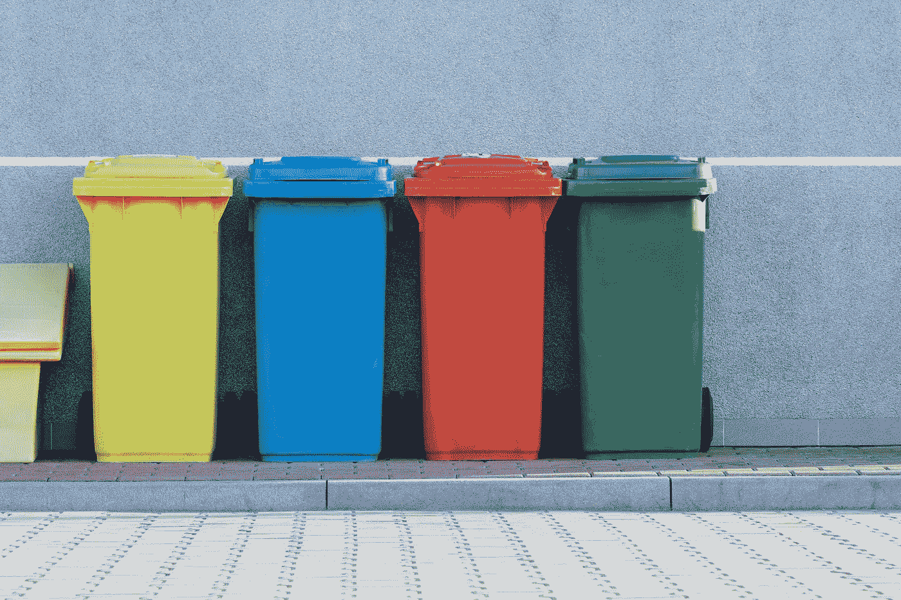

## 用 fastai 库在 Python 中快速训练卷积神经网络

# 为什么要进行垃圾分类？

当废物被不正确地处理时，回收污染就会发生——比如回收一个上面有油的比萨饼盒子(堆肥)。或者当废物被正确处理但未被正确准备时——比如回收未腌制的果酱瓶。

污染是回收行业的一个大问题，自动化垃圾分类可以缓解这个问题。只是为了好玩，我想尝试制作一个图像分类器的原型，对垃圾和可回收物进行分类——这种分类器可以应用在光学分类系统中。

# 构建图像分类器

我将使用 fastai 库(构建在 PyTorch 上)训练一个卷积神经网络来将图像分类为纸板、玻璃、金属、纸张、塑料或垃圾。我使用了 Gary Thung 和 Mindy Yang 手动收集的图像数据集。如果你正在跟随，在这里下载他们的数据集，然后把它移到和笔记本[相同的目录。](https://github.com/collindching/Waste-Sorter)(注意:你会想要使用 GPU 来加速训练。)

## 我的建模渠道:

1.  下载并提取图像
2.  将图像组织到不同的文件夹中
3.  火车模型
4.  做出并评估测试预测
5.  后续步骤

# 1.提取数据

首先，我们需要提取“dataset-resized.zip”的内容。

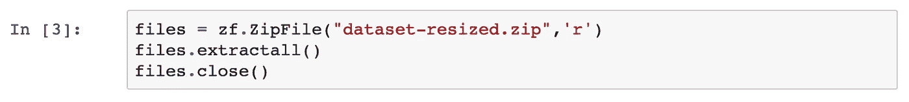

Code for extracting images from zip file

解压缩后，调整了数据集大小的文件夹有六个子文件夹:

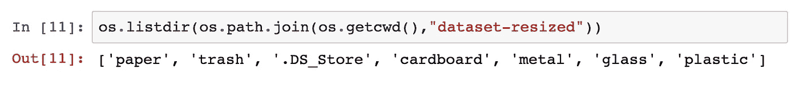

Ignore .DS_Store

# 2.将图像组织到不同的文件夹中

现在我们已经提取了数据，我将把图像按 50–25–25 的比例分成训练、验证和测试图像文件夹。我定义了一些帮助我快速构建它的函数，你可以在[笔记本](https://nbviewer.jupyter.org/github/collindching/Waste-Sorter/blob/master/Waste%20sorter.ipynb)中查看。

接下来，我将根据 ImageNet 目录约定创建一组目标文件夹。这意味着它将有一个包含三个子文件夹的外部文件夹(我称之为 data):train、validation 和 test。在每个文件夹中，都有一个名为纸板、玻璃、金属、纸张、塑料和垃圾的文件夹。我也将跳过这段代码，因为它很普通；只要知道这是我的图像数据集的组织。

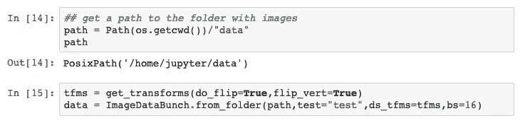

ImageDataBunch.from_folder()指定我们将从 ImageNet 结构的文件夹中提取训练、验证和测试数据。

批量大小 bs 是你一次训练多少个图像。如果您的电脑内存较少，请选择较小的批处理大小。

您可以使用 get_transforms()函数来扩充数据。

以下是数据的一个示例:

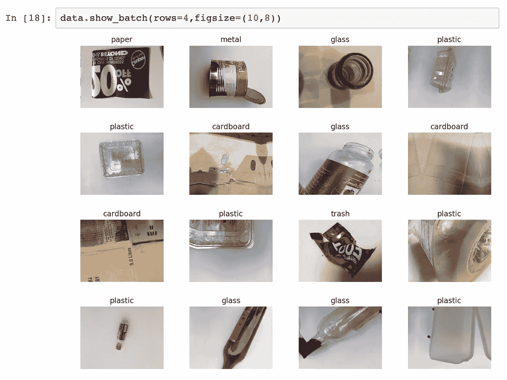

Excellent photos of garbage

# 3.模特培训

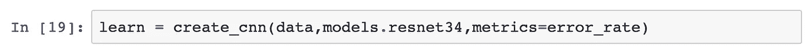

Specifying the CNN in one line of code

## resnet34 是什么？

残差神经网络是有很多层的[卷积神经网络(CNN)](/convolutional-neural-networks-for-beginners-practical-guide-with-python-and-keras-dc688ea90dca) 。具体来说，resnet34 是一个有 34 层的 CNN，已经在 [ImageNet 数据库](http://www.image-net.org/)上进行了预训练。预训练的 CNN 将在新的图像分类任务中表现得更好，因为它已经学习了一些视觉特征，并且可以转移这些知识(因此是转移学习)。

由于它们能够描述更复杂的情况，深度神经网络在理论上应该比浅层网络在训练数据上表现得更好。然而，在现实中，深度神经网络往往比浅层神经网络表现更差。

创建 Resnets 是为了使用一种叫做快捷连接的黑客技术来规避这个故障。如果层中的一些节点具有次优值，则可以调整权重和偏差；如果一个节点是最优的(它的残差是 0)，为什么不放过它呢？仅根据需要对节点进行调整(当存在非零残差时)。

当需要调整时，快捷连接会应用 identity 函数将信息传递给后续层。这在可能的情况下缩短了神经网络，并允许 resnets 具有深层架构，并且表现得更像浅层神经网络。resnet34 中的 34 只是指层数。

阿南德·萨哈在这里给出了一个更深入的解释[。](http://teleported.in/posts/decoding-resnet-architecture/)

## 寻找学习率

我将找到梯度下降的学习率，以确保我的神经网络收敛得相当快，而不会错过最佳误差。关于学习率的复习，看看杰瑞米·乔登关于选择学习率的[帖子](https://www.jeremyjordan.me/nn-learning-rate/)。

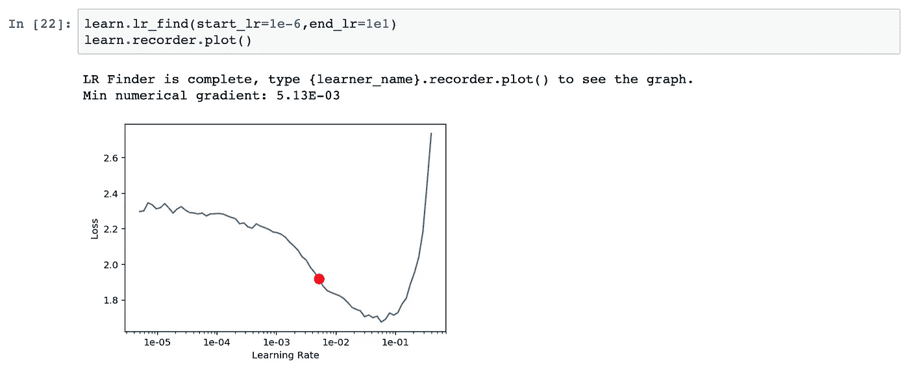

学习率查找器建议学习率为 5.13e-03。有了这个，我们就可以训练模型了。

## 培养

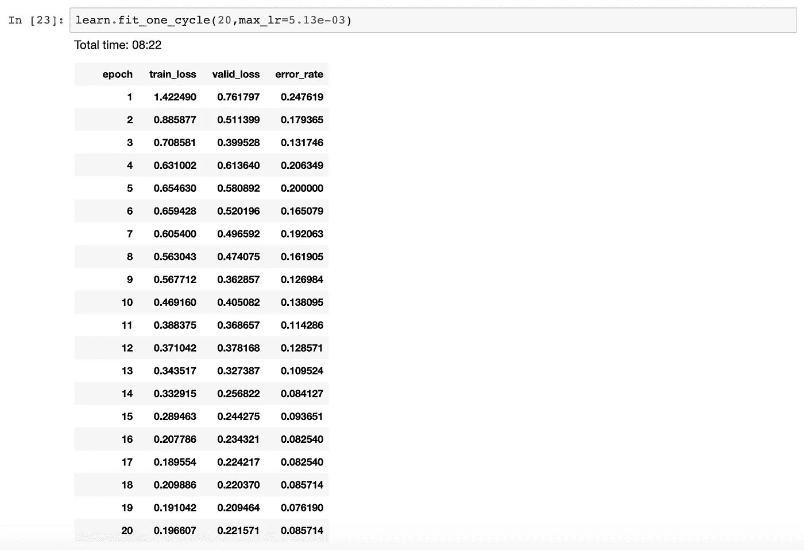

Results of training on validation set

我运行了 20 个时期的模型。这种拟合方法的酷之处在于，学习率随着每个历元而降低，从而使我们越来越接近最优值。8.6%的验证误差看起来非常好…让我们看看它在测试数据上的表现。

首先，我们可以看看哪些图像被错误地分类了。

## 可视化最不正确的图像

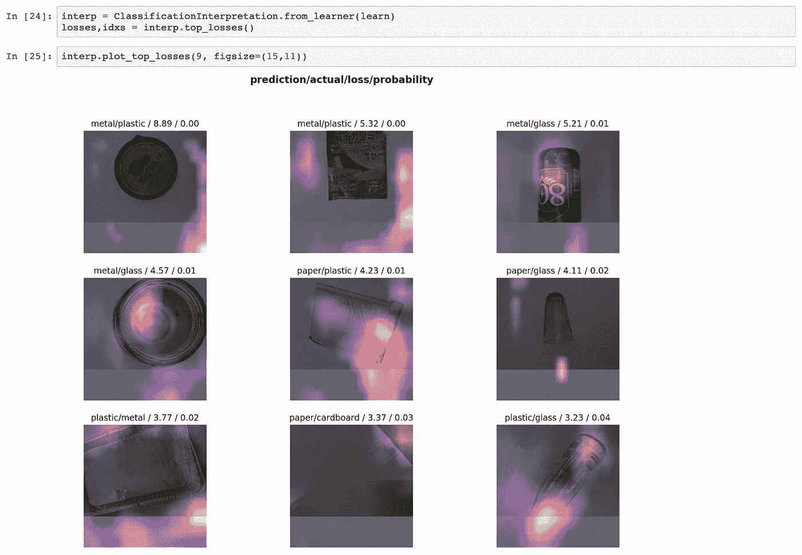

这里回收器表现不佳的图像实际上被降级了。看起来照片曝光太多了，所以这实际上不是模型的错！

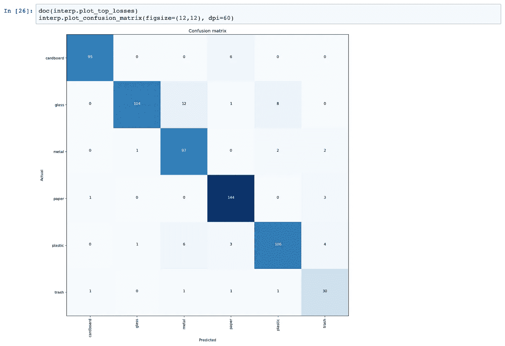

这种模型经常把塑料误认为玻璃，把金属误认为玻璃。最令人困惑的图片列表如下。

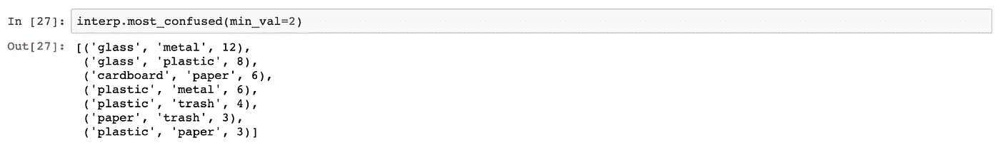

# 4.根据测试数据做出新的预测

为了了解这种模式的实际表现，我们需要对测试数据进行预测。首先，我将使用 learner.get_preds()方法对测试数据进行预测。

**注意:** learner.predict()只对单幅图像进行预测，而 learner.get_preds()对一组图像进行预测。我强烈推荐阅读[文档](https://docs.fast.ai/basic_train.html#Learner.get_preds)来学习更多关于 predict()和 get_preds()的知识。

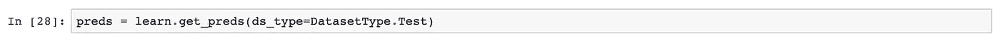

get_preds(ds_type)中的 ds_type 参数接受一个[数据集](https://docs.fast.ai/basic_data.html#DatasetType)参数。示例值是数据集。训练，数据集。我提到这一点是因为我犯了传入实际数据(learn.data.test_ds)的错误，这给了我错误的输出，并且花费了令人尴尬的长时间来调试。

不要犯这种错误！不要传入数据—传入数据集类型！

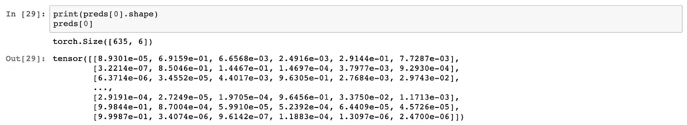

这些是每幅图像的预测概率。这个张量有 365 行(每个图像一行)和 6 列(每个材质类别一列)。

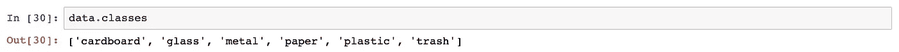

现在我要把上面张量中的概率转换成预测类名的向量。

这些是所有图像的预测标签！让我们检查一下第一个图像实际上是否是玻璃。

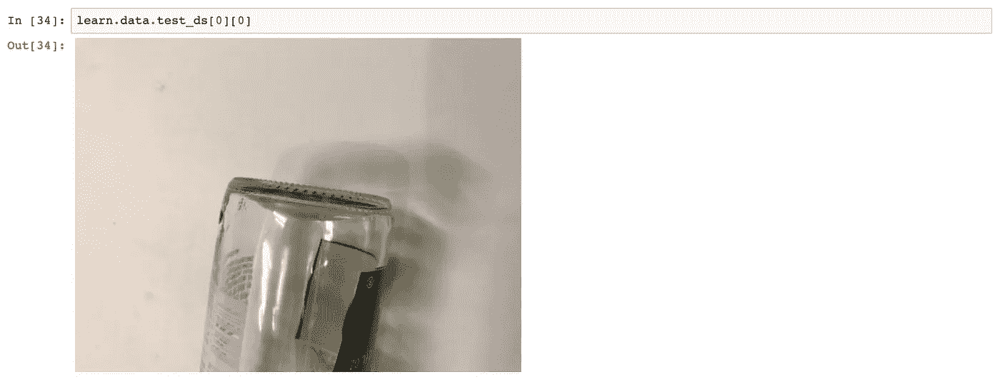

确实是！

接下来，我将从测试数据集中获取实际的标签。

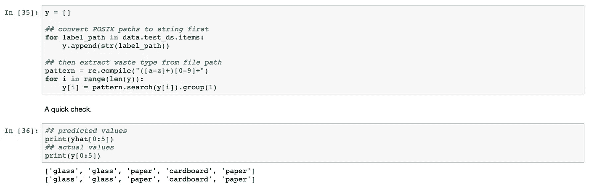

看起来前五个预测匹配！

这款车型整体表现如何？我们可以用混淆矩阵来找出答案。

## 测试混淆矩阵

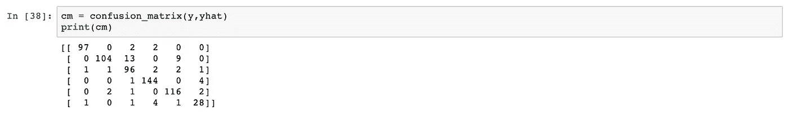

Confusion matrix array

我要把这个矩阵做得漂亮一点:

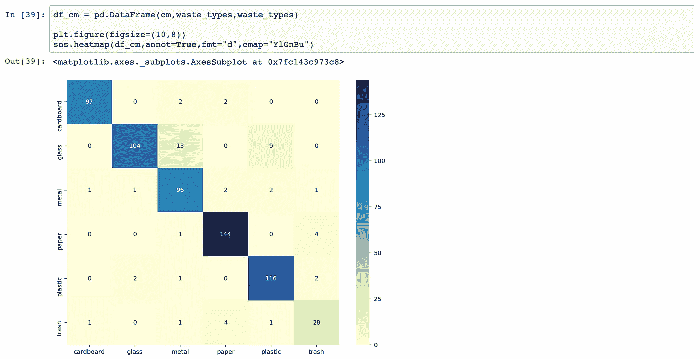

同样，该模型似乎混淆了玻璃的金属和玻璃的塑料。随着时间的推移，我相信进一步的调查会有助于减少这些错误。

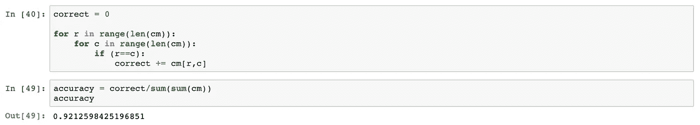

我最终在测试数据上实现了 92.1%的准确率，这相当不错——垃圾网数据集的原始创建者使用支持向量机在 70-30 的测试训练中实现了 63%的测试准确率[(他们还训练了一个神经网络，测试准确率为 27%)。](http://cs229.stanford.edu/proj2016/poster/ThungYang-ClassificationOfTrashForRecyclabilityStatus-poster.pdf)

# 5.后续步骤

如果我有更多的时间，我会回去减少分类错误，特别是玻璃。我还会从数据集中删除曝光过度的照片，因为这些图像只是坏数据。

这只是一个快速而肮脏的迷你项目，旨在表明训练一个图像分类模型是非常快速的，但使用 fastai 库创建一个最先进的模型的速度是非常惊人的。如果你有一个你感兴趣的应用程序，但不认为你有机器学习的能力，这对你来说应该是令人鼓舞的。

[*下面是*](https://github.com/collindching/Waste-Sorter) *这个项目的 Github 回购。*

*感谢詹姆斯·德林杰的这篇关于蓝鸟分类的* [*博文*](https://blog.usejournal.com/if-i-can-you-can-and-you-should-a470d7aea89d) *。有关回收的更多信息，请查看这篇 fivethirtyeeight*[*帖子*](https://fivethirtyeight.com/features/the-era-of-easy-recycling-may-be-coming-to-an-end/) *。*