# 如何使用 IBM Watson NLC 服务构建对象检测模型

> 原文：<https://towardsdatascience.com/how-to-build-an-object-detection-model-using-watson-autoai-64677e045fd0?source=collection_archive---------28----------------------->

## 无需编码，构建脑瘤目标检测模型

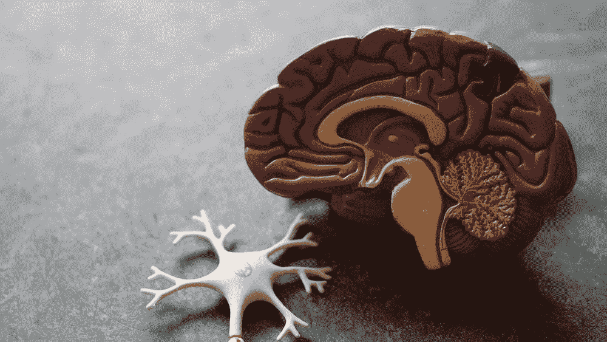

Image by [Robina Weermeijer](https://unsplash.com/@averey) — Unsplash

## 目标检测

目标检测是属于计算机视觉和图像处理的图像分类和定位任务的一般形式。对象检测的目标是利用每个对象的置信度分数来检测图像中的特定对象。它被用于不同的领域，用于不同的目的，例如搜索、计数、检测癌症等。

## 让我们建立模型

在本帖中，我们将构建一个无需一行代码就能检测脑瘤的对象检测模型。

在 IBM Watson 中创建一个项目后，单击项目名称，您将被重定向到一个类似的页面，如下所示

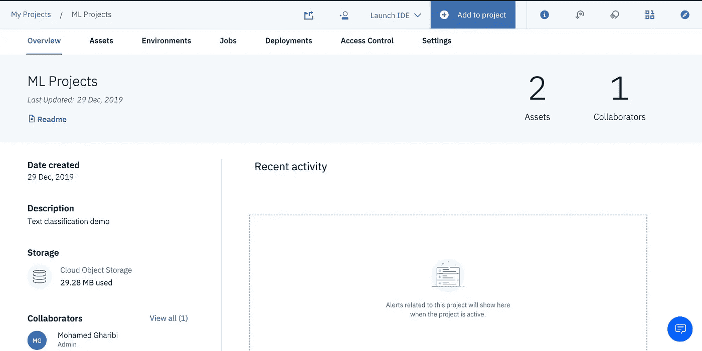

点击*“添加到项目”*选择模型类型:**视觉识别模型。**

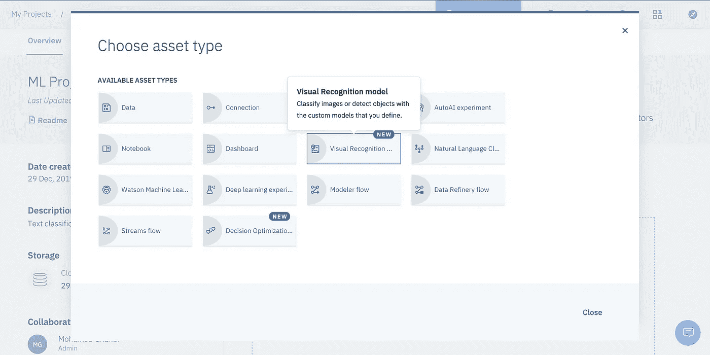

如果是第一次训练或测试可视化模型，您需要添加一个服务

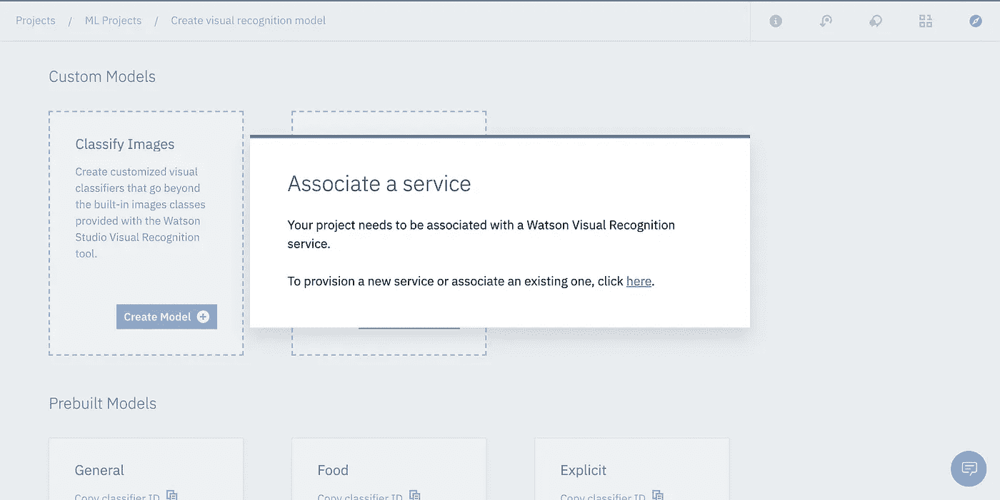

选择一个符合你需要的计划

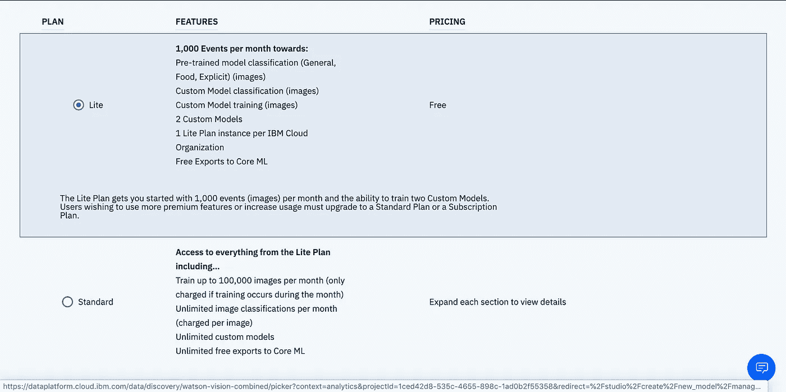

我更喜欢保留默认设置。但是，您可以更改区域、计划、服务名称等。

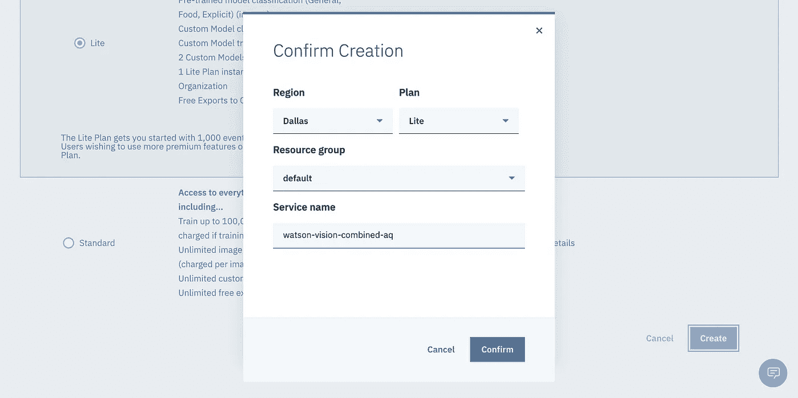

之后，选择一个视觉模型(在我们的例子中，**检测物体**)。

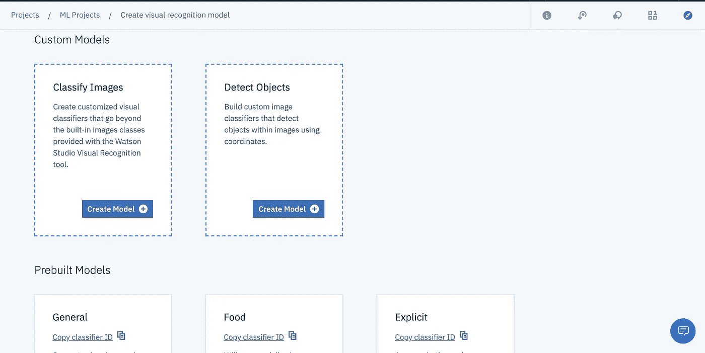

点击*“浏览”*将您的大脑扫描数据集(或任何其他图像数据集)上传为 zip 文件。不久之后，图像将被加载到模型中，您可以在其中看到图像细节。

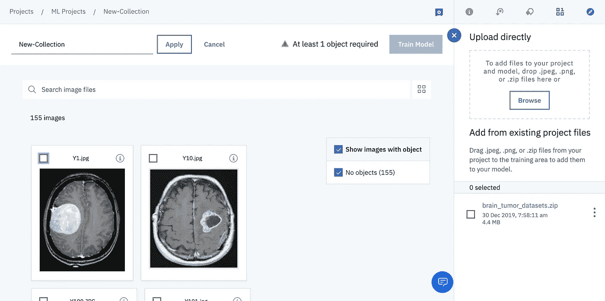

单击每个图像以添加您想要检测的对象。只需点击*【添加对象】*按钮。在对象周围画一个正方形，并在屏幕右侧命名。点击*“添加”*，对象将被添加到图像中。最后，点击*“完成”*保存更改。

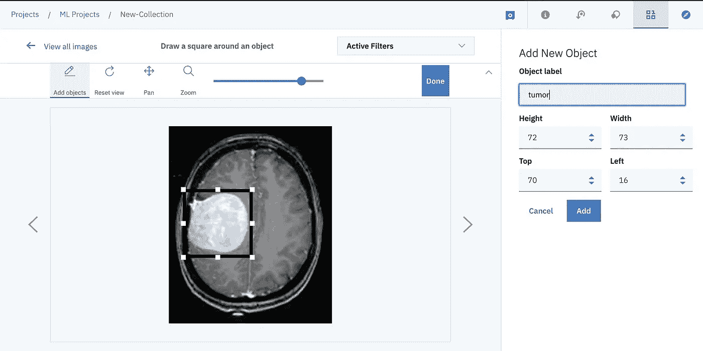

其他图像可能不止一次出现相同的对象或不同的对象。你可以把他们都干掉。点击*“完成”*保存更改。

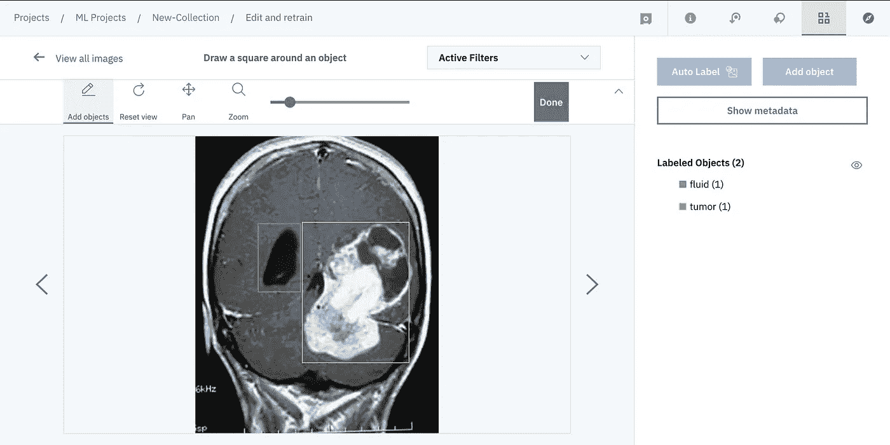

在添加了至少一个对象之后，模型就可以进行训练了。点击*“火车模型”*，模型将立即准备好。

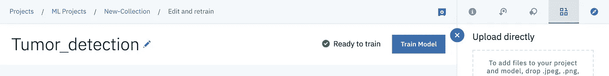

培训结束后将会发送通知。

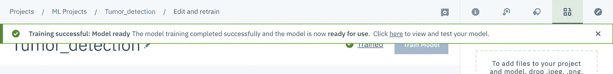

点击*“此处”*导航至模型页面，在此您可以查看其所有详细信息。

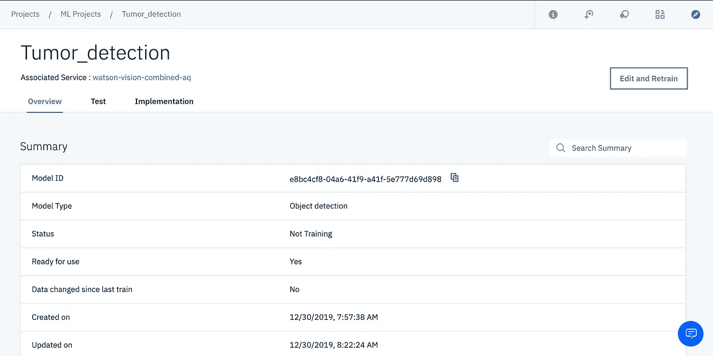

点击“测试”,通过上传新图像来推断您的模型。该模型将利用它们的置信度分数来检测所有可能的对象。在下面的例子中，我选择了只显示肿瘤对象。

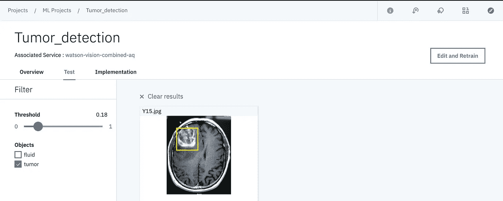

最后，单击“Implementation ”,将会提供 API 来远程推断您的模型。

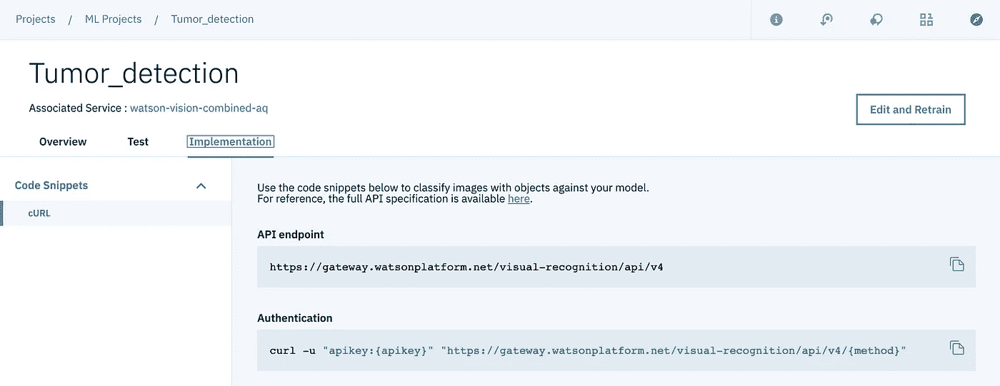

# 资源

*   [IBM 沃森工作室纪录片](https://www.ibm.com/watson)
*   [Youtube 上的 IBM Watson Studio 学习中心](https://www.youtube.com/watch?v=DBRGlAHdj48&list=PLzpeuWUENMK3u3j_hffhNZX3-Jkht3N6V)
*   [Kaggle 上的大脑扫描数据集](https://www.kaggle.com/navoneel/brain-mri-images-for-brain-tumor-detection)