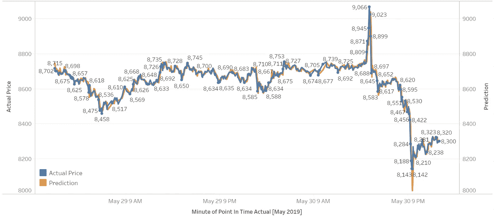
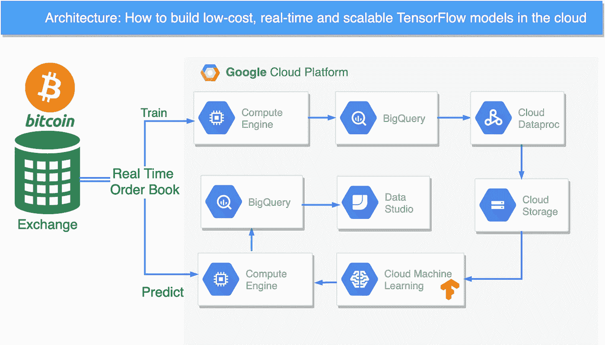
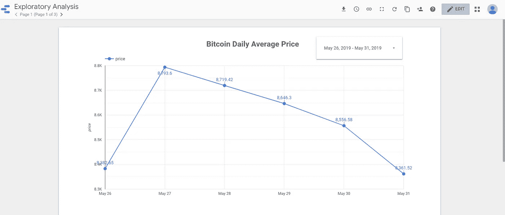
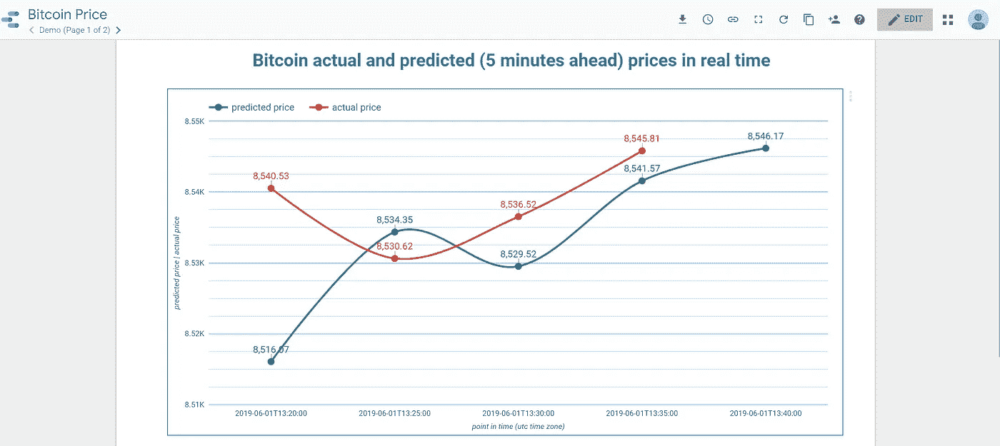

# 如何使用谷歌云通过 4 个步骤构建低成本、实时和可扩展的机器学习模型

> 原文：<https://towardsdatascience.com/how-to-build-low-cost-real-time-and-scalable-machine-learning-models-in-4-steps-using-google-cloud-ea2cff85cca2?source=collection_archive---------19----------------------->

在这篇文章中，我描述了一个端到端的机器学习管道，使用谷歌云平台(GCP)、TensorFlow、约 40 亿订单历史数据集和美国交易所实时订单簿来预测比特币价格。

在过去的 3 年里，我对这个存在于云计算、机器学习和加密货币交汇处的主题产生了热情。

这是 2019 年 5 月几天的主要输出。

Bitcoin actual and predicted price for 2 days in May 2019; predicted price is 5 minutes ahead

你可能会认为这是 TensorFlow 的又一个比特币价格预测模型。其实这与其说是比特币，不如说是机器学习。

在深入了解更多细节之前，让我们先快速了解一下高层架构。

High Level GCP Architecture

这只是一个例子，绝不是投资建议。

这篇文章和其他类似的文章有一些显著的不同:

1.  庞大而丰富的数据集——我一直在流式传输和收集大约 40 亿份 BTC 美元订单；该数据集已用于训练模型
2.  架构——非常注重集成 GCP 提供的许多组件
3.  成本—这不是 IT 部门、硬件机架或百万美元预算所能实现的。这只是我在学习 GCP(当我不在金融机构的分析部门工作时)

现在回到 4 个步骤，简而言之，我做了以下事情:

1.  流式传输和存储实时完整订单
2.  执行探索性分析，并将原始数据转化为有意义的变量
3.  开发和训练深度学习模型
4.  实时评估模型

让我们进入更多的细节，但在“待办事项”列表格式，以保持简短。

1.  **传输并存储实时完整订单簿**

*   选择一个交换。数据是免费的。我喜欢[比特币基地](https://docs.pro.coinbase.com/)
*   决定订单水平。如果你买了[市场微观结构](https://en.wikipedia.org/wiki/Market_microstructure)和价格形成理论，选择给你最多(全订单)数据的级别。我满足于第 3 级，因为我可以分别为交易和(市价和限价)订单创建变量
*   选择一个数据存储。在流式数据方面，BigQuery 是一款很棒的产品。我尝试过(浪费了很多时间)在一个计算实例中运行我自己的数据存储
*   决定流式组件。这一领域有许多优秀的产品。我选择了 node.js/websockets，因为它与 BigQuery 的集成非常好
*   使用小型计算实例全天候传输数据流。小型 linux 实例是可靠的。他们只是跑了几个月。我确实会时不时地让它们停几分钟来升级软件包，但是我通常会设置好实例，然后忘记它

**2。进行探索性分析，将原始数据转化为有意义的变量**

*   使用 [Data Studio](https://datastudio.google.com/) 或 Tableau 连接到 BigQuery。我使用 Tableau 已经很多年了，这是一个很好的工具。但我对 Data Studio 感到惊喜，它与谷歌产品的集成是无与伦比的。我发现自己越来越多地使用 Data Studio

Exploratory Data Analysis with Data Studio

*   使用 [Dataproc](https://cloud.google.com/dataproc/) 从 BigQuery 中提取数据并保存到云存储中。接下来转换数据集:重新采样(例如，10 分钟间隔)，归一化，创建变量。将输出以 [TFRecord](https://www.tensorflow.org/tutorials/load_data/tf_records) 格式保存到云存储中。Dataproc 没问题，但我考虑将这部分切换到[数据流](https://cloud.google.com/dataflow/)，原因有二:

1.  在启动集群之前，我需要确定集群的大小；我多次低估了我需要的资源，并且在 Spark 中遇到了内存不足的错误
2.  我使用 scala 和 Dataproc，但是对于实时组件，我使用 python。两种语言做同样的事情并不理想。另外，你需要考虑一些细微的差别

**3。开发和训练深度学习模型**

*   使用[云 ML 引擎](https://cloud.google.com/ml-engine/) /CMLE 来训练和部署 TensorFlow 模型——一旦训练集准备好，我就使用 TensorFlow 及其强大的神经网络功能来训练一个[序列](https://www.coursera.org/learn/sequence-models-tensorflow-gcp)模型。这里要提到的一件事是，我很惊讶超参数调整如何改进我的模型，在几次试验后将 [RMSE](https://www.tensorflow.org/api_docs/python/tf/metrics/root_mean_squared_error) 降低了 50%。

**4。实时评估模型**

*   使用交易所实时订单簿预测 5 分钟后的比特币价格。

下面的图表是使用 Data Studio 创建的，它实时显示了 5 分钟前的预测。x 轴显示时间线(以 5 分钟为单位，采用 UTC 时区), y 轴显示两个时间序列:实际价格和预测价格。请注意，由于模型是实时预测的，因此没有与上次预测价格相关联的实际价格！

预测跟踪得相当好，但是它们没有始终捕捉到方向的变化(例如图表中的第一点)。这是我打算解决的问题。

最后，我正在考虑将模型输出作为 API 公开，但是我现在还不确定。如果你对此感兴趣，给我写信。