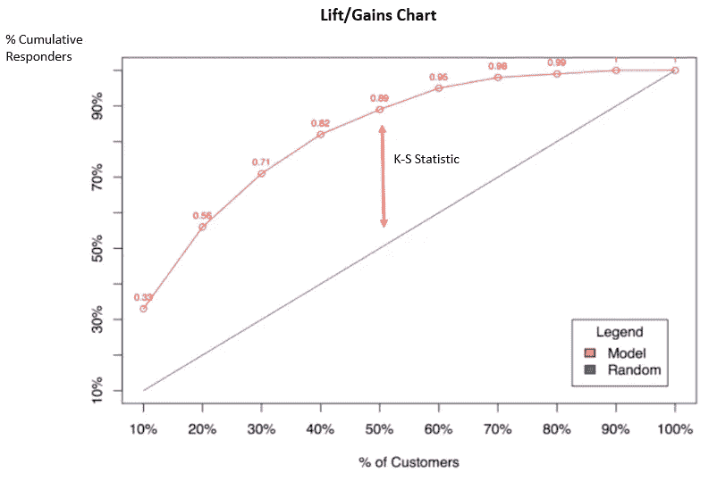

# 如何构建生产级 AI？

> 原文：<https://towardsdatascience.com/how-to-build-production-grade-ai-a0eeff7b1fd2?source=collection_archive---------23----------------------->

Photo by [Hitesh Choudhary](https://unsplash.com/@hiteshchoudhary?utm_source=medium&utm_medium=referral) on [Unsplash](https://unsplash.com?utm_source=medium&utm_medium=referral)

## 让你的人工智能模型为你工作

你是否努力从你新开发的人工智能模型中获取真正的价值？

> “你说的生产是什么意思？太复杂了。我们将再次运行代码。”

以上是许多领先组织中有抱负的数据科学家的典型回应。

生产级人工智能模型是一种帮助人类以可持续和可预测的方式做出商业决策的模型。

在过去的几年里，我成功地领导了高级分析和数据科学领域的组织转型。这些是一些最常见的心态——看看你能否将事实与虚构区分开来:

*   “机器建造了我的人工智能模型”
*   “我不够聪明，无法解释我的人工智能模型”
*   “我有人工智能模型，我不用再做任何工作”

以上都是目前虚构的。人类为人类建立 AI 模型。伟大的数据科学家可以建立与人类一起工作的人工智能模型。此外，人工智能模型提供了额外的见解，但仍需要大量的工作、调查和决策。

那么，生产级 AI 的支柱是什么呢？

# 证明 AI 模型实力

> “所有的模型都是错的，问题是它们错得有多离谱。”——约翰·埃文斯

模型强度并不完全等同于模型准确性。衡量 AI 模型实力还是需要精度的。混淆矩阵是衡量模型准确性的常用方法，它显示模型预测和实际结果之间的差异。尽管它默认适合分类模型，但是可以将非分类模型转换成这种形式。虽然名字很难理解，但结果很容易理解。

An illustrative example of Confusion Matrix from [“Understanding Confusion Matrix”](/understanding-confusion-matrix-a9ad42dcfd62)

精度越高不一定越好。在统计学中，这被称为“过度拟合”，即模型与训练样本过于相似。这意味着模型完美地预测了过去的事件，但是没有正确地预测未来的事件。

衡量模型强度的更好方法是模型提升。它证明了模型如何区分成功和随机选择。

在模型提升下，有一些相关的拟合优度统计，如 AUC(曲线下面积)或 K-S (Kolmogorov-Smirnov)。对于 K-S 统计，任何超过 25%的通常被认为是生产级。

此外，显示人工智能模型强度随时间的退化。我们可以使用的度量标准是 PSI ( [人口稳定性指数](https://www.listendata.com/2015/05/population-stability-index.html))。它通过记分卡以及重新访问模型的关键阈值来跟踪模型的强度。

# 证明人工智能模型稳定性

> 典型的数据科学家或典型的机器学习软件表示:“我使用了 10%的样本，这样就足够了。”

10%的保留样本或任何其他默认百分比是不够的。

有两种类型的时间验证与人工智能模型开发相关:

1.  及时验证(ITV)
2.  超时验证(OTV)

传统的保留样本通常被称为及时验证，因为它是观察时间窗口的子集。然而，这种情况会持续到未来吗？

OTV 是对未来模型稳定性的一个很好的检验。我见过无数次，模特通过了 ITV，但没有通过 OTV。这包括模型精度、模型升力的显著下降，甚至模型方向参数的改变。它还可以作为过度装配的把关者。

# 证明 AI 模型合理性

一个生产级的 AI 模型必须通过理性或者商业常识。尽管复杂的人工智能模型发现了极端异常，但其关键发现植根于普通的商业常识。

部分相关性图(PDP)展示了您的相关性/结果变量与主要驱动因素的关键相关性。尽管人工智能模型的内部机制非常复杂，但如果构建正确，结果解释的清晰度将会非常清晰。

An illustration of PDP Plots from *Christoph Molnar’s book on* [*Interpretable Machine Learning*](https://christophm.github.io/interpretable-ml-book/pdp.html)

上面的例子清楚地显示了租用自行车的数量与温度、湿度和风速之间的半线性关系。尽管人工智能模型很复杂，但企业高管需要利用其结果来做出重要决策。这可能涉及定价，自行车供应和潜在的有利可图的商业地点。

**总之，数据科学家需要学会构建强大、稳定和理性的生产级人工智能模型。**

人工智能模型的建立具有挑战性。它同时需要复杂性、简单性和创造性。

然而，重要的是要记住，人工智能模型是由人类建造的——由机器计算——并为人类所用。

**如果你喜欢这篇文章，并想看更多的内容，请考虑加入媒体会员，使用下面的链接来支持我和其他作者:**

 [## 通过我的推荐链接加入 Medium-Albert Suryadi

### 阅读艾伯特·苏亚迪(以及媒体上成千上万的其他作家)的每一个故事。您的会员费直接支持…

albertsuryadi.medium.com](https://albertsuryadi.medium.com/membership) 

**关于作者:**[*Albert sur yadi*](https://www.linkedin.com/in/albertsuryadi/)*是蓝筹股组织中实现高级分析和数据科学能力的公认领导者。他被公认为分析团队(实践社区)的领导者，该团队授权并激励他人超越现状。*