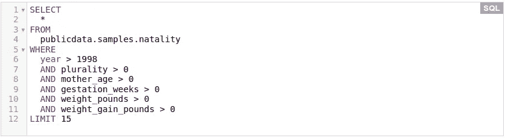
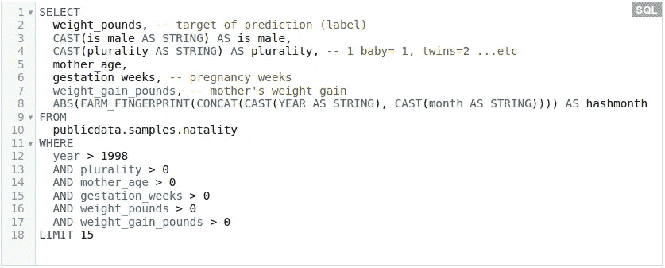
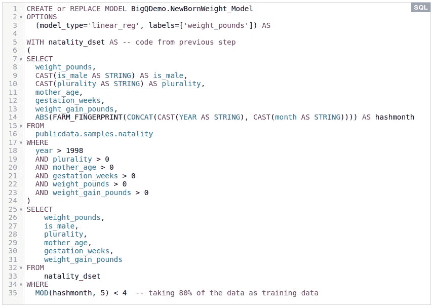
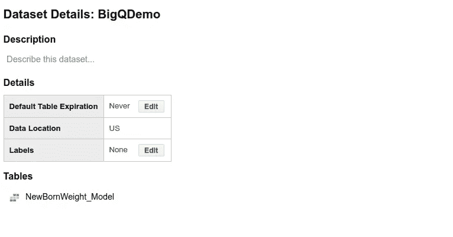
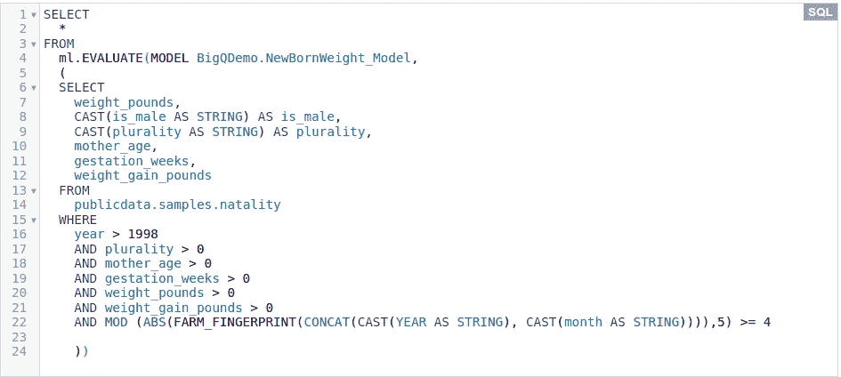
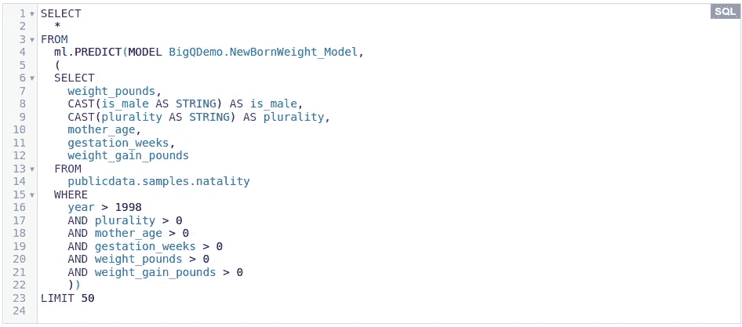

# 如何在几分钟内构建生产规模的云 ML 模型！

> 原文：<https://towardsdatascience.com/how-to-build-production-scale-cloud-ml-model-in-few-minutes-7d1bc59deac9?source=collection_archive---------22----------------------->

## 仅使用 Google Cloud 上的 SQL，在几分钟内构建、训练和部署一个机器学习模型。


Photo by [Markus Spiske](https://unsplash.com/@markusspiske?utm_source=medium&utm_medium=referral) on [Unsplash](https://unsplash.com?utm_source=medium&utm_medium=referral)

作为在云计算市场获得更大市场份额的努力的一部分，谷歌云一直在为其平台添加强大的工具，特别是在人工智能方面。其中一个工具是 BigQuery ML，它使用户能够在几分钟内开发和训练大型数据集的 ML 模型！

如果您还不熟悉它，BigQuery 是一个无服务器的数据仓库，支持 SQL 查询，您只需为查询数据的使用和存储付费(它“类似”于 AWS 上的 Redshift)。

自 2018 年年中以来，BigQuery 已使用户能够在几分钟内用几行 SQL 代码构建 ML 模型。这篇文章将带你经历构建这样的 ML 模型所需的步骤。

**注**:

*   用于说明步骤的例子是受 BigQuery 官方教程中的 [one](https://cloud.google.com/bigquery-ml/docs/bigqueryml-natality) 的启发。
*   如果你想执行这里的代码，你可以在这里找到它。

## **1)将您的数据导入 BigQuery:**

如果数据还没有加载到 BigQuery 中，有几种方法可以实现。事实上，您不需要像查询外部数据一样将数据加载到 BigQuery 中进行查询。但是，如果您关心速度，将您的数据上传到 BigQuery 是一个好主意。

在这里，我们将使用**出生率数据集**，其中有 1969 年至 2008 年间美国出生登记的详细信息，来**预测新生儿的体重**。它已经在 BigQuery 中作为公共数据集 [**在这里**](https://bigquery.cloud.google.com/table/publicdata:samples.natality?tab=details) 可用。

## 2)探索和预处理数据:

让我们通过运行以下查询来考虑数据集中最近 10 年的数据，其中的值是有意义的(即> 0):



这产生了下表:

BigQuery runtime: 2.3s elapsed, 21.9 GB processed

从上表中可以看出，有几列似乎适合创建要素来预测新生儿的体重，即:

```
**is_male**,
**plurality**,(one baby, twins, ...etc)
**mother_age**,
**gestation_weeks**,(duration of pregnancy in weeks)
**weight_gain_pounds** (weight gained by the mother during the pregnancy in pounds)
```

例如，为了检查这些列是否可以被利用到特性中，可以在 Jupyter 或 Datalab 笔记本中对照`weight_pounds`列(预测的目标)来绘制这些列，并进行探索。检查缺失数据、稀疏性等。对于良好的特征工程是必不可少的。为了简单起见，让我们跳过这一步，跟着我们的直觉走！

## 3)定义和设计特征:

使用在上一步中选择的将被利用到特性中的列，让我们看看如何在 BigQuery 中编码我们的特性。

请注意，在 BigQuery ML 中，所有字符串都被视为分类特征，所有数值都被视为连续特征。因此，我们的 5 个特征将定义如下:



运行上述查询会产生:

BigQuery runtime: 2.7s elapsed, 6.82 GB processed

注意`hashmonth`栏。我们为数据集的过去 10 年中的每个月制作了一个哈希值(`year>1998`)，以在下一步中无泄漏地分割训练/评估数据集(即，具有相同出生日期的婴儿应该在训练或评估集中)。

## 3)创建和训练 ML 模型:

在创建 ML 模型之前，需要一个 BigQuery 数据集来存储模型，这可以通过在 BiQuery web UI 中单击“创建数据集”来轻松创建。让我们把这个数据集命名为`BigQDemo`。

SQL 命令`CREATE MODEL`创建并训练模型。因为我们预测的是新生儿的体重，这是一个连续的值，所以在下面的查询中为`model_type`选择了一个线性回归模型。运行这个查询(大约需要 4 分钟)创建并训练一个名为`NewBornWeight_Model`的 ML 模型！



经过训练的模型以表格的形式出现在`BigQDemo`数据集下:



可以通过浏览`NewBornWeight_Model`表或运行以下查询来查看培训统计数据，如损失和学习率:

```
SELECT * FROM ML.TRAINING_INFO(MODEL BigQDemo.NewBornWeight_Model);
```

您可以在官方文档[这里](https://cloud.google.com/bigquery-ml/docs/reference/standard-sql/bigqueryml-syntax-create)找到 BigQuery ML 的所有其他模型类型和可选参数。

## 4)评估训练好的模型:

命令`ML.EVALUATE`用于评估已训练的模型。在我们的例子中，让我们对训练期间没有使用的剩余 20%的数据评估模型(参见下面查询中的条件`AND MOD (..., 5)>= 4`):



这产生了以下结果:

BigQuery runtime: 2.5s elapsed, 6.82 GB processed

## 5)用你的模型预测

当您对您的模型感到满意时，您可以使用命令`ML.PREDICT`来使用它进行预测。让我们根据过去 10 年的出生数据预测 50 个婴儿的体重:



如下表所示，当使用`ml.PREDICT`命令时，预测列自动命名为`predicted_<label_column_name>`。

BigQuery runtime: 1.0s elapsed, 5.80 GB processed

这样，您就有了一个功能完整的 ML 模型！

BigQuery ML 不仅有助于构建 ML 模型作为 Google Cloud 数据管道的一部分，或者使非技术人员能够运行 ML 模型；而且还可以快速测试新设计的复杂 ML 特征的效果，例如在大型数据集上。因此，当直接从开发环境(例如 Jupyter notebooks)执行时，BigQuery ML 对 ML 开发人员特别有用。