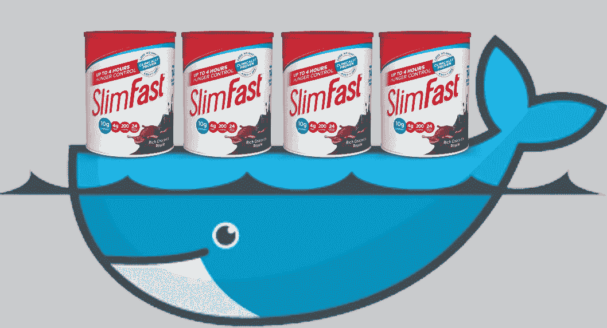

# 如何快速建立苗条的 Docker 图像

> 原文：<https://towardsdatascience.com/how-to-build-slim-docker-images-fast-ecc246d7f4a7?source=collection_archive---------4----------------------->



你还记得那些日子吗，你写了很棒的软件，但是你不能把它安装在别人的机器上，或者它在那里崩溃了。虽然这从来都不是一次愉快的经历，但我们可以说


如今，由于集装箱化，这不再是一个借口。

简而言之，通过容器化，您可以将应用程序和所有必要的依赖项打包到一个映像中。在执行时，您将该映像作为容器运行。有了这个，你就不必为了让你的软件运行而去摆弄别人的系统了。容器和你的软件应该可以在任何地方运行，如果它运行在你的机器上的话。当部署依赖于不同包和版本的模型时，这对于数据科学家也很有用。对我来说，数据科学家必须知道如何创建图像和容器。

众所周知，Docker 是这一领域的主要玩家，Docker 图像无处不在。这太棒了，因为你可以毫无困难地并排启动不同版本的数据库。为你的应用程序拼凑图片也非常简单。这是由于大量的基本图像和简单的定义语言。然而，当你在不知道自己在做什么的情况下一起黑图像时，你有两个问题。

1.  ***你浪费了磁盘空间，因为你的图像变得不必要的庞大。***
2.  等待花费太长时间的构建会浪费你的时间。

在本文中，我想向您展示如何减轻这两个问题。幸运的是，这只需要你知道 Docker 提供的一些技巧和技术。为了让本教程变得有趣和有用，我将向您展示如何将 Python 应用程序打包到 Docker 映像中。你可以在我的 [***Github 资源库***](https://github.com/Shawe82/docker-tutorial) 中找到下面引用的所有代码。

你准备好了吗？我们开始吧。

# 教程

让我们假设我们所有的代码都在一个 Python 文件 *main.py.* 中，因为我们是酷小孩，所以我们使用最新最好的 Python 版本，在撰写本文时是 3.8。我们的应用只是一个简单的网络服务器，它依赖于*熊猫、* [*、fastapi*](https://fastapi.tiangolo.com/) *、*和*、uvicorn* 。我们将依赖关系存储在一个 *requirements.txt* 文件中。在本地，我们在虚拟环境中开发应用程序。该环境位于名为的文件夹中。venv 放在与代码相同的文件夹中(这一点很快变得很重要)。现在，我们决定将所有这些打包成一个 Docker 映像。为此，我们要做的就是

1.  使用 Python 3.8 版本的基础图像。
2.  复制代码和需求文件。
3.  在映像中安装需求和依赖项。
4.  公开运行我们的应用程序的命令

我们的 Docker 图像的第一个版本看起来像

```
**FROM** python:3.8.0-slim
**COPY** . /app
**RUN** apt-get update \
&& apt-get install gcc -y \
&& apt-get clean
**WORKDIR** app
**RUN** pip install --user -r requirements.txt
**ENTRYPOINT** uvicorn main:app --reload --host 0.0.0.0 --port 8080
```

除了我们的代码和需求，我们需要安装 *GCC* ，因为FastApi 要求在安装时安装。我们通过以下方式建立我们的形象

```
docker build -t my-app:v1 .
```

这个映像的大小约为 683 MB，构建它大约需要一分钟(不包括下载基本映像)。让我们看看如何减少这种情况。

## 基础图像

关于基础图像，我已经有意识地选择使用 Python ***slim*** 。我为什么要选择这个？

例如，我可以拍摄一个完整的 Ubuntu 或 CentOS 图像，这将导致图像大小大于 1GB。但是，因为我只需要 Python，所以没有理由安装所有这些。

在图像尺寸的下端，我们可以取 *python:3.8.0-* ***高山*** 。但是，我的代码依赖熊猫，在 alpine 上安装很痛苦。Alpine 在稳定性和安全性方面也有问题。再者，slim 只比 alpine 大~80MB，还是可以的。有关如何选择最佳 Python 映像的更多信息，我建议感兴趣的读者参考本文。

## 构建上下文

当您构建映像时，打印到控制台的第一行内容是:*向 Docker 守护进程发送构建上下文。在我的电脑上，这花了大约 5 秒钟，发送了 154 MB。这里发生了什么事？Docker 将构建上下文中的所有文件和文件夹复制到守护进程中。这里，构建上下文是存放 Dockerfile 文件的目录。由于我们只需要两个文本文件，154 MB 听起来很多，不是吗？这样做的原因是 Docker 复制了所有 T21 的东西，例如。包含虚拟环境的 venv 文件夹，或者。git 文件夹。*

要解决这个问题，你只需要添加一个名为 ***的文件。在你的文档旁边。在这个文件中，你一行一行地列出 ***不应该复制*** 的 Docker。这就像 git 对。gitignore 文件。举个小例子，假设我们的文件夹中有几个不想复制的 Excel 文件和 png 文件。的。dockerignore 文件看起来像***

```
*.xlsx
*.pngvenv
.venv
.git
```

在我们的例子中，在我添加了这个文件之后，“向 docker 发送构建上下文”只需要几毫秒，并且只发送了 7.2 kb。我将图像大小从 683 Mb 减少到 529 Mb，这大约是以前构建上下文的大小。不错！*添加一个. dockerignore 文件既有助于******构建*******缩小*** ***图像尺寸*** 。***

## **图层缓存**

**如前所述，在我的机器上构建这个图像大约需要 60 秒。大部分时间，我估计大约 99.98%，用于安装需求和依赖项。你可能会认为这里没有太大的改进空间。但是有时你必须频繁地构建图像！为什么？Docker 可以利用 ***图层缓存*** 。**

**Docker 文件中的每一行都代表一个层。通过添加/删除线中的内容，或者通过更改它引用的文件或文件夹，可以更改层。当这种情况发生时， ***这一层和下面所有的层得到重建*** 。否则，Docker 使用该层的缓存版本。为了利用这一点，您应该这样构建 docker 文件**

1.  *****不经常变化的图层应该出现在靠近 Dockerfile 开头的地方。*** 这里安装编译器就是一个很好的例子。**
2.  *****经常变化的图层应该出现在接近 Dockerfile 的末尾。*** 复制源代码就是这里最完美的例子。**

**酷毙了。理论到此为止，让我们回到我们的例子。**

**假设你没有改变需求，你只是更新了你的代码。这在开发软件时相当常见。现在，每次构建您的映像时，都会重新安装这些讨厌的依赖项。构建映像总是需要相同的时间。烦人！我们还没有利用缓存。**

***神奇的新 docker 文件来了，它解决了你的问题***

```
****FROM** python:3.8.0-slim
**RUN** apt-get update \
&& apt-get install gcc -y \
&& apt-get clean
**COPY** requirements.txt /app/requirements.txt
**WORKDIR** app
**RUN** pip install --user -r requirements.txt
**COPY** . /app**ENTRYPOINT** uvicorn main:app --reload --host 0.0.0.0 --port 1234**
```

**这看起来没有什么魔力和不同，对吗？我们所做的唯一一件事，就是首先安装 GCC 和*分开复制需求和复制源代码*。**

**GCC 和依赖关系很少改变。这就是为什么这一层现在很早就出现了。需求变化也很慢，但比 GCC 更频繁。这就是为什么这一层在 GCC 层之后。我们的源代码经常改变。因此，复制它发生晚了。现在，当我们对源代码进行修改并重新构建映像时，由于 Docker 使用缓存的层，所以不会重新安装依赖关系。现在重建几乎不需要时间。这很好，因为我们可以花更多的时间来测试和执行我们的应用程序！**

## **多阶段构建**

**在我们的示例图中，我们必须安装 GCC 来安装 FastApi 和 uvicorn。但是，对于运行 ***应用程序我们不需要编译器*** 。现在想象一下，你不仅需要 GCC，还需要其他程序，比如 Git，或者 CMake，或者 NPM，或者…你的制作形象越来越胖。**

> **多阶段构建拯救了我们！**

**通过多阶段构建，您可以在同一个 Dockerfile 文件中定义不同的映像。每个图像执行不同的步骤。您可以将从一个映像生成的文件和工件复制到另一个映像。最常见的情况是，您有一个构建应用程序的映像和另一个运行应用程序的映像。您需要做的就是将构建工件和依赖项从构建映像复制到应用程序映像。**

**对于我们的例子，这看起来像**

```
*****# Here is the build image*
FROM** python:3.8.0-slim as builder
**RUN** apt-get update \
&& apt-get install gcc -y \
&& apt-get clean
**COPY** requirements.txt /app/requirements.txt
**WORKDIR** app
**RUN** pip install --user -r requirements.txt
**COPY** . /app***# Here is the production image***
**FROM** python:3.8.0-slim as app
**COPY** --from=builder /root/.local /root/.local
**COPY** --from=builder /app/main.py /app/main.py
**WORKDIR** app
**ENV** PATH=/root/.local/bin:$PATH
**ENTRYPOINT** uvicorn main:app --reload --host 0.0.0.0 --port 1234**
```

**当我们构建它时，我们得到的最终生产映像大小为 353 MB。这大约是我们第一个版本的一半大小。恭喜你，不算太坏。请记住，您的生产映像越小越好！**

**顺便提一下，多阶段构建也增加了安全性。阿辉，这是为什么？假设您需要一个秘密，比如 SSH 密钥，以便在构建时访问某些资源。即使您在后面的层中删除了该秘密，它在前面的层中仍然存在。这意味着可以访问你的图片的人可以得到这个秘密。对于多阶段构建，您只需复制必要的运行时工件。因此，生产映像永远看不到这个秘密，而您已经解决了这个问题。**

**关于多阶段构建有更多的细节，我建议读者参考本文[和本文](https://medium.com/capital-one-tech/multi-stage-builds-and-dockerfile-b5866d9e2f84)。**

# **包裹**

**在这篇文章中，我向您展示了一些简单的技巧和诀窍，告诉您如何创建更小的 Docker 映像，以便更快地构建。纪念**

*   *****总是添加一个. dockerignore 文件。*****
*   *****想想你的图层顺序，从慢变到快变的动作排序。*****
*   *****尝试使用和开发多阶段构建。*****

**希望这能为你以后节省一些磁盘空间和时间。**

**感谢您关注这篇文章。一如既往，如有任何问题、意见或建议，请随时联系我。**