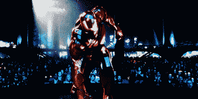
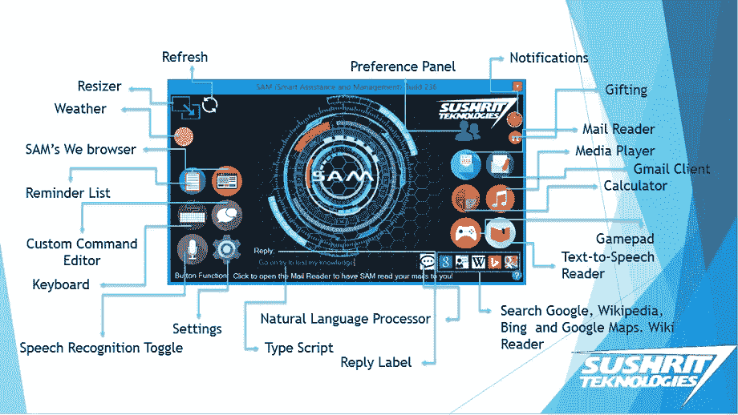
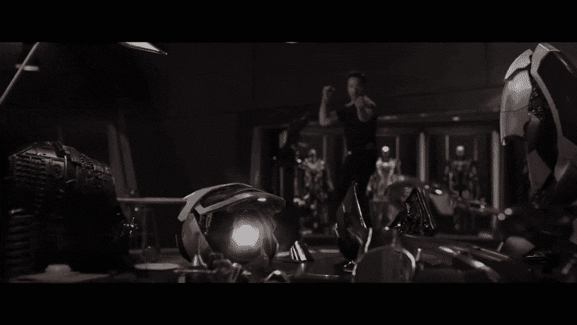
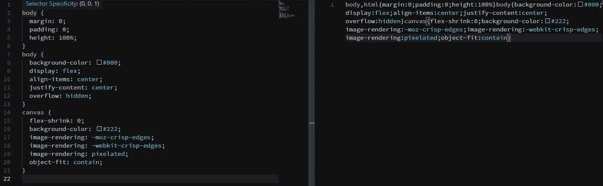
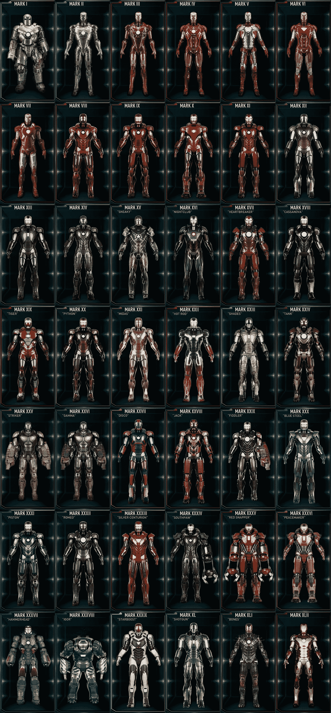
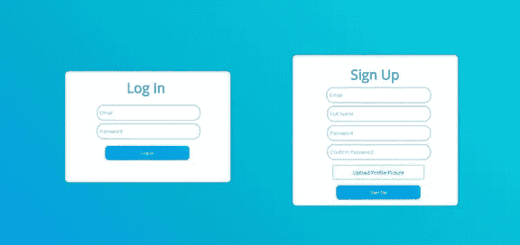

# 如何构建像托尼·斯塔克那样的软件

> 原文：<https://towardsdatascience.com/how-to-build-software-like-tony-stark-95484a2d2173?source=collection_archive---------2----------------------->

That’s gonna be you by the end of this journey

> 这篇文章将带你经历一个过程，在这个过程中，你可以[开始](https://medium.com/datadriveninvestor/the-last-guide-youll-need-how-to-start-your-journey-into-programming-17ca2bd1e073)项目，打破无休止学习的循环，或者改变你的方式，在编码时改进你的工作流程和效率，这样你就可以不再觉得这不是你的事情，而是决定学习 Excel。我们将从托尼·斯塔克(又名钢铁侠)和他如何建造东西中汲取灵感。我也会分享一些我个人遵循的保持 100%状态的小贴士。

如今写伟大的代码并不是一个真正的问题。一切都只是一个谷歌搜索，只需找到 Stackoverflow 的第一个链接，找到最多投票/接受的答案和 boom 复制粘贴！

我看到，如今大多数人面临的真正挑战是下一步去哪里，或者如何真正利用他们所学的东西。我们都有责任在最新的框架上观看完整的视频播放列表，这个框架比其他每个人似乎都在使用的框架做得更好，但无论如何都在抱怨。大多数人只是看看，留下一些评论，然后就结束了。几天后，你看到的下一个播放列表也是如此。

人们以惊人的速度消费这些播放列表。学习新东西没有错，但真正的错误是除了视频用来指导你完成框架的演示应用/服务之外，不要在任何地方使用它们。

如果它是 React 或 Vue 之类的东西，它将是待办事项应用程序。如果是与机器学习相关的东西，如 Tensorflow 或 keras，它十有八九会出现在 MNIST 数据集(识别手写数字)上。

我明白，除了扩展提供的示例代码之外，很难想出一个项目来应用这些技术。我们中的大多数人在待办事项应用程序中添加 2 个或更多按钮，然后结束一天的工作，更新你的简历并完成。如果你拿起播放列表是因为你想学习新的东西来做你的项目，那会更容易，因为你知道你想从那里开始。大多数人不进行下一步，因为他们要么相信他们已经从一门课程中掌握了框架，并能够在需要时使用它(大错特错)，要么他们对如何将各种框架放在一起没有真正的信心，因为他们缺乏经验(这是很常见的，没有错)。然后，你将自己与那些在你之前的人进行比较，他们在车库里的一台简单的电脑上编写了谷歌代码，这让你感到更加不安全。

> 顺便说一句，我有一个[的便利指南](https://medium.com/datadriveninvestor/the-last-guide-youll-need-how-to-start-your-journey-into-programming-17ca2bd1e073)，它可以帮助你在考虑某个项目时决定选择什么语言、框架和方法。

每个程序员都必须在某个时候经历这些阶段。好吧，我们知道你来这里的目的。你学了很多东西，却什么也没做，这可能会让你觉得自己更像个骗子。那我们该怎么办？

> 好吧，这里有一些生活建议:当陷入困境时，总是寻找灵感，你最终会找到出路。

在这种情况下，我们将从 MCU 的一个面孔中获得一些灵感，托尼·斯塔克又名钢铁侠…

让我们开始吧，我们将经历托尼在 11 年钢铁侠生涯中穿过的几件主要盔甲的制作过程。

# 马克 1(一起黑客攻击)

This was the suit that was literally built in a cave, with materials salvaged from missiles.

在早期阶段，当你刚开始学习编码或使用一个框架时，你自己做所有的工作，你谷歌每样东西，以某种方式拼凑你的代码，以便你可以加载一些 HTML 页面或显示一条消息。

您可以从 Stackoverflow 答案中排除所有问题，并在需要时引用。

这类似于托尼在山洞里用碎料和废品拼凑他的衣服。

# 标志 2(美学和质量控制)

虽然马克 1 是坏蛋，但它仍然笨重，一起被黑，不能准确地飞行，必须手动装备。就像您第一次尝试构建一样，大部分代码足以显示一些内容并满足您的基本目的。当然，点击一个 90 年代的按钮打开一个弹出窗口，上面写着“你好，世界”很酷，但是你真的会把它放在你的文件夹里吗？

肯定不会。就像 Mark 2 一样，这是一次全面的升级，从美学到自动化组装和飞行能力，你的代码也需要第二次迭代，否则它不会给你房间外的任何人留下深刻印象。

所以你从网上挑选一些设计，并尝试重新创作。这里有几个地方，你可以找到激发你创造力的设计灵感:

*   [行为](https://www.behance.net)
*   [Reddit/r/Design](https://www.reddit.com/r/Design/)
*   [Reddit/r/userexperience](https://www.reddit.com/r/userexperience/)
*   [Reddit/r/UI_Design](https://www.reddit.com/r/UI_Design/)

既然你已经有了一些灵感，下一步就是想出如何将这个设计变成现实。如果你正在建立一个网站/webapp，这很简单。您可以使用一个工具包/UI 框架，该框架已经预先设计了所有必要的组件，并从那里开始定制。而不是从头开始构建(向绝大多数想要构建东西的人推荐这种方法，如果你真的对设计感兴趣，那么可以尝试从头开始构建)。您可以利用的一些工具包/UI 框架有:

*   [Bootstrap](https://getbootstrap.com/) (个人使用最多，我喜欢！)
*   [布尔玛](https://bulma.io)
*   [Daemonite 的材质](https://daemonite.github.io/material/)(基于谷歌的材质设计)

你可以阅读谷歌关于用户界面/UX 的案例研究，以及设计适合绝大多数设备和用例的用户界面的指南。

# Mark 3(测试和错误修复)

现在，马克 2 看起来一点也不像它的前身(你可以说两者之间有着鲜明的对比),马克 2 在各方面都领先一步，但它也有自己的缺陷。这是我们的第三课。**永远测试！**

托尼完成设计并穿上马克 2 号后，就开始了测试，他直接跳到了飞行测试，而宇航服飞行得令人惊讶。由于结冰，它没能在更高的海拔存活下来。如果他在战斗中没有考虑到这些结果，他就不会赢得这么漂亮。

所以总是尽你所能测试你的代码。这里有一些为 Python 和 JavaScript(目前最常用的两种语言)编写测试的链接

*   [Python 单元测试](https://www.youtube.com/watch?v=6tNS--WetLI)
*   [JavaScript 单元测试](https://www.youtube.com/watch?v=r9HdJ8P6GQI)
*   [另外测试 React](https://www.youtube.com/watch?v=4Fl5GH4eYZ8) (是的，这是一件事，而且非常需要！)

只需查找您选择的武器的视频。

你写的测试越多，你对你的代码就越有信心，尤其是在演示或者部署它的时候。

与 Mark 2 相比，Mark 3 可能是一个较小的增量更新，但它是必要的，你知道为什么。所以不要错过测试。

# 马克 5(便携性)

Mark 5 是一款非常注重便携性和易于装备的套装。

这很小，但是在某些时候你必须意识到你的项目文件夹中的源文件太大了，以至于不能随身携带进行演示，你不能总是希望在你的笔记本电脑上进行演示。因此，考虑将您的项目打包成可执行文件或部署到服务器上，以便您在旅途中需要快速吹嘘时更容易访问它。

# 标志 6(主要的重新设计和规格变化)

现在，从外观上看，Mark 4 可能再次看起来只是一个微小的设计调整，但这还不是全部。它配备了一个新的电弧反应堆，完全是用一种新元素重建的，这种新元素在那之前并不存在。他决定这样做，因为从长远来看，以前的核心并不支持。

该上第四课了。识别出没有成功的事情。

有时候，当你工作时，你会意识到你所付出的努力并没有真正取得成果，因为你的工作环境、你所选择的框架等等的限制。这和托尼面临的问题是一样的。所以，当一个核心组件，比如说你的 PHP 脚本(请不要使用 PHP)跟不上你的需求时，是时候更换工具了。

> 这是我早年作为程序员尝试构建自己的 [JARVIS](https://github.com/SushritPasupuleti/Braggi-A-Python-Based-Contextual-Chatbot-Framework) 时遇到的一些事情。大约 6 年前，当我第一次开始使用 C#时，我决定使用 Windows 窗体(是的，我这样做了，这并不是我引以为豪的事情，但肯定会因为你将看到的原因而感到高兴)。它提供了我当时设计所需的一切。语音识别通过。Net，易于拖放的 UI 生成器(我当时选择它的主要原因)。我能够构建我的第一个版本，并提供下载。

Please ignore that horrible Obviously PowerPoint ripped background

> 这不是最好看的东西，但我很自豪。但很快我意识到 WinForms 已经太老了，过时了，所以我决定改用 WPF 的另一种用于 UI 设计的 Windows 技术，它提供了更细粒度的控制(与 WinForms 相比)
> 
> 它支持 XAML，这基本上是一种美化的创建 UI 的方式，就像你用 HTML 一样，通过添加标签、属性，同时仍然保持拖放方面。在这一点上，我开始欣赏像 HTML 这样的东西所提供的控制水平，我可以制作动画、自定义主题等并没有让我兴奋并让我越来越想学习的事实。在这一点上，我开始喜欢材料设计，并与它一起前进。

This was the last iteration I made for desktop, then I switched to web technologies

如你所见，在我为萨姆开发的过程中，我多次更换了我的核心平台，萨姆现在是[的吹牛大王](https://github.com/SushritPasupuleti/Braggi-A-Python-Based-Contextual-Chatbot-Framework)。不断更换平台是一种巨大的痛苦，而从 WinForms 到 WPF 的切换仍然是在 C#上，一旦我切换到 React，它就是 JavaScript。毫无疑问，所有的代码都变得毫无用处，但是这些变化帮助我成为了今天的 FullStack 开发者。

所以在本节的最后，我想说的是，要有足够的勇气去考虑改变那些不再有用的规范和框架。你改变得越快，你的头痛就越少。如果我没有转到 WPF，我永远不会喜欢上 Web 技术，也不会转到 React 和 Flutter，尽管我知道有很多 UI 要从头开始重新设计，而且我对它没有什么经验。

托尼也经历了同样的事情。永远为你的旧作品保留一份备份，这样万一事情没有按计划进行，你至少有东西可以展示。

# 标志 7–50(部署)

所有向前发展的套装都有一个共同点，那就是它们变得非常容易装备，马克 7 将作为一个完整的包装到达，而马克 42 可以作为微小的零件出现并组装。

这里的关键是**对网络开发者来说是必不可少的**。

当你的产品依赖于用户的互联网连接来满足他们时，来回传输的每个字节的数据尽可能有效地压缩/组织是至关重要的。

让我们来看看当你把你的网站部署到托管服务上时，你必须做的几件事。

1.  **缩小你的 JS 和 CSS** 。缩小从代码中删除必要和冗余的数据以节省空间。当额外文件空间的每一个字节都会影响网站加载时间和服务器负载时，这一点至关重要。

Left: Regular CSS | Right: Minified CSS

2.**使用 CDN。**CDN(内容交付网络)存储经常被请求的图像和视频等文件(比如您网站上加载的徽标或宣传片)，因为这些文件通常比整个网站都大，而且总是按需提供，它们会给您的服务器增加很大的负担，因此利用 CDN 是一个不错的策略，CDN 是分布式服务器，为您托管您的媒体，并使它们可以立即访问。这些服务器通常比你的主机服务快得多，故障率也低。例子包括:

*   [AWS](https://aws.amazon.com/cloudfront/?sc_channel=PS&sc_campaign=acquisition_IN&sc_publisher=google&sc_medium=cloudfront_nb&sc_content=cdn_e&sc_detail=cdn&sc_category=cloudfront&sc_segment=111916818061&sc_matchtype=e&sc_country=IN&s_kwcid=AL!4422!3!111916818061!e!!g!!cdn&ef_id=EAIaIQobChMIrvjVrcet5AIVQwwrCh1xpwa9EAAYASAAEgJNj_D_BwE:G:s)
*   [云耀斑](https://www.cloudflare.com/learning/cdn/what-is-a-cdn/)

3. [**使用类似 Webpack for WebApps**](https://webpack.js.org/) 的捆绑器:捆绑器本质上将你所有的源文件粘在一起，就像 React 应用的情况一样，并使它们一起工作，这样它们就可以通过服务器提供服务。所有文件都根据您的规范链接，定义入口点和出口点，设置何时显示哪个页面等等。捆绑再次减少了加载时间和最终的磁盘和网络空间利用率，从而节省了您的带宽和用户的等待时间。

# 马克 50–85(模块化、自动化和混合方法)

马克 50-85 基本上都是关于使服装适应环境，创造武器，随意支持，这是一个非常混合和模块化的方法。

在这些盔甲出现之前，每一件盔甲都很灵活，每一件都有一套武器和自己的用途，并不是所有的都能进入外太空，对付绿巨人等等。

虽然为某些用例编写定制的模块很好，但是您希望能够尽可能多地重用代码。当然，你拥有的那些过渡动画很酷，驱动它们的 100 行 CSS 是一件真正的艺术品，但是如果它们只适合主页上的滑块，又有什么用呢？

编写代码时，你应该记住在哪里可以重用某些组件。

像 React 这样的框架非常注重重用组件。几乎三分之二的登录表单可以重复使用来制作您的注册表单。

尽量减少重写相同组件和逻辑的需要，尽可能重用。准备条件，以便在检测到状态更改时，禁用并隐藏表单的某些元素。就像在这种情况下，如果表单状态设置为“登录”，那么密码确认和全名字段应该是不可见的，并且文本必须根据需要更改为登录。记住，避免冗余代码可以节省空间，最重要的是提高性能！

在电子表格或 Adobe XD 上一步一步地计划你的设计。随着时间的推移，你会养成在纸上规划设计，然后拼凑代码的习惯。

另一个有用的技巧是为你自己创建样板模板，这样你就可以从这些模板开始新的项目，而不是再次搜索所有的东西。所以即使你完成了这个项目，你也可以马上开始一个新的项目。

我可以推荐一些好的引导库:

*   [对基本反应过来](https://github.com/facebook/create-react-app)
*   [对于高级 React(带路由器、Redux、Express 后端)](https://github.com/flexdinesh/react-redux-boilerplate)
*   Django、Flask 和其他一些人自带样板文件，是很好的起点。
*   对于静态网站，查找一些免费的模板，并尝试通过混合和匹配来修改它们，以满足您的要求。

写下你的要求，分析你还需要什么来实现你的梦想，并学习它们。一旦你完成了学习，将它们整合到你的项目中，冲洗并重复，直到你有一个你有信心向世界展示的版本。

请记住，你的程序员之旅将是一个持续的过程，需要大量的学习、遗忘和再学习。没有一种框架/语言是同等创建的，每一种都有自己的学习曲线和优缺点。在做决定之前，一定要考虑到所有这些因素。

正如我前面所说的，我花了很长时间才意识到我真正想把我的项目带到哪里，最终的规范(目前)只是在多次分解后才开始具体化。所以，如果你发现自己经常把东西拆开，不要担心。最后让你更习惯于造东西。所以继续建造疯狂的东西，打破它们，修复它们，返工它们。

以上都是我的观点，请务必在下面的评论中告诉我你的想法👇。我也想听听你的经历和建议😁。

直到下一次，坚持下去！

