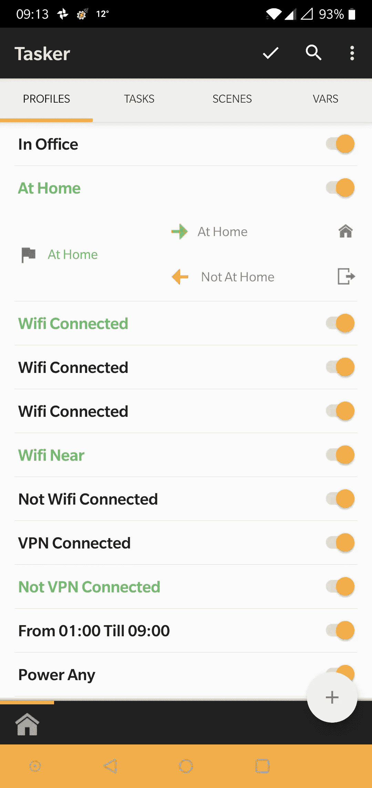

# 如何为数据收集和可视化构建您的个人基础架构，并成为您自己生成的数据点的真正所有者

> 原文：<https://towardsdatascience.com/how-to-build-your-home-infrastructure-for-data-collection-and-visualization-and-be-the-real-owner-af9b33723b0c?source=collection_archive---------18----------------------->


这个故事的更新版本可以在 [*Platypush 博客*](https://blog.platypush.tech/article/How-to-build-your-personal-infrastructure-for-data-collection-and-visualization) *上免费获得。*

智能家居可以生成和收集数据。大量数据。目前，家庭生成的数据还存在一些未解决的问题:

——**碎片化**。你可能有自己的家庭气象站，自己的运动探测器，安全摄像头，气体和烟雾探测器，身体传感器，GPS 和 fit 追踪器和智能插头。很可能这些设备中的大多数都会生成数据，并且在大多数情况下，这些数据只能通过专有的应用程序或网络服务来访问，并且与其他服务的任何集成，或者任何用于修补和自动化目的的空间，将主要取决于开发人员或企业在为这些数据构建第三方界面方面的善意。在本文中，我们将探索如何借助开源解决方案，如 [platypush](https://github.com/BlackLight/platypush/) 、 [Grafana](https://github.com/grafana/grafana) 和 [Mosquitto](https://github.com/eclipse/mosquitto) ，克服碎片问题，将原本无法通信和共享数据的数据源“粘合”在一起。

- **能够查询**。大多数硬件和数据极客不会满足于通过应用程序或时间图表中的标尺来访问他们的数据的能力。我们中的许多人希望能够以结构化的方式探索我们自己生成的数据，最好是通过 SQL 或任何查询语言，我们需要量身定制的仪表板来探索我们的数据，而不是愚蠢的移动应用程序。对我们许多人来说，生成我们健身活动的定制月度报告、查询我们在特定时间范围内去过的国家、或者过去三个月我们在室内呆了多长时间、或者过去一周我们客房的烟雾探测器超过阈值多少次的能力是无价的，并且常常被硬件和软件制造商忽视。在本文中，我们将探讨如何利用开源关系数据库(在本例中为 PostgreSQL)和一些基本的数据管道在您的私人计算机上分发和存储数据，以便随时进行查询或可视化。

——**隐私**。我在前面的例子中提到的许多解决方案或服务都带有基于云的基础设施来存储用户数据。虽然将您的数据存储在其他人的计算机上可以节省您投资本地解决方案所需的时间和磁盘空间，但它也带来了与将您的数据存储在其他人的计算机上相关的所有问题。其他人可以决定你是否以及如何访问你的数据，可以决定出售你的数据获利，或者可以以这样或那样的方式被黑客攻击。如果我们谈论的是关于你自己的身体、位置或房屋环境的数据，这可能尤其令人担忧。家庭托管的数据基础设施绕过了数据的第三方所有权问题。

本文将分析构建数据基础设施的构件，并在此基础上构建自动化。我们将了解如何为一些用例(温度、湿度、气体、手机位置和 fit 数据)设置数据收集和监控，以及如何基于这些数据构建自动化触发器。

首先，你需要一个有鸭嘴兽的 RaspberryPi(或任何类似的克隆体)。我假设您已经安装并配置了 platypush。如果没有，请阅读我之前的文章[如何开始使用 platypush](https://medium.com/swlh/automate-your-house-your-life-and-everything-else-around-with-platypush-dba1cd13e3f6) 。

您还需要在设备上安装一个关系数据库。本文中的示例将依赖于 PostgreSQL，但是任何关系数据库都可以完成它的工作。在 Raspbian 上安装和配置 PostgreSQL 并创建一个名为`sensors`的数据库:

```
[sudo] apt-get install postgresql libpq-dev postgresql-client
postgresql-client-common -y
[sudo] systemctl restart postgresql.service
[sudo] su postgres
createuser pi -P --interactive
psql -U pi
> create database sensors;
```

我们将使用数据库来存储以下信息:

*   系统度量
*   传感器数据
*   智能手机和位置数据
*   拟合数据

您还需要在您的 RaspberryPi 上运行一个消息队列代理程序，以便通过新的数据读取来发送消息——查看[这个 Instructables 教程](https://www.instructables.com/id/Installing-MQTT-BrokerMosquitto-on-Raspberry-Pi/),了解如何在您的 RaspberryPi 上启动和运行 Mosquitto。

对于一些数据测量，我们还需要一个 MQTT 客户机通过配置的队列发送消息——例如，从一个 shell 脚本发送测量。我喜欢使用`mqttcli`来实现这些目的——它快速、轻量并且是用 Go 编写的:

```
go get [github.com/shirou/mqttcli](https://github.com/shirou/mqttcli)
```

最后，安装 Grafana 作为基于网络的数据网关:

```
[sudo] apt-get install grafana
[sudo] systemctl restart grafana
```

启动服务后，前往`[http://your-pi:3000](http://your-pi:3000)`,确保看到 Grafana 闪屏——创建一个新的管理员用户，现在就可以开始了。

现在您已经准备好了所有的基础部分，是时候设置您的数据收集管道和仪表板了。让我们从在数据库上设置表和数据存储逻辑开始。

# 数据库配置

如果您按照上面的说明操作，那么您将有一个 PostgreSQL 实例运行在您的 RaspberryPi 上，可以通过用户`pi`访问，并且有一个为此目的创建的`sensors`数据库。在这一节中，我将解释如何创建基本表和触发器来规范化数据。请记住，您的测量表可能会变得非常大，这取决于您处理的数据量和处理数据的频率。相对重要的是，要控制数据库大小并提高查询效率，提供由触发器强制执行的规范化表结构。出于我的目的，我准备了以下配置脚本:

上面的脚本将保持数据库中的数据规范化和查询友好，即使推送到消息队列中的消息不关心哪个是正确的数字 host_id 或 metric_id。对您的 PostgreSQL 实例运行它:

```
psql -U pi < database_provisioning.sql
```

现在您已经准备好了表格，是时候用数据填充它们了。我们将看到一些度量标准收集的例子，从系统度量标准开始。

# 系统度量

您可能希望监控您自己的 RaspberryPi 或任何其他主机或虚拟服务器的 CPU、RAM 或磁盘使用情况，比如设置一个仪表板来轻松监控您的指标，或者在事情失控时设置警报。

首先，创建一个脚本来检查系统上的可用内存，并在消息队列通道上发送已用内存的百分比——出于本教程的目的，我们将这个脚本存储在`~/bin/send_mem_stats.sh`下:

并在您的 crontab 中安排它每 5 分钟运行一次:

```
*/5 * * * * /bin/bash /home/pi/bin/send_mem_stats.sh
```

也可以为其他系统统计信息创建类似的脚本，例如，监控根磁盘的使用情况:

一旦在 crontab 中进行了调度，这些作业将开始定期将数据推送到您的消息队列中，按照配置的主题(在上面的示例中分别是`sensors/<hostname>/memory`和`sensors/<hostname>/disk_root`)。

现在是时候设置 platypush 来监听这些频道了，只要有新消息进来，就将它存储在您已经提供的数据库中。将以下配置添加到您的`~/.config/platypush/config.yaml`文件中:

启动 platypush，如果一切顺利的话，你很快就会看到你的`sensor_data`表被填充了内存和磁盘使用统计数据。

# 传感器数据

商业气象站、空气质量解决方案和存在探测器可能相对昂贵，并且在开放其数据时相对有限，但通过使用我们迄今为止谈论的成分，可以相对容易地在房子周围建立传感器网络，并让它们收集现有数据基础设施上的数据。为了本文的目的，让我们考虑一个从房子周围的一些传感器收集温度和湿度测量值的例子。在 RaspberryPi 上设置模拟传感器时，您主要有两种选择:

*   *选项 1* :使用模拟微处理器(如 Arduino、ESP8266 或 ESP32)通过 USB 连接到您的 RaspberryPi，并配置 platypush 通过串口读取模拟测量值。RaspberryPi 是一项令人惊叹的技术，但它没有自带 ADC 转换器。这意味着，市场上许多将不同环境值映射到不同电压值的简单模拟传感器无法在 RaspberryPi 上工作，除非您在它们之间使用一个能够读取模拟测量值并通过串行接口将其推送到 RaspberryPi 的器件。出于我的目的，我经常使用 Arduino Nano 克隆，因为它们通常很便宜，但任何可以通过 USB/串口通信的设备都应该可以完成它的工作。您可以在互联网上找到便宜但精确的温度和湿度传感器，如 [TMP36](https://shop.pimoroni.com/products/temperature-sensor-tmp36) 、 [DHT11](https://learn.adafruit.com/dht) 和 [AM2320](https://shop.pimoroni.com/products/digital-temperature-and-humidity-sensor) ，它们可以轻松设置为与您的 Arduino/ESP*设备通信。您所需要做的就是确保您的 Arduino/ESP*设备在每次执行新的测量(例如`{"temperature": 21.0, "humidity": 45.0}`)时都会在串行端口上传回有效的 JSON 消息，这样 platypush 就可以很容易地了解某个测量值何时发生变化。
*   *选项 2* :像 ESP8266 这样的设备已经带有 WiFi 模块，可以通过像`[umqttsimple](https://raw.githubusercontent.com/RuiSantosdotme/ESP-MicroPython/master/code/MQTT/umqttsimple.py)`这样的小型 MicroPython 库直接在 MQTT 上发送消息(查看[本教程](https://randomnerdtutorials.com/micropython-mqtt-esp32-esp8266/)以及 ESP8266+MQTT 设置)。在这种情况下，您不需要串行连接，您可以从设备直接将数据从传感器发送到 MQTT 服务器。
*   *选项 3* :使用通过 I2C/SPI 通信的分线传感器(如 [BMP280](https://shop.pimoroni.com/products/bmp280-breakout-temperature-pressure-altitude-sensor) 、 [SHT31](https://shop.pimoroni.com/products/adafruit-sensiron-sht31-d-temperature-humidity-sensor-breakout) 或 [HTU21D-F](https://shop.pimoroni.com/products/adafruit-htu21d-f-temperature-humidity-sensor-breakout-board) )，您可以直接插入 RaspberryPi。如果您采用这种解决方案，那么您将不再需要另一个微处理器来处理 ADC 转换，但您还必须确保这些器件附带一个 Python 库，并且在 platypush 中得到[支持(如果不是这样，请随意提出问题或发送 pull 请求)。](https://platypush.readthedocs.io/en/latest/)

让我们简单分析一下选项 1 实现的一个例子。假设您有一台 Arduino，其 7 号引脚上连接了 DHT11 温度和湿度传感器。您可以准备一个如下所示的草图，通过 USB 以 JSON 格式将新的测量值发送到 RaspberryPi:

然后，您可以将下面几行添加到 RaspberryPi 的`~/.config/platypush/config.yaml`文件中，该文件连接了传感器，用于向消息队列转发新的测量值，并将它们存储在本地数据库中。该示例还显示了如何调整轮询周期、容差和阈值，以及如何在传感器高于/低于特定阈值时运行自定义操作:

并且记得将`sensors/your-rpi/temperature`、`sensors/your-rpi/humidity`和您想要监控的任何其他 MQTT 主题添加到 MQTT/数据库主机上的`backend.mqtt`所监控的主题列表中。

有了这些简单的组件，您可以在数据库中存储任何类型的传感器数据，并轻松地在其上构建自动化规则。

# 智能手机和位置数据

我们的智能手机还会产生大量数据，这些数据可以在我们新的数据基础设施上进行跟踪，并实现自动化，让我们的生活变得更加轻松。在这个例子中，我们将展示如何在您的 Android 设备上利用 [Tasker](https://tasker.joaoapps.com/) 、[push pullet](https://www.pushbullet.com/)和 [AutoLocation](https://joaoapps.com/autolocation/) 来定期检查您的位置，将其存储在您的本地数据库中(这样您就可以关闭令人毛骨悚然的谷歌位置历史记录——对不起，是谷歌),并实施智能规则，例如打开照明和加热，并在您到家时说一句欢迎信息。

让我们首先看看如何将您的手机位置数据存储到您的本地数据库。

*   在你的手机上安装 Pushbullet、Tasker 和 AutoLocation 应用程序。
*   转到您的[推送帐户设置页面](https://www.pushbullet.com/#settings/account)并创建一个新的访问令牌。
*   在数据库主机上的 platypush 安装上启用 Pushbullet 后端。要添加到您的`config.yaml`中的行:

```
backend.pushbullet:
    token: your-token
    device: platypush
```

*   向数据库中添加一个表来存储位置数据:

*   创建一个事件挂钩，用于监听包含纬度/经度信息的特定格式的推推通知(例如`LATLNG#7.8712,57.3123`)，并将它们存储在 PostgreSQL 数据库中:

*   创建每 10 分钟(或 5 分钟、20 分钟，或您喜欢的任何频率)运行一次的 Tasker 规则，通过向您的 platypush 虚拟设备发送 Pushbullet 通知来更新您的位置:


保存 Tasker 个人资料后，您的智能手机将开始定期向 Pushbullet 发送其位置数据，您的 RaspberryPi 将拦截这些通知并将数据存储在您的本地数据库中。是时候抛弃第三方位置追踪器了！

当您进入或退出您的家庭区域时，如何运行自定义操作？让我们创建一个 Tasker 配置文件，它基于自动定位纬度/经度数据，检测您何时进入或退出某个区域。



该任务将简单地向您的 platypush 虚拟设备发送一个 Pushbullet 通知，其中包含`HOME#1`(您进入了您的家庭区域)或`HOME#0`(您退出了您的家庭区域)。


在您的 platypush `config.yaml`中添加一个事件挂钩来拦截通知并运行您的自定义逻辑:

根据目前为止显示的简单成分，将手机上的事件连接到智能家居基础设施相对简单，只要你的智能手机上有一个 Tasker 插件来实现你想要做的事情。

# 拟合数据

过去几年，智能手表、健身追踪器、身体传感器和智能健身算法在我们的手机上的爆炸式增长，为健康和健身技术开启了一场真正的革命。然而，由于市场的碎片化以及可视化和查询数据的有限可能性，这种革命仍未能发挥其全部潜力。大多数健康和健身解决方案都带有他们的 walled garden 应用程序:你只能使用开发者提供的应用程序访问数据，并且你只能使用该应用程序访问由你的特定传感器生成的数据。解决方案之间缺乏集成，这可能会给我们测量身体产生的数据的方式带来一场革命，我们喜欢向朋友展示这些很酷的技术，但没有多少实际用途。在过去的几年里，Google Fit 已经向前迈出了一些步伐；如今，越来越多的产品可以将数据同步到 Google Fit(我的建议是避开那些不同步的产品:它们只不过是闪闪发光的玩具，没有任何实用价值)。然而，尽管 Google Fit 允许你对你的身体数据有一个单一的视图，即使数据点是由不同的传感器收集的，但当它为你提供一个强大的方法来查询，比较和可视化你的数据时，它仍然非常有限。网络服务已经被扼杀了一段时间，这意味着访问你的数据的唯一途径是通过(坦白说非常有限)移动应用程序。而且你没有办法执行更高级的查询，比如比较不同时期的数据，找出一个月中你走路或睡觉最多的那一天，或者甚至只是在计算机上可视化数据，除非你利用 Fit API 编写自己的程序。

幸运的是，platypush 附带了一个方便的 Google Fit 后端 T2 和插件 T4，你可以利用它们轻松构建可视化、自动化和可查询的 Fit 数据库。

*   在数据库中准备合适的表。同样，我们将利用触发器来处理规范化:

*   前往 [Google 开发者控制台](https://console.developers.google.com)获取您的证书 JSON 文件:


*   运行以下命令授权 platypush 访问您的 Fit 数据:

```
python -m platypush.plugins.google.credentials\
    "[https://www.googleapis.com/auth/fitness.activity.read](https://www.googleapis.com/auth/fitness.activity.read) [https://www.googleapis.com/auth/fitness.body.read](https://www.googleapis.com/auth/fitness.body.read) [https://www.googleapis.com/auth/fitness.body_temperature.read](https://www.googleapis.com/auth/fitness.body_temperature.read) [https://www.googleapis.com/auth/fitness.location.read](https://www.googleapis.com/auth/fitness.location.read)"\
    /path/to/your/credentials.json\
    --noauth_local_webserver
```

*   在 platypush 运行的情况下，检查您的帐户上可用的数据源:

```
curl -XPOST -H 'Content-Type: application/json' \
   -d '{"type":"request", "action":"google.fit.get_data_sources"}'\
   http://your-pi:8008/execute 
```

*   记下您想要监控的指标的`dataStreamId`属性，将它们添加到 Google Fit 后端的配置中，并创建一个事件挂钩，将新数据插入到您新创建的表中:

*   重启 platypush。您应该很快就会看到您的 fit 数据填充到您的表格中。

# 数据可视化和自动警报

现在，您已经构建了数据管道，将系统、传感器、移动和 fit 数据点传输到您的本地数据库，并在这些事件上建立自动化。但是我们都知道，如果我们不能将数据可视化，数据收集就只有一半的乐趣。是时候去我们安装的 Grafana 仪表盘创建一些图表了！

在浏览器中打开`[http://your-pi-address:3000/](http://your-pi-address:3000/)`。在 Grafana 中创建仪表板和面板非常简单。您所需要的就是指定可视化类型和想要对数据库运行的查询。显示每天行走的步数和活动时间的简单面板如下所示:


Grafana 还允许您在某些指标低于/高于某个阈值时，或者在某段时间内没有数据点时创建警报。你也可以通过利用 platypush 的[网络钩子](https://platypush.readthedocs.io/en/latest/platypush/events/http.hook.html)将这样的警报连接回 platypush 事件。

例如，让我们看看如何配置 Grafana，以便在您的某个气体传感器的测量值超过某个阈值时，向 platypush 自定义 web 挂钩发送通知，该挂钩会向您的移动设备发送 Pushbullet 通知:

*   向您的 platypush `config.yaml`添加一个 web hook 事件:

这个配置将创建一个可以通过`[http://your-pi:8008/hook/gas_alert](http://your-pi:8008/hook/gas_alert.)`T5 访问的动态 web 钩子。

*   进入你的 Grafana 仪表盘，点击“提醒”(右边的铃铛图标)->通知频道，然后添加你的网络链接:


*   编辑包含气体传感器测量值的面板，单击钟形图标，并在数值超过某个阈值时添加自动警报:


每当有与您的指标相关的提醒时，您都会在手机上收到推送通知。

如果到目前为止您已经阅读了这篇文章，那么您应该已经具备了使用自己的数据做任何事情的所有要素。本文尽最大努力展示有用的示例，但并不打算详尽地指导您通过连接数据库、数据管道和事件及自动化引擎所能做的一切。我希望我已经为您提供了足够的输入来激发您的创造力并构建新的东西:)