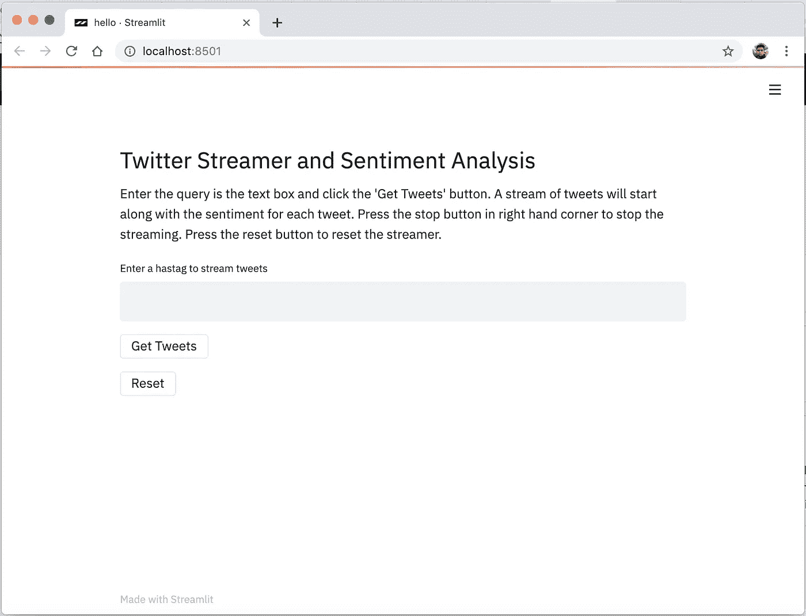
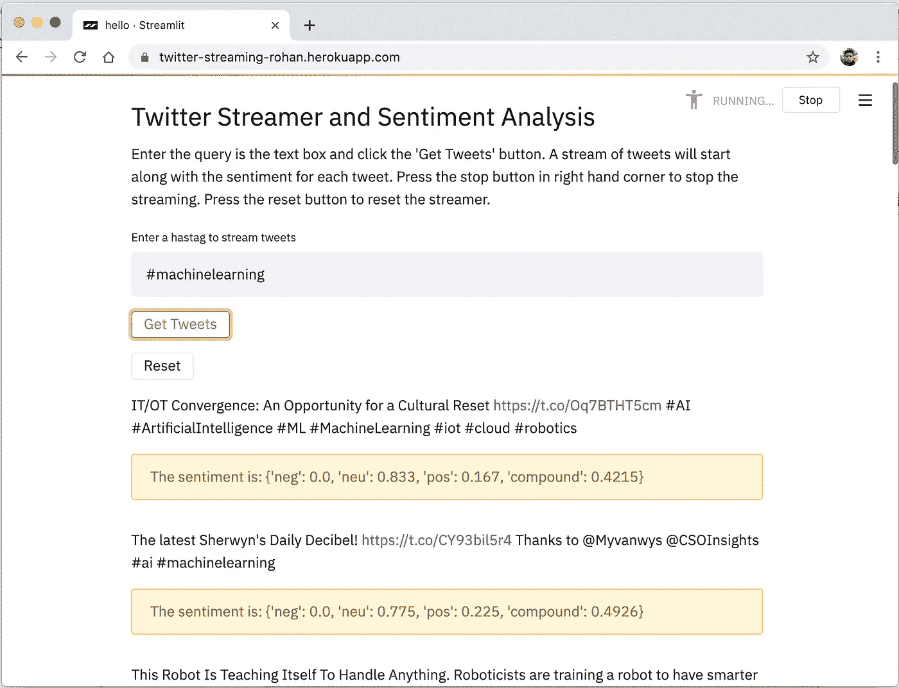

# 如何通过 3 个简单的步骤构建你的机器学习应用

> 原文：<https://towardsdatascience.com/how-to-build-your-machine-learning-app-in-3-simple-steps-d56ed910355c?source=collection_archive---------13----------------------->

## 使用 Streamlit 为您的数据科学项目构建 web 应用程序并使用 Heroku 进行部署的简单方法


Photo by [Markus Spiske](https://unsplash.com/@markusspiske?utm_source=unsplash&utm_medium=referral&utm_content=creditCopyText) on [Unsplash](https://unsplash.com/s/photos/data?utm_source=unsplash&utm_medium=referral&utm_content=creditCopyText)

如果你是一名数据科学家，你会经常被这个问题困扰。

***我已经建立了我的数据科学项目。现在，我如何让人们能够接触到它？我如何展示我的作品？***

我能想到的两个最常见的选择是:

1)将项目代码作为 Jupyter 笔记本。

2)为您的项目构建一个 web 应用程序。

对于第一种选择，通常使用 Github 或 Jupyter Notebook Viewer 来公开您的代码。如果有人想测试您的项目，他们要么必须下载并在本地计算机上运行笔记本，要么在 Jupyter 笔记本查看器中在线运行笔记本。

对于第二种选择，最常见的是使用 HTML 或 JavaScript 和 Flask 围绕您的数据科学项目构建一个 web 应用程序，然后通过该应用程序运行您的项目。但是，构建一个优秀的、精致的、美观的 web 应用程序需要一定程度的 HTML 或 JavaScript 技能，这有点难以快速学习，尤其是如果你的主要关注点是数据科学。

***有没有一种简单的方法可以让我为我的数据科学项目构建一个 web 应用程序，同时避免 HTML、CSS 或 JavaScript 的复杂性？***

## 输入细流

Streamlit 是一个简单而强大的库，它让你只用 Python 就能构建具有丰富 ui 的 web 应用。它带有各种小部件，支持可视化库，如 ALTAIR、GraphViz、Plotly 以及对 GPU 的支持。

***这篇文章是关于了解如何为你的数据科学项目创建一个 Streamlit 应用程序并在 Heroku 上部署它。***

要了解更多关于 Streamlit 的信息，可以看看它的开发者发的这个帖子。

# 步骤 1:构建您的项目

对于这个项目，我决定建立一个流媒体服务，实时捕捉与特定标签相关的推文，然后对这些推文进行情感分析。我用 Tweepy 和 Vader 的情绪来做这个。 [**Tweepy**](https://www.tweepy.org/) 是一个围绕 Twitter API 的 python 包装器，帮助你挖掘 Twitter 数据。 [**维达情感**](https://github.com/cjhutto/vaderSentiment) 是一个基于规则的情感分析库，专为推文的情感分析而设计。

我的推特流代码:

```
analyser = SentimentIntensityAnalyzer()class StreamListener(tweepy.StreamListener):

        def on_status(self, status):
           if not stop:
              text = status.text
              score = analyser.polarity_scores(text)
              st.write(text)
              st.write("The sentiment is: {}".format(str(score)))
              return True
           else:
              exit()
              return Falsedef stream_tweets(tag):
listener = StreamListener(api=tweepy.API(wait_on_rate_limit=True, wait_on_rate_limit_notify=True))
streamer = tweepy.Stream(auth=auth, listener=listener, tweet_mode='extended')
query = [str(tag)]
streamer.filter(track=query, languages=["en"])
```

在上面的代码中，我定义了一个函数 ***stream_tweets*** ，我将' ***tag'*** 传递给它，这将是我想要 tweets 的查询。我使用 tweepy 创建了一个 twitter 流。流 并且我使用了我在类***stream listener***中定义的监听器。当一条推文包含标签时，它被 ***on_status*** 函数检测为 ***状态*** 。然后，我们可以轻松地使用状态来使用推文。我使用 ***分析器*** 获取推文文本的情感，然后显示推文及其情感。上面代码中的 ***st*** 是导入的 Streamlit 库， ***stop*** 是一个按钮的变量，用于停止推文的流式传输。

你需要在你的本地机器上安装 Tweepy 和 Vader 的情绪，并在 Twitter 上获得一个开发者帐户来传输推文。

# 步骤 2:使用 Streamlit 设计一个 web 应用程序

对于这一步，我在我的机器上安装了 streamlit。

```
pip install streamlit
```

我使用下面的代码来设计我的 web 应用程序。

```
import streamlit as stst.header("Twitter Streamer and Sentiment Analysis")st.write("Enter the query is the text box and click the 'Get Tweets' button. A stream of tweets will start along with the sentiment for each tweet. Press the stop button in right hand corner to stop the streaming. Press the reset button to reset the streamer.")t = st.text_input("Enter a hastag to stream tweets")start = st.button("Get Tweets")stop = st.button("Reset")
```

在 streamlit 中创建小部件就像在 python 中创建变量一样简单。在上面的代码中，我使用 ***st.header*** 函数创建了一个 header。st.write 功能可以让你在你的应用程序中写入任何东西，无论是文本、图表、地图等等。接下来，我使用***ST . text _ input***来创建一个文本输入框，以获取我想要的 tweets 流标签。它存储在变量 t 中。我还创建了两个按钮' ***【开始】*** '，以启动流媒体和' ***停止*** '以停止流媒体和重新加载应用程序。

然后我把流媒体功能链接到按钮' ***开始*** '上。

```
if start:
    stream_tweets(str(t))
```

按下“开始”按钮即可触发推文流。我将代码保存在一个名为 hello.py 的文件中。

然后，我检查了 UI 的外观。

```
streamlit run hello.py
```



# 步骤 3:在 Heroku 上部署

现在最后一步是在 Heroku 上部署 app。

首先，我在 Heroku 上创建了一个帐户。


然后，我创建了一个新项目，命名为 twitter-streaming-rohan。

但是，在 Heroku 上部署应用程序之前，我需要定义一些文件。

首先，我定义了需求文件，它包含了我的项目所需的所有库。Heroku 引擎将自己安装所有的库，它们只需要在 requirements.txt 文件中指定。

requirements.txt

```
tweepy
streamlit
pyyaml
vaderSentiment
```

接下来，我定义了我想要使用的 Python 的运行时版本。我用的是 python 3.7。

runtime.txt

```
python-3.7.3
```

接下来是 setup.sh 文件。这是在 Heroku 运行 streamlit 所必需的。

setup.sh

```
mkdir -p ~/.streamlit/echo "\
[general]\n\
email = \"email@website.com\"\n\
" > ~/.streamlit/credentials.tomlecho "\
[server]\n\
headless = true\n\
enableCORS=false\n\
port = $PORT\n\
" > ~/.streamlit/config.toml
```

我创建的最后一个文件是 [Procfile](https://devcenter.heroku.com/articles/getting-started-with-python#define-a-procfile) 。它包含启动应用程序要执行的命令。我将此文件保存为不带任何扩展名的普通文本文件。

Procfile

```
web: sh setup.sh && streamlit run hello.py
```

我把所有这些文件放在同一个文件夹里，命名为 twitter-streaming。

然后，我把代码推给了 Heroku。

为此，我在本地机器上安装了 Heroku CLI。

现在，我从终端登录 Heroku，使用:

```
$heroku login
```

接下来，我转到项目目录:

```
$cd twitter-streaming
```

然后，我使用以下命令初始化该目录中的 git:

```
$git init
$heroku git:remote -a twitter-streaming-rohan
```

twitter-streaming-rohan 是我在 Heroku 上的项目名称。

然后，我将所有文件添加到 Heroku:

```
$git add .
```

已提交更改:

```
$git commit -am “first-commit”
```

推动变革:

```
$git push heroku master
```

## 就是这样！！

应用程序已部署。

我去了网址查看应用程序。对我来说，是 https://twitter-streaming-rohan.herokuapp.com/的

我的应用程序已经启动并运行。



# 结论

有了 Streamlit 和 Heroku，您可以快速简单地部署您的 ML 应用程序，而且完全免费。Streamlit 应用程序也可以部署在 AWS、谷歌云或任何其他云上。有了各种各样的小部件和库，Streamlit 的可能性是无穷无尽的。它还有一个丰富的社区[论坛](https://discuss.streamlit.io/)。

现在，构建 ML 应用程序比以往任何时候都容易！！

这个应用程序的完整代码可以在[这里](https://github.com/rohanvartak1996/twitter-streaming-streamlit)找到。

*感谢*[*Gabe mal donato*](https://discuss.streamlit.io/u/gabe_maldonado)*讲解 Streamlit 在 Heroku 的部署。*