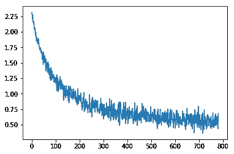
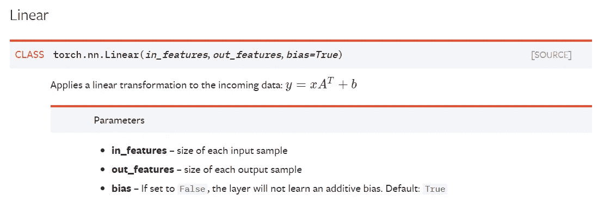
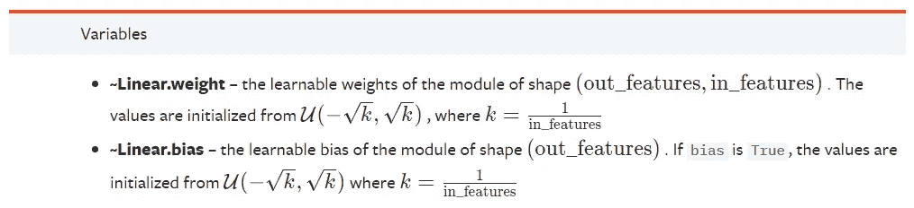
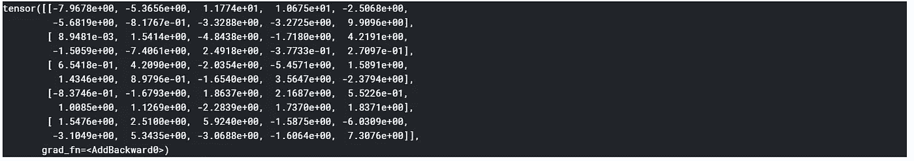
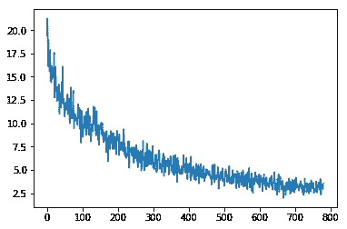
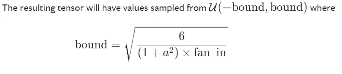
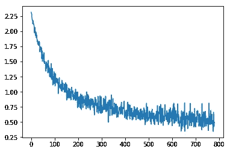

# 如何从零开始构建自己的 PyTorch 神经网络层

> 原文：<https://towardsdatascience.com/how-to-build-your-own-pytorch-neural-network-layer-from-scratch-842144d623f6?source=collection_archive---------7----------------------->

## 并了解一些关于权重初始化的知识


这实际上是杰瑞米·霍华德第五课的作业。我已经展示了使用 PyTorch 从零开始构建卷积神经网络是多么容易。今天，让我们试着更深入地研究一下，看看我们是否可以编写自己的`nn.Linear`模块。既然脸书的开发人员已经写好了 PyTorch 模块，为什么还要浪费时间写自己的呢？

嗯，首先，你会对所有的部分是如何组合在一起的有更深的理解。通过将您的代码与 PyTorch 代码进行比较，您将了解为什么以及如何开发这些库。

此外，一旦你完成了，你将对实现和使用所有这些库更有信心，知道事情是如何工作的。对你来说不会有神话。

最后但同样重要的是，如果情况需要，您将能够修改/调整这些模块。这就是 noob 和 pro 的区别。

好了，动机够了，让我们开始吧。

## 简单的 MNIST 一层 NN 作为背景

首先，我们需要一些“背景”代码来测试我们的模块是否执行以及执行得有多好。让我们建立一个非常简单的单层神经网络来求解古老的 MNIST 数据集。下面的代码片段(在 Jupyter 笔记本中运行):

```
# We'll use fast.ai to showcase how to build your own 'nn.Linear' module
%matplotlib inline
from fastai.basics import *
import sys

# create and download/prepare our MNIST dataset
path = Config().data_path()/'mnist'
path.mkdir(parents=True)
!wget http://deeplearning.net/data/mnist/mnist.pkl.gz -P {path}

# Get the images downloaded into data set
with gzip.open(path/'mnist.pkl.gz', 'rb') as f:
    ((x_train, y_train), (x_valid, y_valid), _) = pickle.load(f, encoding='latin-1')

# Have a look at the images and shape
plt.imshow(x_train[0].reshape((28,28)), cmap="gray")
x_train.shape

# convert numpy into PyTorch tensor
x_train,y_train,x_valid,y_valid = map(torch.tensor, (x_train,y_train,x_valid,y_valid))
n,c = x_train.shape
x_train.shape, y_train.min(), y_train.max()

# prepare dataset and create fast.ai DataBunch for training
bs=64
train_ds = TensorDataset(x_train, y_train)
valid_ds = TensorDataset(x_valid, y_valid)
data = DataBunch.create(train_ds, valid_ds, bs=bs)

# create a simple MNIST logistic model with only one Linear layer
class Mnist_Logistic(nn.Module):
    def __init__(self):
        super().__init__()
        self.lin = nn.Linear(784, 10, bias=True)

    def forward(self, xb): return self.lin(xb)

model =Mnist_Logistic()

lr=2e-2
loss_func = nn.CrossEntropyLoss()

# define update function with weight decay
def update(x,y,lr):
    wd = 1e-5
    y_hat = model(x)
    # weight decay
    w2 = 0.
    for p in model.parameters(): w2 += (p**2).sum()
    # add to regular loss
    loss = loss_func(y_hat, y) + w2*wd
    loss.requres_grad = True

    loss.backward()
    with torch.no_grad():
        for p in model.parameters():
            p.sub_(lr * p.grad)
            p.grad.zero_()
    return loss.item()

# iterate through one epoch and plot losses
losses = [update(x,y,lr) for x,y in data.train_dl]
plt.plot(losses);
```



这些代码很容易理解。我们在这个项目中使用了 [fast.ai](https://github.com/fastai) 库。下载 MNIST pickle 文件并解压缩，将其转换为 PyTorch 张量，然后将其填充到 fast.ai DataBunch 对象中，以便进一步训练。然后我们创建了一个只有一个`Linear`层的简单神经网络。我们还编写了自己的`update`函数，而不是使用`torch.optim`优化器，因为我们可以从头开始编写自己的优化器，作为 PyTorch 学习之旅的下一步。最后，我们遍历数据集并绘制损失图，以查看它是否有效以及效果如何。

## 第一次迭代:让它工作

所有 PyTorch 模块/层都是从`torch.nn.Module`扩展而来。

```
class myLinear(nn.Module):
```

在这个类中，我们需要一个`__init__` dunder 函数来初始化我们的线性层，并需要一个`forward`函数来进行正向计算。让我们先来看看`__init__`函数。

我们将使用 PyTorch 官方文档作为构建模块的指南。从文档中可以看出，`nn.Linear`模块具有以下属性:

[](https://pytorch.org/docs/stable/nn.html#linear)

因此，我们将获得这三个属性:

```
def __init__(self, **in_features, out_features, bias=True**):
        super().__init__()
       ** self.in_features = in_features
        self.out_features = out_features
        self.bias = bias**
```

该类还需要保存重量和偏差参数，以便进行训练。我们也初始化那些。



```
 ** self.weight** = torch.nn.Parameter(torch.randn(out_features, in_features))
       ** self.bias** = torch.nn.Parameter(torch.randn(out_features))
```

这里我们用`torch.nn.Parameter`来设置我们的`weight`和`bias`，否则，它不会训练。

另外，请注意，我们使用了`[torch.rand](https://pytorch.org/docs/stable/torch.html#torch.randn)n`而不是文档中描述的来初始化参数。这不是权重初始化的最佳方式，但我们的目的是让它先工作，我们将在下一次迭代中调整它。

好了，现在`__init__`部分完成了，让我们继续`forward`功能。这实际上是最简单的部分:

```
def forward(self, input):
        _, y = input.shape
        if y != self.in_features:
            sys.exit(f'Wrong Input Features. Please use tensor with {self.in_features} Input Features')
        **output = input @ self.weight.t() + self.bias
        return output**
```

我们首先获得输入的形状，计算出输入中有多少列，然后检查输入大小是否匹配。然后我们做矩阵乘法(注意我们在这里做了转置来调整权重)并返回结果。我们可以通过给它一些数据来测试它是否有效:

```
my = myLinear(20,10)
a = torch.randn(5,20)
my(a)
```

我们有一个 5x20 的输入，它通过我们的层，得到一个 5x10 的输出。您应该会得到这样的结果:



好，现在回到我们的神经网络代码，找到`Mnist_Logistic`类，将`self.lin = nn.Linear(784,10, bias=True)`改为`self.lin = myLinear(784, 10, bias=True)`。运行代码，您应该会看到类似这样的图:



如你所见，它没有很好地收敛(一个时期大约 2.5 次损失)。那很可能是因为我们初始化不好。另外，我们没有注意到`bias`部分。让我们在下一次迭代中解决这个问题。第一次迭代的最终代码如下所示:

```
class myLinear(nn.Module):
    def __init__(self, in_features, out_features, bias=True):
        super().__init__()
        self.in_features = in_features
        self.out_features = out_features
        self.bias = bias
        self.weight = torch.nn.Parameter(torch.randn(out_features, in_features))
        self.bias = torch.nn.Parameter(torch.randn(out_features))

    def forward(self, input):
        x, y = input.shape
        if y != self.in_features:
            sys.exit(f'Wrong Input Features. Please use tensor with {self.in_features} Input Features')
        output = input @ self.weight.t() + self.bias
        return output
```

## 第二次迭代:正确的权重初始化和偏差处理

我们已经处理了`__init__`和`forward`，但是记住我们还有一个`bias`属性，如果`False`，将不会学习加法偏差。我们还没有实施。此外，我们使用`torch.nn.randn`来初始化权重和偏差，这不是最佳的。让我们解决这个问题。更新后的`__init__`函数如下:

```
def __init__(self, in_features, out_features, bias=True):
        super().__init__()
        self.in_features = in_features
        self.out_features = out_features
        self.bias = bias
        **self.weight = torch.nn.Parameter(torch.Tensor(out_features, in_features))
        if bias:
            self.bias = torch.nn.Parameter(torch.Tensor(out_features))
        else:
            self.register_parameter('bias', None)** **self.reset_parameters()**
```

首先，当我们创建`weight`和`bias`参数时，我们没有将它们初始化为最后一次迭代。我们只是给它分配一个规则的张量对象。实际的初始化在另一个函数`reset_parameters`中完成(*将在后面解释*)。

对于`bias`，我们增加了一个条件，如果`True`，做我们上一次迭代做的事情，但是如果`False`，将使用`register_parameter(‘bias’, None)`给它`None`值。现在对于`reset_parameter`功能，它看起来是这样的:

```
def reset_parameters(self):
        **torch.nn.init.kaiming_uniform_(self.weight, a=math.sqrt(5))**
        if self.bias is not None:
            **fan_in, _ torch.nn.init._calculate_fan_in_and_fan_out(self.weight)
            bound = 1 / math.sqrt(fan_in)
            torch.nn.init.uniform_(self.bias, -bound, bound)**
```

以上代码直接取自 PyTorch 源代码。PyTorch 对权重初始化所做的称为`kaiming_uniform_`。它来自一篇论文[深入研究整流器:在 ImageNet 分类上超越人类水平的性能——何，k .等人(2015)](https://arxiv.org/pdf/1502.01852.pdf) 。



它实际上所做的是通过用均值为 0 且方差为 T16 的正态分布**初始化权重，它避免了**消失/爆炸梯度**的问题(*尽管我们在这里只有一层，当编写线性类时，我们仍然应该记住 MLN*)。**

请注意，对于`self.weight`，我们实际上给了`a`一个值`math.sqrt(5)`而不是`math.sqrt(fan_in)`，这在 PyTorch repo 的 [this GitHub issue](https://github.com/pytorch/pytorch/issues/15314) 中有所解释，可能有人对此感兴趣。

同样，我们可以在模型中添加一些`extra_repr`字符串:

```
def extra_repr(self):
        return 'in_features={}, out_features={}, bias={}'.format(
            self.in_features, self.out_features, self.bias is not None
        )
```

最终的模型如下所示:

```
class myLinear(nn.Module):
    def __init__(self, in_features, out_features, bias=True):
        super().__init__()
        self.in_features = in_features
        self.out_features = out_features
        self.bias = bias
        self.weight = torch.nn.Parameter(torch.Tensor(out_features, in_features))
        if bias:
            self.bias = torch.nn.Parameter(torch.Tensor(out_features))
        else:
            self.register_parameter('bias', None)
        self.reset_parameters()

    def reset_parameters(self):
        torch.nn.init.kaiming_uniform_(self.weight, a=math.sqrt(5))
        if self.bias is not None:
            fan_in, _ = torch.nn.init._calculate_fan_in_and_fan_out(self.weight)
            bound = 1 / math.sqrt(fan_in)
            torch.nn.init.uniform_(self.bias, -bound, bound)

    def forward(self, input):
        x, y = input.shape
        if y != self.in_features:
            print(f'Wrong Input Features. Please use tensor with {self.in_features} Input Features')
            return 0
        output = input.matmul(weight.t())
        if bias is not None:
            output += bias
        ret = output
        return ret

    def extra_repr(self):
        return 'in_features={}, out_features={}, bias={}'.format(
            self.in_features, self.out_features, self.bias is not None
        )
```

重新运行代码，您应该能够看到这个图:



我们可以看到，它在一个时期内收敛到 0.5 的损耗要快得多。

## 结论

我希望这能帮你驱散这些 PyTorch `nn.modules`上的阴霾。这可能看起来很无聊和多余，但有时最快(也是最短)的方法就是“无聊”的方法。一旦你深究此事，那种知道没有什么“更多”的感觉是无价的。你会意识到:

> 在 PyTorch 下面，没有技巧，没有神话，没有陷阱，只有坚如磐石的 Python 代码。

此外，通过编写自己的代码，然后与官方源代码进行比较，您将能够看到不同之处，并向行业中的佼佼者学习。多酷啊。

觉得这篇文章有用？在 Medium 上关注我([李立伟](https://medium.com/u/72c98619a048?source=post_page-----dbe7106145f5----------------------))或者你可以在 Twitter [@lymenlee](https://twitter.com/lymenlee) 或者我的博客网站[wayofnumbers.com](https://wayofnumbers.com/)上找到我。你也可以看看我下面最受欢迎的文章！

[](/this-is-cs50-a-pleasant-way-to-kick-off-your-data-science-education-d6075a6e761a) [## “这是 CS50”:开始数据科学教育的愉快方式

### 为什么 CS50 特别适合巩固你的软件工程基础

towardsdatascience.com](/this-is-cs50-a-pleasant-way-to-kick-off-your-data-science-education-d6075a6e761a) [](/two-sides-of-the-same-coin-fast-ai-vs-deeplearning-ai-b67e9ec32133) [## 一枚硬币的两面:杰瑞米·霍华德的 fast.ai vs 吴恩达的 deeplearning.ai

### 如何不通过同时参加 fast.ai 和 deeplearning.ai 课程来“过度适应”你的人工智能学习

towardsdatascience.com](/two-sides-of-the-same-coin-fast-ai-vs-deeplearning-ai-b67e9ec32133) [](/what-you-need-to-know-about-netflixs-jupyter-killer-polynote-dbe7106145f5) [## 你需要了解网飞的“朱庇特黑仔”:冰穴📖

### 是时候让 Jupyter 笔记本有个有价值的竞争对手了

towardsdatascience.com](/what-you-need-to-know-about-netflixs-jupyter-killer-polynote-dbe7106145f5)