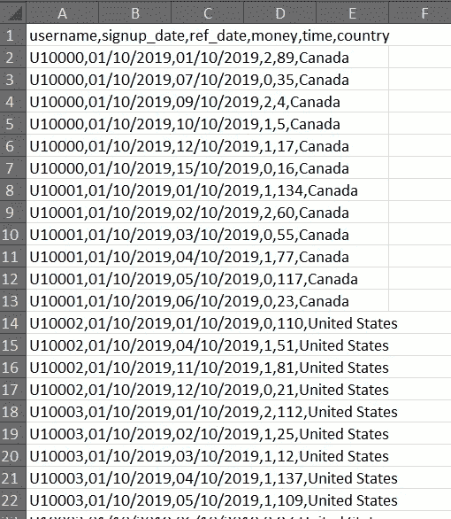
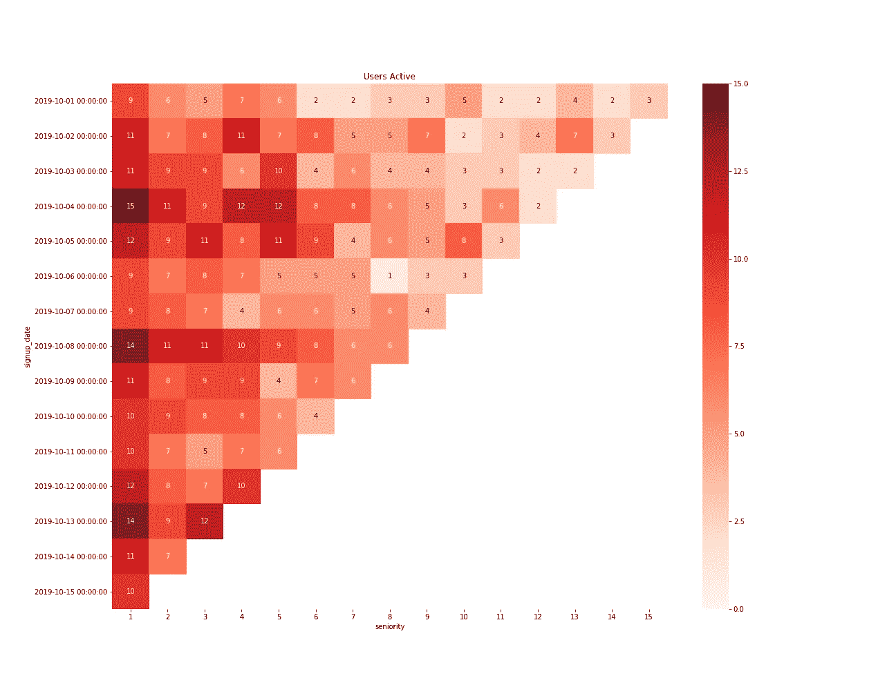
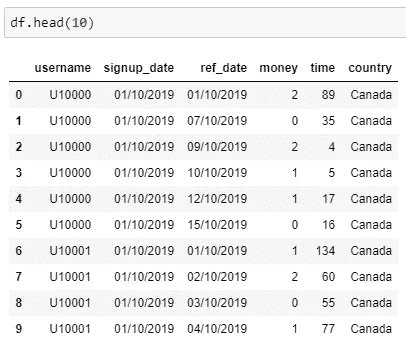
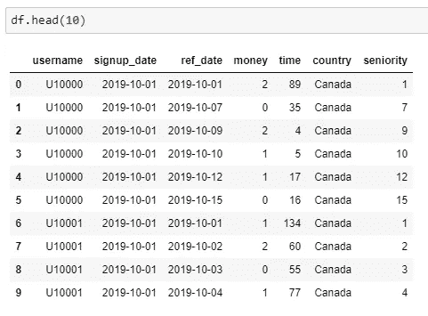
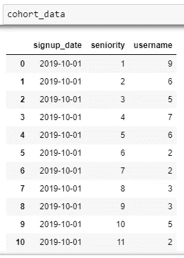
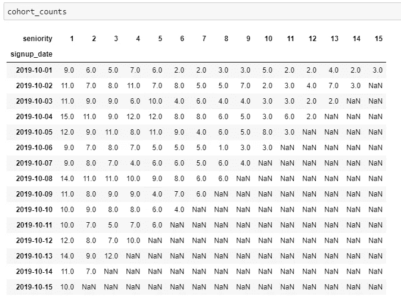
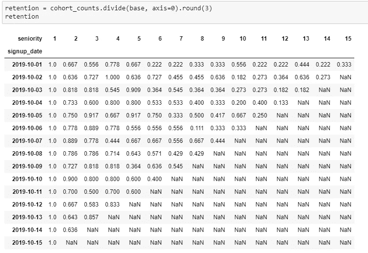
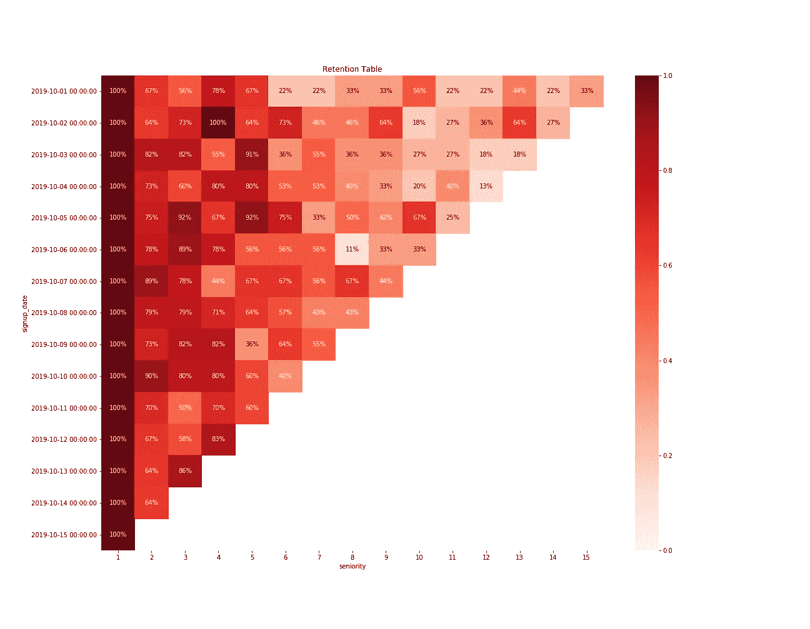

# 如何计算客户保持率——一种实用的方法

> 原文：<https://towardsdatascience.com/how-to-calculate-customer-retention-rate-a-practical-approach-1c97709d495f?source=collection_archive---------3----------------------->

## 可以说，留住人才是新的营销黄金，但计算起来并不总是那么容易。有了这个简单的 Python 脚本，一切都将改变！

If you don’t have a way to measure Customer Retention, how will you know if you’re “leaking” customers? (photo: Vryheid Herald)

# 如此多的指标，如此少的时间…

我明白了。你是一个大忙人，没有时间阅读介绍！不幸的是，我确实需要简单解释一下我们在衡量什么，因为有太多的指标围绕着客户保持率和忠诚度！与我的大多数其他文章相反，这里的代码会很短，但是我需要确保概念是清楚的，因为很容易弄乱计算。

> 我将回顾测量客户保持率的基础知识和原因，然后以一个提供保持率表的 Python 脚本结束

如果你已经关注了我，你知道我通常写 Python 项目并在最后分享代码。这次也不会例外！然而，这一次我决定去做一个项目，一些项目实际上可能适用于他们自己的职业现实，甚至他们自己的企业。请在评论中告诉我你是如何解决的！

在试图计算任何东西之前，你需要明白的最重要的一件事是**每个企业在衡量保留率时都有自己的细微差别**。对于网上商店，你可能想知道每月有多少顾客购买你的商品。对于一家 SaaS 公司，您可能需要考虑有多少客户保持活跃的付费订阅。另一方面，如果你与在 Reddit 或脸书等社交平台工作的分析师交谈，他们可能会更关注用户访问量，而不是购买量。举个例子，如果你有一个像游戏一样的免费增值应用，情况也是如此。

这并不是说我们不关心购买和其他与金钱相关的指标，但是**这里的主要思想是衡量我们的用户是否会回来**！这是知道你是否有好产品的最终方法，对吗？*(提示:是反问句！)*

在衡量最近度时，行业之间也存在这些细微的差异，最近度是指从与用户最后一次交互起经过的*时间。术语“相互作用”可以有很多含义……但这是一篇关于 RFM 分析的全新文章的主题！*

在整篇文章中，我会向你抛出几个名字，你应该事先知道它们的意思:

*   **流失率(或损耗率)** —在一段时间内放弃你的产品的客户的百分比
*   **保留率** —在一段时间内继续使用你的产品的客户的百分比
*   **队列分析**:注意到上面的“一段时间”了吗？您是否想每天、每周、每月地测量保留率？在我们的例子中，我将测量**的每日**保持率。群组分析可能是分析保留率和流失率的最佳工具。这是一个特定类型的表，将用户分成“桶”(群组)，每个群组将包含在同一天/周/月/等注册的用户。也就是说，每个群组指的是一段时间(在我们的例子中是一天)。

# 为什么留住客户很重要？

## 评估您的收购策略的质量

看到上面的图了吗，有一根漏水的管子？如果你没有衡量客户保持，你可能有一个[客户]流失的问题。当你花费宝贵的金钱通过 AdWords 或脸书广告或任何你可能拥有的获取策略来获取新用户时，你可能会以灾难性的速度失去现有用户。

如果你不能让你的用户回来，你基本上就是在**烧钱。**

让它深入人心。

> 当你花费宝贵的金钱获取新用户的时候，你的产品却无法吸引他们，从长远来看，这将会扼杀你的生意。

My business model is solid because I get so many new users!

也许这有点苛刻…但这说明了一个问题。如果你想对你的商业模式做出明智的决定，你需要知道你的保留率。你还会想知道你的客户的终身价值是多少，这样你就可以评估你是否花了太多的钱来获得他们，但这超出了本文的范围！

当你计划下一次 AdWords 或 FB 广告活动以获得新用户时，想想这张 GIF！

## 它允许你测试什么有效，什么无效

当然，使用与保留相关的指标不仅有助于评估您的收购活动。你可以尝试几件事，比如 A/B 测试注册服务或应用程序功能。给一月注册的用户 A，给二月注册的用户 B。衡量留存率，并检查是否有比其他活动效果更好的活动。冲洗。重复一遍。

这就是为什么脸书向人类介绍了新闻提要。你还记得我们只看到朋友们分享的内容，这就足够了吗？后来有一天，脸书决定推出新闻提要。随之而来的是社会动荡，具有讽刺意味的是，这最终证明脸书采取这一举措是正确的。**他们知道人们花更多的时间在网上，与其他人交往，并且更经常回来。**

他们做了测试，数据显示保留率更高。因此，他们不顾公众的强烈抗议，全力以赴。在线游戏完善了他们的使命，以最大限度地提高用户参与度(另一个吸引人的名字)。

同样的原则也适用于用户旅程。如果你决定要给新用户提供一个特定的旅程(这可能与游戏应用程序更相关)，你可以检查哪个路线图最好。你可以看到哪个特定的旅程让用户在你的应用/平台停留的时间更长。如果你将留存指标与销售指标交叉，你还可以看到停留时间更长的用户是否比以前花费更多或更少的钱。然后，显然，你可以针对他们的活动，并评估他们的表现。

***不过我跑题了……***

我可以继续说其他几点，了解你的产品保持率会让你受益，但是这两点应该足够让你信服了！底线是，对一些人来说，**保留是王道**。这应该是合乎逻辑的，因为如果你留住你的客户更久，他们最终会在你的产品上花更多的钱，这意味着增加他们的终身价值。

# 我明白了…但是我们从哪里开始呢？

好吧，我们从获取一些数据开始！

我想超越电子商务商店的经典教科书示例及其 2015 年的月销售额，所以我继续为一个虚构的应用程序创建了一个虚构的数据集。想象一下，这个应用程序是一个免费的游戏，用户可以免费玩，但也要花一些钱。

> 为了在您自己的环境中工作，您需要提取关于哪些用户在应用程序中活跃的日常数据。您不需要每天提取它，但是您必须有一个表来显示在您定义的时间范围内的每一天谁是活跃的。

> 如果您选择分析每月保留，请将上面句子中的单词“*每日*和“*日*”替换为“*每月*”和“*月*”。或者“*周*”和“*周*”等等。你是自己分析的主人！

你可以在文章末尾找到我的 csv 格式的数据集。每一行都和一个玩家一天的活动有关。你可以有重复的玩家名字，如果他们在几天内都是活跃的(希望如此！).但是让我澄清一下这些列是什么:

*   **用户名**:唯一用户 id
*   **注册日期**:玩家注册的日期
*   **ref_date** :活动的日期
*   钱:玩家在那个 ref_date 花了多少钱
*   **时间**:用户在 ref_date 打了多少分钟
*   **国家**:例如，这种分类可以让你对球员进行细分，并计算每个国家的保留率。

下面是我们将使用的文件片段:

# 最后来点 Python！

> 下面的代码基于我之前讨论的 *csv* 的文件结构。如果您试图在其他项目中使用它，请注意您可能需要做一些小的调整——例如，列名。

为了管理你的期望(实际上是增加期望)，让我告诉你这个项目的最终结果应该是什么。

我们将查看从我们的应用程序中收集的数据，并应用一些小的更改来将其转换为正确的格式。这样，我们就可以有一个简单的**数据透视表，其中包含每天活跃的用户数量**。

之后，我们还可以构建**留存率表**，它是第一个数据透视表的变体。

最后，我们为两个表构建**热图**，并尝试得出任何结论。我希望这是一个足够强大的激励，让你不要再去折腾了。看到我做了什么吗？！

This heatmap displays how many users from each cohort (signup date on the left) were active during their lifecycle (their seniority).

## 让我们开始编码吧！

和往常一样，我们从导入将要使用的包开始。没什么特别的，但是我们将使用 *seaborn* 绘制热图，用于我们的保留可视化，因此我们为此导入 *matplotlib* 和 *seaborn* 。我们还将读取我们的数据集和*熊猫。*

在左边，您可以看到我们刚刚导入的表的前 10 行。

根据这些信息，用户 U10000 自注册以来访问了我们的应用 6 次。

我们需要格式化日期并添加另一个名为*资历*的列。资历基本上告诉我们用户在访问我们的应用程序的那一天有多大。我们在上面加了 1，因为这样更容易阅读，资历 10 意味着用户在注册后的第 10 天。

现在我们能够建立队列。但是**在这种背景下**到底什么是队列？

> 将群组想象成桶，根据一定的标准将客户分组。

这样，你就可以比较关于你的产品和你的用户的生命周期的几个指标。这里的重要信息是“跟踪它们的生命周期”。

我们的群组将从注册日期开始创建(每个日期一个)。这样，它们就互相排斥了。我们首先使用 *groupby* 方法，使用 *signup_date* 和*residency*，并获得它们的大小。我们还需要重置索引。

在左侧，这是此时该表的外观。

这看起来可能不多，但是您现在有了每个注册日期的每个资历(在我们的数据中是 1 到 15)的用户数。

但是我们还没有完成。我们需要把它变成一个数据透视表。

正如我之前提到的，数据透视表是我们稍后将用来创建热图可视化的。它应该有索引中的*注册日期*和列中的*资历*。这些值将从*用户名*列中获得，经过上一步后，该列现在包含群组的用户计数。

我在上面的代码片段中添加了一些东西，这样我们就为下一步准备好了两个表。你可能已经注意到，我没有分享任何公式或一些奇怪的方程来计算保留。网上有很多这样的东西，老实说，如果你不明白你在计算什么，就很容易混淆或者应用错误。

> 我们试图找出一天中我们“留住”了多少顾客。首先我们得到一个绝对数字，然后我们计算一个百分比。

这个百分比等于同一个群组在一天 中的 ***活跃用户数除以群组在第 1 天*** 开始的 ***用户数。如果在第 N 天有 10 个人注册，7 天后只有 4 个人还在，那么 7 天后该群组的保留率为 40% (4/10)。***

I’ve been told he is quite convincing…

流失率恰恰相反。如果我们保留了 40%的用户，这意味着他们中的 60%已经流失了。为了简单起见，我们只深入讨论留存率，但请记住，流失率与留存率正好相反！

上面的片段显示了如何在生命周期开始时(资历= 1)从每个群组中分离出注册人数。我使用了一个名为 *base* 的变量，这就是我用来计算保留率的变量，用整个*群组计数*矩阵除以 *base* 。看看下面的两个数据透视表:

通常，第一天的保留率应该是 100%,因为我们将整个表除以第一列。这很有意义，因为在我们的例子中，每个用户在他们的注册日期都是活跃的。

## 热图是可视化群组分析的绝佳工具

只要你知道如何阅读它们！下面您可以找到获得两个热图的代码，一个是用户计数，另一个是保留率。

*   每一行都是同一天注册的一群用户。
*   每一列代表用户在其生命周期中所处的位置(以天、周、月等为单位)。

您可以通过两种主要方法从这张热图中获得一些有用的见解。最显而易见的方法是观察一个特定的群体在变老时的表现。姑且称之为横向途径。在典型的热图中，您会看到用户数量从左向右下降。除非你有一个优秀的产品，每个用户每天/每月/等等都会回来！

> 为了强调这一点，我在上面标记的方块显示，在 10 月 3 日注册的 11 个用户中，有 4 个用户在第六天是活跃的。

第二种方法——可能不太明显——是评估我们的产品在留住特定资历阶段的用户方面表现如何。让我们称之为垂直方法。使用保留表而不是用户计数更容易理解，因为通常群组可能没有相同的基数来纵向比较它们——而比率是一个百分比。查看热图，然后查看示例。

The dataset is not large enough to draw big conclusions, but at least it looks cool…

举个例子，假设我们更新了我们的应用程序，当用户达到第八天的时候，我们会推送通知。我们预计一些用户会在第 8 天登录，也许我们甚至可以为他们提供一些东西作为激励，让他们再次参与进来。然后，我们预计在第 8 天左右，获得更新的用户会出现某种高峰。查看等于 8 的资历栏，我们可以看到不同队列的保留率是如何变化的。

> 这就是你如何为你的新功能，或新用户体验，或任何你认为可能影响用户保持的东西创建 A/B 测试。这就是你如何实际监控它是否工作。

# 结束语

这篇文章绝对超出了我的想象！我仍然想向您展示如何比较不同国家的用户保持率，以及如何为不同的指标而不是用户数构建群组分析。

**国**比较简单。你只需要根据你想要比较的国家来分割数据框架 *df* ，并对每个新的国家数据框架遵循完全相同的代码片段。

在该文件中，我们还有两列“金钱”和“时间”，我们可以用它们来构建群组分析，向我们显示每个群组在其生命周期中花费了多少“金钱”或“时间”。一个想法是检查用户随着生命周期的发展，花费是增加还是减少。如果你想增加特定人群的支出，这是一个很好的跟踪方法。

不幸的是，这篇文章太长了，所以我将把最后一个建议作为对你的挑战。如果你真的真的… *真的*，想让我写另一篇关于队列分析、终生价值的文章，或者这一篇的后续文章，请在评论中告诉我。我试着回答所有的问题，所以我会注意是否有很多人提出同样的要求！

> **这里是** [**存储库**](https://github.com/fnneves/customer_retention) 的链接，我在这里放置了包含客户数据的 csv 文件和包含代码的 Jupyter 笔记本。

我希望这篇文章是有帮助的，也许你甚至可以向你的团队展示一些新的东西。如果您有任何问题，或者如果您看到任何不准确的地方，请让我知道。如果你有营销或创意背景，请允许我*无耻地*塞一个朋友的 [**简介**](https://medium.com/@manuel.banazol) ，他写的是营销策略、创意等等。希望你喜欢！

*感谢您的阅读！如果你喜欢这篇文章，我邀请你看看我的其他故事。我主要感兴趣的是数据科学、Python、* [*区块链*](https://medium.com/@fneves/do-you-even-know-what-blockchain-is-34b180ffbf6d) *和数字货币、技术，以及其他一些像* [*摄影*](https://fnevesphotography.pixieset.com/) *！*

*如果你想取得联系，可以在*[***LinkedIn***](https://www.linkedin.com/in/fabioneves/)**上联系我或者直接回复下面的文章。**

**我的其他文章包括:**

* [## 用一个简单的 Python 机器人增加你的 Instagram 粉丝

### 我在 4 天内有了 500 个真正的追随者！

towardsdatascience.com](/increase-your-instagram-followers-with-a-simple-python-bot-fde048dce20d)  [## 用 Python 绘制马科维茨有效边界

### 基于历史数据，这个边界将允许你根据你的期望优化你的投资组合配置…

towardsdatascience.com](/python-markowitz-optimization-b5e1623060f5)*