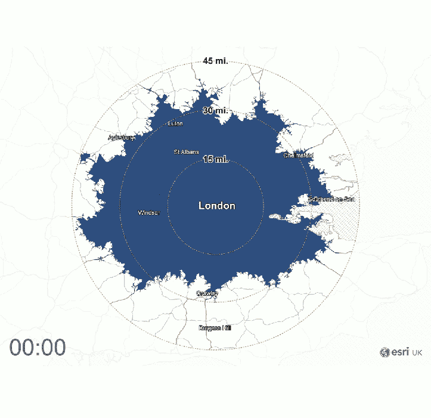
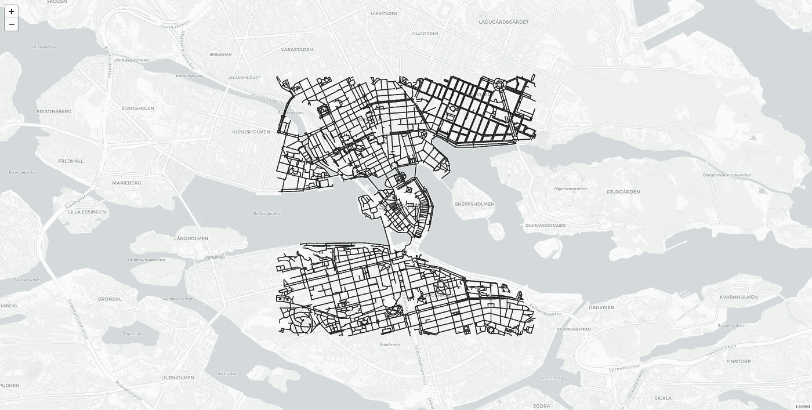
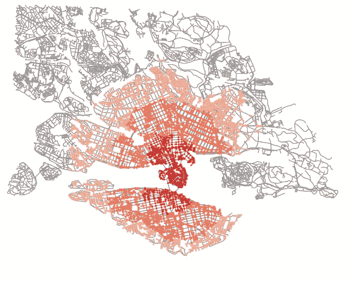

# 如何计算世界上任何地点的旅行时间

> 原文：<https://towardsdatascience.com/how-to-calculate-travel-time-for-any-location-in-the-world-56ce639511f?source=collection_archive---------10----------------------->



Isochrone map from London, Source: Esri UK

## 关于如何在 Python 中执行等时线(从一点到另一点的旅行时间)的指南。

不同的交通方式(如骑自行车、步行或驾车)需要不同的到达时间。但是你有没有想过，“从现在的位置往任何方向走 10 分钟能到达哪里？”

这就是等时线(旅行时间图)的本质。等时线(希腊文 *isos* 的意思是‘相等’， *chrónos* 的意思是‘时间’)，指的是旅行时间相等的线。

例如，送货公司可以使用等时线来确定 30 分钟车程内可到达的送货区域。或者，使用最大通勤时间和交通方式偏好，从你的工作场所找到一个理想的新家。

在本教程中，我将向您展示如何在 Python 中执行等时线(旅行时间图)。我们将为街道网络使用 [OSMnx](https://github.com/gboeing/osmnx) Python 库。这篇文章的代码可以作为 [Mybinder](https://mybinder.org) Notebook 获得。不需要安装任何东西就可以在网上运行和试验它。

如果想在本地电脑上运行，需要用 pip 安装这三个库: [networkx](https://github.com/networkx/networkx) ，Osmnx，和 [Geopandas](https://github.com/geopandas/geopandas) 。

让我们先从建设街道网络开始。

## 网络图

首先，我们需要获得我们想要的位置的数据。所以，让我们先下载并可视化一个地方的街道网络数据。在本教程中，我将以瑞典斯德哥尔摩为例。随意挑选任何其他地点。

首先，让我们导入库。

```
# 1\. Import libraries
import geopandas as gpd
from shapely.geometry import Point, LineString, Polygon
import networkx as nx
import osmnx as ox
import matplotlib.pyplot as plt
from descartes import PolygonPatch
from IPython.display import IFrame
ox.config(log_console=True, use_cache=True)
```

现在我们需要为我们想要创建的网络图设置参数。你需要一个地址或坐标(纬度和经度)。如果你提供一个名字或者一个地址，Osmnx 会进行地理编码并返回该地区的网络图。

让我们为斯德哥尔摩市创建一个网络图。在下面的代码片段 1 和 2 中，我们首先创建两个变量来保存位置和运输方式。

一旦我们有了这些变量，我们就可以创建一个图表。OSMNx 有不同的创建图形的方式；在这个例子中，我们从一个地址创建了一个网络图。您可以通过调整代码片段 3 中的 distance 参数来增加或减少返回的网络图的面积。

最后一个片段(#4)显示了如何绘制图形，该图形可视化了带有边和节点的区域的街道网络。


Network graph plotted

该图包含斯德哥尔摩街道网络的节点和边，并提供了距离(1500)。如果你想要一个有这些图形网络的背景地图，OSMNX 有一个创建叶子地图的功能。

下面是带背景底图的叶图。



让我们试试另一个例子。因为这是一个重复的任务，所以我创建了一个函数，它还可以接受其他参数，如交通方式、距离和位置类型。

现在，我们可以从任何地址/坐标得到一个网络。让我们使用坐标(纬度和经度)作为我们的位置来测试这个函数。这次我们提供来自伦敦的坐标。

在从上述代码中的坐标创建了一个图形之后，我们还绘制了这个图形。这是伦敦图形网络的输出图。


London

接下来，我们将根据网络图创建行程时间图(等时线)。

## 等时线(旅行时间)

首先，我们用交通方式建立兴趣点和图形网络。让我们为更大的网络斯德哥尔摩创建一个距离为 7k 的步行图。

一旦我们创建了遍历图，下一步就是从图中创建节点(代码片段#2)。在代码片段 3 中，我们指定了我们感兴趣的点——时间旅行开始的地方。最后，我们将图从纬度/经度投影到合适的 UTM 投影。

接下来，我们将确定行程时间和行驶速度。

我们希望旅行分为 5 类，从 5 分钟到 1 小时不等。我们还指定平均步行速度为千米每小时(4.5)，然后转换为米每分钟。

现在我们已经设置了行程和行驶速度，我们可以为五个行程类别创建行驶时间(等时线)。

第一段代码为不同的旅行时间提供了不同的颜色。然后在第二个代码片段中，我们遍历行程时间及其颜色，用适当的颜色填充节点。

最后，我们用图形网络来绘制色点。这是输出。



这些点根据它们的行驶时间被涂上颜色，例如，在 60 分钟内，你可以到达在外围涂上浅红色的点。然而，这些彩色的图形节点并不在多边形中，但是我们可以像这样很容易地从这些点创建多边形。

一旦我们创建了等时多边形，我们就可以使用 plot_graph 函数和笛卡尔库中的 PlygonPatch 来绘制它们。

下面绘制的网络图更直观地显示了行驶时间的区域。


Isochrones

注意:OSMNx 没有用 follow 底图绘制等时线的固有功能。我怀疑这是由于地理投影。请记住，在运行等时线过程之前，我们已经对图表进行了投影。

但是，您可以使用 Geopandas 从 isochrone_polys 创建地理数据框架，并通过提供适当的通用横轴墨卡托(UTM)投影区将其导出。

我还包含了如何使用正确的 UTM 投影将等时线多边形导出到 shapefile 的代码。

## 结论

在本教程中，我们介绍了如何使用 Python 执行旅行时间。尝试不同的位置，并测试您所在区域的旅行时间(等时线)情况。这个 Binder 容器中提供了代码，您可以运行并试验它。

[](https://mybinder.org/v2/gh/shakasom/isochronewithosmnx/master) [## GitHub:shaka som/isochronewithosmnx/master

### 单击运行此交互式环境。来自活页夹项目:可复制、可共享、交互式计算…

mybinder.org](https://mybinder.org/v2/gh/shakasom/isochronewithosmnx/master)