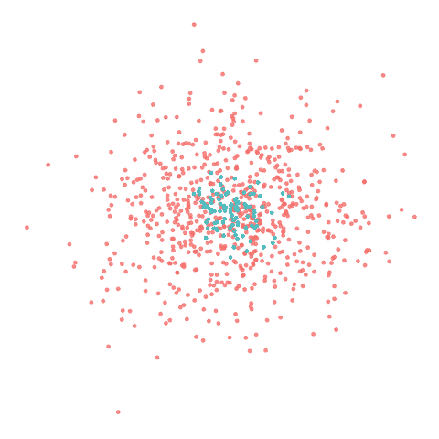
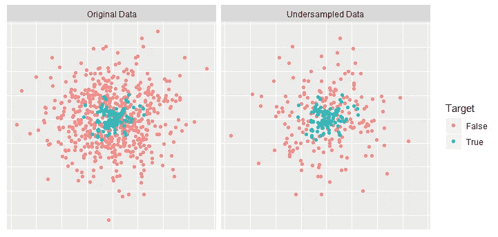
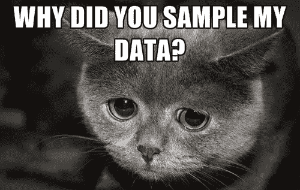
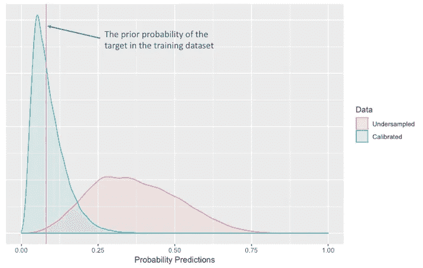

# 如何校准欠采样模型得分

> 原文：<https://towardsdatascience.com/how-to-calibrate-undersampled-model-scores-8f3319c1ea5b?source=collection_archive---------6----------------------->

## 二元预测模型中的不平衡数据问题，以及用 Python 和 r 处理这些问题的简单而有效的方法。

Random Undersampling Flower

## 不平衡的数据，万恶之源

不平衡数据简单地指的是其中一个类别形成高多数并支配其他类别的情况。对于机器学习，目标值的偏斜分布可能会导致算法的准确性偏差，并对模型的性能产生负面影响。在这一点上，模型和性能指标的目标是实质性的。

我们用一个例子来澄清一下。如果您的**目标**列具有带有%1 的**真**类，那么就基本准确性而言，总是预测**假**的模型将有 99%的成功率。然而，这在大多数情况下是不切实际的，因为**假阳性**(或 I 型误差)和**假阴性**(或 II 型误差)预测的成本通常是不相等的。

有几个解决不平衡数据问题的方法，但在这篇文章中，我将提到欠采样方法和校准过程，调整最终分数。

## 什么是欠采样？

假设您的数据有一个比率高度不对称的二进制目标变量。为了平衡目标的比例，增加机器学习算法对少数类的关注，减少了多数类的行数。这个过程称为欠采样，应用于模型训练前的数据准备阶段。

The data before and after undersampling

在欠采样过程之后，在模型分数的分布上可以看到一些副作用。例如，如果训练数据中的**真**类的比率是 **%5** ，我们期望概率预测的平均值也是 **%5** 。但是，如果我们操纵目标类别比率，我们也会改变预测分数的分布。对非目标类别的随机欠采样提高了训练数据中目标类别的先验概率，并且最终增加了概率预测。

## 这是个问题吗？

如果您的目标是根据实例的预测得分选择一定数量的实例，欠采样不是问题，因为它不会改变实例的概率得分顺序。例如，如果您需要为您的营销活动指定一个具有最高倾向得分的人群，您不需要担心采样不足的副作用。

然而，在某些情况下，现实的概率预测很重要:

*   客户终身价值或类似的计算需要校准的概率预测。假设你有价值 100 美元的**产品 A** 和对**产品 A** 倾向评分为 0.1 的**用户 B** 。所以，**用户 B** 在营销方面的价值是 100$*0.1=10$。
*   如果假阳性或假阴性预测的成本很高，则要求有现实的概率预测。在您想要指定罪犯的情况下，误报通常是不可容忍的。或者如果你试图预测一个人是否患有癌症，这个顺序通常是没有意义的，另一方面，概率是至关重要的。

> “如果你给所有发生的事件 0.6 的概率，给所有不发生的事件 0.4 的概率，你的辨别能力是完美的，但你的校准是糟糕的”。
> 
> 丹尼尔·卡内曼

## 校准会改变什么？

如果您使用 AUC 作为模型评估指标，您将看不到校准前后的任何差异，因为 AUC 关心的是区分类别，而不是它们的概率。但是，如果您使用的度量标准(如对数损失)与似然函数配合使用，情况就会有所不同。

在下图中，您可以看到校准前后欠采样数据的概率预测分布。紫色竖线表示原始数据中目标类的先验概率。从图表中可以看出，欠采样模型预测的红色区域在校准过程之后变得与先验概率高度一致。

The comparison of the score distribution before and after calibration

## 让我们校准

为了调整模型输出中的概率，我们校准它们。有两种众所周知的校准算法:普拉特缩放和保序回归。

除了这些，我想说一下另一个不复杂的校准公式及其在 python 和 r 中的作用。

以下是函数参数的解释:

*   **数据:**模型输出的概率预测数组
*   **train_pop:** 训练数据集中的总行数
*   **target_pop:** 训练数据集中目标类的总行数
*   **sampled_train_pop:** 欠采样后训练数据集中的总行数
*   **sampled_target_pop:** 欠采样后训练数据集中目标类的总行数

## 校准功能:

Calibration function in python

Calibration function in R

## **如何使用该功能？**

假设你的目标是生成一个显示信用违约概率的模型，你的原始训练数据有 **50，000** 行，其中只有 **500** 行被标记为目标类。当您随机对非目标实例进行采样，并将总行数减少到 **10，000** ，同时保留 **500** 个目标行时，我们的校准函数变为:

> **校准(型号 _ 结果，50000，500，10000，500)**

这里 **model_results** 是你的模型概率输出数组。在您训练您的模型并将结果放入其中之后，您的函数就可以使用了。好好享受吧！

## 参考

*   [如何处理不平衡数据:概述](https://www.datascience.com/blog/imbalanced-data)
*   [机器学习中不平衡类的处理](/dealing-with-imbalanced-classes-in-machine-learning-d43d6fa19d2)
*   [使用普拉特标度和保序回归进行分类器校准](http://fastml.com/classifier-calibration-with-platts-scaling-and-isotonic-regression/)
*   [普拉特缩放会议论文](https://www.researchgate.net/publication/233784966_Probabilities_for_SV_Machines)
*   [什么是原木损耗？](https://www.kaggle.com/dansbecker/what-is-log-loss)