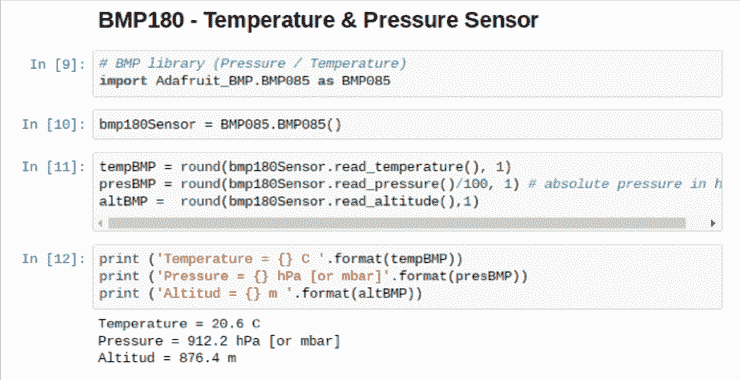

# 如何用自己的物联网家庭工作站捕捉天气数据

> 原文：<https://towardsdatascience.com/how-to-capture-weather-data-on-your-home-400716bde645?source=collection_archive---------8----------------------->

## 通过 MQTT 协议捕获天气数据，并在本地和物联网服务上记录这些数据。


# 介绍

当我们谈论温度、压力等物理变量时。作为一名数据科学家，通常您会从在其他地方创建的数据集开始工作。但是你想过如何自己捕捉那些数据吗？

在本教程中，我们将学习如何从几个不同的传感器获取数据，并将它们发送到物联网服务 ThingSpeak.com 和移动应用程序(Thingsview)，在那里我们可以记录和处理数据。我们还将探索将传感器连接到 Raspberry Pi 的几种不同通信方式，如下所示:

*   DHT22 —温度和湿度传感器—数字通信
*   DS18B20 —温度传感器—单线
*   BMP180 —温度和压力传感器— I2C
*   UV —紫外线传感器—通过 A/D 和 SPI 总线的模拟传感器

简而言之，所有数据将被捕获，保存在本地 CSV 文件中，并通过 MQTT 协议发送到物联网服务(ThingSpeak.com ),如下图所示:


为了完成一个真正的气象站，在最后一步，你还将学习如何测量风速和风向，遵循[毛里西奥·平托](https://www.instructables.com/member/Mtpinto/)的教程。

# 供应品:

*   [树莓派 V3](http://a.co/cSjzJhj)
*   [DHT22 温湿度传感器](https://www.adafruit.com/product/385)
*   电阻器 4K7 欧姆
*   [DS18B20 防水温度传感器](http://a.co/8NPkPQM)
*   电阻器 4K7 欧姆
*   [BMP180 气压、温度和海拔传感器](http://a.co/3bhais0)
*   [紫外线传感器](https://es.aliexpress.com/item/UV-Detection-Sensor-Module-Ultraviolet-Ray-Module/32252554436.html?spm=a2g0s.9042311.0.0.jbbTqb)
*   [Adafruit MCP3008 8 通道 10 位 ADC，带 SPI 接口](https://www.amazon.com/Adafruit-MCP3008-8-Channel-Interface-Raspberry/dp/B00NAY3RB2)

# 1.开发环境— Jupyter 笔记本

Jupyter Notebook 是一个非常棒的工具，或者更好的说法是一个开源的 web 应用程序，它允许您创建和共享包含实时代码、等式、可视化和叙述性文本的文档。Jupyter 笔记本主要用于数据科学，用于清理和转换数据，进行数值模拟，统计建模，数据可视化，机器学习，等等！

在本教程中，我们将使用 Jupyter Notebook 与 Raspberry Pi GPIOs 进行交互，直接读取传感器并将数据发送到互联网。

**安装**

> 如果您的 RPi 上已经安装了 Jupyter 笔记本，您可以跳过这一步

要在您的 Raspberry 上安装 Jupyter(将与 Python 3 一起运行)，请打开终端并输入以下命令:

```
sudo pip3 install jupyter
sudo ipython3 kernelspec install-self
```

现在，在您的终端上，运行命令:

```
jupyter notebook
```

就是这样！！！！太神奇了！非常简单容易。Jupyter 笔记本将作为服务器运行在:

```
http:localhost:8888
```


请注意，您的默认浏览器将在上述地址自动打开，作为“主页”运行，如上图所示。

> 要停止服务器并关闭“内核”(Jupyter 笔记本)，您必须使用键盘上的[Ctrl] + [C]。

从现在开始，任何时候你启动你的 Pi 并想使用 Jupyter notebook，只需在你的终端上输入命令:“Jupyter Notebook”并让它一直运行。这个很重要！

> 例如，如果您需要使用终端执行另一项任务，如运行程序，请打开一个新的终端窗口。

你可以按照这个教程一步一步来，创建自己的笔记本，或者从我的 GitHub 下载最终版:[Rpi _ Weather _ station . ipynb](https://github.com/Mjrovai/RPi-Weather-Station/blob/master/Rpi_Weather_Station.ipynb)。

# 2.DHT22 —温度和湿度传感器


将安装的第一个传感器是 DHT22，用于采集空气温度和相对湿度数据。 [ADAFRUIT 网站](https://learn.adafruit.com/dht/overview)提供了关于这些传感器的大量信息。贝娄从那里检索到一些信息:

**概述**

低成本 DHT 温度和湿度传感器非常简单，速度较慢，但非常适合想要进行一些基本数据记录的爱好者。DHT 传感器由两部分组成，一个电容式湿度传感器和一个热敏电阻。内部还有一个非常基本的芯片，可以进行一些模数转换，并根据温度和湿度发出数字信号。使用任何微控制器都很容易读取数字信号。

DHT22 主要特征:

适用于 0–100%湿度读数，精确度为 2–5%适用于-40 至 125°C 温度读数，精确度为 0.5°C 采样频率不超过 0.5 Hz(每 2 秒一次)

*   低成本
*   3 至 5V 电源和 I/O
*   转换期间的最大电流消耗为 2.5mA(请求数据时)
*   机身尺寸 15.1 毫米 x 25mm 毫米 x 7.7mm 毫米
*   4 个间距为 0.1 英寸的引脚

如果您通常在小于 20 米的距离上使用传感器，则应在数据和 VCC 引脚之间连接一个 4K7 欧姆的电阻。DHT22 输出数据引脚将连接到 Raspberry GPIO 16。检查上述电气图，将传感器连接到 RPi 引脚，如下所示:

*   引脚 1 — Vcc ==> 3.3V
*   引脚 2 —数据==> GPIO 16
*   引脚 3 —未连接
*   引脚 4 — Gnd ==> Gnd

> *不要忘记在 Vcc 和数据引脚*之间安装 4K7 欧姆电阻

一旦连接了传感器，我们还必须在 RPi 上安装它的库。

**安装分布式哈希表库:**

在您的覆盆子上，从/home 开始，转到/Documents

```
cd Documents
```

创建一个安装库的目录并移动到那里:

```
mkdir DHT22_Sensor
cd DHT22_Sensor
```

在您的浏览器上，转到 Adafruit GitHub:

[](https://github.com/adafruit/Adafruit_Python_DHT) [## 阿达果/阿达果 _Python_DHT

### Python 库来读取树莓 Pi 或 Beaglebone Black 上的 DHT 系列湿度和温度传感器。…

github.com](https://github.com/adafruit/Adafruit_Python_DHT) 

通过点击右边的下载 zip 链接来下载这个库，并在您最近创建的 Raspberry Pi 文件夹中解压存档文件。然后转到库的目录(解压文件时自动创建的子文件夹)，并执行命令:

```
sudo python3 setup.py install
```

在 Jupyter 笔记本上，导入 Adafrut DHT 库，定义连接 DHT 和 RPi 的数字 pin，并运行代码以捕获温度和湿度:

```
import Adafruit_DHT
DHT22Sensor = Adafruit_DHT.DHT22
DHTpin = 16humDHT, tempDHT = Adafruit_DHT.read_retry(DHT22Sensor, DHTpin)
if (humDHT is not None) and (tempDHT is not None):
    hum = round (humDHT,1)
    temp = round (tempDHT, 1)
```

运行电池并打印结果:

```
print(‘Temperature = {}*C Humidity = {}%’.format(temp, hum))
```

下面是 Jupyter 笔记本显示结果的部分:


# 3.DS18B20 —温度传感器


**传感器概述:**

在本教程中，我们将使用 DS18B20 传感器的防水版本。这对于在潮湿条件下捕捉温度非常有用，例如在潮湿的土壤上。该传感器是隔离的，可以在 125 摄氏度之前进行测量(由于其电缆 PVC 护套，Adafrut 不建议在 100 摄氏度以上使用)。

DS18B20 是一款数字传感器，即使是长距离使用也很方便！这些单线数字温度传感器相当精确(大部分范围内为±0.5°C ),板载数模转换器的精度最高可达 12 位。它们使用单个数字引脚与 RPi 配合工作，您甚至可以将多个数字引脚连接到同一个引脚，每个数字引脚在出厂时都有一个唯一的 64 位 ID，以便区分。

该传感器的工作电压范围为 3.0 至 5.0V，这意味着它可以直接由其中一个覆盆子引脚(1 或 17)提供的 3.3V 电源供电。

该传感器有 3 根电线:

*   黑色:GND
*   红色:VCC
*   黄色:单线数据

在这里，你可以找到完整的数据: [DS18B20 数据手册](https://cdn-shop.adafruit.com/datasheets/DS18B20.pdf)

**传感器安装:**

按照上图进行连接:

*   Vcc ==> 3.3V
*   Gnd == >接地
*   Data ==> GPIO 4(库的默认值)

**安装 Python 库:**

接下来，让我们安装将处理传感器的 Python 库:

```
sudo pip3 install w1thermsensor
```

在运行脚本测试传感器之前，检查 RPi 中是否启用了“1-Wire”接口(参见下面的打印屏幕)


启用接口

> *更改配置后，不要忘记重启 RPi*

**测试传感器:**

为了测试传感器，可以使用一个简单的 python 代码:

```
from w1thermsensor import W1ThermSensor
ds18b20Sensor = W1ThermSensor()
tempExt = round(ds18b20Sensor.get_temperature(), 1)
print('External Temperature = {}*C'.format(tempExt))
```

下面是 Jupyter 笔记本显示结果的部分:


# 4.BMP180 —温度和压力传感器


**传感器概述:**

BMP180 是 BMP085 的继任者，BMP 085 是面向消费者应用的新一代高精度数字压力传感器。BMP180 的超低功耗、低压电子器件针对移动电话、PDA、GPS 导航设备和户外设备的使用进行了优化。BMP180 的低空噪声仅为 0.25 米，转换速度快，性能卓越。I2C 接口便于系统与微控制器集成。BMP180 基于压阻技术，具有 EMC 鲁棒性、高精度、线性度和长期稳定性。

完整的 BMP 数据表可以在这里找到: [BMP180 —数字压力传感器](https://cdn-shop.adafruit.com/datasheets/BST-BMP180-DS000-09.pdf)

**传感器安装:**

按照上图进行连接:

*   Vin ==> 3.3V
*   GND ==> GND
*   SCL ==> GPIO 3
*   SDA ==> GPIO 2

**启用 I2C 接口**

转到 RPi 配置并确认 I2C 接口已启用。如果没有，请启用它并重启 RPi。

**使用 BMP180**

如果一切都已安装和连接好，你现在准备好打开你的 Pi，并开始查看 BMP180 告诉你关于你周围的世界。

首先要做的是检查 Pi 是否看到你的 BMP180。在终端窗口中尝试以下操作:

```
sudo i2cdetect -y 1
```

如果该命令有效，您应该会看到类似下面的终端打印屏幕，显示 BMP180 在通道' 77 '上。


**安装 BMP180 库:**

创建一个安装库的目录，并转到该目录:

```
mkdir BMP180_Sensor
cd BMP180_Sensor
```

在您的浏览器上，转到 Adafruit GITHub:

[](https://github.com/adafruit/Adafruit_Python_BMP) [## 阿达果/阿达果 _Python_BMP

### Python 库，用于访问 BMP 系列压力和温度传感器，如树莓 Pi 上的 BMP 085/BMP 180…

github.com](https://github.com/adafruit/Adafruit_Python_BMP) 

通过点击右边的下载 zip 链接来下载库，并在您的 Raspberry Pi 创建的文件夹中解压缩归档文件。然后转到创建的子文件夹，在库的目录中执行以下命令:

```
sudo python3 setup.py install
```

在 Jupyter 上，编写以下代码:

```
import Adafruit_BMP.BMP085 as BMP085
bmp180Sensor = BMP085.BMP085()
tempBMP = round(bmp180Sensor.read_temperature(), 1)
presBMP = round(bmp180Sensor.read_pressure()/100, 1)
altBMP =  round(bmp180Sensor.read_altitude(),1)
```

用以下代码检查传感器读取的变量:

```
print ('Temperature = {} C '.format(tempBMP))
print ('Pressure = {} hPa [or mbar]'.format(presBMP))
print ('Altitud = {} m '.format(altBMP))
```

下面是 Jupyter 笔记本显示结果的部分



> 注意，传感器压力以 Pa(帕斯卡)为单位。参见下一步，更好地了解本单元。

# 5.用 BMP180 测量天气和高度


海平面压力

让我们花点时间来了解更多关于我们将会得到的 BMP 读数。

> 你可以跳过这部分教程，或者稍后返回，如果你想知道更多关于传感器读数的信息，请去这个伟大的教程:[https://learn.sparkfun.com/tutorials/bmp180-barome...](https://learn.sparkfun.com/tutorials/bmp180-barometric-pressure-sensor-hookup-)

BMP180 设计用于精确测量大气压力。大气压力随着天气和高度而变化。

**什么是大气压？**

大气压的定义是你周围的空气对一切物体施加的力。大气中气体的重量产生大气压力。压力的常用单位是“磅每平方英寸”或 psi。我们将在这里使用国际符号，即每平方米的牛顿，称为帕斯卡(Pa)。

> *如果你拿 1 厘米宽的空气柱会重约 1 公斤*

这个重量压在柱子上，产生大气压力，我们可以用 BMP180 等传感器测量。因为厘米宽的空气柱重约 1 公斤，所以平均海平面气压约为 101325 帕斯卡，或者更好，1013.25 百帕(1 百帕也称为毫巴)。每上升 300 米，这将下降约 4%。你升得越高，你看到的压力就越小，因为到大气层顶部的柱子要短得多，因此重量也就轻得多。知道这一点很有用，因为通过测量压力和做一些数学计算，你可以确定你的高度。

> *海拔 3810 米的气压只有海平面气压的一半。*

BMP180 以帕斯卡(Pa)为单位输出绝对压力。一帕斯卡是一个很小的压力，大约相当于一张纸放在桌子上所产生的压力。你会经常看到以百帕为单位的测量值(1 百帕= 100 帕)。这里使用的库提供了以 hPa 为单位的输出浮点值，恰好等于 1 毫巴(mbar)。

以下是一些到其他压力单位的转换:

*   1 百帕= 100 帕= 1 毫巴= 0.001 巴
*   1 百帕= 0.75006168 托
*   1 百帕= 0.01450377 磅/平方英寸(磅/平方英寸)
*   1 百帕= 0.02953337 英寸汞柱
*   1 百帕= 0.00098692 大气压(标准大气压)

**温度影响**

因为温度影响气体的密度，密度影响气体的质量，质量影响压力(咻)，大气压会随着温度发生剧烈变化。飞行员将此称为“密度高度”，这使得在寒冷的日子比炎热的日子更容易起飞，因为空气密度更大，空气动力学效应更大。为了补偿温度，BMP180 包括一个相当好的温度传感器和一个压力传感器。

要读取压力，首先要读取温度读数，然后将其与原始压力读数相结合，得出最终的温度补偿压力测量值。(图书馆让这一切变得非常容易。)

**测量绝对压力**

如果您的应用需要测量绝对压力，您所要做的就是获得温度读数，然后执行压力读数(详见示例草图)。最终压力读数的单位为 hPa = mbar。如果您愿意，可以使用上述换算系数将其转换为不同的单位。

> 注意，大气的绝对压力会随着你的高度和当前的天气模式而变化，这两者都是可以测量的有用的东西。

**天气观测**

地球上任何给定位置(或任何有大气的地方)的大气压力都不是恒定的。地球自转、地轴倾斜和许多其他因素之间的复杂相互作用导致较高和较低压力的移动区域，这反过来导致我们每天看到的天气变化。通过观察气压的变化，你可以预测天气的短期变化。例如，压力下降通常意味着潮湿的天气或暴风雨即将来临(低压系统正在移动)。压力上升通常意味着晴朗的天气即将来临(一个高压系统正在通过)。但是请记住，大气压力也随着高度而变化。我家的绝对压力，在智利的 Lo Barnechea(海拔 950 米)将永远低于例如旧金山的绝对压力(不到 2 米，几乎是海平面)。如果气象站仅仅报告了它们的绝对压力，就很难直接比较一个地点和另一个地点的压力测量值(大规模的天气预报依赖于尽可能多的气象站的测量值)。

为了解决这个问题，气象站总是从他们报告的压力读数中消除海拔的影响，通过数学方法加上等效的固定压力，使其看起来好像是在海平面上读取的。当你这样做的时候，旧金山的读数总是比 Lo Barnechea 高，这是因为天气模式，而不是因为海拔。

为此，库中有一个函数叫做 ***海平面(P，A)*** 。这采用了以百帕为单位的绝对压力(P)和以米为单位的测站当前高度(A ),并从压力中去除了高度的影响。您可以使用此功能的输出直接将您的天气读数与世界上其他气象站的数据进行比较。

**确定高度**

由于压力随着海拔高度而变化，您可以使用压力传感器来测量海拔高度(有一些注意事项)。海平面上大气的平均压力是 1013.25 百帕(或毫巴)。当你向太空的真空爬升时，这个值会下降到零。因为这个下降曲线很好理解，你可以用一个特定的方程计算两个压力测量值(p 和 p0)之间的高度差。

如果你使用海平面气压(1013.25 百帕)作为基线气压(p0)，方程式的输出将是你目前的海拔高度。库中有一个函数叫做 ***海拔(P，P0)*** 可以让你得到“计算的海拔”。

*以上解释摘自 BMP 180 Sparkfun 教程。*

# 6.海平面压力测量


正如我们在上一步中了解到的，手头有海平面压力是很重要的，一旦我们有了测量绝对压力的真实高度，就可以计算出海平面压力。下面的函数可以帮助我们:

```
def bmp180GetData(altitude):
    temp = bmp180Sensor.read_temperature()
    pres = bmp180Sensor.read_pressure()
    alt =  bmp180Sensor.read_altitude()

    presSeaLevel = pres / pow(1.0 - altitude/44330.0, 5.255)
    temp = round (temp, 1)
    pres = round (pres/100, 2)
    alt = round (alt)
    presSeaLevel = round (presSeaLevel/100, 2)

    return temp, pres, alt, presSeaLevel
```

在我的例子中，我将 BMP180 安装在 957 米的实际测量高度上，因此我们可以从传感器获得以下更新数据:


# 7.使用 ADC(模数转换器)


下一步，我们将讨论如何从一个非常简单但性能良好的模拟传感器获取 UV 数据。这里的问题是，Raspberry Pi 没有模拟输入引脚作为 Arduino 或 NodeMCU，但我们可以通过使用模数(A/D)转换器来解决这个问题，这将有助于模拟传感器与 Raspberry Pi 的接口。我们将在这个项目中使用的模数转换器是流行的 MCP3008。

MCP3008 是一款 10 位 8 通道 ADC(模数转换器)，使用 SPI 总线协议与 Raspberry Pi 接口。它很便宜，不需要任何额外的部件。它提供 8 路模拟输入，仅使用 4 个 Raspberry Pi gpio，外加电源和接地引脚。MCP3008 输出范围为 0–1，023，其中 0 表示 0V，1，023 表示 3.3V

**MCP3008 引脚排列**


MCP3008 的引脚编号从左上开始(引脚 1: CH0)，顶部有一个半圆，如上图所示。MCP3008 ADC 共有 16 个引脚，其中 8 个引脚用于接收模拟输入。模拟输入引脚来自 CH0-CH7(引脚 1–8)。在另一侧(引脚 9–16)，我们有如下不同的功能:

*   09 — DGND 是芯片的数字接地引脚。
*   10 — CS 是片选引脚。连接到 RPi 引脚 24 (SPI0 — CE)
*   11 — DIN 是 Raspberry Pi 引脚 19 (SPI0 — MOSI)的数据输入引脚
*   12 — DOUT 是数据输出引脚。连接到 RPi 引脚 21 (SPI0 — MISO)
*   13 — CLK 是时钟引脚。连接到 RPi 引脚 23 (SPI0 — SCLK)
*   14 — AGND 是模拟接地引脚。
*   15 — VREF 是模拟基准电压。接 3.3V，想换刻度可以换。16 — VDD 是芯片的电源引脚。

在这个项目中，我们将使用通道 0(引脚 1)作为模拟输入。

**SPI**

Raspberry Pi 配有一条 SPI 总线，具有 2 个芯片选择。Raspbian 上的 SPI 主驱动器默认禁用。要使能它，使用 raspi-config 确认 spi 总线已使能(与之前使用 1-Wire 完成的程序相同)。

首先，导入 spidev，一个访问 SPI 总线的 Linux 驱动程序:

```
import spidev
```

并打开和配置总线:

```
spi = spidev.SpiDev()
spi.open(0,0)
spi.max_speed_hz=1000000
```

从那里，您可以访问我们 ADC 的任何模拟通道。为了测试，编写下面的函数:

```
def ReadChannel(channel):
    adc = spi.xfer2([1,(8+channel)<<4,0])
    data = ((adc[1]&3) << 8) + adc[2]
    return data
```

然后，将通道 0 (MCP3008 引脚 1)连接到 3.3V，并运行以下功能:

```
ReadChannel(0)
```

结果，您应该看到:1023

# 8.模拟紫外线传感器


这种紫外线传感器产生一个与光感应光谱中的紫外线辐射成比例的模拟输出。它使用紫外光电二极管(基于氮化镓)，可以检测 240-370 纳米范围的光(覆盖 UVB 和大部分 UVA 光谱)。来自光电二极管的信号电平非常小，在纳安级，因此该模块嵌入了一个运算放大器，将信号放大到更可读的电压电平(0 至 1V)。

通过将 VCC 连接到 3.3VDC，将 GND 连接到电源地，可以给传感器和运算放大器供电。模拟信号可以从 OUT 引脚获得。其输出以毫伏为单位，由连接到 RPi 的 ADC 的模拟输入(CH0)读取。

使用上一步中显示的相同代码，我们可以看到由 UV 传感器生成的“原始数据”(在本例中为“43”):


有了原始的传感器数据，我们应该“转换”(或“映射”)它的值，以便代码更好地处理。我们可以用函数 readSensorUV()来实现。该功能读取紫外线传感器 3 次，取平均值并将测量值转换为 mV:

```
def readSensorUV():
    numOfReadings = 3
    dataSensorUV = 0
    for i in range(numOfReadings):
        dataSensorUV += ReadChannel(0)
        time.sleep(0.2)
    dataSensorUV /= numOfReadings
    dataSensorUV = (dataSensorUV * (3.3 / 1023.0))*1000;
    return round(dataSensorUV)
```

例如，原始测量值“43”实际上相当于 128 毫伏:

如果我们看下面的表格和曲线:


我们会看到 128mV 应该和指数 0 到 1 之间的辐射有关。让我们创建一个函数来计算这个指数，这是最常见的紫外线辐射测量。我们将考虑一个范围，以上表所示的 Vout 为起点，范围为 110mV。例如，介于 227 毫伏和 337 毫伏之间的紫外线测量值将被视为指数 1。

```
def indexCalculate(dataSensorUV):
    if dataSensorUV < 227: indexUV = 0
    elif (227 <= dataSensorUV) & (dataSensorUV < 318): indexUV = 1
    elif (318 <= dataSensorUV) & (dataSensorUV < 408): indexUV = 2
    elif (408 <= dataSensorUV) & (dataSensorUV < 503): indexUV = 3
    elif (503 <= dataSensorUV) & (dataSensorUV < 606): indexUV = 4
    elif (606 <= dataSensorUV) & (dataSensorUV < 696): indexUV = 5
    elif (696 <= dataSensorUV) & (dataSensorUV < 795): indexUV = 6
    elif (795 <= dataSensorUV) & (dataSensorUV < 881): indexUV = 7
    elif (881 <= dataSensorUV) & (dataSensorUV < 976): indexUV = 8
    elif (976 <= dataSensorUV) & (dataSensorUV < 1079): indexUV = 9
    elif (1079 <= dataSensorUV) & (dataSensorUV < 1170): indexUV =10
    else: indexUV = 11
    return indexUV
```

因此，对于之前的测量(128mV)，指数应为 0。


# 9.完整的硬件和软件


此时，我们已经安装并测试了所有的传感器。现在让我们开发一个函数来一次捕获所有数据:

```
import datetimedef getSensorData():
    global timeString
    global humLab
    global tempExt
    global tempLab
    global presSL
    global altLab
    global presAbs
    global UV_mV
    global UV_index now = datetime.datetime.now()
    timeString = now.strftime("%Y-%m-%d %H:%M") tempExt = round(ds18b20Sensor.get_temperature(), 1)
    tempLab, presAbs, altLab, presSL = bmp180GetData(altReal) humDHT, tempDHT = Adafruit_DHT.read_retry(DHT22Sensor, DHTpin)
    if humDHT is not None and tempDHT is not None:
        humLab = round (humDHT) UV_mV = readSensorUV()
    UV_index = indexCalculate(UV_mV)
```

> 请注意，我已经将所有传感器变量定义为全局变量。您可以将它们保存在本地，从函数中返回值(这是一种更好的做法)。


# 10.本地记录数据


此时，您拥有了从传感器获取大量数据的所有工具。但是该拿它们怎么办呢？

最简单的答案是创建一个循环函数来定期捕获数据，并将它们保存在本地文件中。

```
with open("/home/pi/rpi_weather_station.csv", "a") as log:
    while True:
        getSensorData()
        log.write("{},{},{},{},{},{},{},{},{}\n".format(timeString, humLab, tempExt, tempLab, presSL, altLab, presAbs, UV_mV, UV_index))
        time.sleep(30)
```

上面的代码在你的根目录下打开一个名为“rpi_weather_station.csv”的文件。


每隔 30 秒，时间戳加上来自所有传感器的数据将被“附加”到该文件中，如上所示。

# 11.物联网——向云服务发送数据


至此，我们已经了解了如何从传感器捕获数据，并将其保存在本地 CSV 文件中。现在，是时候看看如何将这些数据发送到物联网平台了。在本教程中，我们将使用[ThingSpeak.com](https://thingspeak.com/)。

> “ThingSpeak 是一个开源的物联网(IoT)应用程序，使用 REST 和 MQTT APIs 来存储和检索数据。ThingSpeak 支持创建传感器日志应用程序、位置跟踪应用程序和具有状态更新的社交网络。”

首先，你必须在 ThinkSpeak.com 有一个账户。接下来，按照说明创建一个通道，记下它的**通道 ID** 和**写 API 键**。


创建频道时，您还必须定义将上传到 8 个字段中的每个字段的信息，如上所示。

# 12.MQTT 协议和 ThingSpeak 连接

MQTT 是一种发布/订阅架构，主要用于通过无线网络连接带宽和功率受限的设备。它是一个简单的轻量级协议，运行在 TCP/IP 套接字或 web 套接字上。WebSockets 上的 MQTT 可以用 SSL 保护。发布/订阅体系结构使得消息能够被推送到客户端设备，而无需设备持续轮询服务器。

MQTT 代理是通信的中心点，它负责在发送者和合法接收者之间分发所有消息。客户机是连接到代理的任何设备，可以发布或订阅主题以访问信息。主题包含代理的路由信息。每个想要发送消息的客户端将消息发布到某个主题，每个想要接收消息的客户端订阅某个主题。代理将带有匹配主题的所有消息传递给适当的客户端。

ThingSpeak 在 URL**mqtt.thingspeak.com**和**端口 1883** 有一个 MQTT 代理。ThingSpeak 代理支持 MQTT 发布和 MQTT 订阅。

在我们的例子中，我们将使用 MQTT Publish。


MQTT 发布

首先，让我们安装 [Eclipse Paho MQTT Python 客户端库](https://pypi.org/project/paho-mqtt/)，它实现了 MQTT 协议的 3.1 和 3.1.1 版本。

```
sudo pip install paho-mqtt
```

接下来，让我们导入 paho 库:

```
import paho.mqtt.publish as publish
```

并启动 Thingspeak 通道和 MQTT 协议。这种连接方法最简单，需要的系统资源最少:

```
channelID = "YOUR CHANNEL ID"
apiKey = "YOUR WRITE KEY"topic = "channels/" + channelID + "/publish/" + apiKey
mqttHost = "mqtt.thingspeak.com"
tTransport = "tcp"
tPort = 1883
tTLS = None
```

现在，您必须定义要上传到您的物联网服务的主题有效负载(“tPayload”):

```
tPayload = “field1=” + str(humLab)+ “&field2=” + str(tempExt)+ “&field3=” + str(tempLab)+ “&field4=” + str(presSL)+ “&field5=” + str(altLab) + “&field6=” + str(presAbs)+ “&field7=” + str(UV_mV) + “&field8=” + str(UV_index)
```

并发送它:

```
print ("[INFO] Data prepared to be uploaded")
try:
    publish.single(topic, payload=tPayload, hostname=mqttHost, port=tPort, tls=tTLS, transport=tTransport)
    print ("[INFO] Data sent for 8 fields: ", humLab, tempExt, tempLab, presSL, altLab, presAbs, UV_mV, UV_index)
except:
    print ("[INFO] Failure in sending data")
```

如果一切正常，您将获得发送数据的“回声”,在 ThingSpeak 频道页面上，您可以看到这些数据。


# 13.在物联网服务上记录传感器数据


ThingSpeak 频道上传了数据

现在，我们知道只需几行代码就可以将数据上传到物联网服务，让我们创建一个循环函数，以固定的时间间隔自动上传数据(类似于我们在“本地记录数据”中所做的)。

持续捕获数据并将其记录在我们的通道上的简单代码是:

```
import timewhile(True):
    getSensorData()
    tPayload = "field1=" + str(humLab)+ "&field2=" + str(tempExt)+ "&field3=" + str(tempLab)+ "&field4=" + str(presSL)+ "&field5=" + str(altLab) + "&field6=" + str(presAbs)+ "&field7=" + str(UV_mV) + "&field8=" + str(UV_index) try:
        publish.single(topic, payload=tPayload, hostname=mqttHost, port=tPort, tls=tTLS, transport=tTransport)
        save_log()

    except (KeyboardInterrupt):
        break except:
        print ("[INFO] Failure in sending data")

    time.sleep(60)
```

寻找你的 ThingSpeak 频道页面，你会观察到数据会被持续加载到每个字段。该通道将自动“记录”这些数据以供将来分析。数据的完整 CSV 文件也可以从该网站下载。

我们包含了一个函数(save_Log())来将数据记录到本地的 CSV 文件中:

```
def save_log():
    with open("/home/pi/rpi_weather_station.csv", "a") as log:
        log.write("{},{},{},{},{},{},{},{},{}\n".format(timeString, humLab, tempExt, tempLab, presSL, altLab, presAbs, UV_mV, UV_index))
    log.close()
```

用于开发的完整 Jupyter 笔记本可以在这里找到:[Rpi _ Weather _ station . ipynb](https://github.com/Mjrovai/RPi-Weather-Station/blob/master/Rpi_Weather_Station.ipynb)。

# 14.things view—ThingSpeak 应用程序


记录的数据可以直接在本地保存的 CSV 文件上查看，也可以在 ThingSpeak.com 网站或通过 APP 查看，例如 ***ThingsView*** ！

ThingView 是由 [CINETICA](http://www.cinetica-tech.com/) 开发的一个应用程序，它使你能够以一种简单的方式可视化你的 ThingSpeak 频道。只需输入频道 ID，您就可以开始了。

对于公共频道，应用程序将尊重您的 windows 设置:颜色，时间刻度，图表类型和结果的数量。当前版本支持折线图和柱形图，样条图显示为折线图。

对于私有通道，数据将使用默认设置显示，因为无法仅使用 API 键读取私有窗口设置。

ThingView 应用程序可以为 [ANDROID](https://play.google.com/store/apps/details?id=com.cinetica_tech.thingview&hl=en) 和 [IPHONE](https://itunes.apple.com/us/app/thingview/id1284878579?mt=8) 下载。

# 15.测量风速和风向


这个气象站教程是我和我的朋友 Mauricio Pinto 共同开发的项目的一部分。在这里，我们学习了如何捕捉与天气相关的几个重要数据，如空气温度和湿度、压力和紫外线。添加到气象站的另一个非常重要的数据是风速和风向。

毛里西奥做得很好，写了一个非常详细的教程，解释了如何构建一个风速计，主要是用回收材料。你可以在这个 2 部分教程中找到他的项目:

[第 1 部分——风速计和风向标装置的结构。](https://www.instructables.com/id/How-to-Build-Your-Own-Anemometer-Using-Reed-Switch/)

[第二部分——使用 Arduino IDE 实现 Esp8266 Nodemcu 并传输到 ThingSpeak 的草图](https://www.youtube.com/watch?v=wFI0PGDIUFY&feature=youtu.be)

> 正如 Mauricio 在他的教程中解释的那样，风速计是一种能够测量风速及其方向的设备。利用霍尔效应传感器，他能够计算出杯子在一段时间内旋转了多少圈，这是风的强度，与轴的旋转速度成正比。通过一些简单的物理方程，他可以确定当时的风速。风向是通过带有钕磁铁和簧片开关的挡风玻璃测量的。

在这里，你可以看到安装在他房子里的风速计(距离我的气象站大约 400 米):

风速和风向也被发送到 Thingspeak.com。


# 16.结论

一如既往，我希望这个项目可以帮助其他人找到进入令人兴奋的电子和数据科学世界的方法！

详情和最终代码，请访问我的 GitHub 仓库: [RPi-Weather-Station](https://github.com/Mjrovai/RPi-Weather-Station)

更多项目，请访问我的博客:【MJRoBot.org 

来自世界南部的 Saludos！

我的下一篇文章再见！

谢谢你，

马塞洛