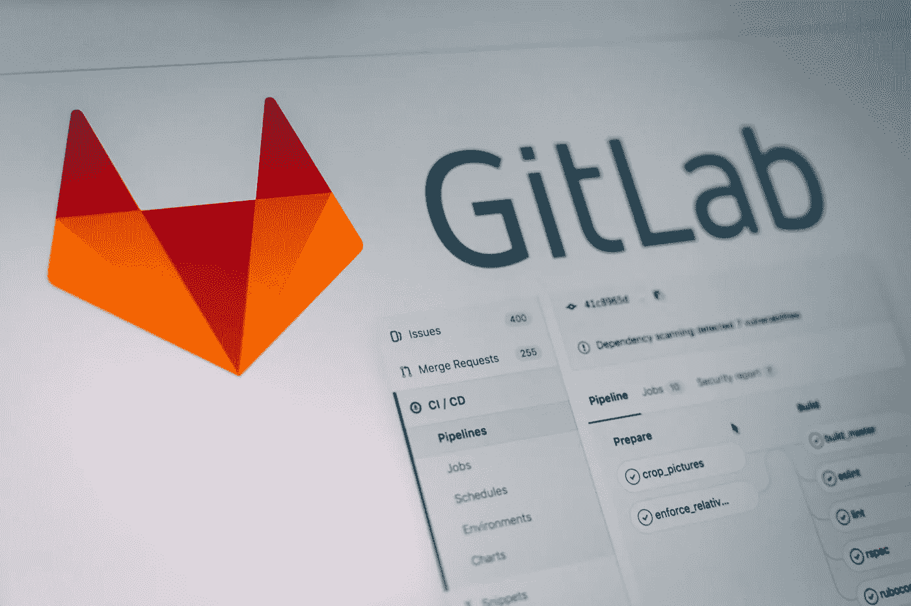
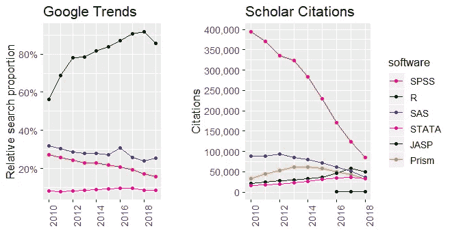

# 如何选择最好的开源软件

> 原文：<https://towardsdatascience.com/how-to-choose-the-best-open-source-software-b1cbbe4f6398?source=collection_archive---------3----------------------->

Photo by [Pankaj Patel](https://unsplash.com/photos/ZV_64LdGoao?utm_source=unsplash&utm_medium=referral&utm_content=creditCopyText) on [Unsplash](https://unsplash.com/search/photos/server?utm_source=unsplash&utm_medium=referral&utm_content=creditCopyText)

在阅读了 Ted Malaska 和 Jonathan Seidman 所著的 O'Reilly 一书“ [**架构数据解决方案**](http://shop.oreilly.com/product/0636920161417.do) 的基础”之后，我反思了我过去是如何选择**软件/工具/解决方案**的，以及我今后应该如何选择它们。

作为一名生物信息学家，你需要能够快速辨别一个出版物/工具是否真的是一个重大进步，或者只是稍微好一点。我不只是在谈论最新的单细胞 RNA-seq 技术或另一种文件格式，而是针对你遇到的每一个问题。无论是数据可视化工具、[展示工具、](https://moldach.github.io/xaringan-presentation_drake/)分布式存储系统、*等等。*

这不仅仅是关于工具有多有用，还取决于文档的质量，安装有多简单，它在开源生命周期中的位置等等。

Xkcd 很有趣，但与之竞争的标准并不有趣。不相信我？看看有多少[管道工具](https://github.com/pditommaso/awesome-pipeline)就知道了！

> 面对如此多的选择，如何选择适合自己需求的解决方案呢？

# 为什么要开源？

我过去曾使用过一些授权软件解决方案；比如 [BLAST2GO](https://www.blast2go.com/blast2go-pro) ( [plug:用 Camille Scott 的 dammit 代替！](https://github.com/moldach/Transcriptome_Assembly-Annotation))、 [Matlab](https://www.mathworks.com/products/matlab.html) 以及一款名为 [Autopano Giga](http://www.kolor.com/) (现已不存在)的图像拼接软件。我最大的挫折之一是学习这些工具只是为了以后改变角色，并且不再使用它们。作为渔业和海洋部的顾问，Matlab 的高昂成本促使我开始学习另一种高级编程语言 R. FWIW:

> “[Matlab]他们在许多情况下混淆源代码，这意味着 bug 更难被发现，也不可能在不冒被起诉的风险的情况下被 T2 编辑。此外，将 Matlab 用于科学会导致[为我们的代码](https://github.com/openjournals/joss/issues/142)付费。从定义上来说，我们正在封闭我们的计算科学。”—摘自 [**我讨厌 Matlab:一个 IDE、一种语言、一种心态如何伤害**](http://neuroplausible.com/matlab)

大多数公司避开第三方解决方案，或者将他们的产品构建为专有和开源的混合体，以保持较低的成本。例如，亚马逊网络服务(AWS)提供收费的简单存储服务(亚马逊 S3)，但它是建立在开源软件如 Apache Hadoop 之上的。我不是说*不*使用 AWS(或任何其他云提供商),因为有时你会被迫*使用*来；我实际上在 Docker 的一个项目中使用了 AWS([珊瑚物种的转录组组装](https://www.sciencedirect.com/science/article/pii/S1874778717303422))。目前，我正在处理必须在现场上锁保存的敏感信息，因此使用了替代解决方案。

大多数较新的大数据平台和成功的开源项目在经历外部孵化阶段之前，最初几年都是作为公司或大学的内部项目开始的。例如:

*   LinkedIn—“**阿帕奇卡夫卡**”
*   加州大学伯克利分校—“**阿帕奇火花**”
*   cloud era—“**黑斑羚**
*   雅虎！—“**Apache Hadoop**”
*   谷歌— " **Kubernetes"**
*   脸书——“阿帕奇蜂房”

选择由可靠的赞助商支持的开源项目是有好处的，这些赞助商拥有良好的声誉、可靠的开发人员以及赞助成功项目的记录。您可以相当自信地认为，这些项目拥有坚实的代码基础、优秀的文档、在会议上获得的会话时间，以及相当大的公众认可度(通过围绕它的博客帖子和文章)。

当考虑开源解决方案时，衡量它们在*开源生命周期中的位置也很重要。*根据马拉斯卡和塞德曼的说法，基于*石榴石炒作周期*，项目生命周期有九个(潜在)阶段；然而，我认为这里只讨论几个相关的问题:

# 你应该选择哪个周期？

Photo by [@Matthew_T_Rader](https://unsplash.com/photos/KeinUoPC6qM?utm_source=unsplash&utm_medium=referral&utm_content=creditCopyText) on [Unsplash](https://unsplash.com/search/photos/cycle?utm_source=unsplash&utm_medium=referral&utm_content=creditCopyText)

## 不要相信炒作

周期的这个阶段被称为“*治愈癌症”*阶段。这个阶段的宣传对于吸引提交者和贡献者是很重要的，但是除非你想在很大程度上提供帮助，否则你应该避开。除非你想走在最前沿(风险承受能力)，或者扮演积极的贡献者角色，否则最好等 6-12 个月再尝试任何新技术。通过让其他人先碰壁，你会遇到更少的错误，并获得更好的文档和博客帖子。

## 失信不是谎言

在"*治愈癌症"*阶段之后是*失信*阶段。此时，人们正在使用项目，并发现问题或限制。例如，一个解决方案可能无法很好地与其他现有系统集成，或者可能存在可伸缩性问题。在这个阶段，您应该以谨慎乐观的态度对待任何开源项目。

## 尽可能寻求可靠的解决方案

处于*硬化*或*企业*阶段的项目已经成为成熟技术。承诺的数量将标志着一个项目的投资水平。提交的类型讲述了一个故事，告诉作者代码的发展方向，通过表明对项目不同特性的兴趣来揭示他们想要做什么。到目前为止，最初的兴奋已经消退，对稳定性的需求超过了对新功能的需求。最初的开发团队可能正在开发其他项目，因为它已经开发了一个可靠的社区——这通常是项目成功的好迹象。

很明显，最近的活动表明这个项目是活跃的，并且得到了维护。请记住，Github 上有许多已经死亡和废弃的项目。也就是说，活动并不总是需要*非常*近！一位多产的“摇滚明星 Dev”这样说:

> 上下文切换是很昂贵的，所以如果我同时处理许多包，我永远也不会完成任何事情。相反，在任何时候，我的大多数包都处于休耕状态，不断积累新特性的问题和想法。一旦积累到一定的数量，我会花几天的时间来包装。— [*哈雷·威克姆*](https://www.quora.com/How-is-Hadley-Wickham-able-to-contribute-so-much-to-R-particularly-in-the-form-of-packages)

最终，项目进入了衰落的 T21 阶段，没有人愿意采纳或贡献一个死去的项目。

# 我能信任你吗？

Photo by [Purnomo Capunk](https://unsplash.com/photos/OLgPKR2IJ6k?utm_source=unsplash&utm_medium=referral&utm_content=creditCopyText) on [Unsplash](https://unsplash.com/search/photos/trust?utm_source=unsplash&utm_medium=referral&utm_content=creditCopyText)

我主要使用 R，所以让我花点时间谈谈项目托管在哪里。代码通常托管在 Github、 [ROpenSci](https://ropensci.github.io/dev_guide/softwarereviewintro.html) 、 [Bioconductor](http://blog.revolutionanalytics.com/2015/08/a-short-introduction-to-bioconductor.html) 或 [CRAN](https://cran.r-project.org/web/packages/submission_checklist.html) 上。全面的 R 档案网络 (CRAN) *是 R 包的主要储存库。*

> “作为 R 用户，我们被惯坏了。在 R 历史的早期，Kurt Hornik 和 Friedrich Leisch 构建了对 R 中的*包*的支持，并开始了全面的 R 存档网络(CRAN)。R 和 CRAN 有一个奇妙的运行。大约二十年后，我们看到超过 12，000 个软件包可以(通常)绝对轻松地安装，没有任何意外。没有任何其他(相关的)开源语言具有类似的严谨性和质量。”—摘自 [Dirk Eddelbuettel](http://dirk.eddelbuettel.com/blog/2018/02/28/#017_dependencies)

在 CRAN 上，几乎任何类型的包都是受欢迎的(只要符合严格的政策)，并且包每天都被测试(在多个系统上)。 [rOpenSci 是 CRAN 的完美对立面。众所周知，曲柄不透明、不一致且冷漠。它不能处理起重机自动化的数量，但在质量方面推销自己。](https://milesmcbain.xyz/ropensci-onboarding1/)

对于生物信息学领域来说，生物导体是一个包的最终归宿。只存在于 Github 上的项目应该被更加谨慎地看待，因为它们没有清单或同行评审。

# 让我们来谈谈依赖性(一个沉重的话题——没有双关语的意思)

安装依赖项太糟糕了！[你有多长时间安装了一个包却得到了一船货？](https://research.swtch.com/deps)您应该尝试并避免包含许多(变化的)包的包，因为这将禁止确定您的工作是否正确(从而确保可再现性)，因为[依赖关系很难管理风险](http://dirk.eddelbuettel.com/blog/2019/03/14/#020_dependency_badges)。

> *[*更多的依赖关系意味着更多节点之间更多的边。这最终意味着更多的破损。*](http://dirk.eddelbuettel.com/blog/2019/03/14/#020_dependency_badges)”*

*tinyverse 的支持者倾向于远离臃肿的依赖，[没有人想在地狱里度过时光！](https://medium.freecodecamp.org/why-im-not-using-your-github-repository-2dff6c7ac7cf)*

*如果您是开发人员，请记住:*

> *"[并不是所有的依赖都是相同的……一些流行的软件包[有]不稳定的 API(突破性变化的历史)和高历史错误率(复杂的历史和增加功能而不是修复东西的历史)。](http://www.win-vector.com/blog/2019/03/software-dependencies-and-risk/)*

*您还可以为您的 repo 添加一个[标记，显示您的包依赖于](https://gitlab.com/edwindj/crandeps)的依赖项的数量*

# *透明度是好的*

**

*Photo by [Aleks Dahlberg](https://unsplash.com/photos/3cWA3U8xb5w?utm_source=unsplash&utm_medium=referral&utm_content=creditCopyText) on [Unsplash](https://unsplash.com/search/photos/transparent?utm_source=unsplash&utm_medium=referral&utm_content=creditCopyText)*

*在 Github 上查看项目时，你应该寻找有许多明星、观察者、分叉、贡献者、*等的人/包。这些社区支持的可见线索表明社区关心一个人、一个项目或一项行动，并且许多其他人将从中受益。**

*请记住，提交、发布和拉动请求(PRs)的数量可能是对项目投资和承诺的信号。问题和减贫战略是否得到处理？后者实际上是一个*提供的*代码，它被忽略，而不是被接受、拒绝或评论。*

*通过遵循代码上的操作，您可以确定谁创建了项目，在不同的版本中发生了什么，并推断出项目的结构和合作者角色(谁对系统的哪些部分有专长)。链接的提交和发布传达了代码更改背后的原因。*

*你也可以通过查看[聚会、](https://www.meetup.com/)和会议的数量(以及他们的出席水平)，或者电子邮件列表、用户组、社区论坛等来衡量社区兴趣。*

*谷歌趋势也可以很好地衡量人们对项目或技术的兴趣程度。*

**

*[Using metrics to track the decline of SPSS](http://lindeloev.net/spss-is-dying/)*

# *要寻找的东西*

**

*Photo by [Arnaud Papa](https://unsplash.com/photos/9P2EwTqDEDM?utm_source=unsplash&utm_medium=referral&utm_content=creditCopyText) on [Unsplash](https://unsplash.com/search/photos/telescope?utm_source=unsplash&utm_medium=referral&utm_content=creditCopyText)*

*   *易于安装*
*   *易于运行*
*   *是否有问题和公关提出*

*所有者是否在照顾他们(修复 bug、帮助用户、添加功能)？还是被抛弃了？*

*   *[文档/插图](https://journals.plos.org/ploscompbiol/article?id=10.1371/journal.pcbi.1006561) ( [和这里的](https://academic.oup.com/bib/article/19/4/693/2907814))有多好*

*它是否列出了硬件要求(RAM 和磁盘大小)、示例命令、玩具数据、示例输出、屏幕截图/记录*

*   *[持续集成状态](https://travis-ci.org/)*
*   *有没有[牌照](https://journals.plos.org/ploscompbiol/article?id=10.1371/journal.pcbi.1002598)*
*   *它是否有一个[贡献](https://gist.github.com/PurpleBooth/b24679402957c63ec426)文档*
*   *它有测试吗*
*   *它有一个`Dockerfile`*
*   *[有徽章吗](https://www.r-bloggers.com/all-the-badges-one-can-earn-parsing-badges-of-cran-packages-readmes/)*

*要查找的其他内容，请参见此处的[和此处的](https://itnext.io/what-i-dont-like-in-your-repo-a602577a526b)和。*

# *基准标记*

*如果您是一名软件开发人员，并且正在考虑整合众多竞争技术中的一种，那么您可以使用您的用例和数据来执行内部基准测试。*

*如果您使用 R，基准可以提供不同的放大级别。对于宏观分析(当计算更密集时)，你应该使用`[rbenchmark](https://cran.r-project.org/web/packages/rbenchmark/index.html)`包。对于微观时间比较(*例如*纳秒时间)使用`[microbenchmark](https://cran.r-project.org/web/packages/microbenchmark/index.html)`包*

*有时其他联合体已经为你做了基准测试(例如[**【组装】**](http://assemblathon.org/) **)。尽管如此，人们应该意识到试图进行不公平比较的隐藏的或有动机的偏见(一种工具明显具有优势的用例)。也要理解测试人员本可以诚实地尝试一个公平的测试，但是却产生了导致无效结果的误解。因此，重要的是执行你自己的内部基准，并将其他基准保持在可重复性和验证的开放标准上。***

# *最后的话*

*最终选择一个软件解决方案归结于你的项目的需求(时间表，预算，等等)，你有多愿意走在前沿(风险承受能力)，以及有能力的团队成员基于他们的技能水平(内部技能集)有多能够掌握这些解决方案。然后，在完全提交之前测试解决方案。这项工作可以交给*团队中的原型*角色；喜欢试验/研究新软件的人。*