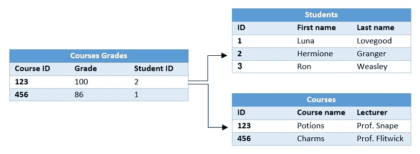
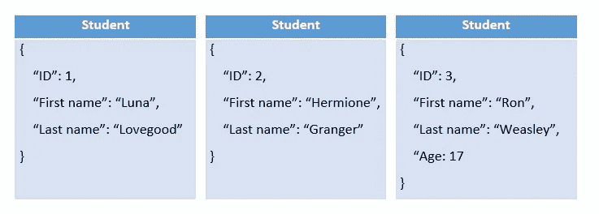
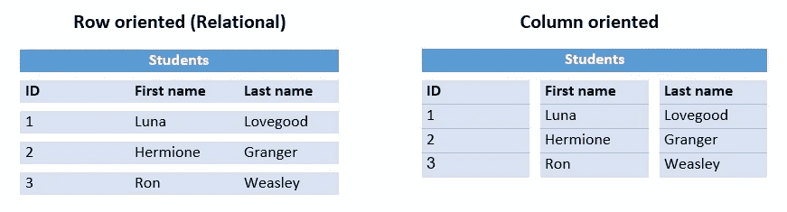
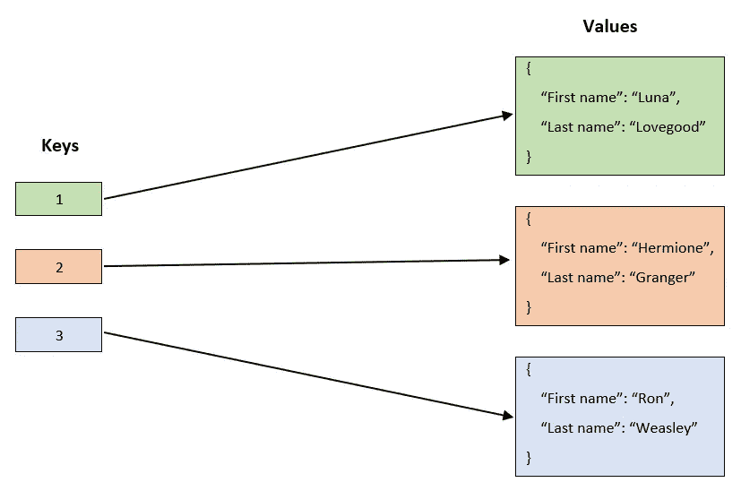
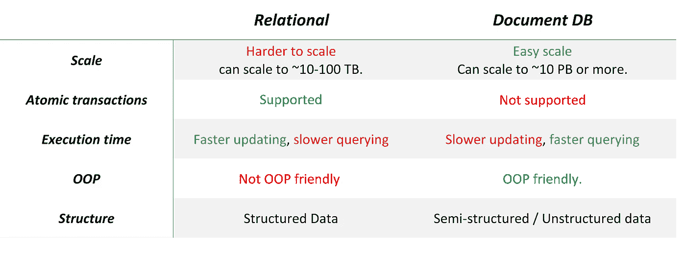

# 如何选择合适的数据库

> 原文：<https://towardsdatascience.com/how-to-choose-the-right-database-afcf95541741?source=collection_archive---------2----------------------->

## 我们将讨论可用的数据库类型以及不同项目类型的最佳实践。

无论你是一个有经验的软件工程师还是一个正在做大学项目的学生，在某些时候你都需要为你的项目选择一个数据库。

如果您以前使用过 DB，您可能会说“我会选择 X，这是我熟悉并使用过的 DB”，如果性能不是您系统的重要需求，这完全没问题。否则，当项目增长时，选择错误的数据库可能会成为一个障碍，有时很难解决。即使您正在从事一个成熟的项目，并且暂时使用了特定的数据库，了解它的限制并确定何时应该向堆栈中添加另一种类型的数据库也是很重要的(组合几个数据库是很常见的)。

了解不同数据库及其属性的另一个原因是，这是求职面试中很常见的问题！

在本帖中，我们将回顾两种主要类型的数据库:
·关系数据库(基于 SQL)。
·NoSQL 数据库。
我们将讨论不同类型的 NoSQL DBs 以及何时使用每种 DBs。
最后，讨论关系数据库与 NoSQL 数据库的优缺点。
这篇文章将不包括为每种类型的数据库提供的不同产品之间的比较(例如 MySQL 与 MS SQL Server)。

TL；DR:如果你正在寻找一个快速的小抄，跳到文章的末尾。

# 关系数据库(基于 SQL)

这个 DB 由一组相互连接的表(如 CSV 表)组成。表中的每一行代表一条记录。

为什么叫关系型？该数据库中存在哪些“关系”?
假设您有一个学生信息表和一个课程成绩表(课程、年级、学号)，每个成绩行**将**关联到一个学生记录。
参见下图，其中“学生 ID”列中的值通过“ID”列的值指向“学生”表中的行。

所有关系数据库都使用类似 SQL 的语言进行查询，这种语言是常用的，并且本身支持连接操作。
它们允许对列进行索引，以便基于这些列进行更快的查询。

由于其结构化的本质，关系数据库的模式是在插入数据之前决定的。

**常见的关系数据库:** MySQL、PostgreSQL、Oracle、MS SQL Server

# NoSQL 星展银行

在关系数据库中，一切都是按照行和列来组织的，而在 NoSQL 数据库中，没有一个通用的结构化模式来管理所有的记录。大多数 NoSQL 数据库包含 JSON 记录，不同的记录可以包含不同的字段。

这一系列数据库实际上应该被称为“非主要 SQL”——因为许多 NoSQL 数据库支持使用 SQL 的查询，但是使用 SQL 并不是它们的最佳实践。

## 有 4 种主要类型的 NoSQL 数据库:

# 1.面向文档的数据库

这个数据库的基本单位是文档。每个文档都是一个 JSON，不同文档之间的模式可以不同，并且包含不同的字段。
文档数据库允许对文档中的一些字段进行索引，以允许基于这些字段进行更快的查询(这迫使所有文档都具有该字段)。

**什么时候该用？**
数据分析——由于不同的记录彼此不相关(逻辑和结构方面)**该数据库支持并行计算。**
这使您可以轻松地对我们的数据进行大数据分析。

**常见的基于文档的数据库** : MongoDB **、** CouchDB、DocumentDB **。**

# 2.柱状 DBs

这个数据库的原子单位是表中的一列，这意味着数据是逐列存储的。这使得基于列的查询非常高效，而且由于每一列上的数据都非常相似，因此可以更好地压缩数据。

**什么时候该用？** 当您倾向于查询数据中列的子集时(不需要每次都是相同的子集！).
columnard DB 执行这种查询的速度非常快，因为它只需要读取这些特定的列(而基于行的 DB 必须读取整个数据)。

*   这在数据科学中很常见，每一列代表一个特征。作为一名数据科学家，我经常用特征的子集来训练我的模型，并倾向于检查特征和分数之间的关系(相关性、方差、显著性)。
*   这在日志中也很常见——我们经常在日志数据库中存储更多的字段，但是在每个查询中只使用了很少的字段。

**常用列 DB 数据库:** Cassandra。

Column vs. raw based DBs.

# 3.键值数据库

该查询只是基于键的—您需要一个键并获得它的值。
不支持跨不同记录值的查询，如“select all records where city = = New York”
该数据库中的一个有用功能是 TTL 字段(生存时间)，该字段可以针对每个记录进行不同的设置，并声明何时应从数据库中删除。

**优点—** 速度非常快。首先是因为使用了唯一的键，其次是因为大多数键值数据库将数据存储在允许快速访问的内存(RAM)中。
**缺点—** 您需要定义惟一的键，这些键是很好的标识符，并且是根据您在查询时知道的数据构建的。通常比其他种类的数据库更贵(因为在内存上运行)。

我应该什么时候使用它？
主要用于缓存，因为它非常快，不需要复杂的查询，而且 TTL 功能对缓存非常有用。
它也可以用于其他任何需要快速查询并符合键值格式的数据。

**常用键值数据库:** Redis，Memcached

# 4.图形数据库

图形数据库包含表示实体的节点和表示实体之间关系的边。

我应该什么时候使用它？
当你的数据是一个图形时，就像知识图形和社会网络。

**常用图数据库:** Neo4j，InfiniteGraph

# 关系数据库与文档数据库

现在你可能已经知道了，没有正确的答案，也没有“一个数据库可以统治所有的数据库”。
最常见的“常规”数据库是关系数据库和文档数据库，因此我们将对它们进行比较。

## 关系优势

*   它有一个简单的结构，可以匹配程序中通常拥有的大多数类型的数据。
*   它使用了 **SQL** ，这是常用的，并且天生支持 JOIN 操作。
*   允许**快速数据更新**。所有的数据库都保存在一台机器上，记录之间的关系被用作指针，这意味着您可以更新一个记录，所有相关的记录都会立即更新。
*   关系数据库也支持原子事务。
    什么是原子事务:假设我想从 Alice 转账 X 美元给 Bob。我想执行 3 个操作:将 Alice 的余额减少 X，将 Bob 的余额增加 X，并记录交易。我想把这些行为作为一个原子单位来对待——要么所有的行为都会发生，要么什么都不会发生。

## 关系—缺点

*   因为每个查询都是在一个表上完成的，所以**查询执行**的时间取决于表的大小。这是一个很大的限制，它要求我们保持表相对较小，并对数据库进行优化，以便进行伸缩。
*   在关系数据库中，扩展是通过向保存数据库的机器添加更多的计算能力来完成的，这种方法被称为'**垂直扩展'**。
    为什么是劣势？因为机器能够提供的计算能力是有限的，而且向机器添加资源可能需要一些停机时间。
*   关系型**不支持基于 OOP** 的对象，即使表示简单的列表也非常复杂。

## 文档数据库—优势

*   它允许你用不同的结构来保存物体。
*   你可以使用优秀的 JSON 来表示几乎所有的数据结构，包括基于面向对象的对象、列表和字典。
*   尽管 NoSQL 本质上是无模式化的，但它通常支持**模式** **验证**，这意味着您可以将集合模式化，模式不会像表那样简单，它将是一个具有特定字段的 JSON 模式。
*   **查询** NoSQL 非常**快**，每个记录都是独立的，因此查询时间与数据库的大小无关，**支持并行性**。
*   在 NoSQL，扩展数据库是通过添加更多的机器并在它们之间分配你的数据来完成的，这种方法被称为**‘水平扩展’**。这允许我们在需要时自动向数据库添加资源，而不会导致任何停机。

## 文档数据库—缺点

*   **更新**数据在文档数据库中是一个**缓慢**的过程，因为数据可以在机器之间划分，并且可以复制。
*   **原子事务本身不受支持**。您可以通过使用验证和恢复机制在代码中自己添加它，但是由于记录是在机器之间划分的，所以它不能是一个原子过程，并且可能会出现争用情况。

# 备忘单:

*   对于**缓存** —使用一个**键值数据库**。
*   对于**图形-** 之类的数据-使用**图形数据库**。
*   如果您倾向于查询列 /features 的**子集，请使用**列数据库。****
*   对于所有其他用例，关系数据库或文档数据库。