# 如何在高维空间中聚类

> 原文：<https://towardsdatascience.com/how-to-cluster-in-high-dimensions-4ef693bacc6?source=collection_archive---------0----------------------->

## [生命科学的数理统计和机器学习](https://towardsdatascience.com/tagged/stats-ml-life-sciences)

## 自动检测集群数量的方法

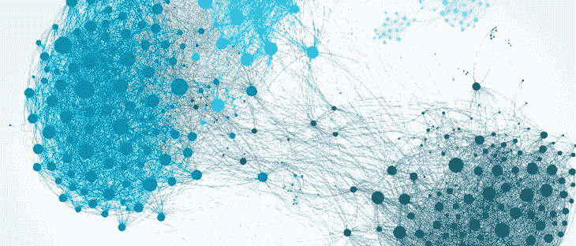

[Image source](https://www.stratio.com/blog/graph-database-clustering-solution/)

这是 [**生命科学的数理统计与机器学习**](https://towardsdatascience.com/tagged/stats-ml-life-sciences) 栏目的第三篇文章。之前，我们强调了**[**scRNAseq**](https://en.wikipedia.org/wiki/Single_cell_sequencing)是[有前途的大数据资源](/do-we-have-big-data-in-life-sciences-c6c4e9f8645c)，讨论了 **tSNE** 是 scrna seq 的中心降维技术，并学习了[如何调优 tSNE](/how-to-tune-hyperparameters-of-tsne-7c0596a18868) 的超参数。tSNE 应用于 scRNAseq 数据后的下一步是进行**聚类分析**，以检测细胞群之间的边界。**

**然而，聚类同时受到算法的**限制和 [**维数灾难**](https://en.wikipedia.org/wiki/Curse_of_dimensionality) 的影响，这经常导致 tSNE 图的视觉解释和聚类分析输出之间的矛盾。在本文中，我提出了一种**自动化的**方法，在 scRNAseq 数据分析的维度缩减和聚类之间达成**一致**。****

# **聚类分析的假象**

**对 scRNAseq 进行聚类的一个问题是，我们在 tSNE 图中看到的**与**聚类分析报告的**在聚类数量和聚类的单元分配方面存在差异。例如，我们在下图中清楚地观察到三个集群，甚至可以手动绘制集群之间的边界。然而，运行聚类算法可能会导致诸如**错误的聚类数**或**错误的单元分配给聚类**之类的假象，即当一个均匀的聚类碰巧被算法分割成多个块时。****

**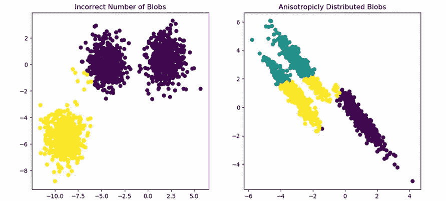**

**Results of clustering contradict our visual interpretation, [image source](https://scikit-learn.org/stable/auto_examples/cluster/plot_kmeans_assumptions.html)**

**此外，由于聚类算法缺乏鲁棒性，试图复制科学论文的结果可能会令人困惑。例如，使用来自 [Kolodziejczyk 等人的数据，细胞干细胞 2015](https://www.cell.com/cell-stem-cell/fulltext/S1934-5909(15)00418-X?_returnURL=https%3A%2F%2Flinkinghub.elsevier.com%2Fretrieve%2Fpii%2FS193459091500418X%3Fshowall%3Dtrue) 、**八个集群**在 tSNE 图中可见，然而本文中使用的聚类算法似乎只检测到**三个集群**。**

**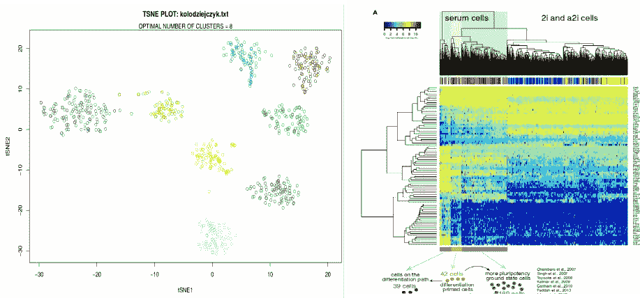**

**Contradiction between tSNE (left) and clustering (right) from [Kolodziejczyk et al., Cell Stem Cell 2015](https://www.cell.com/cell-stem-cell/fulltext/S1934-5909(15)00418-X?_returnURL=https%3A%2F%2Flinkinghub.elsevier.com%2Fretrieve%2Fpii%2FS193459091500418X%3Fshowall%3Dtrue)**

**降维和聚类之间的矛盾具有双重性。一方面，由于[维数灾难](https://en.wikipedia.org/wiki/Curse_of_dimensionality)，在高维 scRNAseq 空间中定义数据点之间的距离是出了名的困难；另一方面，聚类算法通常使用理想化的**假设，而这些假设对于现实世界的数据来说**并不成立。**

# **高维空间中的欧氏距离突变**

**高维数学是一个活跃的研究领域，我将为这个主题专门写一篇文章。高维空间中会出现很多怪异的现象。其中之一是数据点和坐标系原点之间的距离随着维数 d 的平方根增长。这可以被视为**数据点耗尽中心，并集中在 [n 维球](https://en.wikipedia.org/wiki/Volume_of_an_n-ball)的壳**中。**

**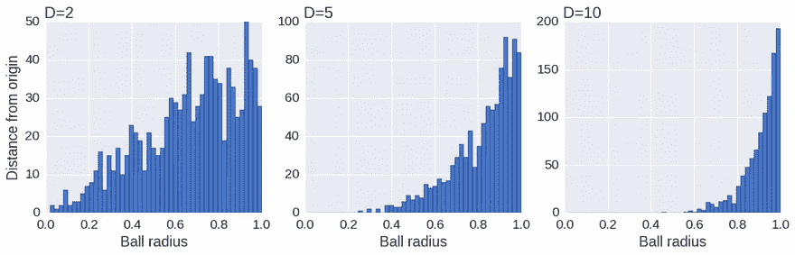**

**Data points occupy the surface and deplete the center of the n-ball in high dimensions, [image source](https://www.oreilly.com/learning/an-illustrated-introduction-to-the-t-sne-algorithm)**

**因此，数据点之间的平均距离发散并失去其意义，进而导致欧几里德距离的**发散，欧几里德距离是用于聚类的最常见距离。[曼哈顿距离](https://en.wikipedia.org/wiki/Taxicab_geometry)对于 scRNAseq 来说是更好的选择，但是它在高维度上也没有完全的帮助。****

# **聚类方法的假设和限制**

**尽管维数灾难是 scRNAseq 聚类分析的主要障碍，但由于其内部假设和限制，许多聚类算法即使在低维中也可能表现不佳**。所有的聚类方法大致可以分为四组:****

1.  **分层聚类**
2.  **基于质心的聚类**
3.  **基于图的聚类**
4.  **基于密度的聚类**

**Python 库 Scikit-learn 提供了一组聚类方法，并提供了一个出色的[概述](https://scikit-learn.org/stable/modules/clustering.html)，强调了它们的优缺点:**

**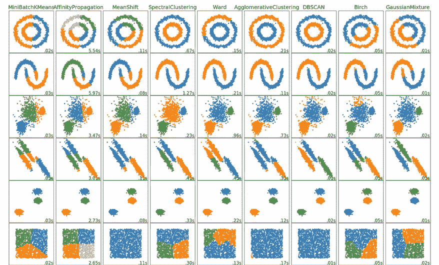**

**Clustering methods overview at [scikit-learn](https://scikit-learn.org/stable/modules/clustering.html#k-means) Python library web-page**

**分层(凝聚)聚类对数据中的 **噪声**过于**敏感。基于质心的聚类(K-means，高斯混合模型)只能处理具有球形或椭球形对称性的聚类。****

**基于图的聚类(Spectral，[SNN-克里格](https://academic.oup.com/bioinformatics/article/31/12/1974/214505)，[修拉](https://satijalab.org/seurat/))对于高维数据来说可能是最健壮的，因为它使用了图上的**距离，例如共享邻居的数量，与欧氏距离相比，这在高维数据中更有意义。****

**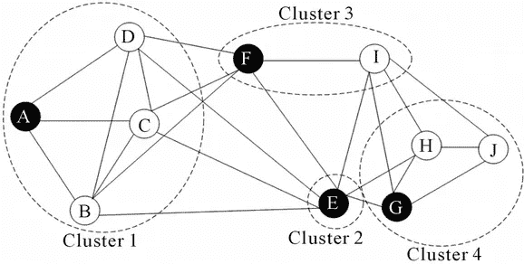**

**Graph-based clustering uses distance on a graph: A and F have 3 shared neighbors, [image source](https://file.scirp.org/Html/4-4200105_40958.htm)**

**然而，为了构建图形，这种方法**仍然** **使用欧几里德距离**。此外，集群的数量必须通过“分辨率”超参数隐式指定*先验*。改变超参数可以容易地导致更少或更多的聚类，这在某种程度上是任意的，因此非常不令人满意，因为没有明显的方法来定义用于自动调整超参数的目标函数。**

**在所有聚类算法中，只有基于密度的算法(Mean-Shift、DBSCAN、OPTICS、HDBSCAN)允许**聚类，而无需指定聚类数**。这些算法通过向高密度点移动的滑动窗口来工作，即它们发现存在许多密集区域。**

**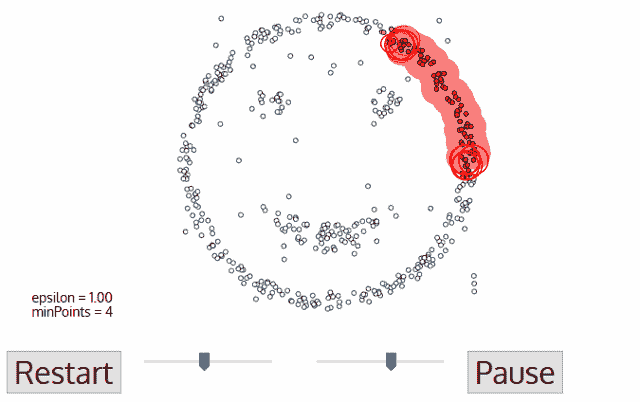**

**DBSCAN clustering finds dense regions in the data, [image source](http://primo.ai/index.php?title=Density-Based_Spatial_Clustering_of_Applications_with_Noise_(DBSCAN))**

**此外，这些算法与**聚类形状无关**，并且可以捕获任何拓扑结构的 scRNAseq 数据。下面我将展示如何通过最小化一个目标函数来调整算法的超参数。**

# **如何调整 HDBSCAN 的超参数**

**聚类是一个无监督的学习问题，这意味着我们不知道基本事实(聚类的数量)，并且不能使用交叉验证来优化算法的超参数。然而，有一种方法可以自动优化 HDBSCAN 的超参数。**

**HDBSCAN 是一种强大的基于密度的聚类算法，它 1)与聚类的形状无关，2)不需要指定聚类的数目，3)对不同密度的聚类具有鲁棒性。此外，HBDSCAN 非常有吸引力，因为它只有一个超参数 **minPts** ，这是一个聚类中的最小点数。对于大型数据集来说，它的[速度相对较快](https://github.com/scikit-learn-contrib/hdbscan/blob/master/notebooks/Comparing%20Clustering%20Algorithms.ipynb)，**检测外围小区**，并为每个小区报告一个**分配给一个集群的概率**。分配到一个簇的概率低的单元部分可以用作优化 minPts 的目标函数，min pts 进而给出最优的簇数。**

**下面，我将继续使用[癌症相关成纤维细胞(CAFs)](https://www.nature.com/articles/s41467-018-07582-3) 从[以前的帖子](/how-to-tune-hyperparameters-of-tsne-7c0596a18868)中，我们发现了最佳的困惑( **optPerp** )和主成分数( **optPC** )。现在，我们将针对不同最小规模的集群，即范围从 3 到 N_pt=50 的 **minPts** ，对 tSNE 维数缩减运行 HDBSCAN。对于每个 minPts，我们将分数函数计算为具有低置信度(概率< 5%)分配给聚类的细胞的分数，通过分数函数的最小化，我们希望减少未分配的数据点的数量。由于内部随机性，tSNE 从运行到运行是变化的，因此为了稳健性，我们重复聚类 N_iter=50 次，并对结果进行平均。绘制分数函数与 minPts 的关系揭示了某个最小聚类大小 minPts 的明确最小值。**

**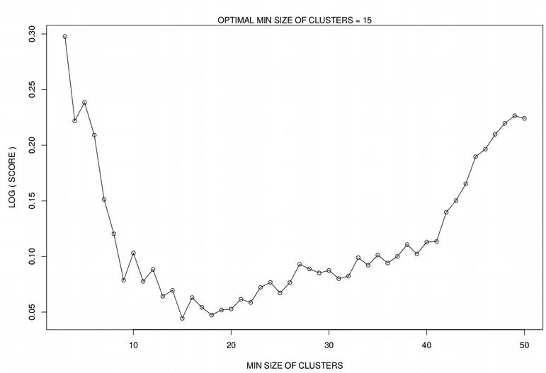**

**现在，在我们为我们的数据集 minPts 找到簇的最佳最小大小后，我们将使用该值在 tSNE 上运行最终的 HDBSCAN，这将为我们提供簇的数量、分配给簇的单元，以及不能确定分配给任何簇的单元，即**外围单元**。与其他算法相比，后者是一个**优势**，也是基于密度的聚类的一个特点，但是这里为了简单起见，我使用 [KNN](https://en.wikipedia.org/wiki/K-nearest_neighbors_algorithm) 分类器将外围单元分类到它们最近的邻居聚类中。注意，tSNE 运行 N_tsne=50 次，最小 Kullback-Leibler 散度图被选为最终图。下面，我展示了几个 scRNAseq 数据集。**

**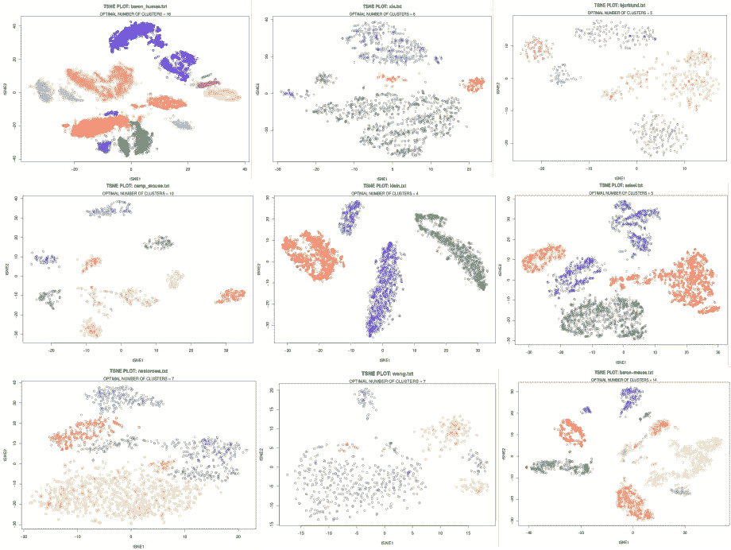**

**Results of HDBSCAN clustering on tSNE**

**将 HDBSCAN 应用于各种 scRNAseq 数据集的结果看起来并不太差，因为这些图是通过只提供原始表达式矩阵**而不手动调整聚类参数**获得的。该函数的代码只接受一个原始的 scRNAseq 表达式矩阵，对所有超参数进行自动优化，并返回一个带有 HDBSCAN 聚类结果的 tSNE 图，可以在 my [github](https://github.com/NikolayOskolkov/ClusteringHighDimensions/blob/master/easy_scrnaseq_tsne_cluster.R) 上找到。**

# **基于 tSNE、PCs 和原始表达式矩阵的聚类**

**由于维数灾难，在原始表达式矩阵上运行聚类可能非常具有挑战性。因此，几乎总是建议在进行聚类分析之前进行任何类型的维数缩减。这里我比较了 9 种流行的聚类算法在 CAFs 数据集上的性能:HDBSCAN(如上所述)， [Kmeans](https://en.wikipedia.org/wiki/K-means_clustering) ，[高斯混合模型(GMM)](https://www.rdocumentation.org/packages/mclust/versions/5.4.2/topics/Mclust) ，[层次聚类](https://www.rdocumentation.org/packages/stats/versions/3.6.1/topics/hclust)，[谱聚类](https://www.rdocumentation.org/packages/kernlab/versions/0.9-27/topics/specc)， [SC3](https://bioconductor.org/packages/release/bioc/html/SC3.html) ， [Bootstrap 一致性聚类](https://bioconductor.org/packages/release/bioc/vignettes/ConsensusClusterPlus/inst/doc/ConsensusClusterPlus.pdf)，[SNN-克里格](https://academic.oup.com/bioinformatics/article/31/12/1974/214505)和[修拉](https://satijalab.org/seurat/)。事实上，在原始 CAFs 表达矩阵上运行聚类算法带来了不令人满意的结果:**

**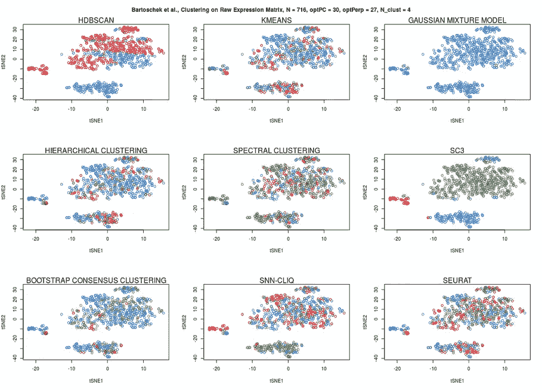**

**Clustering on raw expression matrix**

**虽然所有的算法都无法在原始表达式矩阵上进行聚类，但是只有 **SC3** 提供了令人惊讶的好的单元分配网络，它跨不同的算法和距离度量执行一致性聚类。现在，我们将把聚类算法应用于通过在[先前帖子](/how-to-tune-hyperparameters-of-tsne-7c0596a18868)中置换表达式矩阵找到的**重要 PCs** 。**

**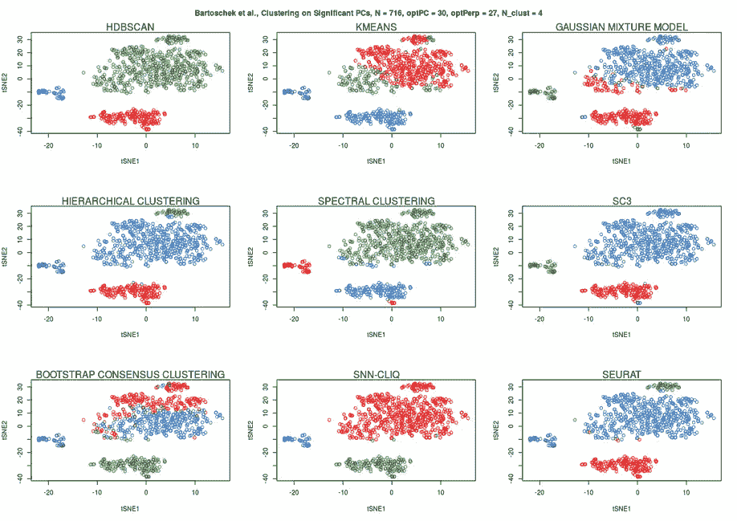**

**现在，SC3 的表现不太好，HDBSCAN 也不完美。相反，基于修拉图的社区检测和层次聚类似乎表现最好。最后，让我们将 9 种聚类算法应用于 scRNAseq 表达数据的 tSNE 降维表示:**

**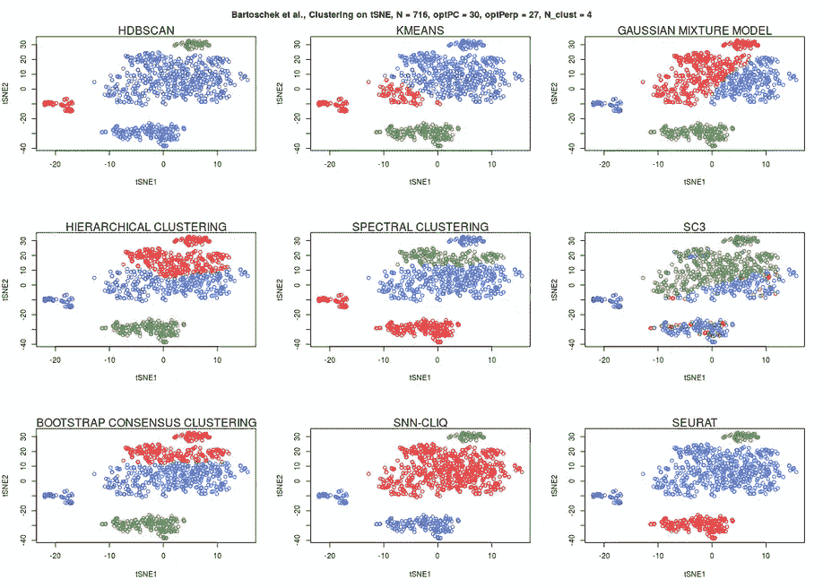**

**尽管 tSNE 图是 2D 维数缩减，但是诸如 K-means、高斯混合模型(GMM)、分级聚类、谱聚类、Bootsrap 一致性聚类和 SC3 的许多算法都不能正确地将细胞分配到它们的聚类。HDBSCAN 和基于图的聚类方法(修拉和 SNN-克里格)似乎表现最好。然而，后者需要手动调整超参数，由于上述自动优化程序，HDBSCAN 不需要这样做。**

# **摘要**

**在本文中，我们已经了解到，由于聚类方法的**维数灾难**和**限制，对**高维度** scRNAseq 数据进行聚类是具有挑战性的。令人沮丧的是，大多数聚类算法需要预先指定**的**个簇*个*，由于**交叉验证**不适用于聚类，这很难优化。然而，HDBSCAN 作为一种只有一个超参数的算法在这里很突出，该算法**很容易通过最小化未分配单元的数量来优化**。****

**在下面的评论中让我知道生命科学中的哪些分析对你来说似乎特别神秘，我会在这个专栏中尽力解答。在媒体[关注我，在 Twitter @NikolayOskolkov 关注我，在](https://medium.com/u/8570b484f56c?source=post_page-----4ef693bacc6--------------------------------) [Linkedin](http://linkedin.com/in/nikolay-oskolkov-abb321186?source=post_page---------------------------) 关注我，在我的 [github](https://github.com/NikolayOskolkov/ClusteringHighDimensions) 上查看这篇文章的代码。我计划写下一篇关于**如何标准化你的数据，你可以在传统统计学打破的单一空间中结束**，敬请关注。**