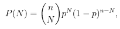

# 如何用 Python 编写公平抛硬币的代码

> 原文：<https://towardsdatascience.com/how-to-code-a-fair-coin-flip-in-python-d54312f33da9?source=collection_archive---------7----------------------->


要掌握任何东西，你需要从头开始，理解基础。对于 python 来说，编写一个公平的抛硬币程序是一种通行的权利。这似乎是一个简单的项目，但它可以用许多不同的方式来完成。你甚至可以洞察你的编码习惯。能够评论你的代码是一个关键的程序员技能，但那是另一篇文章。让我们来看看你点击了什么，用 python 编写了一个公平的抛硬币程序。

# 创建蓝图

在我们开始敲敲打打，创建一个程序让计算机做一个平凡的任务，如抛硬币，让我们飞到 10，000 英尺，并得到我们的方向。程序员有惊人的创造自由(取决于你的(微观)经理，如果你在那条船上，我同情你❤)，你可能开始失去对项目的主要关注。是的，即使是这样一个简单的项目，习惯也是在公众视线之内和之外形成的。你的标准只有在没人看的时候才算高。

好的。现在我们有了项目的鸟瞰图，让我们来分析它。我们知道我们将进行一次公平的掷硬币。一枚硬币由两部分组成，头和尾。由于项目描述中使用了“公平”,我们知道获得任何一方的概率都是 50%。如果描述提到有偏见或加权硬币，那么概率将被调整。

# 二项分布

我们如何模拟抛硬币？我们不能给电脑一个比特币，让它翻转。因为我们使用 python，一种数学语言，我们将使用概率。具体来说就是 [numpy 的二项分布](https://docs.scipy.org/doc/numpy-1.14.1/reference/generated/numpy.random.binomial.html)，np.random.binomial(n，p)。这是随机类中的一种方法，它接受试验次数(n)和事件发生的概率(p)。二项式分布，顾名思义，可以对两个事件的发生进行“抛硬币”。该调用返回 0 或 1 来表示这两个事件中的一个。这是它使用的等式:



p 是概率，N 是试验次数，N 是成功次数。我们现在知道，要使二项分布成立，我们需要两个变量，n 和 p。

这就引出了一个问题，我们是想看到每一次翻转并跟踪它，还是仅仅满足于积极事件发生的次数？我在船上看到一系列事件，只是为了好玩。所以我们需要一个数组来存储结果。谢天谢地，numpy 能做到这一切！

# 密码

让我们回到现实，开始编码。

首先，我们需要导入 numpy。

```
import numpy as np
```

接下来，我们将创建 n 和 p 变量。我们知道我们需要这些，因为我们将使用 np.random.binomial，这需要试验次数和概率。

```
'''Main Area'''
#probability of heads vs. tails. This can be changed.
probability = .5
#num of flips required. This can be changed.
n = 10
```

在我的代码中，我喜欢标记主要区域的位置以便于搜索，以防程序中创建了多个方法。标记任何可以安全改变而不会产生负面影响的变量也是一个很好的实践。

我们还知道，我们将需要启动一个数组来存储翻转。使用 np.arange 将创建一个包含 10 个元素的数组，用 0 到 9 的值按升序填充。

```
#initiate array
fullResults = np.arange(n)
```

在这一点上，我们可以走两条路。它要求我们创建一个函数，在 for 循环中进行翻转。由于我们关注代码的可重用性，我们将创建一个包含二项式分布的函数。如果我们决定在未来建立该程序，这将使访问变得容易。

# 抛硬币

有了这个决定，让我们创建这个方法。我们称之为硬币翻转，它需要考虑事件的概率。它将返回二项式的结果。一定要把这个放在主要区域之前。程序需要定义它才能使用。

```
def coinFlip(p):    
    #perform the binomial distribution (returns 0 or 1)    
    result = np.random.binomial(1,p) 

    #return flip to be added to numpy array    
    return result
```

如您所见，试验次数将被设置为 1。这将只返回 0 或 1，假或真。现在可以创建调用 coinFlip 的 for 循环了。

# For 循环

```
#perform desired numbered of flips at required probability set above
for i in range(0, n):    
    fullResults[i] = coinFlip(probability)    
    i+=1
```

For 循环是基本的代码结构，但是为了以防万一，让我们看看发生了什么。头中的 I 将是控制循环是否再次进行的索引。range(0，n)是我可以取的值。我们使用 n，这样我们就不会超过我们的数组大小。当程序可以进入循环时，我们创建的 coinFlip 被调用，结果被保存到数组的元素中。然后，索引 I 递增。

# 展示掷硬币的发现

我们差不多完成了。最后一步是计数和打印结果。这部分很简单。对于打印部分，我们将打印用于验证是否使用了正确的概率，以及 fullResult 数组。Numpy 有许多针对数组的不同函数。我们将使用 np.count _ 非零()来遍历数组，并计算我们给它的数字出现的次数。在这种情况下，我们将检查 1 和 0 出现的次数。

```
#print results
print("probability is set to ", probability)
print("Tails = 0, Heads = 1: ", fullResults)
#Total up heads and tails for easy user experience 
print("Head Count: ", np.count_nonzero(fullResults == 1))
print("Tail Count: ", np.count_nonzero(fullResults == 0))
```

就是这样！我们已经创建了一个程序来模拟公平的掷硬币。代码应该是这样的:

```
import numpy as npdef coinFlip(p):    
    #perform the binomial distribution (returns 0 or 1)    
    result = np.random.binomial(1,p)#return flip to be added to numpy array    
    return result'''Main Area'''
#probability of heads vs. tails. This can be changed.
probability = .5
#num of flips required. This can be changed.
n = 10#initiate array
fullResults = np.arange(n)#perform desired numbered of flips at required probability set above
for i in range(0, n):    
    fullResults[i] = coinFlip(probability)    
    i+=1#print results
print("probability is set to ", probability)
print("Tails = 0, Heads = 1: ", fullResults)
#Total up heads and tails for easy user experience 
print("Head Count: ", np.count_nonzero(fullResults == 1))
print("Tail Count: ", np.count_nonzero(fullResults == 0))
```

那很有趣！做一些简单的项目，比如抛硬币，是理解像 numpy 这样的库的好方法。Numpy 是一个强大的库，除了模拟抛硬币和创建数组之外，它还能做更多的事情。如果您有兴趣了解更多，请查看[了解 python Numpy](https://medium.com/analytics-vidhya/python-numpy-basics-4a1e851898c0)的基础知识。这篇文章将对 numpy 有一个更广泛的理解。

感谢您的阅读！

在我们重新学习之前，


原载于 https://reginaoftech.com 的