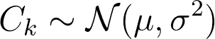
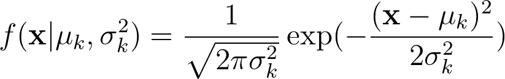
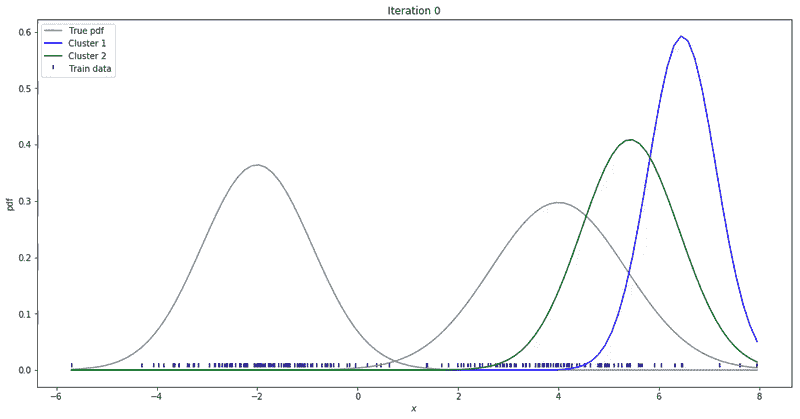

# 如何用 Python 从头开始编写高斯混合模型

> 原文：<https://towardsdatascience.com/how-to-code-gaussian-mixture-models-from-scratch-in-python-9e7975df5252?source=collection_archive---------2----------------------->

## 使用 NumPy 的 GMMs 和最大似然优化

在无监督学习算法领域，高斯混合模型或 GMM 是特殊公民。GMM 基于这样的假设，即所有数据点都来自具有未知参数的高斯分布的精细混合。它们是试图了解真实数据分布的参数化生成模型。因此，一旦我们知道了高斯参数，我们就可以从与源相同的分布中生成数据。

我们可以认为 GMMs 是 K-Means 聚类算法的软推广。像 K-Means 一样，GMM 也需要聚类的**数 K** 作为学习算法的输入。然而，这两者之间有一个关键的区别。K-Means 只能学习圆形的聚类。另一方面，GMM 可以学习任何椭圆形状的簇。

此外，K-Means 只允许一个观察值属于一个且仅属于一个聚类。**不同的是，GMM 给出了将每个例子与给定的聚类相关联的概率**。

> 换句话说，GMM 允许一个观测值属于多个聚类——具有一定程度的不确定性。

对于每个观察，GMM 学习该例子属于每个聚类 k 的概率

一般来说，GMM 试图将每个聚类学习为不同的高斯分布。它假设数据是从有限的**高斯混合**高斯产生的。

假设一维数据和聚类数 K 等于 3，GMM 试图学习 9 个参数。

*   平均值的 3 个参数
*   方差的 3 个参数
*   3 个缩放参数

这里，每个聚类由一个单独的高斯分布表示(在本例中，总共 3 个)。对于每个高斯，它从数据中学习**一个均值**和**一个方差**参数。3 个缩放参数(每个高斯 1 个)仅用于密度估计。

为了学习这些参数，GMM 使用期望最大化(EM)算法来优化最大似然。在此过程中，GMM 使用贝叶斯定理计算给定观测值 **xᵢ** 属于每个聚类 k 的概率，其中 k = 1，2，…，k

让我们来看一个例子。为了简单起见，让我们考虑一个合成的一维数据。但是，正如我们将在后面看到的，该算法很容易扩展到 D > 1 的高维数据。你可以用这个 [jupyter 笔记本](https://colab.research.google.com/drive/1PChVghOtJSjWwCYVoevnLGXjnbQNvFOY)跟着做。

为了建立一个玩具数据集，我们从从不同的高斯分布中采样点开始。每一个(有自己的均值和方差)代表我们合成数据中的一个不同的聚类。为了让事情更清楚，让我们用 K 等于 2。

下面，你可以看到合成的数据。我们将使用它作为训练数据，使用 GMM(从数据中)学习这些聚类。请注意，某些值在某些时候确实会重叠。

我们可以把 GMM 看作高斯分布的加权和。聚类数 K 定义了我们想要拟合的高斯数。

正如我们所说的，集群的数量需要预先定义。为简单起见，让我们假设我们知道聚类的数量，并将 K 定义为 2。在这种情况下，GMM 将尝试学习 2 个高斯分布。对于一维数据，我们需要了解每个高斯的均值和方差参数。

在开始运行 EM 之前，我们需要给出可学习参数的初始值。我们可以猜测均值和方差的值，并将权重参数初始化为 1/k。

然后，我们可以使用 EM 算法开始最大似然优化。EM 可以简化为两个阶段:E(期望)和 M(最大化)步骤。

在 e 步骤中，我们使用估计的参数计算每个观测值 **xᵢ** 的可能性。

1-d gaussian distribution equation

对于每个聚类 k = 1，2，3，…，K，我们使用均值和方差的估计值来计算数据的概率密度(pdf)。在这一点上，这些值仅仅是随机猜测。

然后，我们可以计算给定示例 **xᵢ** 属于 **kᵗʰ** 集群的可能性。

利用贝叶斯定理，我们得到了第 k 个高斯的后验概率来解释数据。那就是观测值 **xᵢ** 由 **kᵗʰ** 高斯产生的可能性。请注意，参数**φ**充当我们的先验信念，即一个例子来自我们正在建模的一个高斯模型。由于我们没有任何额外的信息来支持一个高斯模型而不是另一个，我们开始猜测一个例子来自每个高斯模型的概率相等。然而，在每次迭代中，我们改进我们的先验直到收敛。

然后，在最大化或 M 步骤中，我们如下重新估计我们的学习参数。

Parameter update equations

这里，对于每个聚类，我们更新均值( **μₖ** )、方差( **σ₂** )和缩放参数**φₖ**。为了更新平均值，请注意，我们使用条件概率 **bₖ** 对每个观察值进行加权。

我们可以重复这些步骤，直到收敛。这可能达到参数更新小于给定容限阈值的程度。在每一次迭代中，我们更新我们的参数，使其类似于真实的数据分布。

Gaussian Mixture Models for 1D data using K equals 2

对于高维数据(D>1)，只有很少的东西会改变。现在我们估算平均值和**协方差**，而不是估算每个高斯的平均值和方差。协方差是形状为(D，D)的方阵，其中 D 表示数据的维度。下面，我展示了一个不同的例子，其中一个 2-D 数据集被用来拟合不同数量的高斯混合。

在查看 [jupyter 笔记本的二维数据。](https://colab.research.google.com/drive/1Eb-G95_dd3XJ-0hm2qDqdtqMugLkSYE8)

Gaussian Mixture Models for 2D data using K equals 2

Gaussian Mixture Models for 2D data using K equals 3

Gaussian Mixture Models for 2D data using K equals 4

请注意，上面的合成数据集是从 4 种不同的高斯分布中提取的。然而，GMM 为**两个**、**三个**和**四个**不同的集群提供了一个很好的案例。

这就是高斯混合模型。这是这篇文章的一些要点。

*   GMM 是一族生成参数无监督模型，试图使用高斯分布对数据进行聚类。
*   和 K-Mean 一样，你还是需要定义你要学习的聚类数 K。
*   与 K-Means 不同，GMM 将聚类表示为概率分布。这允许一个数据点属于多个具有一定不确定性的聚类。

**感谢阅读。**