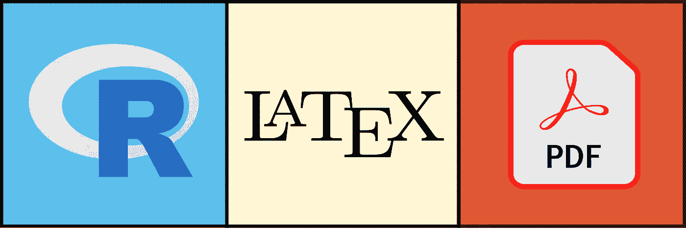
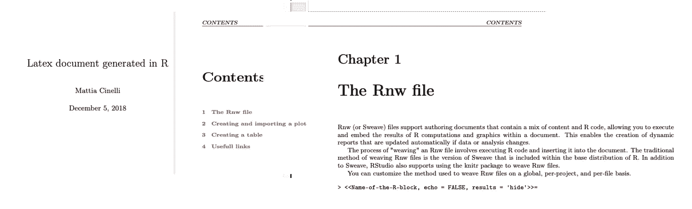
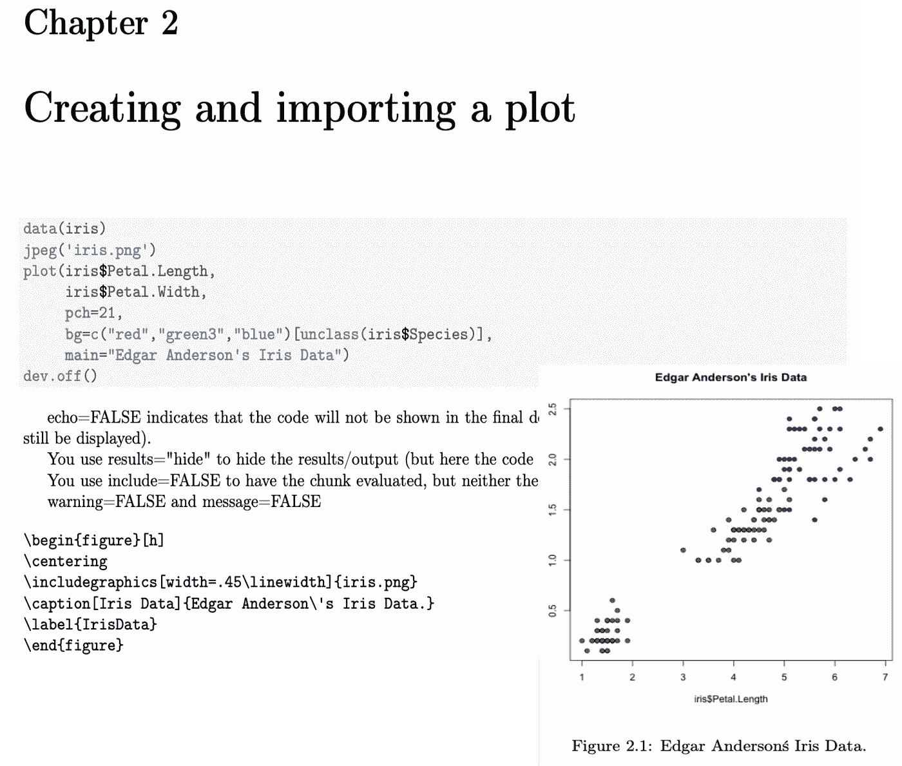
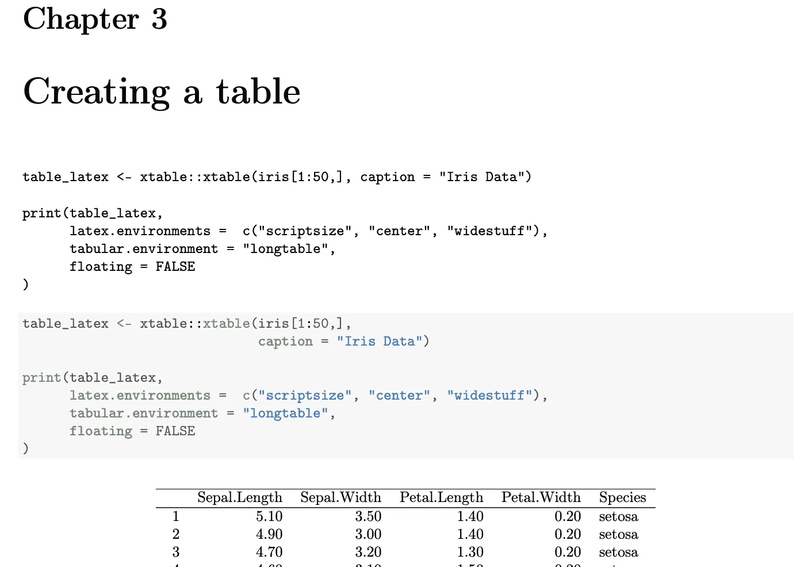

# 如何结合 LaTeX 和 R 生成报表

> 原文：<https://towardsdatascience.com/how-to-combine-latex-and-r-for-report-generation-82f23787fc43?source=collection_archive---------8----------------------->

## 如何获得最佳数据科学报告的简单教程！



(*Image by author*)

如果您必须创建一个报告，LaTeX 绝对是您的选择，LaTeX 中的所有内容看起来都更好！

在你的学术生涯中，你可能用它来写论文或做一些分析。事实上，像 texstudio 或最近的 Overleaf 这样的环境非常适合单个项目。但现在在你的日常工作中，他们真的能扩大它的规模，让乳胶仍然有用吗？

你需要的是一个自动生成报告**(也许，就在你的管道末端)的方法，它根据你的代码的发现动态地**改变它的内容**，它是**视觉上令人愉快的**(对你的老板来说)，并且它能够*快*到足以**批量产生**结果。**

**如果是这种情况，我最喜欢的解决方案是 R 包“*knitter*”，它允许我们直接从 R 代码创建 LaTeX 文档。结合了编程语言的灵活性和 LaTeX 美学。**

**在这篇文章中，我想给你一个基本的教程和一些如何成功做到这一点的技巧。
我知道知道 R 和 LaTeX 的人不多，我会尽量保持简单，但这两种编码系统及其组合无法在一篇文章中解释，我希望，如果您点击了这篇文章并一直阅读到现在，您已经对这两者有了一些基本的了解。**

**事不宜迟，让我们用 r 创建一个 LaTeX 报表。**

**其中两个是创建 R/tex 报告所需的步骤，一个创建最终 pdf 的“starter”R 脚本，以及。Rnw 文件，我们所有的代码都将存储在这里。让我们看看他们:**

# **起始脚本**

**“starter”脚本必须完成两个基本功能:**

1.  **加载并传递 Rnw 文件到**编织器**包的**编织**命令。这个过程叫做*编织*。这将执行 R 代码并生成一系列文件，其中有一个我们通常在 texstudio 中使用的. tex 文件。**
2.  **执行两次。tex 文件，以便创建最终的 PDF 报告**

**为了使整个过程更容易，我建议创建一个名为 starter 的独立文件。r 使用上面的代码，并在需要时使用下面的命令运行它:**

```
R CMD BATCH starter.R
```

**或者，您可以在命令行或任何您可能需要的地方复制/粘贴这三行代码。**

**别忘了在 r 中安装 knitr。**

```
install.packages('knitr')
```

# **Rnw 文件**

**的。Rnw(或 Sweave)文件本质上是一个. tex 文件，可以在其中插入 R 代码块。**

**文件的结构遵循 LaTeX 作品的正常结构，从 document 类的声明开始，但是在代码中的任何地方，您都可以添加 R 个代码块。**

**这些是在两个元素之间定义的:a **< < … > >** ，在其中传递 R 代码块的设置，以及一个 **@** ，定义其结束。**

**让我们看一个例子:**

**到目前为止，这是一个常见的代码，你可以在任何。tex 文件并生成图 1 中的**页面。它产生一个首页、目录和第一章:****

****

****Fig 1:** The first three pages of the final document (*Image by author*)**

**让我们继续，看看第一个 R 块，它用 R 创建了一个图，并在 LaTeX 中导入图形:**

## **其余块:**

**在小于号和大于号之间，我们可以传递执行 R 块的参数；要通过的最重要的要素是:**

*   ****Name** :这只是程序块的名字，每个程序块必须有一个唯一的名字。在调试阶段，识别名称将对您有很大帮助**
*   ****echo** :该 TRUE 或 FALSE 值将指示代码是否会显示在最终的 pdf 文档中。**
*   ****结果**可以取值‘asis’或‘hide ’,它将显示或隐藏程序块的结果(输出)**

**其他参数是布尔值“include ”,它决定该块是否必须运行,“warning”和“message”都决定调试消息是否必须在 pdf 最终版本中显示。**

**让我们看一个实际的例子，其中我们将加载 Iris 数据库并在 R 代码块中创建一个绘图:**

**在上面的代码中，我们定义了一个名为 CreatePlot 的代码块，其中我们要求在 pdf 中显示下划线 R 代码，但是结果图是隐藏的，它将使用\includegraphics{}加载。**

****

****Fig 2**: The resulting pages from the code above. (*Image by author*)**

**在图 2 的**中，我们可以看到上面代码的结果。
标题、显示为 echo 请求的 R 代码块和用于加载图形的 latex 代码。****

**我已经手动添加了图 2 中的图来显示 R 代码的结果，否则它将在不同的 pdf 页面中。**

**让我们以*表格*为例来看另一种情况:**

**通过这段代码，我们使用 iris 数据库创建了一个表格，代码和表格立即显示出来，如下图**图 3** 所示。**

****

****Fig 3:** PDF page resulting from the code. (*Image by author*)**

**我们可以看到，上面的块创建了一个表，其中包含 Iris 数据库(没有完全报告)和生成它的 R 代码。**

# **提示和有用的链接**

**就我个人的经验来说。Rnw 文件是一个非常强大的工具，但是，我建议将 R 代码保持在最低限度，并且只使用块来导入在其他地方生成的图和 CSV/表。
如果你更喜欢直接在 Rnw 中计算和生成内容，它很快就会变得混乱。**

**我希望这篇文章能为你使用 LaTeX 和 r 创建第一个报告提供具体的帮助。**

**完整的扩展代码存在于这个 [GitHub 库](https://github.com/MattiaCinelli/fromRtoLatex)中:**

**上面的脚本会产生下面的 [pdf](https://mattiacinelli.com/document/) (点击链接内的图片)。**

**关于编织者的更多信息:来源[一](https://yihui.name/knitr/)和[二](https://cran.r-project.org/web/packages/knitr/knitr.pdf)。**

***我希望这篇文章对你有所帮助***