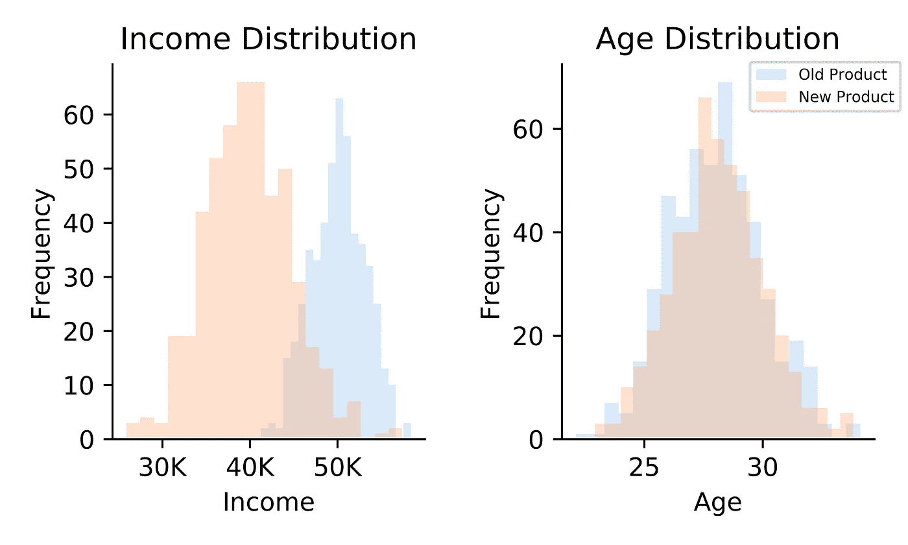

# 如何在实践中比较两种分布

> 原文：<https://towardsdatascience.com/how-to-compare-two-distributions-in-practice-8c676904a285?source=collection_archive---------2----------------------->

## [现实世界中的数据科学](https://towardsdatascience.com/data-science-in-the-real-world/home)

## 应用离散 Kolmogorov-Smirnov 检验的快速指南

Photo by [Raquel Martínez](https://unsplash.com/@fiteka?utm_source=unsplash&utm_medium=referral&utm_content=creditCopyText) on [Unsplash](https://unsplash.com/s/photos/two-apple?utm_source=unsplash&utm_medium=referral&utm_content=creditCopyText)

# 我们将在本文中讨论的内容

本文演示了如何进行离散 Kolmogorov-Smirnov(KS)测试并解释测试统计。作为一个*非参数*检验，KS 检验可以用来比较任何两个分布，不管你假设它是正态分布还是均匀分布。在实践中，KS 检验是非常有用的，因为它在区分一个样本与另一个样本或理论分布(如正态或均匀分布)时是高效和有效的。

# 首先，为什么我们需要研究我们的数据？

假设你的公司推出了一款新产品，你的首席执行官问你该新产品是否比旧产品更受欢迎。你进行了 A/B 测试，发现新产品比旧产品卖得多。兴奋地分享好消息，你告诉首席执行官新产品的成功，却看到困惑的表情。

By visual inspection, the two groups have different incomes and are of similar ages. How can we verify this?

首席执行官看起来很困惑，因为我们没有提供任何故事。毕竟，首席执行官最不愿意做的事情就是在不了解谁在购买这些产品的情况下停止旧产品并销售新产品。

为了传递一个故事，我们可以分析人口统计数据并回答以下问题:

*   这两组客户的年龄相似吗？
*   这两组顾客的收入相似吗？

回答这些问题需要比较两个样本分布，这可以通过离散 KS 检验来完成。作为这次测试的结果，我们将发现我们是否应该保留或停止旧的产品线。

# 离散 KS 测试背后的思想是什么？

KS 检验背后的思想很简单:如果两个样本属于彼此，它们的*经验累积分布函数* (ECDFs)一定非常相似。这表明我们可以通过测量 ECDFs 之间的差异来评估它们的相似性。

为了实现这一点，KS 测试找到了 ECDFs 之间的最大距离。更重要的是，测试需要评估距离是否大到足以声称两个样本不属于彼此。

在下图中，入站 ECDFs 之间的最大距离用红色箭头表示。红色箭头对应于 KS 测试统计数据，显示在红色圆圈中。

实际上，由于四舍五入的原因，离散型的 KS 检验通常是合适的。虽然时间和价格等变量在理论上是连续的，但由于四舍五入的原因，这些变量通常被视为离散变量，这给了我们一组有限的可能值。KS 测试的连续版本仍然可以使用，尽管它将导致更保守的结果(即，如果拒绝水平为 5%，实际水平将小于 5%)。

# 我们如何应用离散 KS 检验？

以下是对两个样品进行离散 KS 测试的程序:

## 第一阶段:宁滨山脉

*   找出组合样本的最小值和最大值，以定义我们的范围。
*   对范围进行分箱，使每个分箱至少有 10 个样本:
    例如，对于 500 个样本，通过选择 20 个桶，我们可以预计每个分箱有 25 个样本。

Stage 1: Binning the range

## 阶段 2:计算箱频率

*   利用阶段 1 中的仓集，使用上一节中的 ECDF 公式计算每个样本的所有仓的频率。

## 阶段 3:计算最大距离

*   对于每个箱，计算两个样本之间的频率差。
*   KS 检验统计量等于所有频段中频率的最大差值。

# 我们如何理解 KS 检验统计量？

为了找出我们是否可以拒绝零假设，我们必须使用统计技术推导出一个 KS 检验统计分布。

## 1.样本分布与理论分布

当我们将样本与理论分布进行比较时，我们可以使用*蒙特卡罗模拟*来创建测试统计分布。

例如，如果我们想要测试一个 p 值分布是否是均匀分布的(即 [p 值均匀性测试](/how-to-test-your-hypothesis-using-p-value-uniformity-test-e3a43fc9d1b6)，我们可以模拟均匀随机变量并计算 KS 测试统计量。通过重复这个过程 1000 次，我们将有 1000 个 KS 测试统计，这给了我们下面的 KS 测试统计分布。

The red line is the actual test statistic and the green line is the test statistic for 1000 random normal variables.

通过插入实际样本的 KS 检验统计量(即红线)，我们可以看到实际的 KS 检验统计量包含在分布中。这意味着没有强有力的证据反对 p 值样本遵循均匀分布的零假设。

此外，绿线代表使用 1000 个正态随机变量模拟的 KS 测试统计数据，位于分布之外。这表明了均匀分布和正态分布之间的不同。

## 2.样本分布与另一个样本分布

在我们前面的年龄和收入分布的例子中，我们将一个样本分布与另一个样本分布进行比较，而不是与理论分布进行比较。在这种情况下，我们需要应用重采样技术，如置换测试或自举，以获得 KS 测试统计分布。

在这一节中，我们将进行一个*排列测试*，它包括组合两个样本，以随机创建两个样本的新集合。对于每个新集合，我们将计算 KS 检验统计量，并将所有这些统计量组合起来，以生成 KS 检验统计量分布。

The red vertical line is the KS test statistic value of the two original samples.

不出所料，实际收益样本的 KS 检验统计量远离分布。这表明我们可以拒绝收入样本相同(即 p 值为零)的零假设。相反，实际年龄样本的 KS 检验统计量位于其 KS 检验统计量分布内。因此，我们不能拒绝零假设，即年龄样本是相同的。

# 我们学到了什么

由于我们的发现，我们可以得出结论，新老产品可能针对相似的年龄组，但不同的收入组。这告诉我们，我们不应该停止旧产品，必须在两种产品之间找到最佳平衡。

除了 KS 检验外，还有卡方检验和 Anderson-Darling (AD)检验等替代方法，可在[2]中找到。与将所有重点放在具有最大差异的箱上的 KS 测试相比，这些备选方案在所有箱之间分配权重。卡方检验根据箱的预期频率分配权重，而 AD 检验则更加强调尾部。

我想鼓励读者应用离散 KS 检验或探索其他替代方法作为他们分析程序的一部分。这些测试不仅帮助我们从里到外理解数据，而且实现起来也很简单。这里有一个 R 包[可用](https://cran.r-project.org/web/packages/dgof/dgof.pdf)。玩得开心，好好享受吧！

***来源***

[1]埃尔莫尔，K. L. (2005 年)。根据集合预报评估等级直方图的卡方检验的替代方法。*天气与预报*， *20* (5)，789–795。doi:10.1175/884.1

[2]m .斯蒂尔和 j .蔡斯林(2006 年)。拟合优度检验离散拟合优度检验统计量对一个均匀空值和一组备选分布的功效。