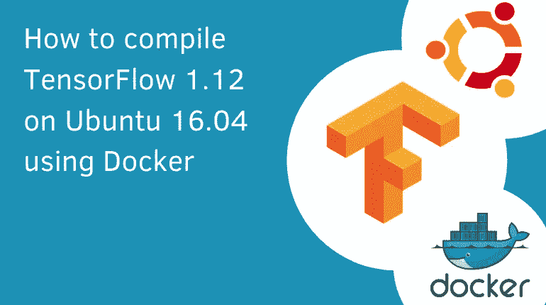

# 如何使用 Docker 在 Ubuntu 16.04 上编译 TensorFlow 1.12

> 原文：<https://towardsdatascience.com/how-to-compile-tensorflow-1-12-on-ubuntu-16-04-using-docker-6ca2d60d7567?source=collection_archive---------17----------------------->

## 本教程将帮助您在 Ubuntu 16.04 上使用 Docker 和 nvidia-docker 的 GPU 设置 TensorFlow 1.12。



TensorFlow 是最受欢迎的深度学习库之一。它由谷歌创建，并于 2015 年作为一个开源项目发布。TensorFlow 用于研究和生产环境。安装 TensorFlow 可能很麻烦。难度因环境限制而异，如果你是一名只想构建神经网络的数据科学家，难度会更大。

在 GPU 上使用 TensorFlow 时—设置需要几个步骤。在下面的教程中，我们将回顾设置 TensorFlow 所需的过程。

# 要求:

*   NVIDIA GPU 机器
*   Docker 和 Nvidia-Docker 已安装。(阅读我们博客中的“[如何安装 docker 和 nvidia-docker”)](https://cnvrg.io/how-to-setup-docker-and-nvidia-docker-2-0-on-ubuntu-18-04/)
*   Ubuntu 16.04

## 步骤 1-使用 Docker 和 Nvidia-Docker 准备您的环境

[Docker](https://github.com/docker/docker) 是一个工具，旨在通过使用容器来简化应用程序的创建、部署和运行。容器到底是什么？容器允许数据科学家和开发人员用环境需要的所有部分——比如库和其他依赖项——包装环境，并将其全部打包。

要将 docker 与 GPU 配合使用，并能够在您的应用程序中使用 TensorFlow，您需要安装 Docker 和 Nvidia-Docker。如果您已经安装了这些，请转到下一步。否则，你可以按照我们之前的指南[安装 nvidia docker](https://cnvrg.io/how-to-setup-docker-and-nvidia-docker-2-0-on-ubuntu-18-04/) 。

# **先决条件:**

## 第 2 步— Dockerfile

Docker 可以通过读取 docker 文件中的指令来自动构建映像(环境)。Dockerfile 是一个文本文档，它包含用户可以在命令行上调用的所有命令来组合一个图像。

在我们的例子中，这些命令将描述 Python 3.6、CUDA 9 和 CUDNN 7.2.1 的安装—当然还有从源代码安装 TensorFlow 1.12。

对于这种环境，我们将使用以下 docker 文件-

## 步骤 3 —运行 Dockerfile

要从 docker 文件构建映像，只需运行 docker build 命令。请记住，这个构建过程可能需要几个小时才能完成。我们建议使用 [nohup 实用程序](https://www.maketecheasier.com/nohup-and-uses/),这样，如果您的终端挂起，它仍将运行。

```
$ docker build -t deeplearning -f Dockerfile
```

这将输出设置过程，并以类似于以下内容结束:

```
>> Successfully built deeplearning (= the image ID)
```

您的图像已经可以使用了。要启动环境，只需输入以下命令。但是，不要忘记更换您的图像 id:

```
$ docker run --runtime=nvidia -it deeplearning /bin/bashStep 4 — Validating TensorFlow & start building!
```

**验证 TensorFlow 确实在您的 docker 文件中运行**

```
$ python
import tensorflow as tf
sess = tf.Session(config=tf.ConfigProto(log_device_placement=True))
2019-02-23 07:34:14.592926: I tensorflow/core/platform/cpu_feature_guard.cc:141] Your CPU supports 
instructions that this TensorFlow binary was not compiled to use: AVX2 FMA2019-02-23 07:34:17.452780: I 
tensorflow/stream_executor/cuda/cuda_gpu_executor.cc:964] successful NUMA
node read from SysFS had negative value (-1), but there must be at leastone NUMA node, so returning NUMA node zero
2019-02-23 07:34:17.453267: I
tensorflow/core/common_runtime/gpu/gpu_device.cc:1432] Found device 0 with 
properties: 
name: Tesla K80 major: 3 minor: 7 memoryClockRate(GHz): 0.8235pciBusID: 0000:00:1e.0
totalMemory: 11.17GiB freeMemory: 11.10GiB
2019-02-23 07:34:17.453306: I
tensorflow/core/common_runtime/gpu/gpu_device.cc:1511] Adding visible gpu
devices: 0
2019-02-23 07:34:17.772969: I
tensorflow/core/common_runtime/gpu/gpu_device.cc:982] Device interconnect
StreamExecutor with strength 1 edge matrix:
2019-02-23 07:34:17.773032: I
tensorflow/core/common_runtime/gpu/gpu_device.cc:988]      0
2019-02-23 07:34:17.773054: I
tensorflow/core/common_runtime/gpu/gpu_device.cc:1001] 0:   N
2019-02-23 07:34:17.773403: I
tensorflow/core/common_runtime/gpu/gpu_device.cc:1115] Created TensorFlow
device (/job:localhost/replica:0/task:0/device:GPU:0 with 10757 MB memory)
-> physical GPU (device: 0, name: Tesla K80, pci bus id: 0000:00:1e.0,
compute capability: 3.7)
Device mapping:
/job:localhost/replica:0/task:0/device:XLA_CPU:0 -> device: XLA_CPU device
/job:localhost/replica:0/task:0/device:XLA_GPU:0 -> device: XLA_GPU device
/job:localhost/replica:0/task:0/device:GPU:0 -> device: 0, name: Tesla K80,
pci bus id: 0000:00:1e.0, compute capability: 3.7
2019-02-23 07:34:17.774289: I
tensorflow/core/common_runtime/direct_session.cc:307] Device mapping:
/job:localhost/replica:0/task:0/device:XLA_CPU:0 -> device: XLA_CPU device
/job:localhost/replica:0/task:0/device:XLA_GPU:0 -> device: XLA_GPU device
/job:localhost/replica:0/task:0/device:GPU:0 -> device: 0, name: Tesla K80, pci bus id: 0000:0
```

恭喜你。您的新 TensorFlow 环境已经设置完毕，可以开始训练、测试和部署您的深度学习模型了！

## 结论

Tensorflow 通过提供一种大规模构建生产就绪模型的解决方案，真正颠覆了机器学习世界。但是 Tensorflow 并不总是最用户友好的。很难顺利地融入你的机器学习管道。 [cnvrg.io](https://cnvrg.io) 数据科学平台利用 Tensorflow 和其他开源工具，以便数据科学家可以专注于算法这一魔法。你可以找到更多关于如何轻松利用开源工具的教程，如 [Tensorflow](https://blog.cnvrg.io/how-to-compile-tensorflow-1-12-on-ubuntu-16-04-using-docker) 、[如何为你的机器学习工作流设置 Kubernetes](https://info.cnvrg.io/kubernetes-for-machinelearning)，以及[如何在 Kubernetes](https://info.cnvrg.io/spark-on-kubernetes) 上运行 Spark。找到简单的方法来集成这些有用的工具将使您的模型更接近生产。