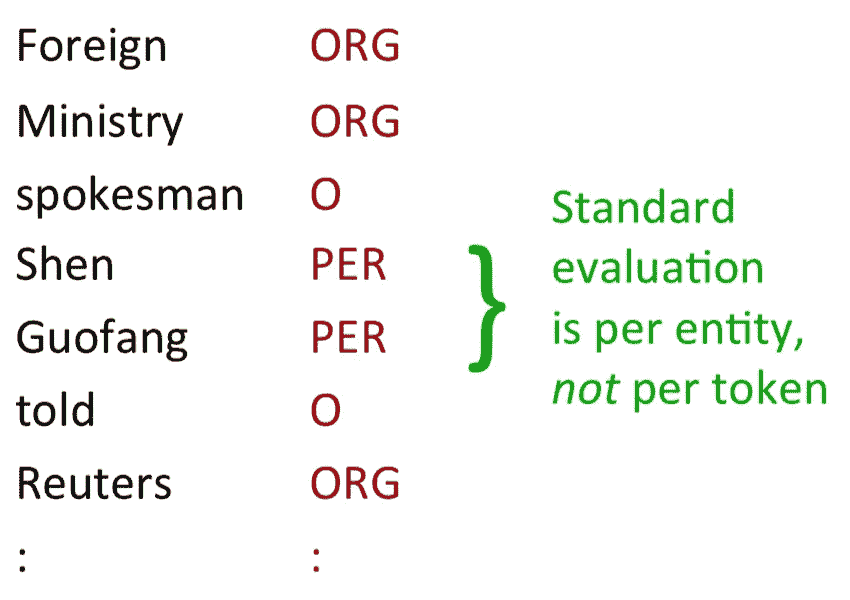

# 如何计算 Keras 中命名实体识别的 f1 值

> 原文：<https://towardsdatascience.com/how-to-compute-f1-score-for-named-entity-recognition-in-keras-6f28b31dccca?source=collection_archive---------14----------------------->

在命名实体识别中，f1 分数用于评估训练模型的性能，特别是，该评估是针对每个实体的，而不是令牌。



在许多机器学习框架中都实现了评估 f1 分数的功能。然而，它的目标是分类任务，而不是像命名实体识别那样的序列标记。

幸运的是，Keras 允许我们通过[回调类](https://keras.io/callbacks/#callback)在训练期间访问验证数据。通过扩展回调，我们可以评估命名实体识别的 f1 值。

下面是一个示例代码，用于在每个时期结束时计算和打印 f1 分数、召回率和精确度。你不必自己实现这段代码，它包含在 [seqeval](https://github.com/chakki-works/seqeval) 包中:

```
import numpy as np
from keras.callbacks import Callback
from seqeval.metrics import f1_score, classification_report

class F1Metrics(Callback):

    def __init__(self, id2label, pad_value=0, validation_data=None):
        """
        Args:
            id2label (dict): id to label mapping.
            (e.g. {1: 'B-LOC', 2: 'I-LOC'})
            pad_value (int): padding value.
        """
        super(F1Metrics, self).__init__()
        self.id2label = id2label
        self.pad_value = pad_value
        self.validation_data = validation_data
        self.is_fit = validation_data is None

    def find_pad_index(self, array):
        """Find padding index.
        Args:
            array (list): integer list.
        Returns:
            idx: padding index.
        Examples:
             >>> array = [1, 2, 0]
             >>> self.find_pad_index(array)
             2
        """
        try:
            return list(array).index(self.pad_value)
        except ValueError:
            return len(array)

    def get_length(self, y):
        """Get true length of y.
        Args:
            y (list): padded list.
        Returns:
            lens: true length of y.
        Examples:
            >>> y = [[1, 0, 0], [1, 1, 0], [1, 1, 1]]
            >>> self.get_length(y)
            [1, 2, 3]
        """
        lens = [self.find_pad_index(row) for row in y]
        return lens

    def convert_idx_to_name(self, y, lens):
        """Convert label index to name.
        Args:
            y (list): label index list.
            lens (list): true length of y.
        Returns:
            y: label name list.
        Examples:
            >>> # assumes that id2label = {1: 'B-LOC', 2: 'I-LOC'}
            >>> y = [[1, 0, 0], [1, 2, 0], [1, 1, 1]]
            >>> lens = [1, 2, 3]
            >>> self.convert_idx_to_name(y, lens)
            [['B-LOC'], ['B-LOC', 'I-LOC'], ['B-LOC', 'B-LOC', 'B-LOC']]
        """
        y = [[self.id2label[idx] for idx in row[:l]]
             for row, l in zip(y, lens)]
        return y

    def predict(self, X, y):
        """Predict sequences.
        Args:
            X (list): input data.
            y (list): tags.
        Returns:
            y_true: true sequences.
            y_pred: predicted sequences.
        """
        y_pred = self.model.predict_on_batch(X)

        # reduce dimension.
        y_true = np.argmax(y, -1)
        y_pred = np.argmax(y_pred, -1)

        lens = self.get_length(y_true)

        y_true = self.convert_idx_to_name(y_true, lens)
        y_pred = self.convert_idx_to_name(y_pred, lens)

        return y_true, y_pred

    def score(self, y_true, y_pred):
        """Calculate f1 score.
        Args:
            y_true (list): true sequences.
            y_pred (list): predicted sequences.
        Returns:
            score: f1 score.
        """
        score = f1_score(y_true, y_pred)
        print(' - f1: {:04.2f}'.format(score * 100))
        print(classification_report(y_true, y_pred, digits=4))
        return score

    def on_epoch_end(self, epoch, logs={}):
        if self.is_fit:
            self.on_epoch_end_fit(epoch, logs)
        else:
            self.on_epoch_end_fit_generator(epoch, logs)

    def on_epoch_end_fit(self, epoch, logs={}):
        X = self.validation_data[0]
        y = self.validation_data[1]
        y_true, y_pred = self.predict(X, y)
        score = self.score(y_true, y_pred)
        logs['f1'] = score

    def on_epoch_end_fit_generator(self, epoch, logs={}):
        y_true = []
        y_pred = []
        for X, y in self.validation_data:
            y_true_batch, y_pred_batch = self.predict(X, y)
            y_true.extend(y_true_batch)
            y_pred.extend(y_pred_batch)
        score = self.score(y_true, y_pred)
        logs['f1'] = score

id2label = {1: 'B-LOC', 2: 'I-LOC'}
f1score = F1Metrics(id2label)
```

定义模型，并在拟合函数中添加回调:

```
model.fit(x_train, y_train, 
          validation_data=(x_valid, y_valid),
          epochs=1,
          batch_size=32,
          callbacks=[f1score])
```

培训期间的打印输出如下所示:

```
Epoch 1/1
541/541 [==============================] - 46s 85ms/step - loss: 9.5729
 - f1: 53.24

             precision    recall  f1-score   support

        PER     0.5754    0.4484    0.5040      1617
        ORG     0.3798    0.4395    0.4075      1661
       MISC     0.4202    0.4387    0.4293       702
        LOC     0.6886    0.7650    0.7248      1668

avg / total     0.5320    0.5381    0.5315      5648
```

格式类似于 scikit-learn 的[分类 _ 报告](https://scikit-learn.org/stable/modules/generated/sklearn.metrics.classification_report.html)功能。

就是这样。祝您愉快！

[https://github.com/chakki-works/seqeval](https://github.com/chakki-works/seqeval)