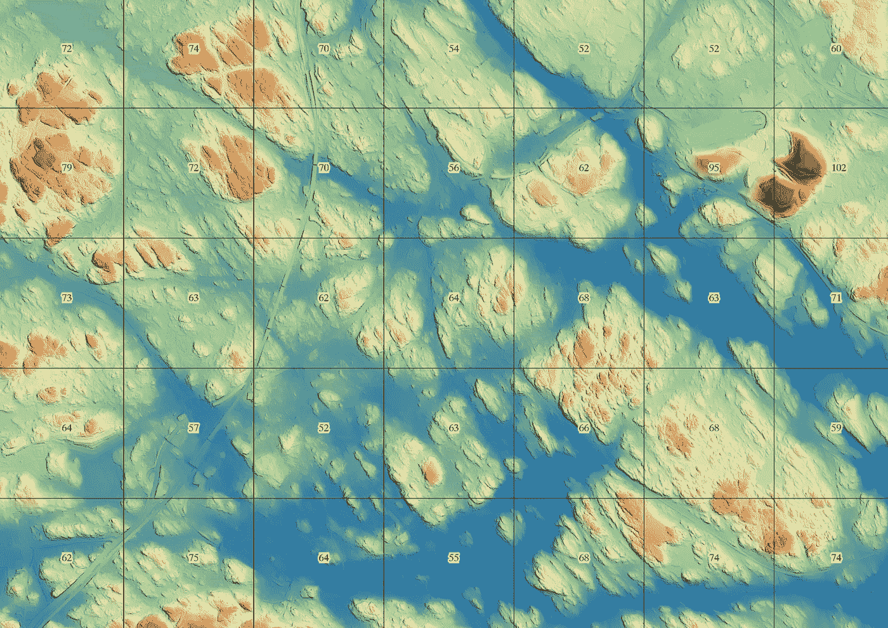
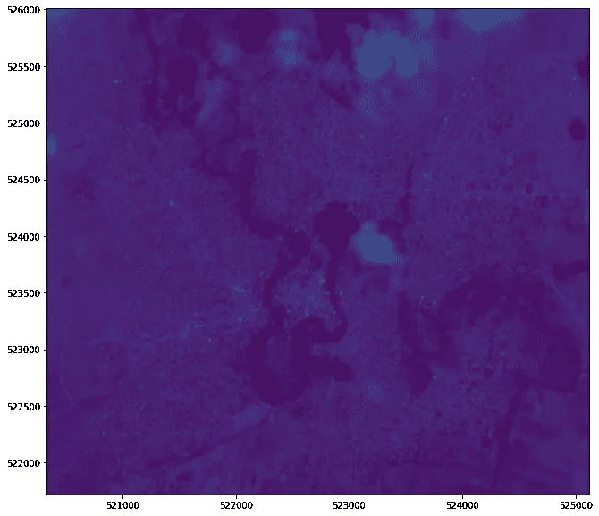
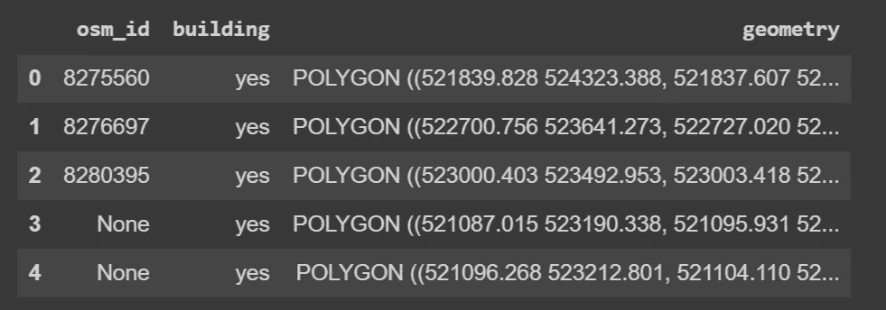
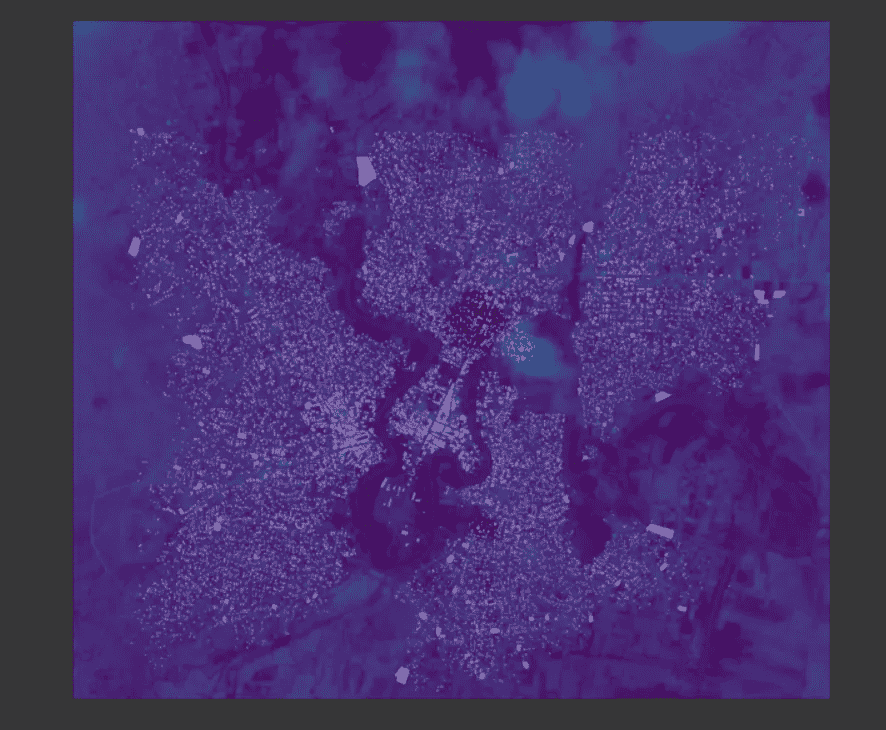
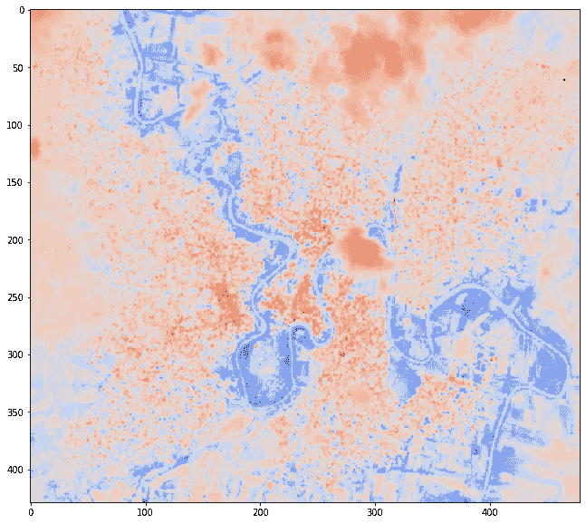
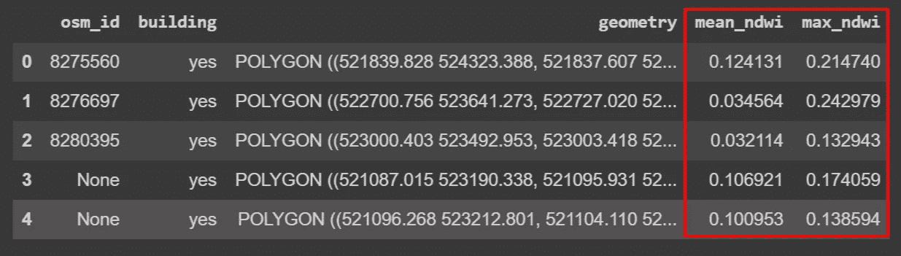

# 如何计算卫星图像统计数据并将其用于熊猫

> 原文：<https://towardsdatascience.com/how-to-compute-satellite-image-statistics-and-use-it-in-pandas-81864a489144?source=collection_archive---------15----------------------->

## 从 Sentinel 2 影像中获取分区统计数据，并与您的 Pandas 数据框合并。洪灾区 NDWI 水指数计算演练。



Example of Zonal Statistics — Elevation DEM overlayed on derived statistics (Max elevation in each grid shown)

卫星数据非常密集，使用像元来存储值。但是，在许多情况下，您只想将卫星(栅格)影像的摘要转换为表格格式 CSV 或 Pandas 数据框。

让我们举例说:您有一个数字高程模型(DEM)。DEM 图像清晰地显示了该区域的高程和地形。现在，如果您想要获取高程值并整合您拥有的表格数据(例如，建筑物)来获取每座建筑物的高程，该怎么办呢？

从光栅图像导出表格输出(汇总统计)的过程称为**区域统计。**

在本教程中，我们将学习如何从栅格数据中提取值，并以表格格式存储这些值(Pandas Dataframe)。

本教程的数据集和代码可以在 Github 中找到。让我们从探索数据开始。

## 数据探索

本教程的数据集是 2019 年 11 月 1 日在索马里贝莱德文拍摄的哨兵图像。该地区在此期间被淹没，我们计算 NDWI 来测量水压力水平。我们用的是 Google Colab 笔记本，直接从 URL 下载笔记本里的数据。

让我们导入本教程中使用的库。

```
import pandas as pd
import numpy as np
import geopandas as gpd
import rasterio as rio
from rasterio.plot import show
from rasterio.mask import mask
import matplotlib.pyplot as plt
```

使用 Rasterio，您可以读取 Sentinel 2 图像的不同波段。在这种情况下，我们读取波段 8 (NIR)、4(红色)、3(绿色)和 2(蓝色)。

```
b8 = rio.open(“/content/Data/20191101/B08–20191101.tif”)
b4 = rio.open(“/content/Data/20191101/B04–20191101.tif”)
b3 = rio.open(“/content/Data/20191101/B03–20191101.tif”)
b2 = rio.open(“/content/Data/20191101/B02–20191101.tif”)
```

让我们看看图像的宽度和高度。我只使用 b4，但你可以检查是否所有带都有相同的重量和长度。

```
b4.width,
b4.height
```

我们绘制数据，以查看和探索我们拥有的卫星图像。在这里，我只绘制波段 3。

```
fig, ax = plt.subplots(1, figsize=(12, 10))
show(b3, ax=ax)
plt.show()
```

如果你想知道如何用 Rasterio 制作 RGB 图像，我这里有一个教程你可能想看。

[](/satellite-imagery-access-and-analysis-in-python-jupyter-notebooks-387971ece84b) [## Python 和 Jupyter 笔记本中的卫星图像访问和分析

### 使用 Python 在 Jupyter 笔记本中访问、预处理、分析和可视化卫星图像。

towardsdatascience.com](/satellite-imagery-access-and-analysis-in-python-jupyter-notebooks-387971ece84b) 

该区域的哨兵 2 影像(仅波段 3)如下所示。



让我们也读一下 buildings 表，我们将使用它来存储从卫星图像得到的统计概要。请注意，您可以使用其他多边形，如区域、矩形网格，而不是本例中的建筑多边形。

我们使用 Geopandas 来读取数据。

```
buildings = gpd.read_file(“/content/Data/shapefiles/osm_buildings.shp”)
buildings = buildings[[“osm_id”,”building”, “geometry”]]
buildings.head()
```

这是表格的前五行。我们有每个建筑的几何列、osm_id 和建筑列。



我们也可以在哨兵 2 号图像的顶部绘制建筑物。

```
fig, ax = plt.subplots(figsize=(12, 10))
show(b4, ax=ax)
buildings.plot(ax=ax, color=”white”, alpha=.50)
plt.show();
```

建筑物在图像中被标记为白色并被覆盖，如下所示。图为蜿蜒的谢贝利河延伸到城市(居民区)的范围。



现在让我们计算哨兵 2 号图像的 NDWI 值。

## 计算归一化差异水指数(NDWI)

为了计算 NDWI 值，我们使用以下公式:

> (频段 3 —频段 8)/(频段 3 +频段 8)

所以，让我们用拉斯特里奥的这个公式来计算。

```
green = b3.read()
nir = b8.read()
ndwi = (nir.astype(float)-green.astype(float))/(nir+green)
```

可以使用 Rasterio 绘制 NDWI 阵列，如下所示。

```
fig, ax = plt.subplots(1, figsize=(12, 10))
show(ndwi, ax=ax, cmap=”coolwarm_r”)
plt.show()
```

NDWI 图清楚地显示了谢贝利河(蓝色)附近未标注日期的区域。洪水淹没了居民区。



我们可以将 NDWI 阵列保存为光栅图像，以便以后使用。

```
meta = b4.meta
meta.update(driver='GTiff')
meta.update(dtype=rio.float32)
with rio.open('NDWI.tif', 'w', **meta) as dst:
     dst.write(ndvi.astype(rio.float32))# Read the saved 
ndwi_raster = rio.open(“NDWI.tif”)
```

现在，我们已经计算了 NDWI 值，是时候从 NDWI 栅格影像中获取统计数据并将其合并到建筑物表中了。我们使用栅格掩膜功能从 NDWI 栅格图像中获取像元值。

以下是一个小函数，它将像元值屏蔽到数据框表中。

```
def derive_stats(geom, data=ndwi_raster, **mask_kw):
    masked, mask_transform = mask(dataset=data, 
          shapes=geom,)crop=True, all_touched=True, filled=True)
    return masked
```

我们可以像这样得到我们想要的值。假设我们对获取每栋建筑的 NDWI 平均值感兴趣。我们为“mean_ndwi”创建了一个列，并传递我们函数来应用建筑物的几何图形，还使用 Numpy 应用到 mean。

```
buildings[‘mean_ndwi’] = buildings.geometry.apply(derive_stats).apply(np.mean)
```

或者，获取每个建筑物的最大 NDWI 值。

```
buildings[‘max_ndwi’] = buildings.geometry.apply(derive_stats).apply(np.max)
```

我们的表现在有两个新列，mean_ndwi 和 max_ndwi，我们在其中存储每个建筑物的平均和最大 ndwi 值。



该数据集还包括该地区以前数据(洪水之前)中的哨兵图像。在“数据”文件夹中，有“20191002”文件夹。尝试使用这些图像计算平均和最大 NDWI 值。将此与我们为 20191101(洪水期)计算的图像得出的统计数据进行比较。

## 结论

在本教程中，我们已经了解了如何从 Sentinel 2 影像中计算 NDWI 值，并从中获取汇总统计数据。代码和 Google Colab 笔记本可以在这个 Github 存储库中找到。

[](https://github.com/shakasom/zonalstatistics) [## shaka som/区域统计

### python-Rasterio 和 Geopandas 计算分区统计数据卫星数据密集，并使用像元存储值…

github.com](https://github.com/shakasom/zonalstatistics) 

或者直接在这个谷歌合作实验室笔记本上

[](https://github.com/shakasom/zonalstatistics/blob/master/Zonal_Statistics_Sentinel.ipynb) [## shaka som/区域统计

### 此时您不能执行该操作。您已使用另一个标签页或窗口登录。您已在另一个选项卡中注销，或者…

github.com](https://github.com/shakasom/zonalstatistics/blob/master/Zonal_Statistics_Sentinel.ipynb)