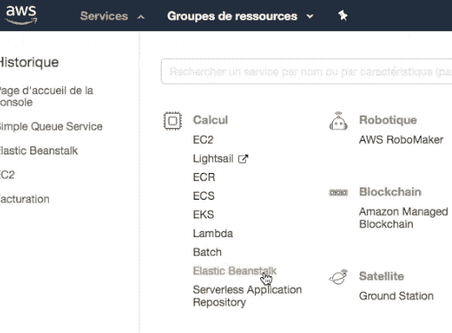

# 如何在 docker 中包含你的第一个 Django 并从 AWS 中访问它

> 原文：<https://towardsdatascience.com/how-to-contain-your-first-django-in-docker-and-access-it-from-aws-fdb0081bdf1d?source=collection_archive---------10----------------------->

今天，许多初级软件工程工作需要一系列技术，包括 Django、python、docker 和 AWS。如果你是一个初学者，并且想了解这些技术，那么你来对地方了。通过这篇文章，我将指导您操作这些工具并创建您的第一个 Python Django 应用程序，该应用程序包含在 docker 中并可从 AWS 访问。

您只需要:

Docker Hub 免费账户:[https://hub.docker.com/](https://hub.docker.com/)

AWS 免费账户[https://aws.amazon.com/account/](https://aws.amazon.com/account/)

MAC 或 Windows 笔记本电脑。

Pycharm 框架[https://www.jetbrains.com/pycharm/download/](https://www.jetbrains.com/pycharm/download/)

一个大脑:)

从你的宝贵时间最多一个小时。

你准备好了吗？

所以让我们开始吧…第一步是打开你的 **pycharm** 并创建一个新项目。

接下来，您必须在 **pycharm** 中安装 Django 库:

```
pip install django
```

然后，只需通过下面的命令启动您的项目(我们将项目命名为 **DjangoDocker** ，但是您可以命名为其他名称)。

```
django-admin startproject DjangoDocker
```


这将创建项目目录和里面的几个文件，我们稍后将详细检查它们。


之后，您需要使用下面的命令在 Django 项目中创建第一个应用程序:

```
python manage.py startapp myApp
```


这将在您的主项目目录中创建一个新目录，它将包含以下文件:


您可能会注意到，我们可以在同一个 Django 项目中创建多个应用程序，这在我们想要创建一个后端 API 并在多个项目中使用它的情况下非常有用。

现在让我们试着在我们的第一个应用程序中填充代码，看看我们如何从云中 dockerize 和访问它！！

在接下来的步骤中，我们将填充获得“Salam World”Django 应用程序所需的最低编码。

首先，打开 **myApp** 目录下的文件“views.py ”,并填入以下代码:

```
from django.shortcuts import render

# Create your views here.
from django.http import HttpResponse
def index(request):
    return HttpResponse(**" Django on Docker on AWS "**)
```

然后，您应该向 Django 表明该文件将成为您的索引，为此，只需将以下代码放入 myApp => **urls.py**

并且只需在 **urls.py** (根文件夹)填充根 URL 路径即可。

```
from django.contrib import admin
from django.urls import include, path
path(‘<appname>/’, include(‘<appname>.urls’)),
```

之后，您可以启动数据库并检查您的应用程序是否正常工作:

```
## initiate the database
python manage.py migrate## check it works
python manage.py runserver
```

只要启动下面的网址，你应该会看到类似的结果:


将代码推送到 docker image 之前的一个中间步骤是将它放在 GITHUB 中，以跟踪对每次迭代所做的各种更改。这也将允许您实施您的 DevOps CI/CD 管道，以便直接将更改和“**自动**”推送到 AWS，而无需重复所有这些步骤。

```
## initiate GIT
# Go to directory and tape:
git init
## Create and fill .gitignore to untrack files
git status #( to check )
git add — all .
git commit -m “My first commit”## push to GitHIB
## Connect to Github (login/password)
## create a new repo
git remote add origin [https://github.com/](https://github.com/)<login>/<repo>.git
git push -u origin master
```

现在，我们将看到如何将代码包含在 docker 映像中，并将其推送到 docker hub。

要创建 docker 映像，只需在 **Django** 根目录中创建以下 3 个文件:

**docker file
docker-compose . yml
requirements . txt**

```
— — — — — Dockerfile
# We Use an official Python runtime as a parent image
FROM python:3.6
# The enviroment variable ensures that the python output is set straight
# to the terminal with out buffering it first
ENV PYTHONUNBUFFERED 1
# create root directory for our project in the container
RUN mkdir /<dir-in-container>
# Set the working directory to /music_service
WORKDIR /<dir-in-container>
# Copy the current directory contents into the container at /music_service
ADD . /<dir-in-container>/
# Install any needed packages specified in requirements.txt
RUN pip install -r requirements.txt
EXPOSE 8000
CMD exec gunicorn <Django-project_name>.wsgi:application — bind 0.0.0.0:8000 — workers 3— — — — docker-compose.yml
version: ‘3’
services:
 web:
 build: .
 command: bash -c “python manage.py makemigrations && python manage.py migrate && python manage.py runserver 0.0.0.0:8000”
 container_name: <dir-in-container>
 volumes:
 — .:/<dir-in-container>
 ports:
 — “8000:8000”

 — — — — requirements.txt
Django==2.1.5
gunicorn==19.9.0
```

之后，通过运行以下命令创建 docker 映像:

```
docker build -t <DockerLogin>/<Docker-Image_name> .
# PS: don’t forget the “.” at the end of the above command
```

其中 **DockerLogin** 是您的 docker Hub 登录名， **Docker-Image_name** 是您想要的图像名称。

要测试您的映像是否正常工作，只需启动:

```
docker run -p 8000:8000 -i -t <DockerLogin>/<Docker-Image_name>
```

您应该会在路由端口 8000 上看到您声明的 IP 0.0.0.0 的结果，如下所示:


要将图像推入 docker hub，只需启动以下命令:

```
docker push <DockerLogin>/<Docker-Image_name>
```

**PS** :检查你的本地 docker 是否在运行，如下图所示(针对 Mac 用户)。


现在，您的 Django 应用程序被推送到 Docker Hub 映像，任何人都可以从 Hub 中取出它，并在 Docker 中实例化它，以便在他的本地环境中运行它，而不用担心依赖关系，也不用使用 Django、Python 等。本地安装。

现在让我们看看如何托管您的 docker 映像并从 **AWS** 访问它。

首先，您需要创建一个 **JSON** 文件，告诉 AWS 如何找到您的 docker 映像，请参见下面的示例:

```
— — — -Dockerrun.aws.json
{
 “AWSEBDockerrunVersion”: “1”,
 “Image”: {
 “Name”: “abdel1979/<image-name>”,
 “Update”: “true”
 },
 “Ports”: [
 {
 “ContainerPort”: “8000”
 }
 ],
 “Logging”: “/var/log/nginx”
}
```

之后，只需在您的 AWS 帐户中导航至**管理控制台**:


然后交给**弹性豆茎。**



之后，通过命名创建一个新的应用程序，然后选择 web 服务器环境:


接下来，填写所需信息，**环境名**，**域名**并选择 docker 作为平台，最后上传你的 **JSON** 文件。


最后，等待几分钟来创建您的环境，一旦准备好，打开您选择的域，您将看到您的应用程序显示如下:


我们到了:)
一如既往，我希望你学到了新的东西。

萨拉姆，