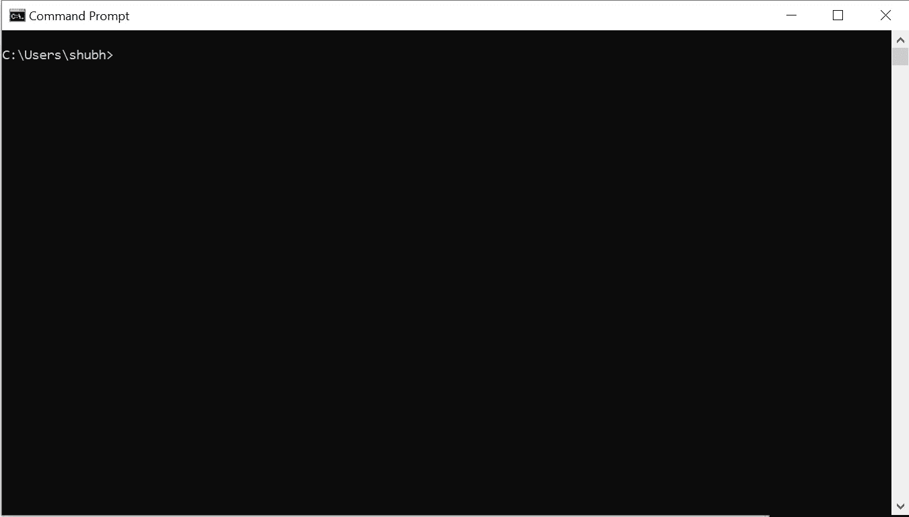
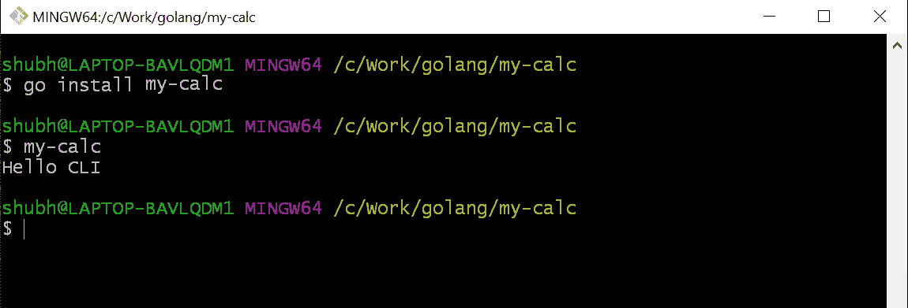
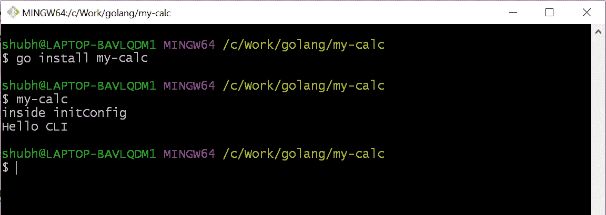
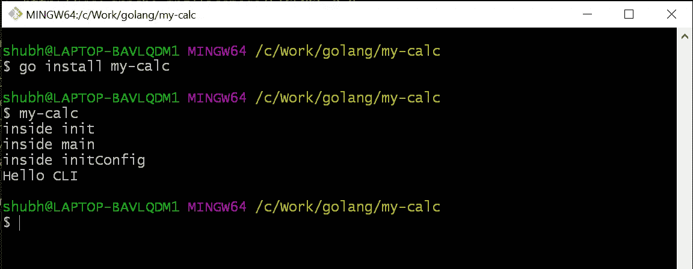
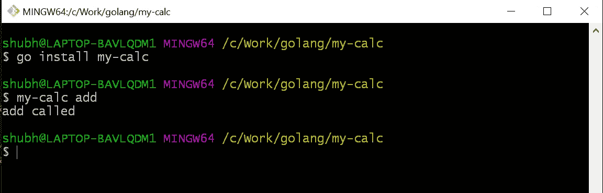
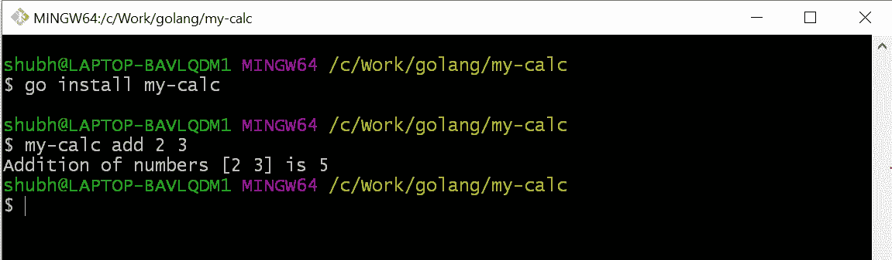
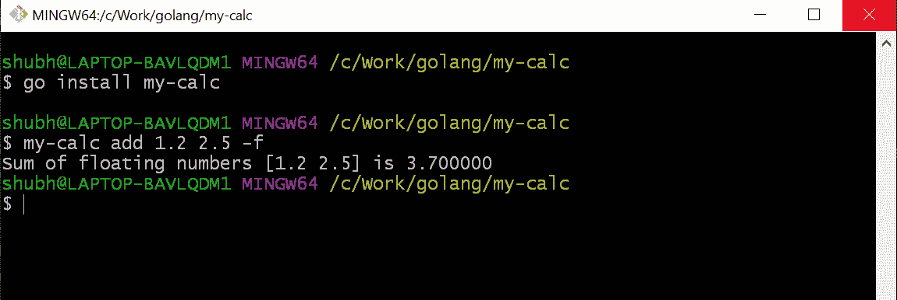
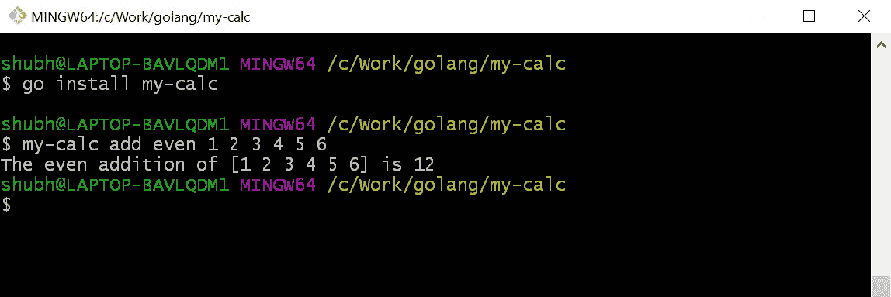
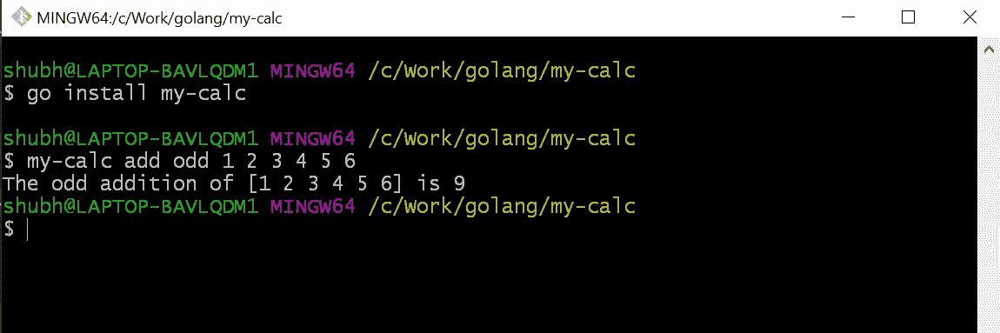

# 如何使用 cobra 在 golang 中创建 CLI

> 原文：<https://towardsdatascience.com/how-to-create-a-cli-in-golang-with-cobra-d729641c7177?source=collection_archive---------1----------------------->


Photo by Marvin Meyer on Unsplash

你有没有想过为什么在 GUI 的世界里，CLI 依然存在？当你自己造一个的时候你会更好的理解它。

当你学习 golang 的时候，你经常会碰到“golang 是构建 cli 工具的好工具”。这也让我着迷。所以，我试着动手做，找到了一些创建 cli 的教程，但大多数都不是基础的。在本教程中，我将尝试平滑学习曲线。

这是基本的 CLI 应用程序，我们将在其中介绍基本的 CLI 操作。我计划写另一篇关于高级 CLI 操作的文章，但那是以后的事了。

我们正在创建一个简单的数学 cli，它将能够完成以下两项工作:

*   数字相加
*   仅偶数或奇数的加法

我知道这些工作不符合你的期望，但相信我，在这之后，你会觉得建立一个 cli 很舒服。

# 什么是 CLI？(命令行界面)

CLI 根据软件工程的基本原理工作，接受输入，对其进行处理，然后给出输出。在 CLI 工具中，它不是一个闪烁的前端，而是从 ***黑色窗口*** 获取输入。记住，黑客帝国三部曲。

如果你使用的是 ***窗口*** 只需在`start`中键入`cmd`或`powershell`并回车，黑色窗口或蓝色窗口就是 cli。



cmd

在 Mac 或 Linux 中，它被称为`terminal`。

> [**命令行界面** ( **CLI** )](https://en.wikipedia.org/wiki/Command-line_interface) 是一种与[计算机程序](https://en.wikipedia.org/wiki/Computer_program)交互的手段，其中[用户](https://en.wikipedia.org/wiki/User_(computing))(或[客户端](https://en.wikipedia.org/wiki/Client_(computing)))以连续文本行(命令行)的形式向程序发出[命令](https://en.wikipedia.org/wiki/Command_(computing))。处理接口的程序被称为**命令行解释器**或**命令行处理器**。— [维基百科](https://en.wikipedia.org/wiki/Command-line_interface)

你可以使用很多 CLIs，比如 npm、node、go、python、docker、Kubernetes 等等。所有这些都是与软件交互的理想界面。

## 为什么他们还在使用 CLI？

*   它重量轻，速度快。
*   最少或没有依赖性。
*   最适合系统管理和基于任务的自动化等。

理论讲够了，让我们从需求开始:

*   golang 已安装(我使用的是 go1.11.5 windows/amd64)
*   眼镜蛇库(`go get -u github.com/spf13/cobra/cobra`)
*   您选择的任何代码编辑器。(我用的是 VS 代码)

> 我推荐使用 VS 代码，安装微软的`go`扩展。这将根据代码更新导入语句。如果您使用新包，它将在保存时导入该包。如果某个包已导入但未被使用，它会将该包从导入中移除。

`Cobra`图书馆简介。我们将使用 cobra cli 来使用 cobra 库。我们将使用命令行界面来构建命令行界面😃

> Cobra 既是一个用于创建强大的现代 CLI 应用程序的库，也是一个用于生成应用程序和命令文件的程序。
> 
> 很多应用最广泛的 Go 项目都是用 Cobra 搭建的，比如: [Kubernetes](http://kubernetes.io/) 、 [Hugo](http://gohugo.io/) 、 [Docker (distribution)](https://github.com/docker/distribution) 等。— [Github](https://github.com/spf13/cobra)

# Cobra 概念

Cobra 建立在命令、参数和标志的结构上。

*   **命令**代表动作
*   **Args** 是事物
*   **标志**是那些动作的修饰符

基本结构就像一个简单的句子

`APPNAME Command Args --Flags`或`APPNAME Command --Flags Args`

**为 Ex。**

*   `git clone URL -bare`
*   `go get -u URL`
*   `npm install package --save`
*   `docker run image -d`

在 **GOPATH** 的之外创建一个新的项目目录**。我已经为本教程创建了`**my-calc**`项目目录。你可以说出你的任何选择。**

在 **GOPATH** 之外创建项目简化了本地文件的导入。初始化项目中的模块。该模块将保留该项目中需要和使用的所有库和依赖项。它类似于 nodejs 中的`package.json`。要了解关于这些模块的更多信息，请阅读这篇伟大的[文章](https://medium.com/rungo/anatomy-of-modules-in-go-c8274d215c16)。

> 一个*模块*是一个相关 Go 包的集合，这些包作为一个单元一起被版本化。
> 
> 模块记录精确的依赖需求，并创建可重复的构建。— [维基](http://A module is a collection of related Go packages that are versioned together as a single unit.  Modules record precise dependency requirements and create reproducible builds.)

在您选择的命令行中打开项目目录。我用的是`**bash**` 。进入项目目录后，运行下面的命令来初始化模块。

```
**go mod init my-calc**
```

你可以注意到它在项目中创建了一个`**go.mod**`文件。

> **注意:**默认情况下，在`***$GOPATH***`内创建模块是禁用的。如果你运行上面的命令— `***go: modules disabled inside GOPATH/src by GO111MODULE=auto; see ‘go help modules’***`，你会得到这个错误。如果您仍然想在`**$GOPATH**`中创建 go 模块，那么首先将`***GO111MODULE***`环境变量设置为`***on***` **。** `**export GO111MODULE=on**`

现在，无论何时你在项目中使用任何第三方包，它都将把它保存为与他们版本的依赖关系。这样，即使库的新版本中引入了重大更改，您的项目也会按预期工作。

如果你还没有安装`**cobra**` 库，你可以使用下面的命令来安装。

```
go get -u github.com/spf13/cobra/cobra
```

使用`cobra init`命令初始化项目的 cli 脚手架。

```
cobra init --pkg-name my-calc
```

**编辑:**感谢[布兰登卡顿，](https://medium.com/u/9d89a5180aaf?source=post_page-----d729641c7177--------------------------------)对 init 命令的更新。

它将用`cobra`库初始化`my-calc`项目。您可以观察到它在项目中创建了几个文件。

```
▾ my-calc/
  ▾ cmd/
     root.go
   main.go
```

`main.go`是`cli`的切入点。在`main.go`内部，它正在调用`cmd/root.go`的`Execute`函数。

```
// main.go
package main**import "my-calc/cmd"**func main() {
  **cmd.Execute()** }
```

我们来考察一下`root.go`。

# rootCmd

Root 命令是任何 cli 的基本命令。为了前任。`go get URL` — `**go**` 是这里的根命令，`**get**` 是`**go**` 的子命令。在`**root.go**`中，用`cobra`命令初始化`**rootCmd**` 结构变量。cli 中的所有其他命令都将是`**rootCmd**`和**的子命令。**

在编辑器中打开`root.go`并在`rootCmd`中取消注释

```
**Run: func(cmd *cobra.Command, args []string) {},**
```

并将`fmt.Println("Hello CLI")`粘贴在花括号内。

```
**Run: func(cmd *cobra.Command, args []string) {fmt.Println("Hello CLI"},**
```

> ⚠️不要去掉右花括号后面的逗号。它将抛出语法错误。

打开`my-calc`项目内的终端并运行

```
go install my-calc
```

该命令将在`**$GOPATH/bin**` 文件夹中生成项目的二进制或可执行文件。

现在在终端中运行`**my-calc**` 。因为它保存在 bin 文件夹中，所以您不必为此设置环境变量。

> cli 的名称是 **rootCmd** 。 **my-calc** 是 rootCmd。

您将看到类似如下的输出。



hello-cli

# 初始化

每当一个包在 golang 中初始化时，这是第一个被调用的函数。`**cobra.OnInitialize(funcDeclarations)**` 在命令的初始化中追加用户自定义函数。 ***每当运行或调用命令时，它将首先执行命令初始化中的所有函数，然后运行 execute 方法。*** 这种初始化可以用于加载配置文件或者可以用作构造函数。这完全取决于你的用例以及你的创造力。

我想我在这里失去了你。我们用一个例子来理解这个。

在`root.go`中，命令是`**rootCmd**`。

`**cobra.OnInitialize(initConfig)**` 在`**rootCmd**`的初始化中追加了`**initConfig**`函数声明。所以，每当`**rootCmd**` 的 execute 方法(`**RUN: func**`)运行时，`**rootCmd**` 将首先运行`**initConfig**`函数。一旦所有初始化函数的执行结束，它将运行`**rootCmd**`的`**RUN: func**`执行方法。

为了可视化，在`**initConfig**` 功能中添加一条打印消息。

```
func initConfig() { **fmt.Println("inside initConfig")
...**
```

保存更改。打开`my-calc`项目内的终端。

重建二进制`**go install my-calc**` **。**

```
go install my-calc
```

运行`**my-calc**`。无论何时在 cli 中进行任何更改，都必须重新构建二进制文件。运行`**go install my-calc**`以在 cli 命令中反映它。



initConfig

可以看到`initConfig`先运行，后`Hello CLI`运行。

为了理解 cli 的完整流程，在`**main.go**`中的`**init**`函数内添加一条消息，在`**main**` 函数内添加一条消息。

```
// root.gofunc init() {
     **fmt.Println("inside init")** cobra.OnInitialize(initConfig)
...// main.gofunc main() {
     **fmt.Println("inside main")**
     cmd.Execute()
}
```

保存更改。重建二进制`**go install my-calc**`并运行`**my-calc**` **。**



cli flow

现在，您已经了解了 cli 命令流。

`init`函数中最后一个是`flags`。

标志就像命令的修饰符。你可以把它们看作是条件动作。我们将在教程的后面了解更多。

有两种类型的旗帜`**Persistent Flags**` 和`**Local Flags**` 。

*   **持久标志:**该标志可用于分配给它的命令以及该命令的所有子命令。
*   **本地标志:**该标志仅适用于其被分配到的命令。

# 初始化配置

该功能设置主目录中的配置路径，配置文件名为`.my-calc`。如果配置文件存在，它将使用该文件。

`**viper**` 库以 go 应用的配置解决方案而闻名。它读取 JSON、TOML、YAML、HCL、envfile 和 Java 属性配置文件。它不仅仅是读取配置。要了解更多信息，请点击此[链接](https://github.com/spf13/viper)。

通过该功能，我们完成了`root.go`检查。它有点长，但是理解我们正在使用的东西是有好处的。

> **注意:**现在如果你愿意，你可以从`*root.go*`和`*main.go*`中删除所有的打印语句。为了保持代码的整洁，我已经删除了所有的打印语句。

是时候在我们的 cli 中添加一些命令了。我们已经创建了一个命令`**my-calc**`作为`rootCmd`，它返回 **Hello CLI。**

# 添加数字

在项目目录中打开终端并创建一个名为`**add**`的命令。添加新命令的 cobra 命令是

`**cobra add <commandName>**`

```
**cobra add add****// output**
add created at C:\Work\golang\my-calc
```

查看`cmd`文件夹，里面添加了一个`add.go`文件。

打开`add.go`。它类似于`root.go`。

首先，一个`addCmd`结构变量被声明为`*cobra.Command`类型。

`*cobra.Command`有`RUN`，它是一个 func，带`***cobra.Command**`的指针和一段字符串`**[]string**`。

然后在`init`函数中初始化。在`init`中，添加到`**rootCmd**`T34 中。我们可以理解为`**rootCmd**`的子命令或子命令`**addCmd**`。

```
func init() {
   **rootCmd.AddCommand(addCmd)**
```

在终端中，使用`**go install my-calc**`命令重建二进制文件，并运行`**my-calc add**` **。**



add called

`add`命令工作正常。是时候修改一下加一串数字了。

这些命令只接受一部分字符串作为参数。为了将数字相加，我们首先必须将`string`转换成`int`，然后返回结果。我们将使用`strconv`库将`string`转换成`int`。

导入`strconv`包。

```
import (
   "fmt"
   **"strconv"** "github.com/spf13/cobra"
)
```

在`add.go`内部，创建一个新的`**addInt**` 函数。

```
// add.go**func addInt(args []string) {** var sum int // iterate over the arguments
  // the first return value is index of args, we can omit it using _

   for _, ival := range args { // strconv is the library used for type conversion. for string
 // to int conversion Atio method is used.
      ** itemp, err := strconv.Atoi(ival)**

       if err != nil {
           fmt.Println(err)
       }
       sum = sum + itemp
    } fmt.Printf("Addition of numbers %s is %d", args, sum)
}
```

保存更改。

在`addCmd`变量中，更新`RUN`功能。删除打印信息，用`args`调用`addInt`功能。

```
// addCmd
Run: func(cmd *cobra.Command, args []string) {
  addInt(args)
},
```

使用`go install my-calc`重建二进制文件。

运行`my-calc add 2 3`。

> ⚠️Don't 忘记了争论之间的空隙。



add int

您可以传递任意多个参数。如果你记得 args 是一段字符串。但是这个功能是有限制的。它只能将整数相加，不能将小数相加。在`addInt`函数中，我们将字符串转换成`int`而不是`float32/64`。

是时候在`addCmd`中引入一只`flag`了。该标志将帮助 cli 决定是`int` 操作还是`float`操作。

在`add.go`中，在`init` func 内，创建一个 bool 类型的本地标志`**Flags().BoolP**`。其名称为`float`，简称`f`，默认值`false`和描述。默认值非常重要。意味着即使命令中没有调用标志，标志值也会是`false`。对于 bool 类型，如果调用一个标志，它将切换默认值。

```
// add.gofunc init() {
 rootCmd.AddCommand(addCmd)
 **addCmd.Flags().BoolP("float", "f", false, "Add Floating Numbers")**
}
```

在`add.go`中创建新的`addFloat`功能

```
// add.gofunc addFloat(args []string) { var sum float64 for _, fval := range args {
    // convert string to float64 
       **ftemp, err := strconv.ParseFloat(fval, 64)** if err != nil {
          fmt.Println(err)
       }
       sum = sum + ftemp
    } fmt.Printf("Sum of floating numbers %s is %f", args, sum)
}
```

该功能与`addInt`相同，只是将`**string**` 转换为`**float64**`。

在`addCmd` `RUN`函数中，会根据标志调用`addInt`或`addFloat`。如果标志`--float or -f`通过，那么它将调用`addFloat`。

```
// add.go 
// addCmdRun: func(cmd *cobra.Command, args []string) {
 **// get the flag value, its default value is false**
 **fstatus, _ := cmd.Flags().GetBool("float")** if fstatus { // if status is true, call addFloat
   ** addFloat(args)**
  } else {
    **addInt(args)**
  }
},
```

保存所有更改。使用`go install my-calc`重建二进制文件。

运行`my-calc add 1.2 2.5 -f`或`my-calc add 1.2 2.5 --float`



add float flag

你可以用旗子做很多事情。您甚至可以将值传递给标志，如一片 int、float、string 等。

操作实现的基本添加完成。

让我们通过向`addCmd`添加子命令来扩展它。

# 添加偶数

在项目目录中打开终端，创建一个新的`**even**`命令。

```
cobra add even
```

`even`命令作为`even.go`添加到`cmd`文件夹中。

在编辑器中打开`even.go`。将`init`中的`**rootCmd**`改为`**addCmd**`。

```
// even.go
func init() {
    **addCmd.AddCommand(evenCmd)** ...
}
```

`addCmd.AddCommand(evenCmd)`将添加`evenCmd`作为`addCmd`的子命令或子命令。

更新`evenCmd`结构变量的`RUN`方法。

```
// even.go
Run: func(cmd *cobra.Command, args []string) { var evenSum int
   for _, ival := range args {
     ** itemp, _ := strconv.Atoi(ival)**
      **if itemp%2 == 0 {**
         evenSum = evenSum + itemp
      }
   } fmt.Printf("The even addition of %s is %d", args, evenSum)
},
```

它将首先使用`strconv`包将`string`转换为`int`，然后只添加偶数。

保存所有更改。使用`go install my-calc`重建二进制文件。

运行`**my-calc add even 1 2 3 4 5 6**`



add even

`my-calc`是根命令，`add`是`rootCmd`的命令，`even`是`addCmd`的命令(子命令)。

# 添加奇数

这个和`evenCmd`一样。它不加偶数，反而会加奇数。

在项目目录中打开终端并创建一个新的 odd 命令。

```
cobra add odd
```

`odd`命令作为`odd.go`添加到`cmd`文件夹中。

在编辑器中打开`odd.go`。将`init`中的`**rootCmd**`改为`**addCmd**`。

```
// odd.go
func init() {
    **addCmd.AddCommand(oddCmd)** ...
}
```

`addCmd.AddCommand(oddCmd)`将添加`oddCmd`作为`addCmd`的子命令或子命令。

更新`oddCmd`结构变量的`RUN`方法。

```
// odd.goRun: func(cmd *cobra.Command, args []string) {
    var oddSum int
    for _, ival := range args {
      **itemp, _ := strconv.Atoi(ival)**
     ** if itemp%2 != 0 {**
         oddSum = oddSum + itemp
      }
    } fmt.Printf("The odd addition of %s is %d", args, oddSum)
},
```

它将首先使用`strconv`包将`string`转换为`int`，然后只添加偶数。

保存所有更改。使用`go install my-calc`重建二进制文件。

运行`**my-calc add odd 1 2 3 4 5 6**`



`my-calc`是根命令，`add`是`rootCmd`的命令，`odd`是`addCmd`的命令(子命令)。

# 恭喜🎉

恭喜你！您使用 cobra 在 golang 中创建了自己的 cli。

> 完整的代码保存在 [Github](https://github.com/schadokar/my-calc.git) 上。

cli 项目已经完成。本教程的主要目的是理解 cobra 库的基础知识。本教程涵盖了创建 cli 所需的大多数基本操作。如果需要，我会不断更新更多的基本操作。我希望我平滑了创建 cli 的学习曲线。感谢您花时间阅读教程。我希望你学到了一些东西，这是值得你花时间。

请对本教程提出宝贵的反馈意见。我会做出相应的改变。

> 如果你喜欢这个教程，你可以在我的博客上阅读我的最新教程。 *📑*