# 如何毫不费力地用 GitHub 页面免费创建一个网站(即使你不知道自己在做什么)

> 原文：<https://towardsdatascience.com/how-to-create-a-free-github-pages-website-53743d7524e1?source=collection_archive---------0----------------------->

## GitHub Pages 入门:创建和发布免费作品集、博客或网站的快速简便指南

> GitHub Pages 必须是人们不知道他们已经拥有的最酷的工具。几乎 GitHub 上的任何存储库都可以通过点击两个按钮变成一个网站。

你需要一个你的工作的在线作品集，让潜在的雇主检查，但你不知道如何制作一个网站？你想创建一个博客或商业网站，但你不知道从哪里开始？有没有可能你只是不想处理(或支付)网站托管，域名，以及其他一切？

这是给你的！

Photo by [Leonard Alcira](https://unsplash.com/@naptimedoe?utm_source=medium&utm_medium=referral) on [Unsplash](https://unsplash.com?utm_source=medium&utm_medium=referral)

## 我为什么要有网站？

很难想象谁不会从拥有一个网站中受益！你可能需要向潜在客户或雇主展示你的投资组合。您可能需要以一种可以共享的方式来组织项目。你可能想创建一个关于你正在做的事情或你去过的地方的博客。你可能需要宣传你自己或你的企业或销售产品。不管你的理由是什么，很有可能你不想花太多时间就想把一些东西放在一起。更有可能的是，你不想花很多钱。

Photo by imarksm via [Pixabay](http://pixabay.com)

网站是与世界联系的一种方式，也是一种强大的交流工具。这是分享你的工作、兴趣和激情的一种方式。这是你如何创造，建立和控制你的在线形象。另外，你越早建立你的网站，你就有越多的时间来建立你的网上形象，接触你想接触的人。它可以帮助你在众多竞争者中脱颖而出。

如果你不知道自己在做什么，这也不是一件容易的事情。

初学者有几种方法可以创建一个简单且完全免费的网站。主要的有 GitHub 和 Wordpress。

Wordpress 对于需要所有帮助的初学者来说非常棒。我爱 Wordpress！这就是我如何开始我的第一个博客！关于一个免费的 Wordpress 网站，很明显它是一个 Wordpress 网站。你有一个以 wordpress.com 结尾的地址，并且在每一页的底部有一个 Wordpress 标志。

如果你刚进入科技领域，你会发现如果你知道如何使用 GitHub，你会看起来更有吸引力。如果你现在已经在技术世界呆了一段时间，现在你很有可能已经在 GitHub 上有了一百万到一百万个仓库。

为什么不在 GitHub 上建立你的网站，并直接从你的库托管它呢？

GIF via [GIPHY](https://giphy.com/gifs/sherlock-benedict-cumberbatch-CI6hQq7NgmCqI)

现在在技术世界中，很多重要的事情都是为开源做贡献。在社区中公开分享你的作品是一件大事。GitHub 正是为此而设计的。把你的作品放在 GitHub 上，说明你参与了，也意识到了。([如果你想看的话，我把我的作品集放在 GitHub 的一个库中。它已经相当过时了，但它是一个用 Bootstrap 构建的、由 GitHub repo 托管的个人资料网站的例子。)](https://bonn0062.github.io/anne_bonner/)

当你在 GitHub 上分享你的项目时，人们可以看到你的代码，你在做什么，以及你是如何做的。GitHub 就是关于思想的交流。

现在几乎所有的技术人员都在以某种方式使用 Git 和/或 GitHub。将你的个人资料放在 GitHub 上是举起你的手并参与进来的好方法。另外，您将在您的个人资料页面上获得一个存储库和一些提交！

如果你对 Git 一无所知，你可能想看看“[Git 和 GitHub 入门:完全初学者指南](/getting-started-with-git-and-github-6fcd0f2d4ac6)”那篇文章将带您了解什么是 Git 和 GitHub 的基础知识，如“**库**”等概念。我假设你已经知道了基本知识。如果你不知道，花几分钟去熟悉他们是值得的。

## 让我们开始派对吧！

有两种方法可以开始你的网站。你可能会完全从零开始！另一方面，你可能已经有了一个网站，但是你不知道如何使用 GitHub 把它变成一个免费的网站。

我从选项 2 开始。

GIF via [GIPHY](https://giphy.com/gifs/love-rihanna-money-Qs3JEjIXwbTdS)

## 我有文件，但我不知道该怎么处理它们！

这再简单不过了。说真的！GitHub 会为您完成剩下的工作。我假设你已经有一个 GitHub 帐户，并且你知道什么是资源库，但是如果你不知道，请查看[Git 和 GitHub 入门文章](/getting-started-with-git-and-github-6fcd0f2d4ac6)。

> 简而言之，一个存储库就是你的项目将要存在的地方。这是您组织项目的地方。您将在存储库中保存文件夹、文件、图像、视频、电子表格、Jupyter 笔记本、数据集以及项目需要的任何其他东西。

如果您还没有，那么继续使用存储库初始化您的项目，或者创建一个新的存储库并上传您的文件。如果你有一个名为“index.html”的文件，GitHub 会知道你想做什么。

现在你将利用 [GitHub 页面](https://pages.github.com/)。进入你的 GitHub 库，点击**设置**

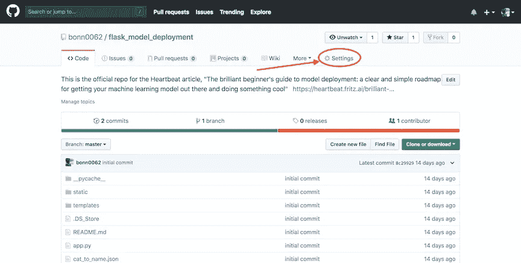

向下滚动到 **GitHub 页面**你会看到这个:

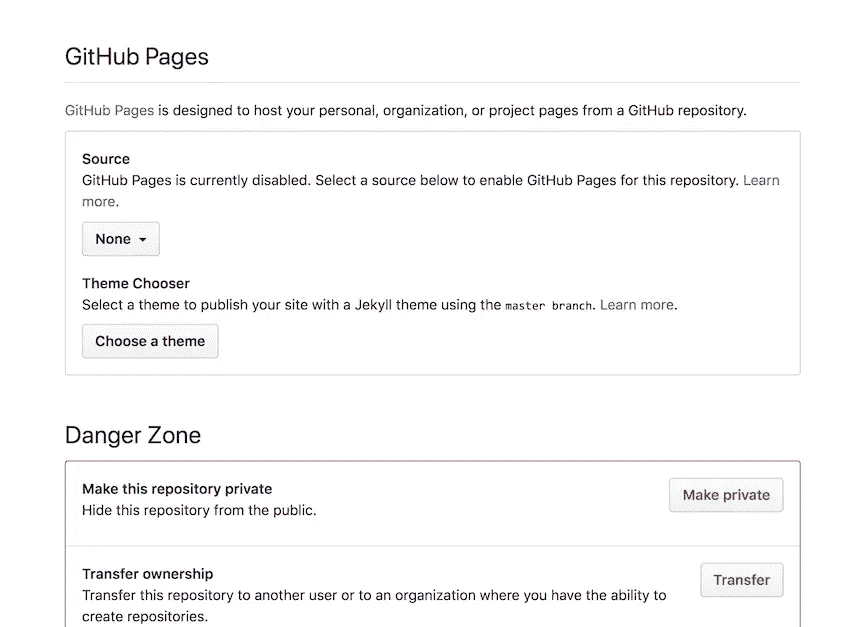

现在将“ **Source** ”下拉菜单拖放到“ **master branch** ”或“ **master branch/docs 文件夹**”事情是这样的:如果你想从你的“docs”文件夹发布，你真的需要在你的主分支中有一个“docs”文件夹，你想从那里运行你的网站！

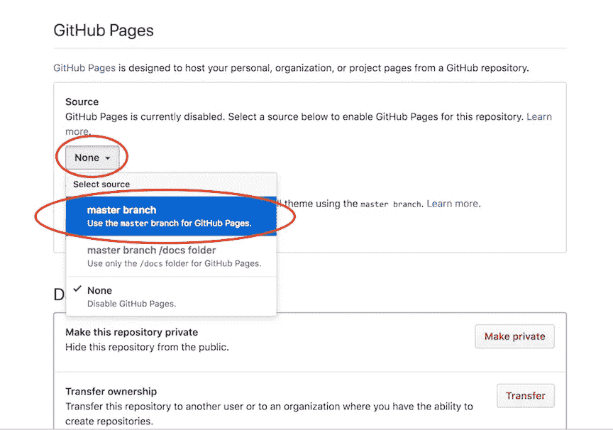

如果你是一个初学者，你可能会选择“master branch”，这意味着你想按原样发布你的库。(有几次，我需要调整一两个文件路径，这取决于我如何组织我的文件夹。)

您将看到一个通知，告知您的站点可以发布了。

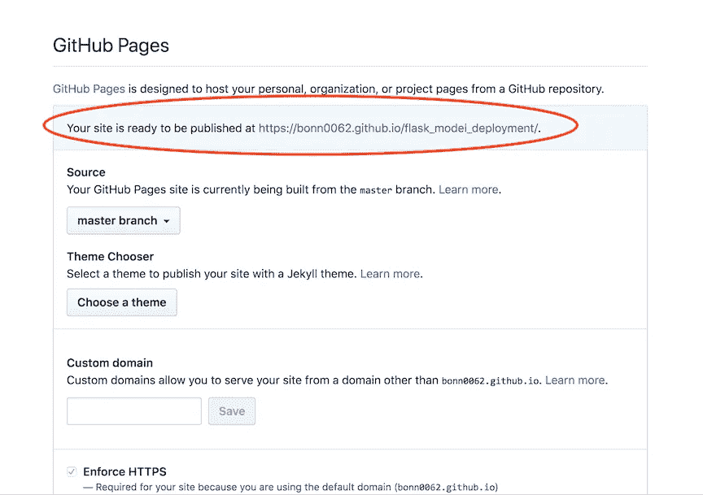

请耐心等待一两分钟，然后刷新页面或尝试链接。一旦您的站点发布，您将看到以下内容:

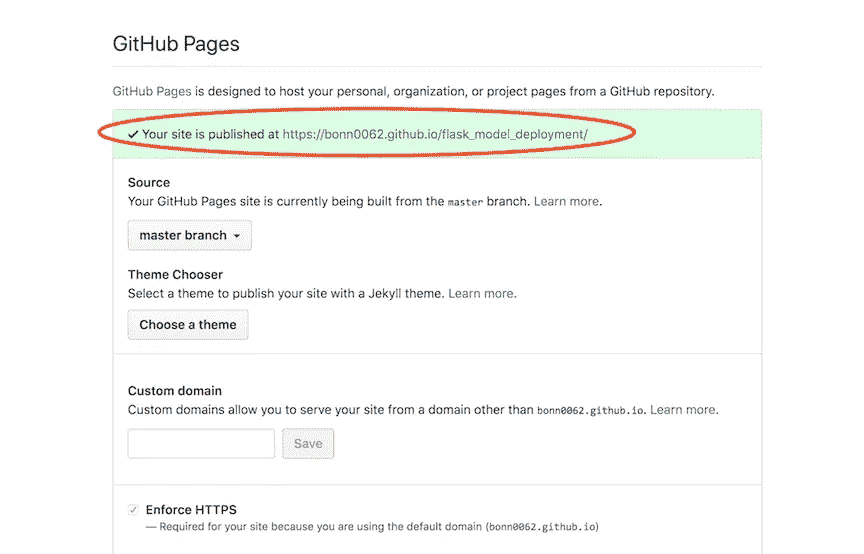

试着点击那个链接。

噗！你有一个免费网站！

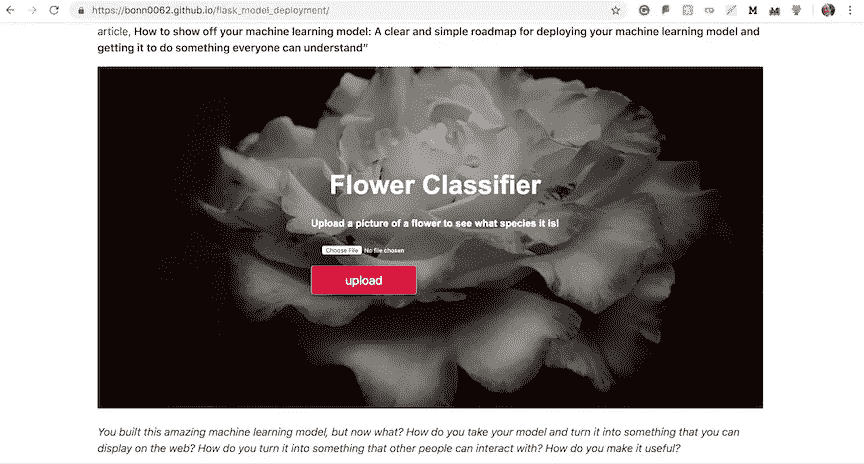

恭喜你！！！

现在是另一个选择:

## 我都不知道怎么开始！

我将在另一个时间处理像引导和基本网站设计这样的事情，并在这里关注绝对的基础。不过，我确实想让你知道，这个世界是你的！唯一限制你选择的是你实现它的动力。(嗯，可能是开车，也可能是你有多少时间……)因为这个选项是针对完全初学者的，所以我将向你展示如何在 GitHub 网站上做好每一件事。

我们将首先创建一个新的存储库。

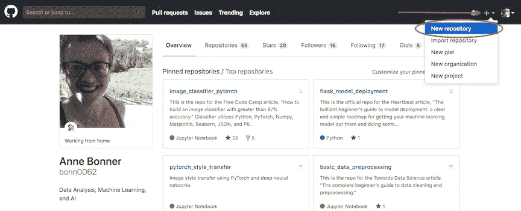

填写您的存储库名称和简短描述，选中“**使用自述文件**初始化此存储库”框，然后单击“**创建存储库**”

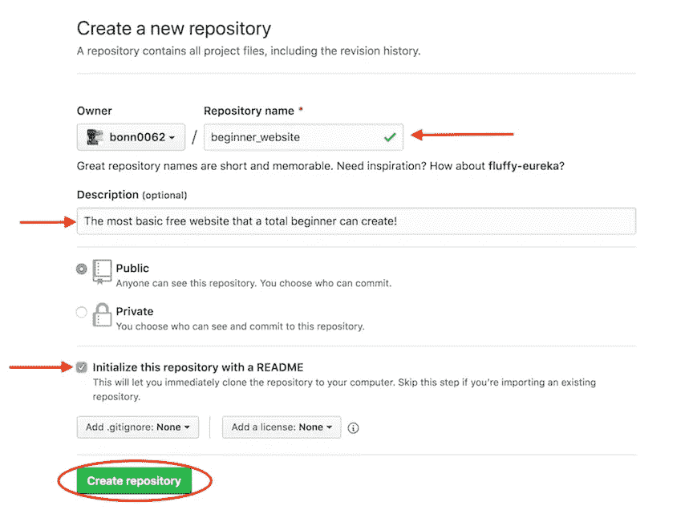

现在转到屏幕右上方附近的“**设置**，然后向下滚动到“ **GitHub 页面**”部分。下拉显示“**无**”的下拉菜单至“**总分行**”

首先，你会看到这个:

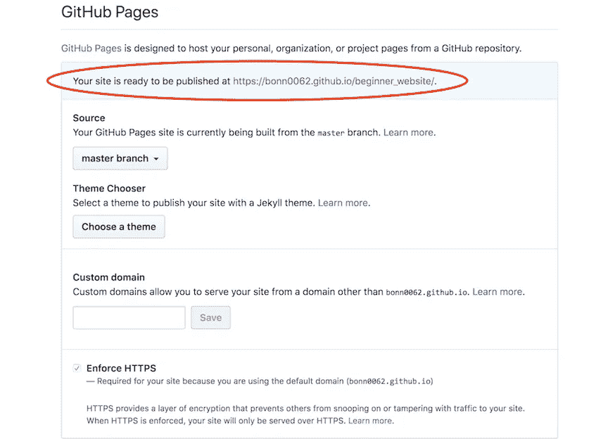

等一两分钟，然后你会看到这个:

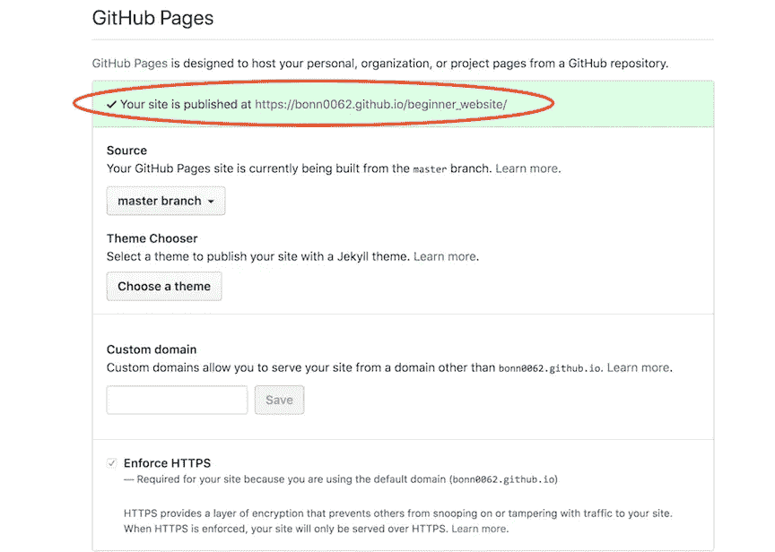

现在点击链接！

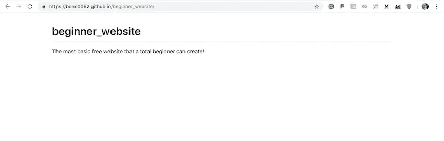

你有网站了！恭喜你！

## 这看起来没什么

好吧，这看起来确实很无聊，但是你可以看到这里显示的是你的自述文件。

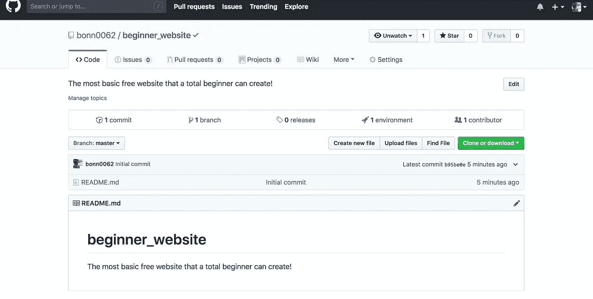

如果您想做一些快速更改，您可以继续编辑您的自述文件，以显示您希望人们看到的内容。要做到这一点，请回到您的存储库中，单击您的自述文件上的小铅笔图标，并使它变得更好！

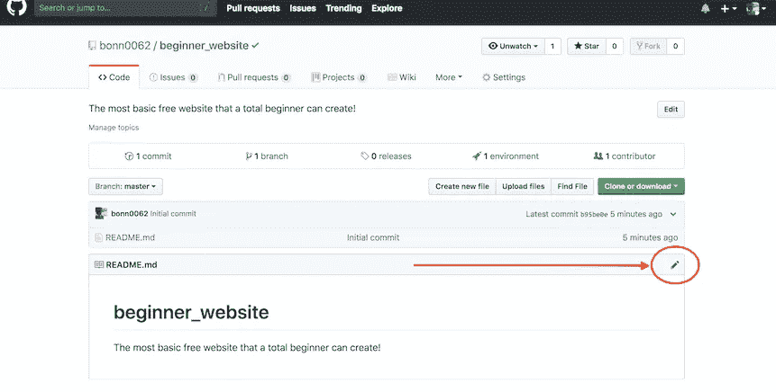

Edit your README file

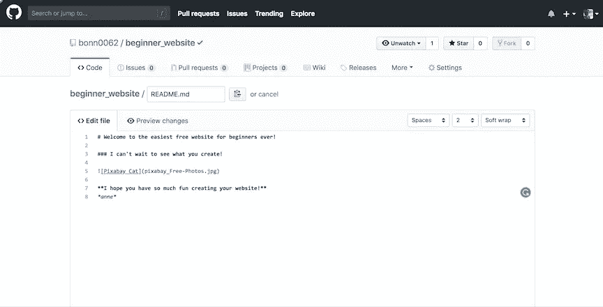

Editing the file (you’re working with a Markdown file)

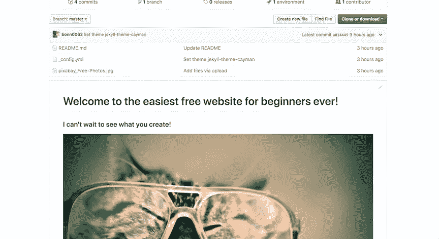

How the file looks with a few edits!

你正在使用 markdown，你可以用 Markdown 文件做很多事情。这包括添加文本、图像、链接、颜色和一些基本的格式。这是一个非常简单的开始方式！这里是基本语法的[降价指南，适合以前没有用过的人。](https://www.markdownguide.org/basic-syntax/)

(请记住，如果您在自述文件中添加任何图像，您需要确保将它们上传到您的资源库，否则 GitHub 不会知道您想要什么！)

现在回到你的网站，看看你有什么！

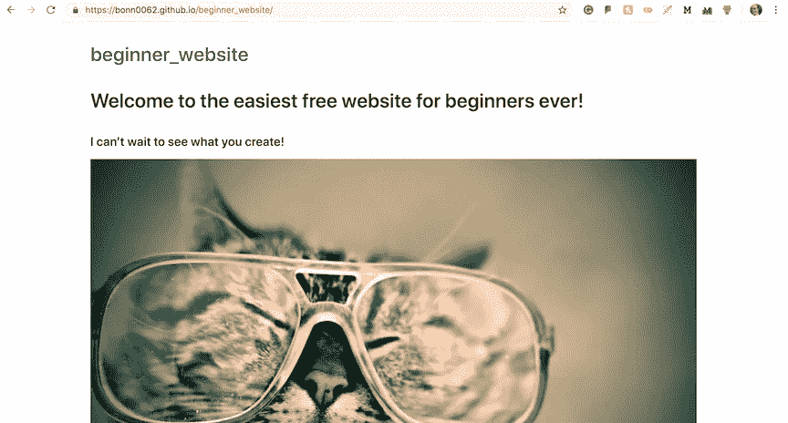

请注意，这些更改有时需要几分钟才能完成。如果您没有立即看到您的更改，请等待几分钟，然后重试。我还遇到了一个问题，即使我做了更改，我的笔记本电脑还是想回到我网站的旧版本。删除我过去 24 小时的浏览器历史记录解决了这个问题。在你被复杂的事情吓到之前，尝试简单的解决方法！

GIF via [GIPHY](https://giphy.com/gifs/spoilers-iron-man-3-ZPTYYyEtEMoCc)

## 这是一个进步，但它可能会更有趣

如果你是一个完全的初学者，你对 CSS 一无所知，但是你想要更多的视觉吸引力，试试 Jekyll 主题！它们是预先构建的主题，你可以用它们来让你的网站看起来更好，而你自己基本上不需要做任何努力。Jekyll 和 GitHub 将为您完成这项工作！你的工作就是按一两个按钮。

回到“**设置**”中的“ **GitHub 页面**”部分，点击“**选择一个主题**”

让我们看看，如果我们选择第一个出现的主题，我们的网站会是什么样子。你所要做的就是按下绿色的"**选择主题**"按钮，等待几分钟，然后再次尝试你的网站！

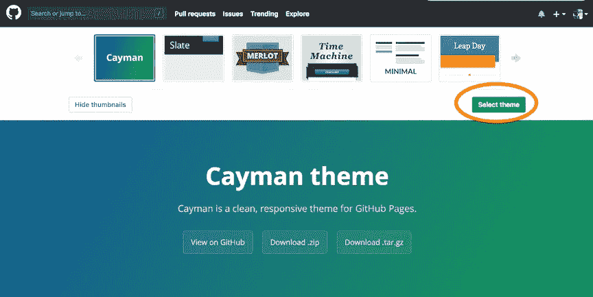

经过几分钟的努力，我们已经有所进展了！

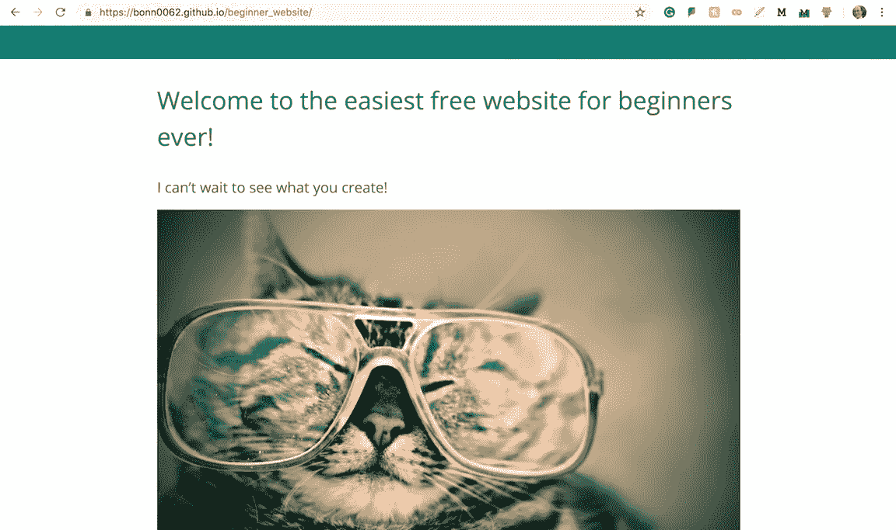

就是这样！只需几分钟，您就可以为自己的企业、博客或作品集创建一个免费网站，通过 GitHub 存储库托管它，而且它已经开始运行了。你已经准备好与世界分享了！

好样的。！！

> 只有几个提示:
> 
> *如果你决定你根本不想使用一个主题，没有按钮可以回到原来的版本。不过，去掉你的主题其实是完全容易的！如果你回到你的存储库，你会发现你现在有一个名为“ **_config.yml** ”的文件，它包含了你的主题信息。如果你删除了那个文件，你就删除了主题！
> 
> *如果您想尝试您的主题和主题选项，您会发现" **_config.yml** "文件是您的第一站。现在你知道了，看看你拥有的无数其他 Jekyll 选项吧！如果你想要一个简单的已经设置好的博客，你甚至可以从 Jekyll Now 主题开始。你的选择是无限的！

我等不及要看你创造的东西了！一如既往，如果你用这些信息做出了什么惊人的事情，请在下面的评论中让每个人都知道。

如果你想接触或者找到更多很酷的文章，请到[内容简约](https://contentsimplicity.com/articles/)来和我一起吧！

你可能也想看看我在 Medium 上为初学者写的其他教程！

 [## 如何撰写和发表引人注目的文章

### 创建内容的简单技巧，易于查找，阅读起来令人兴奋

medium.com](https://medium.com/swlh/how-to-write-and-publish-articles-that-get-noticed-60e9701daed4)  [## Git 和 GitHub 入门:完全初学者指南

### Git 和 GitHub 基础知识，供好奇和完全困惑的人使用(加上最简单的方法来为您的第一次公开…

towardsdatascience.com](/getting-started-with-git-and-github-6fcd0f2d4ac6)  [## Google Colab 入门

### 沮丧和困惑的基本教程

towardsdatascience.com](/getting-started-with-google-colab-f2fff97f594c) 

感谢阅读！