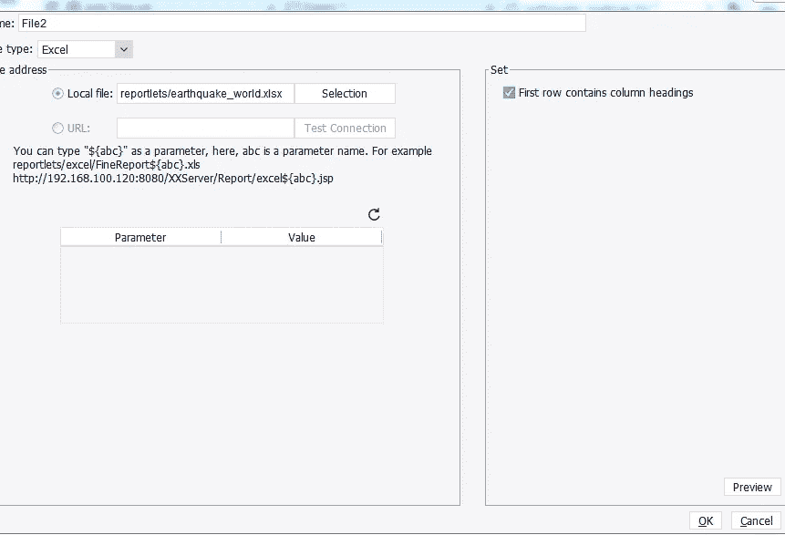
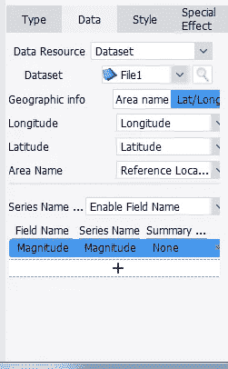
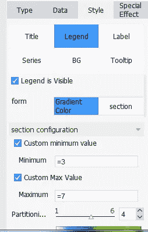
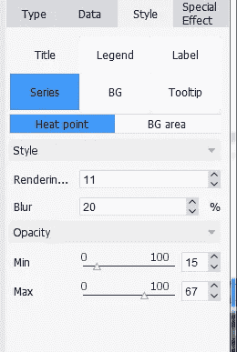
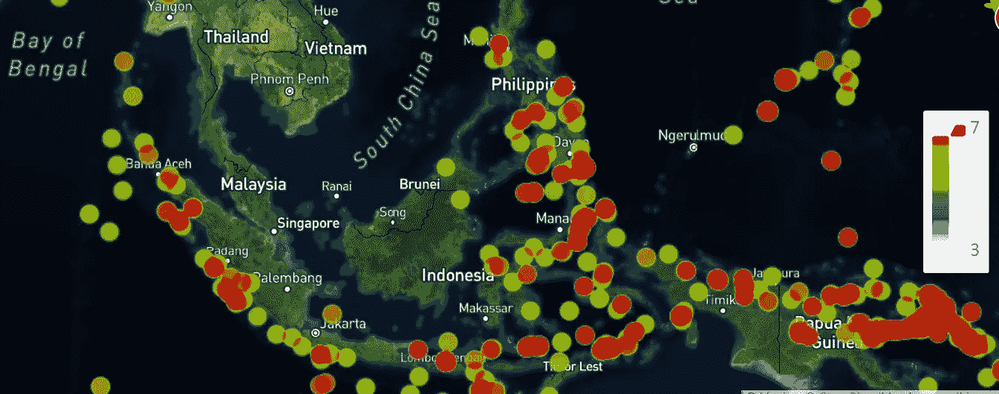
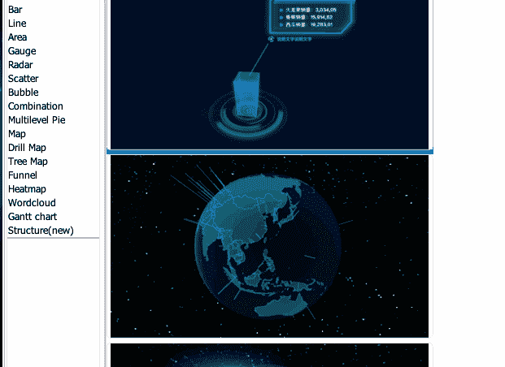

# 不写代码怎么创建热图？

> 原文：<https://towardsdatascience.com/how-to-create-a-heat-map-without-writing-code-e1d7b10cf33f?source=collection_archive---------15----------------------->

我们如何在不编写一行代码的情况下创建热图？这听起来不可能，但实际上非常容易实现。有时候，我们需要善于利用工具和学习技巧来帮助我们节省时间，提高工作效率。今天我将向你展示如何不用写代码就能制作地震热图。而我用的工具是一个[数据可视化软件](http://www.finereport.com/en/data-visualization/9-data-visualization-tools-that-you-cannot-miss-in-2019.html?utm_source=medium&utm_medium=media&utm_campaign=blog&utm_term=How%20to%20Create%20a%20Heat%20Map%20without%20Writing%C2%A0Code%3F)，FineReport。

个人版 [**FineReport**](http://www.finereport.com/en/?utm_source=medium&utm_medium=media&utm_campaign=blog&utm_term=How%20to%20Create%20a%20Heat%20Map%20without%20Writing%C2%A0Code%3F) 完全免费。想学做热图可以下载，跟着我的教程练习。

首先给大家展示一下地震图的最终效果。图为 1999 年至 2019 年地震的分布和震级。

上面的截图只显示了东南亚的地震。我还做了一个 3D 动态热图，显示地震的全球分布。而且我在制作过程中没有使用任何代码。

现在，让我们开始学习如何[可视化数据](/how-can-beginners-design-cool-data-visualizations-d413ee288671)。

# **1。找到数据源**

[数据可视化](http://www.finereport.com/en/features/data-visualization?utm_source=medium&utm_medium=media&utm_campaign=blog&utm_term=How%20to%20Create%20a%20Heat%20Map%20without%20Writing%C2%A0Code%3F)的第一步是找到数据的来源。我们可以从 [**美国地质调查局**](https://earthquake.usgs.gov/earthquakes/) 获得各个地区的地震热图数据。在这篇文章中，我们将 1999 年至 2019 年的世界地震数据导入 Excel，然后编辑成如下图所示的统一格式。

# 2.连接数据集

接下来，我们将数据导入 FineReport 设计器。 [FineReport](http://www.finereport.com/en/?utm_source=medium&utm_medium=media&utm_campaign=blog&utm_term=How%20to%20Create%20a%20Heat%20Map%20without%20Writing%C2%A0Code%3F) 可以连接各种数据库。

但是如果数据来自 Excel，我们需要把 Excel 文件放在安装 FineReport 的同一个
路径下。比如在我的电脑里，我把上面创建的 Excel 文件放入**C:\ fine report _ 10.0 \ WEB apps \ webroot \ we b-INF \ reportlets**，作为内置模板。

然后打开 FineReport 设计器，你会找到你的 Excel 文件。选择**文件**，设置**文件类型**为 **Excel** ，选择**本地文件**，选择刚导入的 Excel 文件，在右侧选择“**首行包含列标题**”，数据导入完成。

# 3.选择图表类型

我们创建一个**新表单**来设计仪表板，并在**图表**中选择热图，如下所示。

单击地图进行编辑。选择**地图点**，这里我选择**模板参数**，然后选择 **GIS 图层**选择**卫星**。您可以设置地图显示的中心点。这里我选择(101，0)来显示，以东南亚为中心。

然后将数据导入地图。设置如下。

# 4.设计热图的样式

最后，我们调整了热图的样式。

默认情况下，图例设置为渐变颜色。您可以根据需要定义最大值和最小值。选择**图表属性表- >样式- >系列**，可以看到系列属性分为两种设置:**热点**和 **BG 区域**。如果用户选择的边界/点不包含边界信息，则设置无效。热点的串联界面如下:渲染半径越大，热区显示范围越大；模糊越大，热边界的模糊程度越高。不透明度最小值和最大值，对应于图形中最小和最大值的不透明度，在此设置如下。

# 5.效果显示

点击预览，一个没有编码的热图就完成了。

看到这里你可能会问文章开头的 3D 动态热图是怎么做出来的？这很简单。插入图表时，只需选择**结构(新)**。而且我觉得后续的设置你可以自己摸索，和上面的步骤差不多。

# 最后

除了热图，如果想了解地图可视化，可以看看这篇文章 [***数据可视化中的 10 大地图类型***](/top-10-map-types-in-data-visualization-b3a80898ea70) 。

# 您可能也会对…感兴趣

[*2019 年你不能错过的 9 个数据可视化工具*](/9-data-visualization-tools-that-you-cannot-miss-in-2019-3ff23222a927)

[*2019 年 6 大数据分析工具*](/top-6-data-analytics-tools-in-2019-4df815ebf82c)

[*什么是大屏幕的数据可视化，如何实现？*](/what-is-data-visualization-for-large-screen-and-how-to-implement-it-1d79cf07783)

[*数据分析师需要掌握的 6 项关键技能*](/6-key-skills-that-data-analysts-need-to-master-df1d82257b9)

[*业务仪表盘初学者指南*](/a-beginners-guide-to-business-dashboards-981a8192a967)

[*数据可视化中排名前 16 的图表类型*](/top-16-types-of-chart-in-data-visualization-196a76b54b62)