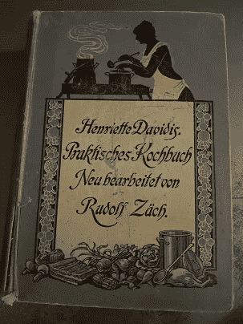
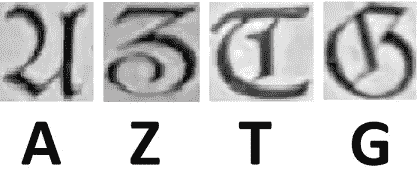
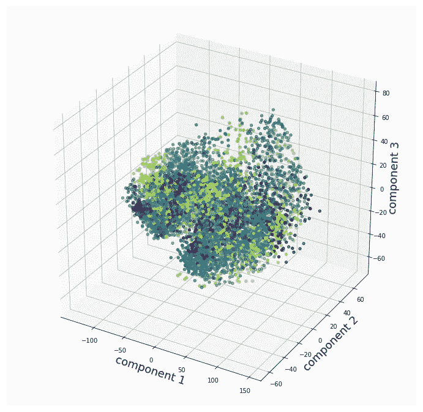
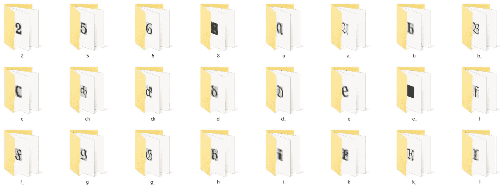

# 如何从零开始创建机器学习数据集？

> 原文：<https://towardsdatascience.com/how-to-create-a-machine-learning-dataset-from-scratch-6a24a9fd1673?source=collection_archive---------19----------------------->

## 我祖母的烹饪书遇见机器学习第一部分



Figure 1: My grandmothers old, German cookbook: *“Praktisches Kochbuch”* by Henriette Davidis

我的祖母是一位杰出的厨师。因此，当我最近偶然发现她的旧烹饪书时，我试着通读了一些食谱，希望我能重现一些我小时候喜欢的菜肴。然而，这比预期的要难，因为这本书是在 1911 年左右以一种叫做[f*rak tur*的字体印刷的。不幸的是，fraktur 字体偏离现代字体在几个例子。例如，字母*“A”*看起来像 fraktur 中的*“U”*，每当我看到 fraktur 中的*“Z”*时，我就会读出一个*“3”*(见图 2)。](https://en.wikipedia.org/wiki/Fraktur)



Figure 2: Examples of letters in fraktur and in a modern typeface (Calibri)

因此，这个想法出现了，以开发一个管道，将创建一个现代字体的 fraktur 字母的现场翻译。有了这样的工具在手，我们可以很容易地通读食谱，并专注于烹饪部分，而不是破译这本书。幸运的是，有许多优秀的开源工具可以帮助我们开发这样的管道。然而，这个项目的一些方面必须从头开始建设。主要是我们需要一个数据集来训练我们的机器学习算法。这就是我们将在本文中重点讨论的内容。但在我们开始使用数据集之前，让我们快速浏览一下摆在我们面前的所有任务:

1.  检测图像中的单个字母
2.  从这些字母创建一个训练数据集
3.  训练一个算法来分类字母
4.  使用经过训练的算法对单个字母进行分类(在线)

我们将在本文中讨论前两个主题，并在第二和第三篇文章中继续讨论主题 3 和 4。这应该给我们足够的空间来详细研究每个任务。

同样作为一个一般备注:在这些文章中，我们不会关注如何从头开始实现每个算法。相反，我们将看到如何连接不同的工具，将烹饪书翻译成现代字体。如果你对代码比对解释更感兴趣，你也可以直接去 Github 上的 Jupyter 笔记本。

## 检测图像中的字母

所以第一个任务是找到一种方法从烹饪书的书页中提取单个字母。这是后面一切的基础。在下一步中，我们可以从提取的字母中创建一个数据集，并最终在其上训练一个分类器。


Figure 3: Picture of one paragraph of the cook book

我们管道的输入将总是来自烹饪书的页面图片，类似于上面图 3 所示。这些输入可以是来自智能手机摄像头的单个高分辨率图像，也可以是来自网络摄像头的图像流。我们必须确保的是，每一张独立于其来源的图像，都以一种检测算法可以找到所有单个字母的方式进行处理。这里首先要记住的是，数码相机是以三个独立的通道存储图像的: **R** ed、 **G** reen 和 **B** lue ( *RGB* )。但是在我们的例子中，这三个通道包含冗余信息，因为字母可以在这三个通道的每一个中分别被识别。因此，我们将首先把所有图像转换成灰度。结果，我们只需要处理一个通道，而不是三个通道。此外，我们还将数据量减少到 1/3，这将提高性能。但我们的检测算法将面临另一个问题:不断变化的闪电条件。这使得从背景中分离字母变得复杂，因为整个图像的对比度发生了变化。为了解决这个问题，我们将使用一种称为自适应阈值的技术，该技术使用附近的像素来创建局部阈值，然后用于二值化图像。结果，处理后的图像将仅由黑白像素组成；不再是灰色了。然后，我们可以通过使用中值模糊滤波器对图像进行去噪来进一步优化字母检测。下面的代码概述了一个 Python 函数，它在 [openCV 库](https://opencv.org/)的帮助下将图像从 RGB 转换为黑白。该处理步骤的结果在图 4 中进一步举例说明。

```
# Define a function that converts an image to thresholded image
def convert_image(img, blur=3):
    # Convert to grayscale
    conv_img = cv2.cvtColor(img, cv2.COLOR_BGR2GRAY) # Adaptive thresholding to binarize the image
    conv_img = cv2.adaptiveThreshold(conv_img, 255,   
               cv2.ADAPTIVE_THRESH_GAUSSIAN_C, 
               cv2.THRESH_BINARY, 11, 4) # Blur the image to reduce noise
    conv_img = cv2.medianBlur(conv_img, blur) 

    return conv_img
```


Figure 4: The left image shows the original picture, middle image shows the gray scaled version and the right image shows the thresholded and blurred result.

好了，现在我们处理了图像，是时候检测字母了。为此，我们可以使用 [openCV](https://opencv.org/) 库的 *findContours* 方法。代码归结为一行，由下面的函数调用。然后，我们可以将该函数找到的轮廓的边界框映射回原始 RGB 图像，以查看实际检测到了什么(图 5)。

```
# Define a function that detects contours in the converted image
def extract_char(conv_img):
    # Find contours
    _, ctrs, _ = cv2.findContours(conv_img, cv2.RETR_TREE,  
                 cv2.CHAIN_APPROX_SIMPLE) return ctrs
```


Figure 5: Result of detected contours mapped back onto the original image.

从图 5 中我们可以看到检测工作得相当好。但是，在某些情况下，没有检测到字母，例如，第 1 行末尾的一些*“I”*。而在另外一些情况下，一个字母被拆分成两个字母，例如*【b】*在最后一行的末尾。另一件要注意的事情是，一些字母组合实质上变成了单个字母，并被算法相应地检测到，图 5 中的两个例子是*“ch”*和*“CK”*。我们将在后面看到如何处理这些问题。但是现在我们可以继续目前的结果。因此，由于我们有了每个字母的边框，我们可以将它们剪切下来，保存为单独的图像。png)放在我们硬盘上的一个文件夹里。如果你对如何做到这一点感兴趣，可以看看 Jupyter 的笔记本。

## 创建数据集

拥有一组提取的字母是好的，但是我们需要以一种数据集对我们有用的方式来组织它们。为此，我们必须做两件事:

1.  删除不包含字母的图像。这可能是各种各样的伪像，例如，我们在图 5 中看到的一页上的污点或一封信的一部分。
2.  将所有剩余图像分组。这意味着所有字母*“A”*进入一个文件夹，所有字母*“B”*进入另一个文件夹，依此类推。

原则上，以上两点都很容易解决。然而，由于我们从这本书的许多页中提取了几千封潜在的信件，它们构成了一个漫长而乏味的任务。从好的方面来看，我们可以自动化第一轮分组，这样我们以后“只”需要纠正这个预分组步骤的结果。但是在我们开始这个聚类步骤之前，还有一件事要做:我们必须使提取的字母的所有图像具有相同的大小。



Figure 6: Scatter plot of the first 3 PCA scores. Color represents the cluster.

其原因是，我们将用于聚类和分类的算法预期输入图像的大小是固定的。但是正如我们从图 5 的边界框中看到的，每个图像目前都有不同的形状。为了克服图像尺寸的多样性，我们将使用 openCV 库的 *resize* 方法，并将所有图像调整到相同的尺寸。然后，我们将图像存储在一个 Numpy 数组中，并通过计算它们的 [z 值](https://en.wikipedia.org/wiki/Standard_score)来归一化它们。归一化对于下一步很重要，下一步是用主成分分析(PCA)降低每幅图像的维数。然后，第一主成分的分数将作为 K-Means 聚类算法的输入，该算法将为我们进行字母的预聚类。如果你对这个过程和 K-Means 算法的细节感兴趣，你可以查看这篇文章的 [Jupyter 笔记本，或者在这里](https://github.com/akcarsten/cook_book/blob/master/01_create_first_dataset.ipynb)了解一个[不同的用例。K-Means 聚类的结果如图 6 所示，其中每个点的颜色表示它所属的聚类。查看图 6 看起来一些数据点形成的组也通过 K-Means 算法被分配到同一个聚类。然而，仅仅从图 6 中很难判断集群工作得有多好。评估结果的一个更好的方法是将一个簇中的所有图像移动到一个单独的文件夹中，然后查看每个簇的内容。图 7 显示了一个示例文件夹中的图像，在该文件夹中，集群工作得非常好。下一步是将该文件夹重命名为“a”。](/whos-talking-using-k-means-clustering-to-sort-neural-events-in-python-e7a8a76f316)


在其他情况下，聚类效果并不好。图 8 显示了一个包含不同类型字母的集群示例。虽然大多数字母是“n ”,但在字母串中也有一些“K”和“u”。然而，我们可以通过搜索“K”和“u”集群并将图像移动到那里来轻松解决这个问题。之后，该文件夹可以重命名为“n”。


Figure 8: Example folder with clustered data that contains different letters

我们将继续这样做，直到所有的集群都被清理和重命名，如上所述。结果应该类似于图 9，其中大写字母用“_”标记。



Figure 9: Example of how the data should be organized after clustering and manual adjustments.

因此，显然需要一些手工工作来整理数据。然而，我们能够通过使用 [PCA 和 K-Means](/whos-talking-using-k-means-clustering-to-sort-neural-events-in-python-e7a8a76f316) 对数据进行预聚类来自动化大部分工作。数据集现在已经清理和组织好了，但是为了让我们更有效地工作，我们需要以一种比硬盘上的文件夹更方便的方式保存它。

## 将数据集转换为 IDX 格式

因此，最后一步是将数据集转换为 IDX 数据格式。你可能已经熟悉了这种格式，因为著名的 [MNIST 数据集](http://yann.lecun.com/exdb/mnist/)也是以同样的方式保存的。只是在这里，我们必须写数据，而不是从 IDX 文件中读取数据。
我们将通过使用一个 [idx_converter](https://github.com/akcarsten/convert_IDX) 来实现，它采用我们上面设置的文件结构，并直接以 idx 格式保存。输出将是两个文件:一个文件包含图像，另一个文件包含标签。
由于我们希望稍后在数据上训练一个分类器，我们应该已经将图像分成训练和测试数据集。为此，我们将 30%的字母移动到测试文件夹，而剩余的字母留在培训文件夹中。您可以查看 [Jupyter 笔记本](https://github.com/akcarsten/cook_book/blob/master/01_create_first_dataset.ipynb)中的代码，了解有关该程序实现的详细信息。

既然我们已经从头开始创建了 fraktur 数据集，我们可以继续下一篇文章，在这篇文章中，我们将比较几个分类器算法的性能，以便选择一个用于烹饪书的实时翻译。

同时，你可以在这里查看这篇文章[的完整代码，在](https://github.com/akcarsten/cook_book/blob/master/01_create_first_dataset.ipynb) [Twitter](https://twitter.com/ak_carsten) 上关注我或者通过 [LinkedIn](https://www.linkedin.com/in/carsten-klein/) 联系我。