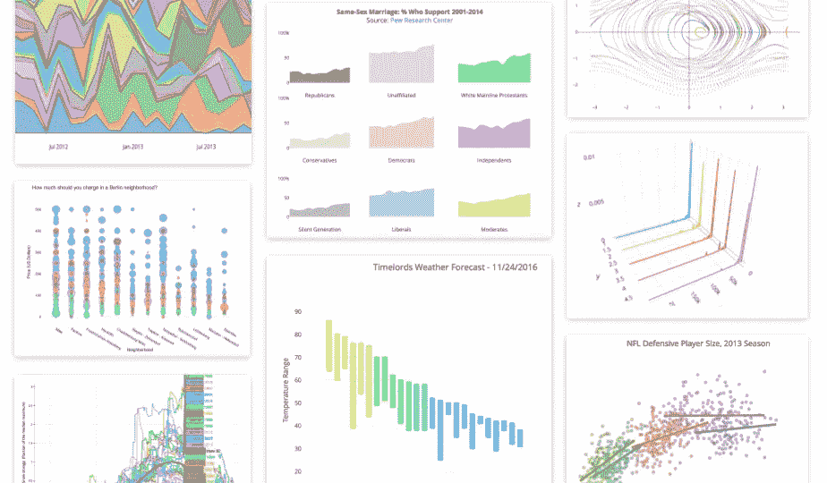
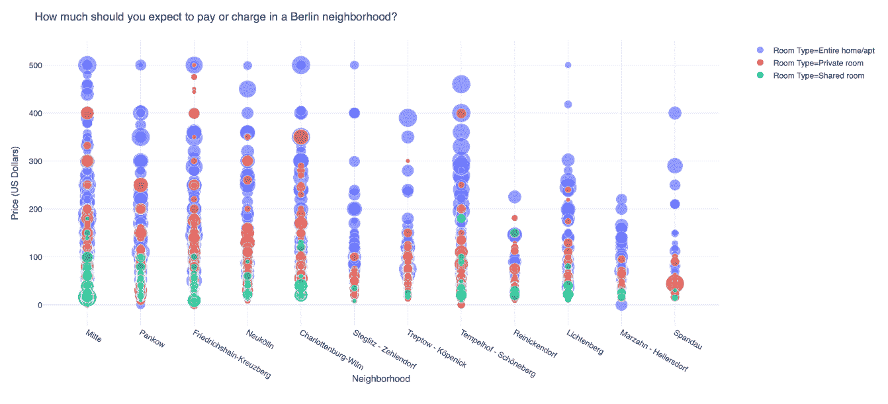
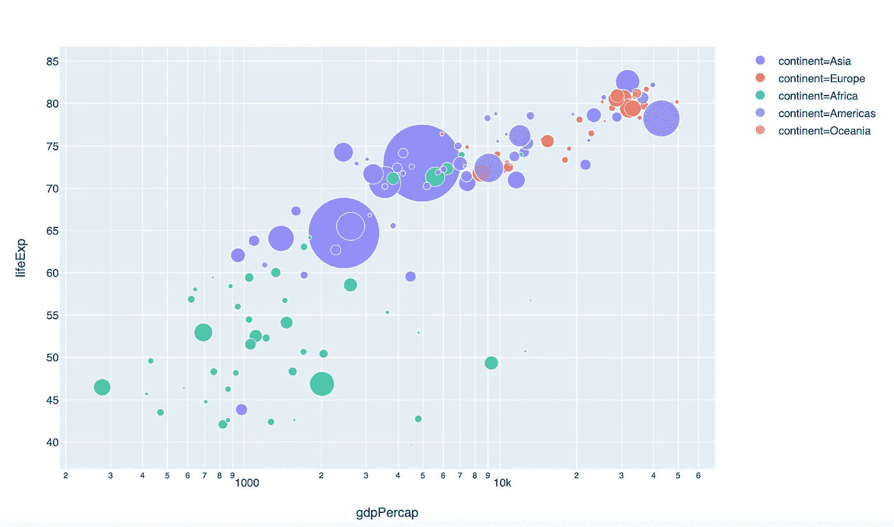
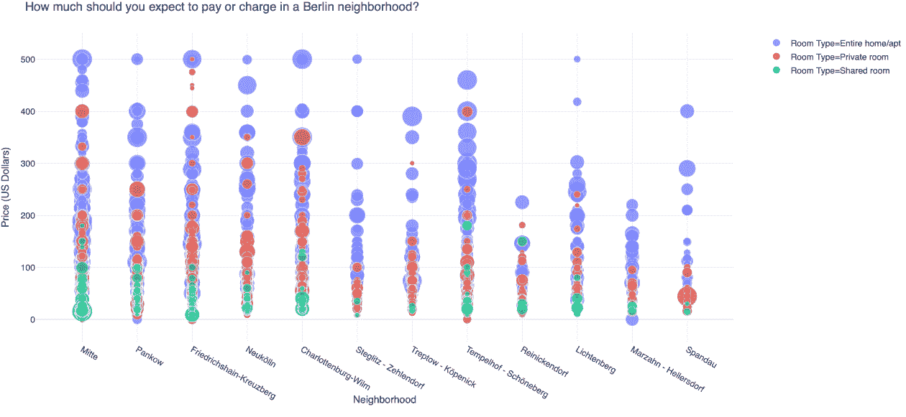
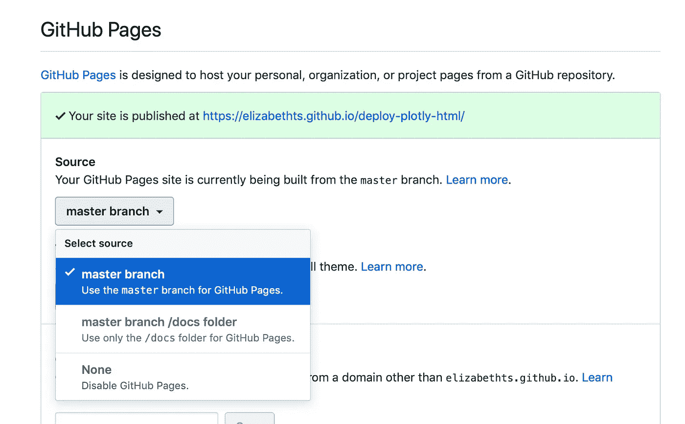

# 如何创建一个 Plotly 可视化，并将其嵌入网站

> 原文：<https://towardsdatascience.com/how-to-create-a-plotly-visualization-and-embed-it-on-websites-517c1a78568b?source=collection_archive---------3----------------------->



Examples from Plot.ly

Plotly 是一个开源的、易于使用的 python 图表库。Plotly.express 是作为 Plotly.py 的包装器构建的，使创建交互式可视化像编写一行 python ✨一样简单

> `plotly.express`之于`plotly`就像`seaborn`之于`matplotlib`

有很多很酷的交互式可视化可以用 Plotly Express 创建——就像这个使用 Airbnb 数据集的可视化:



使用 [Plotly express](https://medium.com/plotly/plotly-py-4-0-is-here-offline-only-express-first-displayable-anywhere-fc444e5659ee) 创建的交互式可视化可以在大多数笔记本和 IDE 上渲染和显示。将它们嵌入其他地方则是另一回事。如果你在嵌入你的交互式可视化图形时遇到了麻烦，那你就来对地方了！

在本文中，我将介绍如何使用 plotly express 创建一个基本的交互式可视化，并生成 iframe 嵌入代码以在任何网站上显示它。

步骤如下:

*   创建情节可视化
*   主机可视化(在 plotly 或 github 页面上)
*   获取 iframe 嵌入代码

# 创建一个情节可视化

如果您还没有，使用`!pip install plotly`将 plotly 安装到您的环境中，并使用`import plotly.express as px`导入 plotly。

运行以下代码创建一个基本的可视化:

```
gapminder = px.data.gapminder()
fig = px.scatter(gapminder.query("year==2007"), x="gdpPercap", y="lifeExp", size="pop", color="continent",
           hover_name="country", log_x=True, size_max=60)fig.show()
```

下图应该会出现在您的笔记本中:



现在你有了一个交互式可视化工具…让我们把它放在某个地方吧！

# 上传可视化到 Plotly

如果你的数据集足够小，你就可以免费将你的可视化上传到 plotly，如果不够小，当你尝试下面的部分时，它会给你一个错误。我将在下一节解释如果遇到错误如何解决。

要将可视化上传到您的 plotly 帐户，请使用`!pip install chart_studio`安装 chart studio，然后使用`import chart_studio`将其导入。

您将需要您的用户名和 api 密钥从您的 plotly 帐户连接到它从您的笔记本电脑。要获取您的 api 密钥，只需点击您的个人资料右上角的用户名，然后点击设置，然后重新生成一个新的 api 密钥。现在，您可以设置您的凭据:

```
username = '' # your username
api_key = '' # your api key - go to profile > settings > regenerate keychart_studio.tools.set_credentials_file(username=username, api_key=api_key)
```

使用以下代码行将您的可视化应用到您的帐户中:

```
import chart_studio.plotly as py
py.plot(fig, filename = 'gdp_per_cap', auto_open=True)
```

如果操作正确，这段代码应该会在你的帐户上打开一个新的可视化窗口，并返回你的笔记本中的链接。您可以使用相同的链接，然后在支持 embed.ly 嵌入的网站上嵌入，如 Medium。注意:当你在 Medium 上写文章的时候，你的可视化效果不会是交互式的，但是一旦你发布了它，它就会起作用。

这是我们创建的交互式可视化，我只需粘贴链接就可以嵌入到 Medium 中…很简单。

如果把你的可视化上传到 plotly 对你有用，那太好了。您可以跳到下一节，我将向您展示如何生成 iframe 嵌入代码。

# 为绘图可视化生成 HTML

当您正在处理的数据集太大时，您将从 plotly 获得一个错误，即您无法上传可视化，除非您升级您的帐户。因此，为了解决这个问题，我们将把我们的可视化图形写成 HTML。

首先，让我们创建一个大型数据集的可视化。我将使用 Airbnb 的数据，这些数据可以在这个 [github repo](https://github.com/elizabethts/publish-plotly-website) 中找到。如果您想继续学习，可以下载 csv。

下面是创建我将使用的数据帧的代码:

下面是创建可视化的代码:

```
fig = px.scatter(df, x='Neighborhood', y='Price (US Dollars)'
                 ,size='Accommodates'
                 , hover_data=['Bedrooms', 'Wifi', 'Cable TV', 'Kitchen', 'Washer', 'Number of Reviews']
                 ,color= 'Room Type')fig.update_layout(template='plotly_white')
fig.update_layout(title='How much should you charge in a Berlin neighborhood?')fig.show()
```

输出将如下所示:



现在，如果您尝试使用`py.plot(fig, filename='airbnb', auto_open=True)`将它上传到您的 plotly 帐户，您将会看到以下错误:

```
PlotlyRequestError: This file is too big! Your current subscription is limited to 524.288 KB uploads. For more information, please visit: [https://go.plot.ly/get-pricing.](https://go.plot.ly/get-pricing.)
```

因此，我们将把我们的可视化结果写成 HTML，并放在 github 页面上。

## 创建 HTML

要为 plotly 可视化生成 HTML 文件，请使用:

```
import plotly.io as pio
pio.write_html(fig, file=’index.html’, auto_open=True)
```

如果操作正确，这段代码将在您的浏览器中打开本地 HTML 文件，您应该会看到可视化效果。

## GitHub 页面的宿主

发布到 github 页面非常简单。你可以按照 github [这里](https://pages.github.com)的说明或者按照我的简要概述来做。

创建一个新的 github repo 并用 README.md 初始化。上传我们刚刚创建的 index.html 文件，并将其提交到主分支。现在，点击设置，向下滚动到 github 页面部分，在“源”下选择“主分支”。



现在你应该可以使用这个链接结构[](http://username.github.io/repository)*来查看你的可视化效果了*

*我刚刚做的那个可以在这里找到[https://elizabethts.github.io/publish-plotly-website/](https://elizabethts.github.io/publish-plotly-website/)。*

# *用 iframe 嵌入 Plotly 可视化*

*现在我们有了到我们的 plotly 可视化的链接(托管在 plotly 或 github 页面上),我们可以为可视化生成 iframe 代码。如果您能够将可视化上传到 plotly，则可以使用以下代码行生成 iframe 嵌入代码:*

```
*import chart_studio.tools as tls
tls.get_embed('[https://plot.ly/~elizabethts/9/'](https://plot.ly/~elizabethts/9/')) #change to your url*
```

*这将为您提供输出:*

```
*<iframe id="igraph" scrolling="no" style="border:none;" seamless="seamless" src="https://plot.ly/~elizabethts/9.embed" height="525" width="100%"></iframe>*
```

*如果您走的是 github pages 路线，您需要自己修改上面的 iframe 代码。把 plotly 网址换成 github 网址就行了！*

*最后，您可以将这个 iframe 嵌入代码放到您的站点中，您的可视化效果将会出现！注意:如果使用 github 链接，可能需要修改高度和宽度。*

*讽刺的是，据我所知，如果你的数据集太大，你不能在媒体上嵌入你的交互式可视化，你必须把它放在 github 上。为了解决这个问题，我强烈推荐使用 [CloudApp](https://www.getcloudapp.com) 来筛选记录 gif，你可以轻松地将其拖放到你的中型文章中，这就是我在这篇文章中所做的。*

*现在，您可以创建一个交互式的 plotly 可视化，并生成 iframe 嵌入代码以在任何网站上显示它！*

*在推特上找到我[@伊丽莎白](https://twitter.com/elizabethets)！*

*来源:*

*[](https://plot.ly/python/) [## plotly

### Plotly 的 Python 图形库制作出交互式的、出版物质量的图形。如何制作线图的示例…

plot.ly](https://plot.ly/python/) [](https://plot.ly/python/getting-started-with-chart-studio/) [## Python 的 Plotly 入门

### 情节可以设置为三种不同类型隐私:公开、私人或秘密。公共:任何人都可以查看此图表。它…

plot.ly](https://plot.ly/python/getting-started-with-chart-studio/) [](https://medium.com/plotly/introducing-plotly-express-808df010143d) [## ✨推出 Plotly 快递✨

### Plotly Express 是一个新的高级 Python 可视化库:它是 Plotly.py 的包装器，公开了一个简单的…

medium.com](https://medium.com/plotly/introducing-plotly-express-808df010143d) [](https://plot.ly/python/embedding-plotly-graphs-in-HTML/) [## 在 HTML 中嵌入图形

### Plotly 图形可以嵌入任何 HTML 页面。这包括 IPython 笔记本、Wordpress 网站、仪表盘、博客…

plot.ly](https://plot.ly/python/embedding-plotly-graphs-in-HTML/) [](https://pages.github.com) [## GitHub 页面

### 使用你最喜欢的文本编辑器，在你的项目中添加一个 index.html 文件:Hello World I hosted with GitHub Pages…

pages.github.com](https://pages.github.com)*