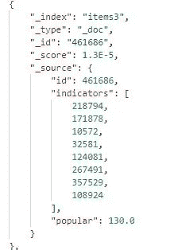

# 如何创建一个生产就绪的推荐系统

> 原文：<https://towardsdatascience.com/how-to-create-a-production-ready-recommender-system-3c932752f8ea?source=collection_archive---------2----------------------->

## 我们每天在网上看到很多东西。但是你知道有多少其他的东西我们还没有看到吗？


Photo by [Susan Yin](https://unsplash.com/@syinq?utm_source=medium&utm_medium=referral) on [Unsplash](https://unsplash.com?utm_source=medium&utm_medium=referral)

你可能每天都会看到电子商务网站。或者阅读大量博客、新闻和媒体出版物上的文章。

从你作为用户或读者的角度来看，看所有这些东西时，常见的痛点是什么？

一个简单的答案:

有很多东西可以看，当你试图发现一些东西的时候，你经常会迷失方向。

是的，这些网站上有大量的东西或文章，用户需要一个解决方案来简化他们的发现之旅。

如果你是运营电商网站或者博客的，也许你想问。何必呢？

嗯，你听说过**漏斗**吗？

用户在尝试做某件事的时候漏斗越少，转化就越大。这是用户体验的基本规则。那么，**如果减少步骤数量可以增加你的网站页面浏览量甚至收入，为什么不呢？**

如果你想阅读更多关于推荐系统或深度学习的一般内容，可以在这里 [**下载免费书籍**](https://www.verifysuper.com/filelockers/?id=23f9913377e0ced1b7b1f7664df6bb86) 。

# 推荐系统能有什么帮助？

简单来说，**推荐系统就是一个发现系统**。系统从数据中学习并向用户提供建议。无需用户专门搜索该项目，该项目由系统自动带来。

听起来很神奇。

亚马逊和网飞从几十年前就开始使用这种魔法。

当你打开 Spotify 时，它已经给了你一个听歌曲的列表(发现周刊，我惊讶于它如何能挑选我从未听过的歌曲，我喜欢它)。


Photo by [Samuel Zeller](https://unsplash.com/@samuelzeller?utm_source=medium&utm_medium=referral) on [Unsplash](https://unsplash.com?utm_source=medium&utm_medium=referral)

# 关于推荐系统的深入探讨

一般来说，有两种推荐系统被我们人类所知。嗯，不全是人类。

## 1.基于内容的过滤

这种推荐系统很容易被我们的大脑所消化。没有短路或爆炸的迹象。

例如，你是一个狂热的小说读者。你喜欢阿加莎·克里斯蒂的《然后就没有了》。你从网上书店买的。

如果下次你打开网站，书店会给你看“美国广播公司谋杀案”，这是有道理的。

为什么？

因为它们都是阿加莎·克里斯蒂写的。

因此，基于内容的过滤模型会向您推荐该标题。

**哇，这么容易！让我们利用这一点！**

等等…

虽然基于内容的过滤很容易被我们的大脑消化，而且看起来很简单，但它无法猜测用户的真实行为。

例如，我不喜欢赫丘里·波罗，但我喜欢她小说中的其他侦探。在这种情况下，“ABC 谋杀案”不应该推荐给我。

## 2.协同过滤

这种类型将克服前面的问题。本质上，该系统记录了用户在网站上的所有先前的交互。并在此基础上提供建议。

它是如何工作的？

看一下这个场景。

**有两个用户 A 和 b。**

购买的项目 1

购买的项目 2

购买的项目 3

b 购买的项目 1

b 购买的项目 3

协同过滤**将推荐 B 项目 2** ，因为有另一个购买了项目 1 和 3 的用户也购买了项目 2。

你可能会说，哇，它们可能是偶然凑巧一起买的。

但是，如果，有 100 个用户和用户 A 有同样的行为呢？

这就是所谓的**，群体的力量**。

那么，为什么要等呢？让我们开始在您的生产环境中创建协作过滤系统吧！

别冲动，伙计！

虽然它的性能非常好。它有几个严重的问题。更重要的是，当您试图创建一个生产就绪的系统时。

# 协同过滤的缺点

1.  它不知道上下文。与推荐相似项目的基于内容的过滤相比，协同过滤不会基于相似性进行推荐。如果这是您关心的问题，那么解决方案就是混合动力。结合两种方法。
2.  它需要大量的硬件资源，因为你需要存储一个用户条目矩阵。想象一下，如果你打开你的电子商务网站，它有 10 万用户。同时，你提供 10K 产品。在这种情况下，您将需要 10K x 100K 矩阵，其中每个元素包含 4 个字节的整数。是的，你需要 4GB 的内存来存储矩阵。甚至不做其他事情。
3.  冷启动。一个新用户不会从系统中得到任何好处，因为你不了解他。
4.  不可改变的。如果你没有在网站上做任何事情，推荐系统的结果将保持不变。用户会认为网站上没有什么新东西。他们会离开。

虽然第一个问题很容易通过混合动力解决，但其他问题仍然令人头疼。

嗯，解决数字 2，3，4 是这篇文章的原因。

我们开始吧。

# 让您的推荐系统投入生产的明确指南

我可能和你在同一个地方。我真的不知道如何让这件事成为可能。由于机器的限制，当然还有常识，我不能仅仅为了这个微小的需求就部署一个庞大的服务。

幸运的是，我偶然发现了这本书


[Practical Machine Learning by Ted Dunning & Ellen Friedman](https://mapr.com/practical-machine-learning/)

他们告诉我，对于一个生产就绪的系统，您可能不希望它的性能达到最佳精度。

一个有些不准确但可接受的在现实世界中最常见的用例。

关于如何做到这一点，最有趣的部分是，

1.  一般推荐指标的批量计算。
2.  实时查询，不使用用户-项目矩阵，而是取用户最近的几次交互，查询到系统。

当我们建立系统的时候让我解释。

# 基于 Python 的推荐系统

为什么是 python？嗯，python 是最容易学的语言之一。你只需要花几个小时就能理解语法。

```
for item in the_bag:
    print(item)
```

你可以打印包里的所有东西。

这么简单。

去 [Python 网站](https://www.python.org/downloads/)根据你的操作系统下载安装。

对于本教程，您需要几个包

```
pip install numpy
pip install scipy
pip install pandas
pip install jupyter
pip install requests
```

Numpy 和 Scipy 是处理数学计算的 python 包，你将需要它们用于矩阵。熊猫是用于你的数据。请求用于 http 调用。Jupyter 是一个交互式运行 python 代码的 web 应用程序。

键入 **jupyter 笔记本**，你会看到这样的内容


Jupyter Notebook

在提供的单元格上编写代码，代码将交互式运行。

在我们开始之前，你需要几个工具。

1.  弹性搜索。这是一个[开源](https://www.elastic.co/)搜索引擎，可以让你快速搜索你的文档。您将需要这个工具来保存您计算的指标，以便您可以实时查询。
2.  [邮递员](https://www.getpostman.com/)。一个 API 开发工具。您将需要它来模拟对 elasticsearch 的查询。因为 elasticsearch 可以通过 http 访问。

下载并安装这两个软件，你就可以开始了。

# 数据

对于本教程，我们来看看 Kaggle 中的一个数据集。 [Retailrocket 推荐系统数据集](https://www.kaggle.com/retailrocket/ecommerce-dataset)。下载并提取 Jupyter 笔记本目录中的数据。


应该是那样的。

在这些文件中，对于本教程，您只需要 events.csv。

该文件由用户对电子商务网站上的商品的数百万次操作组成。

## 让我们来探索数据！

```
import pandas as pd
import numpy as np
```

在 Jupyter 笔记本上写下那些进口货。你已经准备好了。

```
df = pd.read_csv('events.csv')
df.shape
```

它会打印你(2756101，5)。这意味着你有 270 万行 5 列。

我们去看看。

```
df.head()
```


它有五列。

1.  时间戳，事件的时间戳。
2.  Visitorid，用户的 id
3.  Itemid，项目的 id
4.  事件，事件
5.  Transactionid，如果事件是事务，则为事务的 id

让我们查一下，有什么样的活动

```
df.event.unique()
```

您将得到三个事件，*视图*、*添加到图表*和*事务*

为了简单起见，您可能不想玩所有的事件。对于本教程，您将只玩事务。

因此，让我们只过滤事务。

```
trans = df[df['event'] == 'transaction']
trans.shape
```

它将返回(22457，5)

你将有 22K 的交易可以玩。我认为对于我们这样的新手来说已经足够好了。

让我们进一步看看这些数据

```
visitors = trans['visitorid'].unique()
items = trans['itemid'].unique()print(visitors.shape)
print(items.shape)
```

您将获得 11，719 个独特的访问者和 12，025 个独特的项目。

创建简单而有效的推荐系统的经验法则是在不损失质量的情况下对数据进行下采样。这意味着，你可以为每个用户只取 50 个最新的交易，你仍然可以得到你想要的质量，因为行为会随着时间的推移而改变。

```
trans2 = trans.groupby(['visitorid']).head(50)
trans2.shape
```

现在你只有 19939 笔交易。意味着大约有 2K 个事务被废弃。

因为访问者 id 和项目 id 是巨大的数字，你将很难记住每一个 id。

```
trans2['visitors'] = trans2['visitorid'].apply(lambda x : np.argwhere(visitors == x)[0][0])
trans2['items'] = trans2['itemid'].apply(lambda x : np.argwhere(items == x)[0][0])trans2
```

您需要其他基于 0 的索引列。你会看到这样的东西。


更干净。现在，在接下来的所有步骤中，您可以只使用访问者和项目列。


Photo by [Andrei Lazarev](https://unsplash.com/@andreilazarev?utm_source=medium&utm_medium=referral) on [Unsplash](https://unsplash.com?utm_source=medium&utm_medium=referral)

## 下一步:创建用户-项目矩阵

噩梦来了…

你有 11，719 个独立访问者和 12，025 个条目，所以你需要大约 500MB 的内存来存储这个矩阵。

稀疏矩阵来拯救。

稀疏矩阵是大部分元素为零的矩阵。这是有意义的，因为不是所有的用户都购买所有的商品。连接的批次将为零。

```
from scipy.sparse import csr_matrix
```

西皮有这个东西。

```
occurences = csr_matrix((visitors.shape[0], items.shape[0]), dtype='int8')def set_occurences(visitor, item):
    occurences[visitor, item] += 1trans2.apply(lambda row: set_occurences(row['visitors'], row['items']), axis=1)occurences
```

对数据中的每一行应用 set _ occurences 函数。

它会打印出这样的内容

```
<11719x12025 sparse matrix of type '<class 'numpy.int8'>'
	with 18905 stored elements in Compressed Sparse Row format>
```

在矩阵中的 1.4 亿个单元中，只有 18905 个填充了非零值。

所以基本上你只需要把这 18，905 个值存储到内存中。效率提高了 99.99%。

稀疏矩阵的缺点是，当试图实时检索数据时，它的计算量较高。所以，你不应该在这一步结束。

## 同现是一个更好的现象

让我们构建一个商品-商品矩阵，其中每个元素表示用户一起购买这两种商品的次数。称之为共生矩阵。

要创建一个共生矩阵，你需要将共生矩阵的转置矩阵和它本身进行点积。

我试过没有稀疏矩阵，我的电脑突然停止工作。所以，我们不要这样做。

```
cooc = occurences.transpose().dot(occurences)
cooc.setdiag(0)
```

它立即完成了一个稀疏矩阵。我很开心。

setdiag 函数将对角线设置为 0，这意味着您不想计算项目 1 的值，因为项目 1 是同一个项目，所以它们会放在一起。

## 反常行为更好

同现矩阵将由两个项目一起购买的次数组成。

但是有可能有一件物品。不管用户的行为如何，该商品都会被购买。可能是闪购之类的。

实际上，你可能想要真正捕捉用户的行为，从类似闪购的东西中清理出来。因为这不是你所期望的行为。

为了去除那些受影响的东西，你需要在同现矩阵上扣分。

泰德·邓宁斯在之前的书里有一个算法叫做，**对数似然比或 LLR。**

```
def xLogX(x):
    return x * np.log(x) if x != 0 else 0.0def entropy(x1, x2=0, x3=0, x4=0):
    return xLogX(x1 + x2 + x3 + x4) - xLogX(x1) - xLogX(x2) - xLogX(x3) - xLogX(x4)def LLR(k11, k12, k21, k22):
    rowEntropy = entropy(k11 + k12, k21 + k22)
    columnEntropy = entropy(k11 + k21, k12 + k22)
    matrixEntropy = entropy(k11, k12, k21, k22)
    if rowEntropy + columnEntropy < matrixEntropy:
        return 0.0
    return 2.0 * (rowEntropy + columnEntropy - matrixEntropy)def rootLLR(k11, k12, k21, k22):
    llr = LLR(k11, k12, k21, k22)
    sqrt = np.sqrt(llr)
    if k11 * 1.0 / (k11 + k12) < k21 * 1.0 / (k21 + k22):
        sqrt = -sqrt
    return sqrt
```

LLR 函数计算两个事件 A 和 B 同时出现的可能性。

这些参数是，

1.  k11，两个事件同时出现的次数
2.  k12，数 B 出现而无 A
3.  k21，A 出现的次数没有 B 多
4.  k22，其他一些东西出现的时候没有他们两个

现在计算 LLR 函数并保存到 pp_score 矩阵中。

```
row_sum = np.sum(cooc, axis=0).A.flatten()
column_sum = np.sum(cooc, axis=1).A.flatten()
total = np.sum(row_sum, axis=0)pp_score = csr_matrix((cooc.shape[0], cooc.shape[1]), dtype='double')
cx = cooc.tocoo()
for i,j,v in zip(cx.row, cx.col, cx.data):
    if v != 0:
        k11 = v
        k12 = row_sum[i] - k11
        k21 = column_sum[j] - k11
        k22 = total - k11 - k12 - k21
        pp_score[i,j] = rootLLR(k11, k12, k21, k22)
```

对结果进行排序，使每个项目的最高 LLR 分数出现在每行的第一列。

```
result = np.flip(np.sort(pp_score.A, axis=1), axis=1)
result_indices = np.flip(np.argsort(pp_score.A, axis=1), axis=1)
```

## 指标，如何推荐

结果矩阵上的第一个项目，如果足够高，可以被认为是该项目的指示器。

让我们来看看其中的一个结果

```
result[8456]
```

你会得到

```
array([15.33511076, 14.60017668,  3.62091635, ...,  0\.        ,
        0\.        ,  0\.        ])
```

看看这些指数

```
result_indices[8456]
```

会抓到你

```
array([8682,  380, 8501, ..., 8010, 8009,    0], dtype=int64)
```

您可以有把握地回答，对于高数量 LLR 分数，项目 8682 和 380 可以是项目 8456 的指示符。而项目 8501 由于分数没有那么大，可能不是项目 8456 的指示符。

意思是，如果有人买了 8682 和 380，你可以推荐他 8456。

**容易。**

但是，根据经验法则，您可能希望对 LLR 分数进行一些限制，这样无关紧要的指标将被删除。

```
minLLR = 5
indicators = result[:, :50]
indicators[indicators < minLLR] = 0.0indicators_indices = result_indices[:, :50]max_indicator_indices = (indicators==0).argmax(axis=1)
max = max_indicator_indices.max()indicators = indicators[:, :max+1]
indicators_indices = indicators_indices[:, :max+1]
```

现在你已经准备好把它们放在一起进行 elasticsearch 了。所以可以实时查询推荐。

```
import requests
import json
```

好了，现在你准备好把东西放进你之前准备好的 elasticsearch 里面了。

但是，要小心。如果你试图使用/_create/ <id>API 一个一个地添加数据，那将花费你很长时间。当然，你可以，但是你可能需要半个小时到一个小时才能将我们的 12，025 个项目移动到 elasticsearch 中。</id>

我做过一次，所以请不要重复我的错误。

那么解决办法是什么呢？

## 批量更新

幸运的是，elasticsearch 有 bulk API，可以很容易地一次发送多个文档。

因此，创建一个新的索引(items2，我在前面的错误中使用了 items ),让我们尝试一下

```
actions = []
for i in range(indicators.shape[0]):
    length = indicators[i].nonzero()[0].shape[0]
    real_indicators = items[indicators_indices[i, :length]].astype("int").tolist()
    id = items[i]

    action = { "index" : { "_index" : "items2", "_id" : str(id) } }

    data = {
        "id": int(id),
        "indicators": real_indicators
    }

    actions.append(json.dumps(action))
    actions.append(json.dumps(data))

    if len(actions) == 200:
        actions_string = "\n".join(actions) + "\n"
        actions = []

        url = "[http://127.0.0.1:9200/_bulk/](http://127.0.0.1:9200/_bulk/)"
        headers = {
            "Content-Type" : "application/x-ndjson"
        }
        requests.post(url, headers=headers, data=actions_string)if len(actions) > 0:
    actions_string = "\n".join(actions) + "\n"
    actions = [] url = "[http://127.0.0.1:9200/_bulk/](http://127.0.0.1:9200/_bulk/)"
    headers = {
        "Content-Type" : "application/x-ndjson"
    }
    requests.post(url, headers=headers, data=actions_string)
```

瞧，它将在几秒钟内完成。

在邮递员中点击这个 API

```
127.0.0.1:9200/items2/_count
```

您已经存储了您的数据

```
{
    "count": 12025,
    "_shards": {
        "total": 1,
        "successful": 1,
        "skipped": 0,
        "failed": 0
    }
}
```

让我们用/items2/240708 检查你的项目数据

```
{
    "id": 240708,
    "indicators": [
        305675,
        346067,
        312728
    ]
}
```

Id 是项目的 id。而指标是成为推荐该项目的指标的其他项目。

## 实时查询

我们创造的最好的部分是实时查询，

```
{
  "query": {
    "bool": {
     "should": [
      { "terms": {"indicators" : [240708], "boost": 2}}
     ]
    }
  }
}
```

将请求发送到*127 . 0 . 0 . 1:9200/items 2/_ search*

你会得到三个结果。312728、305675 和 346067。与 240708 号物品一起购买的三件物品。

太好了！所以，需要大量资源的问题现在已经不是问题了。那么，另外两个问题呢？

在那之前，让你的眼睛休息一会儿。


Photo by [Sean O.](https://unsplash.com/@seantookthese?utm_source=medium&utm_medium=referral) on [Unsplash](https://unsplash.com?utm_source=medium&utm_medium=referral)

# 冷启动问题:我不认识你

构建推荐系统时最常见的问题是冷启动问题。每个新用户都不会在系统中记录他们的任何行为。

那么，系统应该给他们推荐什么呢？

让我们来看看我们最近建立的推荐系统。你认为结果有什么奇怪的吗？

是的，结果只返回 3 个推荐的项目。就三个。您计划如何向客户展示？

让我们在列表末尾显示另一个不推荐的项目。只是为了用户体验好。

```
{
  "query": {
    "bool": {
     "should": [
      { "terms": {"indicators" : [240708]}},
      { "constant_score": {"filter" : {"match_all": {}}, "boost" : 0.000001}}
     ]
    }
  }
}
```

您可以使用常数分数来返回所有其他项目。

但是，对于所有不推荐的项目，您需要对它们进行排序，以便用户可能会喜欢的东西，即使没有在他们的行为中捕捉到。

很多情况下，**热门单品**确实很好用。

你如何计算一个受欢迎的项目？

```
popular = np.zeros(items.shape[0])def inc_popular(index):
    popular[index] += 1trans2.apply(lambda row: inc_popular(row['items']), axis=1)
```

简单，一件一件数物品外观。所以人气值最高的就是最受欢迎的。

让我们创建另一个名为 items3 的索引。和批量插入

```
actions = []
for i in range(indicators.shape[0]):
    length = indicators[i].nonzero()[0].shape[0]
    real_indicators = items[indicators_indices[i, :length]].astype("int").tolist()
    id = items[i]

    action = { "index" : { "_index" : "items3", "_id" : str(id) } }

#     url = "[http://127.0.0.1:9200/items/_create/](http://127.0.0.1:9200/items/_create/)" + str(id)
    data = {
        "id": int(id),
        "indicators": real_indicators,
        "popular": popular[i]
    }

    actions.append(json.dumps(action))
    actions.append(json.dumps(data))

    if len(actions) == 200:
        actions_string = "\n".join(actions) + "\n"
        actions = []

        url = "[http://127.0.0.1:9200/_bulk/](http://127.0.0.1:9200/_bulk/)"
        headers = {
            "Content-Type" : "application/x-ndjson"
        }
        requests.post(url, headers=headers, data=actions_string)if len(actions) > 0:
    actions_string = "\n".join(actions) + "\n"
    actions = []url = "[http://127.0.0.1:9200/_bulk/](http://127.0.0.1:9200/_bulk/)"
    headers = {
        "Content-Type" : "application/x-ndjson"
    }
    requests.post(url, headers=headers, data=actions_string)
```

在这个索引阶段，您包括热门领域。所以，你的数据会像这样

```
{
    "id": 240708,
    "indicators": [
        305675,
        346067,
        312728
    ],
    "popular": 3.0
}
```

您将有三个字段。Id 和指标像上一个，热门领域。用户购买商品的数量。

让我们将 popular 添加到前面的查询中。

## 函数分数，组合分数的方式

那么，你现在有多个分数来源，即指标匹配和热门，如何组合分数？

Elasticsearch 具有与此相关的功能评分。

```
{
  "query": {
    "function_score":{
     "query": {
      "bool": {
       "should": [
        { "terms": {"indicators" : [240708], "boost": 2}},
        { "constant_score": {"filter" : {"match_all": {}}, "boost" : 0.000001}}
       ]
      }
    },
     "functions":[
      {
       "filter": {"range": {"popular": {"gt": 0}}},
       "script_score" : {
                 "script" : {
                   "source": "doc['popular'].value * 0.1"
                 }
             }
      }
     ],
     "score_mode": "sum",
     "min_score" : 0
    }
  }
}
```

重做您的查询，并添加一个函数分数，将上面的常量分数稍微增加 0.1 倍。您不必坚持使用 0.1，您可以使用其他函数，甚至是自然对数。像这样，

```
Math.log(doc['popular'].value)
```

现在，您将看到您最受欢迎的项目 461686 位于第四位，就在推荐项目的下方。



下面还有其他受欢迎的项目。

# 不变的静态推荐

如您所见，每次运行实时查询时，我们的结果都保持不变。这可能是好的，因为我们的技术是可重复的，但同时，用户可能会不高兴。

书中的泰德·邓宁斯说，**推荐的点击率，在第 20 个结果之后会下降得很低。**这意味着我们在此之后推荐的任何项目都不会被用户知道。

这个怎么解决？

有一种技术叫做抖动。当查询显示最不推荐的项目，但仍然将强烈推荐的项目放在顶部时，这是在制造随机噪音。

```
{
  "query": {
    "function_score":{
     "query": {
      "bool": {
       "should": [
        { "terms": {"indicators" : [240708], "boost": 2}},
        { "constant_score": {"filter" : {"match_all": {}}, "boost" : 0.000001}}
       ]
      }
    },
     "functions":[
      {
       "filter": {"range": {"popular": {"gt": 1}}},
       "script_score" : {
                 "script" : {
                   "source": "0.1 * Math.log(doc['popular'].value)"
                 }
             }
      },
      {
       "filter": {"match_all": {}},
       "random_score": {}
      }
     ],
     "score_mode": "sum",
     "min_score" : 0
    }
  }
}
```

随机评分，**它会给你所有的物品均匀分布随机噪音**。分数会很小，所以最高推荐不会下降。

点击查询，并查看结果。你可以看到

积极的一面是。您的用户将不必滚动到第二或第三页。他或她只需要点击浏览器上的刷新按钮，就会有新的内容提供给他或她。

就像魔法一样。


Photo by [Marvin Meyer](https://unsplash.com/@marvelous?utm_source=medium&utm_medium=referral) on [Unsplash](https://unsplash.com?utm_source=medium&utm_medium=referral)

# 结论

构建一个生产就绪的推荐系统并不难。目前的技术允许我们这样做。

使用您的数据创建系统，并准备将其部署到生产环境中。

当然，你可以从这个[人工智能的最佳课程](https://thedatamage.com/best-course-for-ai-2019-updated/)中学习人工智能

干杯！