# 如何用 EDA 创建癌症生存预测模型

> 原文：<https://towardsdatascience.com/how-to-create-a-simple-cancer-survival-prediction-model-with-eda-629dfa45d98b?source=collection_archive---------23----------------------->

## 利用 Haberman 的癌症生存数据集，使用 Python 创建一个简单的预测性癌症生存模型，对探索性数据分析技术进行全面的演练


Illustration by [John Flores](https://vimeo.com/johnfloreswork)

这个博客和由此产生的癌症生存预测模型的动力是让人们一窥医疗保健行业的潜力。医疗保健继续从当前机器学习在其他行业的成功中学习宝贵的经验，以推动预测分析(也称为“健康预测”)的应用，并改善患者诊断、护理、慢性病管理、医院管理和供应链效率。[1]

这个分类项目是对 Haberman 数据集的探索性数据分析(EDA)的介绍，以确定开发一个简单的预测性癌症生存模型所必需的属性。该模型的预测将决定，手术后患者存活超过 5 年的可能性有多大？该记录最终基于三个属性自动进行患者的预后；年龄、手术年份和手术期间从患者身上切除的阳性腋窝淋巴结数目。

# 1.什么是探索性数据分析？

在机器学习领域，探索性数据分析(EDA)是一种哲学，或者说是一种用于分析数据集的*方法*。这是一种总结、可视化和熟悉数据集重要特征的技术。EDA 对于最大化洞察力、揭示底层结构、提取重要变量、检测异常值和异常值以及测试无意识/无意的假设非常有用。

虽然这个过程可能有点乏味，*人们不会简单地*，【插入经典的 LOTR 迷因】，跳过 EDA 过程，冲进机器学习阶段。事实上，EDA 技术是机器学习的前身，因为它用于回答以下问题:

*如何定义潜在可用于机器学习的特征变量？如何选择最适合自己数据集的算法？*

本质上，EDA 是为了挖掘数据能够告诉我们的超出正式建模或一般假设测试的内容，以创建适用的业务洞察力、模型和过程增强，这些对于业务利益相关者来说可能不明显或不值得调查。怎么会？通过在数据中寻找模式，从而洞察一些值得研究的有趣事物。

# 2.了解数据集

哈伯曼的生存数据集包含了 1958 年至 1970 年间在芝加哥大学比林斯医院进行的一项关于乳腺癌手术患者生存的研究。

您可以从下面的 Kaggle 链接轻松下载数据集:

[](https://www.kaggle.com/gilsousa/habermans-survival-data-set) [## 哈伯曼生存数据集

### 下载数千个项目的开放数据集+在一个平台上共享项目。探索热门话题，如政府…

www.kaggle.com](https://www.kaggle.com/gilsousa/habermans-survival-data-set) 

**属性信息:**

1.  **年龄**:**手术时患者的年龄(数值)。**
2.  **年**:患者手术切除淋巴结的年份(年份— 1900，数字)
3.  **淋巴结**:检出阳性腋窝淋巴结数(数值)
4.  **状态**:生存状态(职业属性)

*   1 =患者存活了 5 年或更长时间
*   2 =患者在 5 年内死亡

**注意:**只是提醒一下！在深入研究 EDA 之前，对数据集和手头的问题做一些背景研究总是一个好主意。我用“节点”做到了这一点，以下是我的发现。

> **背景**:阳性腋窝淋巴结是位于腋窝(腋窝)的豆状小器官，沿淋巴液通道起过滤器的作用。当淋巴液离开乳房并最终回到血液中时，淋巴结在癌细胞到达身体其他部位之前捕捉并捕获癌细胞。因此，腋下淋巴结中有癌细胞表明癌症扩散的风险增加。
> 
> 当淋巴结没有癌症时，测试结果是阴性的。然而，如果在腋窝淋巴结中检测到癌细胞，它们被认为是阳性的。

# 3.环境配置:导入库和加载数据文件

下面，您将了解如何设置您的环境以重复此 EDA 过程和癌症存活模型的详细信息。导入分析所需库的目的是:

*   Pandas 用于操作数据集
*   NumPy 用于对数据集进行数学计算和统计
*   Matplotlib 和 Seaborn 用于可视化

```
# Import the necessary packages 
**import** pandas **as** pd
**import** matplotlib.pyplot **as** plt
**import** seaborn **as** sns
**import** numpy **as** np# Load the dataset
haberman = pd.read_csv("haberman.csv")
```

# 4.数据细节

```
# Print first 5 lines of dataset
haberman.head()
```

输出:

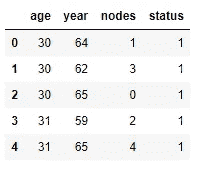

```
# Personal preference: convert year format from 'YY' to 'YYYY'
haberman['year'] = haberman['year'] + 1900# Again, personal preference: convert survival status 1 and 2 to #'yes' and 'no', respectively
haberman['status'] = haberman['status'].map({1:'yes', 2: 'no'})# Print first 5 lines of altered dataset
haberman.head()
```

输出:

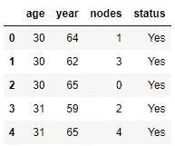

```
# Print the number of rows and columns for the dataset
haberman.shape
```

输出:

(306, 4)

**观察:**

1.  的。csv 文件包含来自 306 名患者的数据，存储在描述数据集特征的行和 4 列中。

```
# Print the column names in dataset and the data type
haberman.columns
```

输出:

索引(['年龄'，'年份'，'节点'，'状态']，类型= '对象')

```
# Details about the dataset
haberman.info()
```

输出:

```
<class 'pandas.core.frame.DataFrame'>
RangeIndex: 306 entries, 0 to 305
Data columns (total 4 columns):
age       306 non-null int64
year      306 non-null int64
nodes     306 non-null int64
status    306 non-null int64
dtypes: int64(4)
memory usage: 9.6 KB
```

**观察:**

1.  该数据集中没有缺失值。
2.  这 3 个属性是 int 数据类型，最后一个属性被转换为分类数据类型。
3.  在“状态”栏中，最初的 int-type 被映射为“是”，这意味着患者存活超过 5 年。值“2”被映射为“否”，这意味着患者在 5 年内去世。

```
# Statistically describe the dataset
haberman.describe()
```

输出:

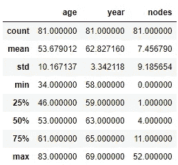

**观察:**

1.  计数:每个相应列中存在的数据点总数为 306。
2.  Mean:关于年龄、年份和节点的每一列的平均值。
3.  Std(标准偏差):衡量一组数值与平均值或期望值相差多远。
4.  Min(最小值):每列中出现的最小值。
5.  25%四分位数:1/4 的数据点低于规定值。
6.  50%四分位数:1/2 的数据点低于提供的值。
7.  75%四分位数:3/4 的数据点低于规定值。
8.  Max (Maximum):每列的最大值。

```
# Count each type of status in the dataset
haberman["status"].value_counts()
```

输出:

```
Yes 225
No 81
Name: status, dtype: int64
```

**观察:**

1.  value_counts 函数详细说明每个类有多少个数据点。这段代码描述了 5 年后有多少患者存活，有多少患者死亡。
2.  在 306 名患者中，225 名存活，81 名未超过 5 年。

```
# Create a 'yes status' dataset to store 'yes' values for the patients that survived
status_yes = haberman[haberman["status"] == 'yes']
status_yes.describe()
```

输出:

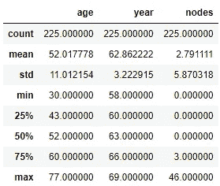

```
# Create a 'no status' dataset to store values for the patients that did not survive
status_no = haberman[haberman["status"] == 'no']
status_no.describe()
```

输出:


## 观察结果:

1.  关于年龄:否和是数据集的平均年龄和年份之间的差异没有统计学意义。**注意:**然而，有一种趋势描述了手术后 5 年未存活患者的年龄普遍增加。这种增加可以在非存活患者的最小年龄、四分位数百分比和最大年龄中看到。
2.  年份:平均年份和否与是数据集之间的差异在统计学上并不显著。
3.  在节点上:“是数据集”和“否数据集”的平均节点数都有显著增加。“无数据集”中的最大节点数也有所增加。无数据集的四分位数百分比也高于有数据集。**注意:**例如，对于 75%在手术后 5 年内死亡的患者，发现他们有 11 个或更多的淋巴结，相比之下，存活的患者只有 3 个淋巴结。

**模型洞察:**

1.  平均而言，存活下来的人比没有存活下来的人少大约 2.5 倍的节点。存活的患者平均有 2.79 个淋巴结，而未存活的患者平均有 7.46 个淋巴结。

# 5.单变量分析

单变量分析是分析数据的最简单形式。这个过程不处理原因或关系，因为只涉及一个变量。相反，它的主要动机是描述；它获取数据，汇总数据，并找出单个特征中存在的模式。

## 5.1 概率密度函数

概率密度函数(PDF)是一种统计方法，用于衡量离散值的可能结果。PDF 绘制在一个典型的类似钟形曲线的图表上，结果的概率位于曲线之下。

这里，柱的高度表示相应组下的数据点的百分比。

PDF 背后的直觉是什么？

```
# Create a function for PDF analysis
def histoPDF(featureVar, classVar):
    sns.FacetGrid(data = haberman, hue = classVar, height = 5) \
    .map(sns.distplot, featureVar) \
    .add_legend(); 
    plt.title("Histogram for " + featureVar)
    plt.ylabel("density")
    plt.plot('histogram_2.png')# PDF histogram for age v. status
histoPDF('age', 'status')
```

输出:

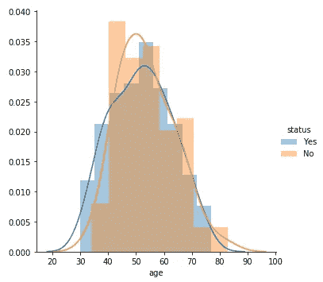

## 观察结果:

1.  观察到大量的重叠，这表明年龄不是决定患者存活率的主要因素。
2.  给定 PDF 中的重叠量,“是”数据集和“否”数据集之间的年龄差异几乎不可见。也许另一种统计方法可以揭示年龄和生存状态之间的模式。

**模型洞察:**

1.  30-40 岁的人有更高的存活率，而 40-60 岁的人则没有。对于 60 岁以上的人来说，存活的机会大约是 50/50。

```
# PDF histogram for year v. status 
histoPDF('year', 'status')
```

输出:

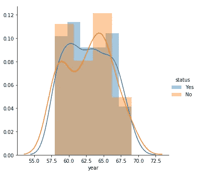

## 观察结果:

1.  主要的重叠继续再次表明，患者手术的年份并不影响他们 5 年后的生存率/结果。
2.  1965 年手术的病人死亡率有一个高峰，而 1960 年手术的病人死亡率有所下降。
3.  在 1960-1962 年间，病人存活的可能性增加了。

```
# PDF histogram for nodes v. status
histoPDF('nodes', 'status')
```

输出:

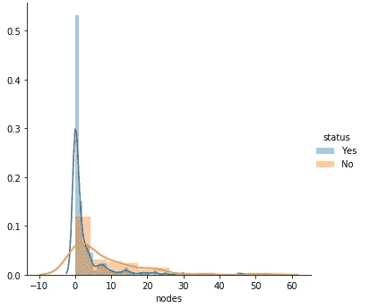

## 观察结果:

1.  完全分离将是理想的，以区分存活患者的确切淋巴结数量。
2.  有 0 个淋巴结或 1 个淋巴结的患者更有可能存活。如果有 25 个或更多的节点，存活的机会很小。
3.  该图显示，淋巴结数目似乎比年龄和手术年份更能影响患者的存活率。

**模型洞察:**

1.  5 个淋巴结后，患者越来越有可能无法存活。

# 6.累积分布函数

CDF 创建了一个经验累积分布函数图。使用 CDF 图确定 x 轴上等于或低于给定值的数据百分比。

```
# CDF analysis 
count1, bin_edges1 = np.histogram(status_yes['nodes'], bins = 10, density = True)
pdf1 = count1/(sum(count1))
print(pdf1, bin_edges1);
cdf1 = np.cumsum(pdf1)
plt.plot(bin_edges1[1:], pdf1)
plt.plot(bin_edges1[1:], cdf1, label = 'Yes')
plt.xlabel('nodes')print("---------------------------------------------------------")count2, bin_edges2 = np.histogram(status_no['nodes'], bins = 10, density = True)
pdf2 = count2/(sum(count2))
print(pdf2, bin_edges2);
cdf2 = np.cumsum(pdf2)
plt.plot(bin_edges2[1:], pdf2)
plt.plot(bin_edges2[1:], cdf2, label = 'No')
plt.xlabel('nodes')
plt.legend()plt.show()
```

输出:

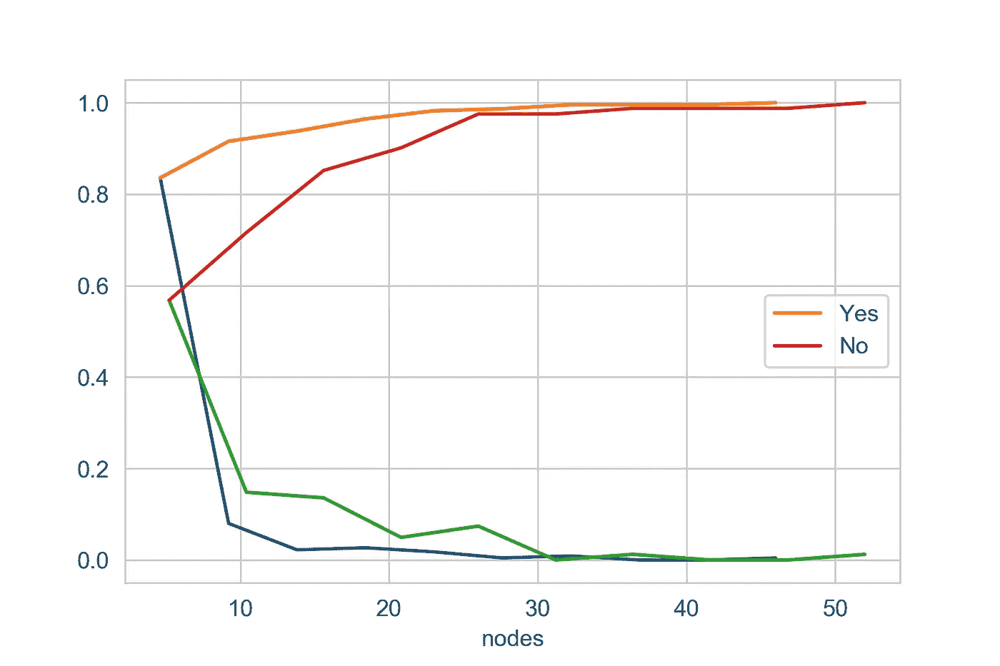

## 观察结果:

1.  根据 CDF 汇总统计，大约 83.55%存活的患者的淋巴结在 0 至 4.6 范围内。

# 7.盒须图和小提琴图

盒须图也称为盒状图，显示一组数据的五个数字汇总。五位数汇总是最小值、第一个四分位数、中值、第三个四分位数和最大值。该方框从数据的下四分位数延伸到上四分位数，中间有一条线。触须从框中延伸出来，以显示数据的范围。离群点是那些超过胡须末端的点。

小提琴图是箱线图和概率密度函数(CDF)的组合。Violin 图允许可视化一个或几个组的数字变量的分布。这是箱线图的近似形式，但可以更深入地理解密度。

```
# Create box and whisker plot for each feature
plt.figure(1)
plt.figure(figsize = (15, 5))
plt.subplot(131)
sns.boxplot(x = 'status', y = 'age', data = haberman)
plt.subplot(132)
sns.boxplot(x = 'status', y = 'year', data = haberman)
plt.subplot(133)
sns.boxplot(x = 'status', y = 'nodes', data = haberman)
plt.show()
```

输出:

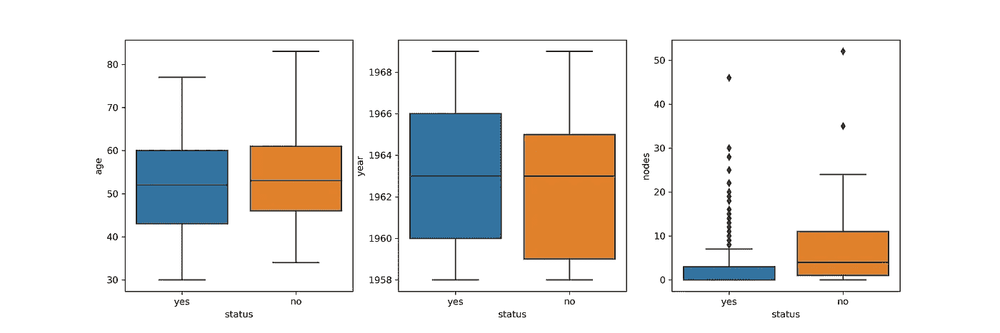

```
# Create violin plots for each feature
plt.figure(1)
plt.figure(figsize = (15, 5))
plt.subplot(131)
sns.violinplot(x = "status",y = "age",data = haberman,height = 10)
plt.subplot(132)
sns.violinplot(x = "status",y = "year",data = haberman,height = 10)
plt.subplot(133)
sns.violinplot(x = "status",y = "nodes",data = haberman,height = 10)
plt.show()
```

输出:

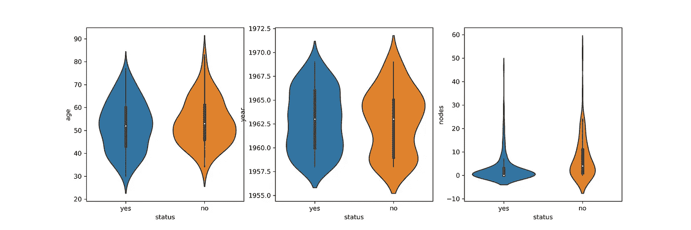

**观察:**

1.  相对而言，45 至 65 岁年龄组中有更多的人没有活下来。然而，患者年龄本身并不是决定其存活率的重要参数。
2.  在 1965 年接受手术的人中，有更多的人活不过 5 年。
3.  超过 1 个淋巴结的患者存活的可能性更小。一般来说，越多的淋巴结意味着存活率越低。
4.  大部分存活的患者没有淋巴结。然而，有一小部分腋窝淋巴结为 0 的患者在术后 5 年内死亡，因此没有腋窝淋巴结阳性不能保证存活。
5.  年龄和年份参数的箱线图和小提琴图给出了相似的结果，数据点有很大的重叠。与其他特征相比，节点的箱线图和小提琴图中的重叠较少，但是重叠仍然存在，因此很难设置阈值来对两类患者进行分类。

# 8.双变量分析

双变量分析是定量分析的另一种简单形式。双变量分析是对两个变量(属性)的同时分析。它探讨了两个变量之间关系的概念，是否存在关联以及这种关联的强度，或者两个变量之间是否存在差异以及这些差异的意义。

## 8.1 散点图

散点图揭示了两个变量之间的关系或关联。这种关系通过图中的任何非随机结构表现出来。
“关系”是指存在某种结构化关联(线性、二次等。)在 X 和 y 之间。

散点图是确定相关性的有用诊断工具，但如果存在这种相关性，该图可能会也可能不会提示潜在的因果机制。散点图永远无法“证明”因果关系——最终只有研究人员(依靠基础科学/工程)才能得出因果关系确实存在的结论。*记住这句话:“相关性并不意味着因果关系”。*

```
# Create scatter plot of age v nodes
sns.set_style("whitegrid")
sns.FacetGrid(haberman, hue = "status", height = 6)\
.map(plt.scatter, "age", "nodes")\
.add_legend()
plt.show()
```

输出:

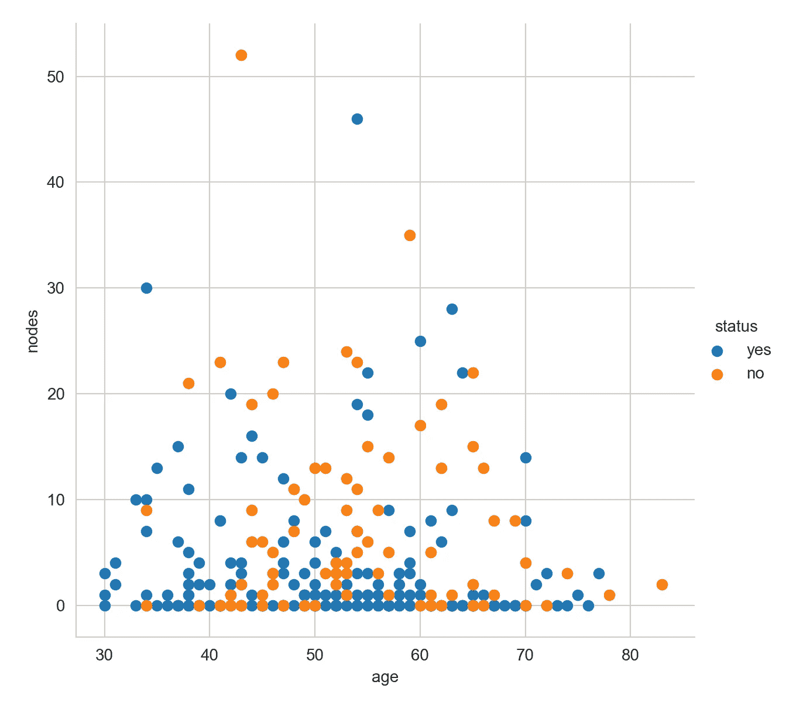

**观察结果**:

1.  年龄在 30 至 40 岁之间的 0 至 15 个淋巴结的患者更有可能存活。
2.  不考虑年龄，具有 0 至 1 个淋巴结的患者更有可能存活。
3.  50 岁以上有 5 个以上淋巴结的患者更有可能没有存活。

## **8.2 对图**

配对图用于理解最佳特征集，以解释两个变量/维度之间的关系或形成最大程度分离的聚类。在我们的数据集中画一些简单的线或者做线性分离，也有助于形成一些简单的分类模型。

```
# Create pair-plot to determine a possible relationship between the columns / attributes
sns.set_style("whitegrid")
sns.pairplot(haberman, hue = "status", height = 5)
plt.show()
```

输出:

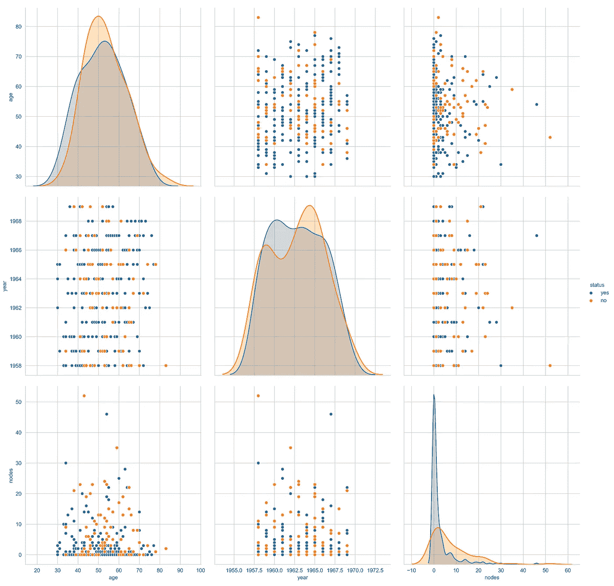

**观察:**

1.  在年龄与节点之间的配对图中，可以用两条重叠的钟形曲线来区分类别变量。
2.  为了进一步分析，年龄和节点属性可以考虑用于模式发现，因为您可以确定关系，无论多么模糊。
3.  然而，所有其他属性在它们的 PDF 中没有显示出太大的差异。

# 9.多变量分析

多元分析是一次对许多变量的统计调查。在生命科学中，大多数问题本质上都是多元的。多元分析是一组用于分析包含多个变量的数据集的技术，这些技术在处理相关变量时尤其有价值。这些技术为信息提取、回归或分类提供了一种经验方法；这些技术中的一些是最近开发的，因为它们需要现代计算机的计算能力。

# 9.1 等高线图

等值线图是一种图形技术，通过以 2D 格式绘制常量 z 切片(称为等值线)来表示 3D 表面。也就是说，给定一个 z 值，在 z 值出现的地方画出连接(x，y)坐标的线。

```
# Create contour plot for the cross section of 3D graph
sns.jointplot(x = "year", y = "age", data = haberman, kind = "kde")
plt.show()
```

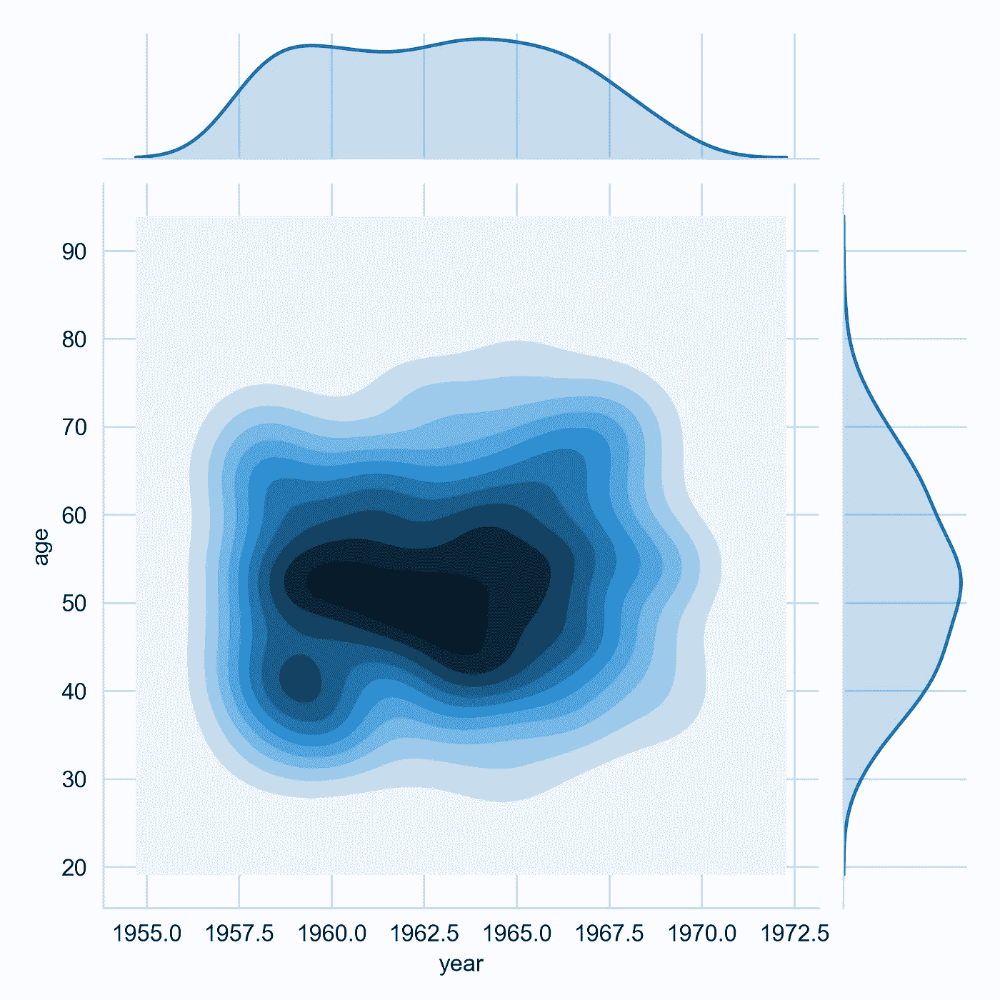

```
# Create contour plot for the cross section of 3D graph
sns.jointplot(x = "nodes", y = "age", data = haberman, kind = "kde")
plt.show()
```

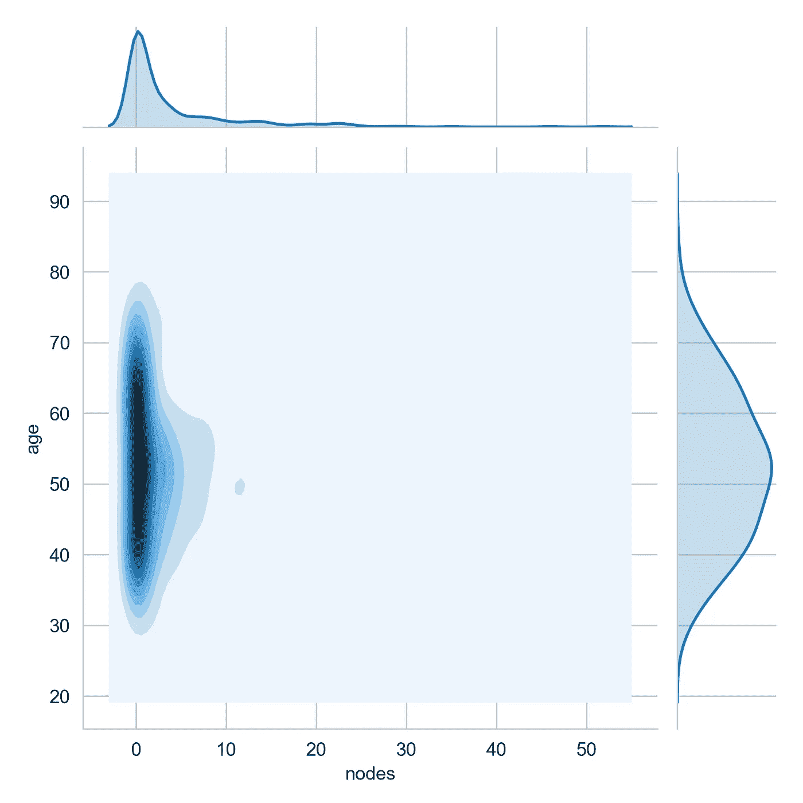

**观察:**

1.  大约从 1960 年到 1964 年，在 45 岁到 55 岁之间的病人身上完成了更多的外科手术。
2.  大多数 0 至 1 个淋巴结的患者年龄在 45 至 65 岁之间。

# 结论

1.  患者的年龄和手术年份本身并不是他们生存的唯一决定因素。然而，年龄小于 35 岁的人有更大的生存机会。
2.  存活的可能性似乎与每位患者发现的阳性腋窝淋巴结数成反比。然而，数据显示没有阳性腋窝淋巴结并不总是保证存活。
3.  对新患者的生存状态进行分类的目标是困难的，并且可能产生不可靠的结果，因为数据集需要额外的特征和属性。

# 10.简单哈伯曼生存模型

在数据分析和一点 EDA 之后，我们可以从上面的统计分析和图表中提取这些见解，以勾勒出一个预测患者存活率的简单模型。这是从哈伯曼数据集确定一个介绍性生存模型的许多方法之一。根据我观察到的数据，淋巴结的数量和年龄是决定病人生死的最大因素。您可以向该模型添加额外的功能来提高其准确性。

总的想法是，你允许你从 EDA 的观察来通知你的假设。

# 10.1 数据洞察

模型的计算方式:

1.  年龄分组在~10 年内，从 30 岁开始，到 83 岁结束
2.  按年龄组计算总人数。
3.  计算在该年龄范围内存活的总人数。
4.  计算在该年龄范围内死亡的总人数。
5.  计算每组的总节点数和存活状态。
6.  节点范围由从数据细节部分获取的幸存者和未幸存者的平均值决定。
7.  最后，计算存活节点的平均数量。
8.  并计算存活率。

**模型洞察概要**

```
Case 1: 
       10% Chance of not surviving when: 
       Age 30–40 
       Nodes <= 7Case 2: 
       31% Chance of not surviving when: 
       Age 40–50 
       Nodes >= 8Case 3: 
       28% Chance of not surviving when: 
       Age 50–60 
       Nodes >= 9Case 4: 
       29% Chance of not surviving when: 
       Age 61–70 
       Nodes >= 6Case 5: 
       29% Chance of not surviving when: 
       Age 71–83 
       Nodes <= 2
```

# 10.2 创建模型

在 EDA 过程和收集生存模型的见解中，我得出了一个假设。我的理论或对这个模型的期望包括一个总体趋势，而如果节点数量和年龄增加，患者存活率实际上会下降。

```
# Create a simple Survival Prediction Model with if/else statements **def** survivalModel(age, nodes):

    **if** nodes **in** range(0, 4):            
        **if** age **in** range(30, 41): 
            print('Survival rate is approximately 90%')

        **else**:
            print('Survival rate is approximately 74%')

    **elif** nodes **in** range(4, 7):              
        **if** age **in** range(30, 51):
            print('Survival rate is approximately 75%') **else**:
            print('Survival rate approximately 47%') **elif** nodes >= 7:              
        **if** age **in** range(30, 51):
            print('Survival rate is approximately 54%')

        **else**:
            print('Survival rate is approximately 40%')
```

# 10.3 测试结果

```
survivalModel(32,2)
```

**输出**:存活率约 90%

```
survivalModel(47,5)
```

**输出**:存活率约 75%

```
survivalModel(55,6)
```

**产量**:存活率约 47%

```
survivalModel(38,21)
```

**输出**:存活率约 54%

```
survivalModel(60,8)
```

**输出**:存活率约 40%

# 10.4 生存预测模型考虑因素

如果你对医学领域或普通生命科学感兴趣，我相信你很快就会意识到，有许多其他因素导致患者被诊断患有癌症，他们的治疗选择以及癌症存活的结果。其他因素，不包括在这个数据集，有助于癌症的生存，包括病人的饮食，一般身体健康，遗传素质等。因此，为了开发一个更加精确、可靠和全面的癌症生存预测模型，我们的数据集需要包括所有这些因素，以及其他无形(抽象)的因素，如手术过程中的人为错误、药物对身体的影响、手术后护理等。

然而，作为 EDA 的初学者指南，正如您已经发现的那样，Haberman 数据集是有限的，因此我们的预测模型实际上在范围和准确性方面都是有限的，即使是在使用当今具有相同癌症诊断的患者数据时也是如此。但是对于我们所需要的来说，它非常好，并且在实现模型时没有可怕的暗示，所以不用担心。我只想提几个警告。该模型的范围有限，不应用于任何关键决策。

总之，在创建模型时，您可以使用任何分类算法，如逻辑回归和支持向量机，如果您有足够的数据，您可以尝试神经网络。这只是一个介绍，您需要识别或创建更多的功能，执行功能缩放，最重要的是识别相关性和因果关系之间的差异。

## 参考资料:

[1] E. Just，L. Thatcher，T. Lawry，[医疗保健中的机器学习:首席执行官必须知道哪些才能在他们的组织中有效地使用它(执行报告)](https://www.healthcatalyst.com/whitepaper/machine-learning-in-healthcare-what-c-suite-executives-must-know-to-use-it-effectively-in-their-organizations/) (2018)，Health Catalyst AI 知识中心