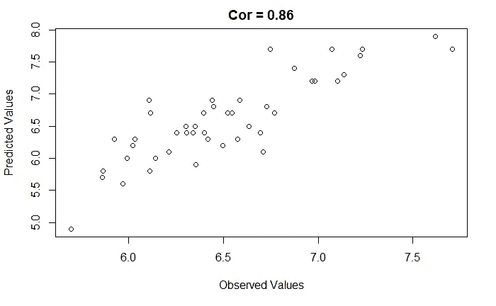

# 从头开始创建一个简单的统计学习模型:在回归中强调预测

> 原文：<https://towardsdatascience.com/how-to-create-a-simple-statistical-learning-model-from-scratch-emphasizing-prediction-in-620d6fd8b94b?source=collection_archive---------20----------------------->

## 在 lm 的引擎盖下发生了什么？线性回归的估计、预测和验证教程

学习统计/机器学习可能会令人生畏，尤其是如果你像我一样来自另一个领域(例如，社会科学、生命科学、商业等)。有数百种复杂的模型可供选择，并且有大量的方案来验证您的数据。在这里，我们将仔细研究一个简单的预测模型，如果你完成了统计学课程，你可能会遇到回归。为什么这么简单？回归可能不像其他一些方法那样吸引人，但对基础知识有更深的理解对于转向更复杂的模型无疑是重要的。

当学习回归时，重点可能不是在**预测**(或预测值来自哪里)，而是跳到输出，检查系数，并祈祷与所述系数相关的 p 值低于. 05。回归不一定只是推断统计的工具。正如我提到的，如果你已经运行了一个回归分析，你就已经完成了一个包括计算预测值的计算。

下面，我们将解开预测如何在两种不同的背景下展开。在第一种情况下，我们将处理存在 y 值的数据，这是一种常见的情况，分析师正在对结果和预测变量之间的关系进行推断。在第二种情况下，我们将预测遗漏数据的新 y 值。我们将在没有函数或库的帮助下完成所有这些，以说明如何使用线性回归作为经典 iris 数据集的基本预测工具。

首先要做的是加载虹膜数据集:

在我们开始自己的计算之前，让我们先来看看如何拟合一个线性模型，并使用该模型通过“lm”函数来预测基数 R 中的一些新数据。我们将尝试从 iris 数据集中的其他 3 个数值变量来预测萼片长度。首先，我们将获取一些训练数据(70/30 分割)并拟合我们的模型。

现在，我们将创建一些测试数据，并将其与来自训练数据的模型相结合，以创建一些预测。

预测看起来很棒！如果有人不小心删除了花卉数据库中有关鸢尾属植物萼片长度的信息，我们可以有把握地说，我们会很好地恢复这些信息。

当然，我们在这里关心的是确定“predict”正在做什么来产生这些值。我们一会儿就来看看。但是首先，我们将在更一般的意义上检查线性回归模型的预测。

我们将从检查如何在一组数据上预测新值开始，其中**y 值和预测变量都存在(使用我们创建的 iris 训练数据作为例子)。首先，我们需要把 x 值和 y 值分开。我们将用一列 1 填充 x 矩阵来表示截距。**

现在，我们需要转置 X，并将其乘以自身( *X'X)* 。这导致平方和/叉积矩阵， *SSCP* 。事实证明，通过一些操作，这个矩阵可以描述一组变量之间的方差/协方差、相关性或余弦关联。如果你有兴趣听到更多关于这方面的信息，请点击这里查看我的帖子。

我们的计算与实际叉积函数的输出相匹配。

接下来，我们将计算一个投影矩阵或*帽子矩阵*(在它的对角线上是观察杠杆)。

这将允许我们将 *y* 映射成预测的 y 值。

因此，如果我们可以访问 y 值，我们可以将它们与投影矩阵结合起来获得预测。这很好，但是我们如何使用训练数据来预测测试数据中 y 的新值呢？为此，我们需要为包含 y 值和 x 值之间关系信息的训练数据计算β系数。

通过与“lm”产生的值进行比较，我们可以确保计算出的β值确实是正确的。

我们可以将模型截距加到我们的测试数据中，然后乘以β系数(截距除外)，得出我们的预测值。

到目前为止，我们所学的可以很容易地扩展到 kfold 交叉验证方案。下面的函数将创建折叠并返回一个包含原始数据集的列表，其中折叠作为一个新列。此外，还将返回包含折叠索引本身的列表。

让我们创建折叠，并确保他们有意义。

并使用 5 重交叉验证来拟合我们的模型:

我们可以提取和检查预测汇总统计数据。

最后，我们可以将我们的折叠指数传递给流行的预测建模包 caret，并确认我们的计算。

通过对折叠进行平均，我们的统计数据与 caret 的输出相匹配。

总之，我们仔细研究了预测在回归环境中的作用。我们最终能够应用我们所涵盖的计算对遗漏的数据进行预测。希望本教程能让你明白，当你在一行包含“lm”函数的代码上按下 ctrl+enter 时会发生什么。