# 如何在 Excel 中创建显示覆盖在样本指标上的正常范围的可视化？

> 原文：<https://towardsdatascience.com/how-to-create-a-visualization-showing-normal-range-overlaid-on-sample-metrics-in-excel-c73fc08c05b5?source=collection_archive---------3----------------------->

**本文简介**:创建图表的分步指南，该图表显示覆盖在多个数据系列的平均值、最小值和最大值上的正常范围。换句话说，实际与目标图表。本教程结束时，您将能够在 MS-Excel 中生成如下内容:

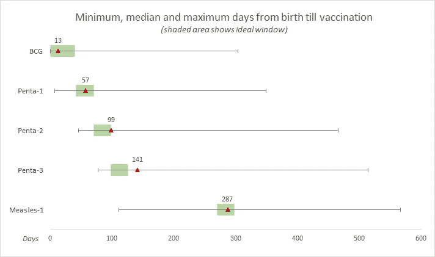

上面的图像来自我在 T2 发表的一篇研究论文，研究儿童接种疫苗的及时性。我们展示了自出生以来，儿童接受某种疫苗的天数范围。在此基础上，我们还在同一图表中显示了该疫苗的理想时间窗口。这有助于比较各种疫苗接种时机的好坏。

将定量变量的正常或理想范围覆盖在实际结果之上是可视化这种比较的常用方法。为了在 Excel 图表中实现这一点，我们依赖于为正常范围窗口和实际结果创建单独的数据系列。然而，为了获得不错的结果，我们需要*滥用【Excel 提供的工具；我们用散点图而不是条形图来表示数据。如果你想自己练习，完整的教程文件在这里可以找到[。](https://drive.google.com/file/d/1E1adQDxbUt8PJMd1kpGrpEZXq7zfWJM5/view?usp=sharing)*

## 第一步:整理数据

创建图表需要三组数据*:你想要显示的实际结果，代表要覆盖的正常范围的数值，第三组是在 y 轴上放置标签的数据。让我逐一解释。*

***系列 1:实际结果需要显示***

这个系列有 6 个栏目。前三个是:

*   **样本中的儿童在出生后接受某种疫苗接种的最小**、**中位数**和**最大**天数。例如，对于我收集的数据中的卡介苗，这些值分别为 0、13 和 304 天。稍后，中位数将在散点图中绘制为 x 值。

下一个是 y 值列:

*   **y 值**:包含每个 x 值的 y 值。这些是手动创建的，不是来自数据。当我们创建散点图时，您会看到这些值只是用来在 y 轴上垂直分布 x 值。

除此之外，还需要两列:

*   **err_neg** =中值—最小值
*   **err_pos** =最大值—中值

上面两列计算的数字将用于在中间值的两侧创建适当长度的误差线。您的数据表现在应该看起来像这样:

您可能会发现上表中列的位置有点奇怪。我这样做只是为了以后创建散点图更容易一些，只要正负误差的公式正确工作，列的顺序真的不重要。

***系列 2:您需要显示的正常范围窗口***

塑造这个系列的过程与第一个系列完全相同，有两个不同之处:

1.  该系列中的最小值和最大值代表给定类别的任何正常范围的最小和最大极限。例如，儿童出生后应接种卡介苗的正常/适当天数的最小值和最大值分别为 0 天和 40 天。
2.  这种情况下正常范围的‘中位数’是一个计算值，我们可以通过这个公式得到: **=MEDIAN(min，max)** 。

该系列的数据表应该如下所示:

***系列 3:放置在 y 轴上的分类标签***

我们可以简单地使用图表本身提供的 y 轴，但是我发现要将标签正确地放置在正确的距离上，并且没有显示 y 轴本身，这是非常烦人和困难的。因此，我使用了另一个数据系列来绘制标签，就像数据点一样。这给了我们更多的控制标签出现的地方。在本系列中，我为每个类别创建了 x 和 y 值列。下面的截图可以帮助你准备这个系列:

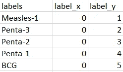

## 步骤 2:创建散点图

要创建第一个散点图，作为以后添加的所有内容的基础，首先选择前面创建的第一个系列(结果)的中间值和 y 值列。然后在功能区菜单中找到“插入”选项卡，选择第一种类型的“散点图”。

这应该给出下面的基本散点图。在这里，将轴调整正确是很重要的。如果你做得对，数据点应该对下面显示的 x 轴值有意义。

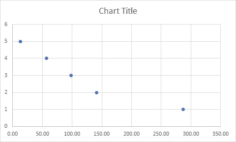

> 提示:如果您不确定散点图中的哪一列是 x 或 y 值，您可以通过右键单击图表，选择“选择数据”,然后单击相关系列的“编辑”按钮进行检查。这将显示哪个范围被选择为 x 值，哪个范围被选择为 y 值。

现在让我们清理一些图表垃圾，给我们一些喘息的空间。单击 y 轴以及垂直和水平网格线，然后按“Delete”键将其删除。

现在，我们将数据点标记从圆形转换为向上的三角形。双击任何数据点以选择整个系列。如果格式工具栏还没有打开，这应该会打开它。找到线条和标记设置，并从标记选项的内置选项中选择三角形。将“深红色”填充颜色(或您喜欢的任何颜色)应用于同一工具栏中的标记，并将相同的颜色应用于标记的边框。

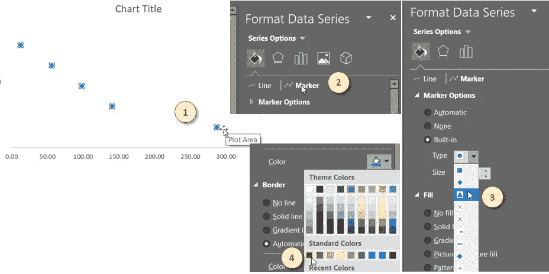

现在你应该有这样漂亮的尖角标记:

现在，为了在中间值周围添加代表最小值和最大值的条，我们将使用误差线。单击图表顶部附近的“添加图表元素”按钮(或从功能区菜单中)，然后单击“误差线”将水平和垂直误差线添加到数据点。然后点击垂直误差线，按“删除”键，只留下水平误差线。

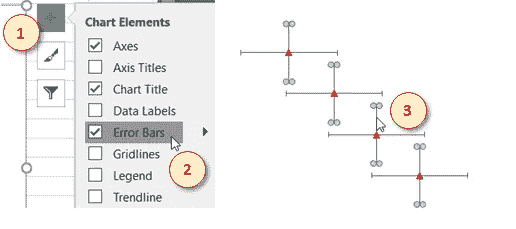

现在单击水平误差线，在属性工具栏中，为误差量选择“自定义”选项。然后单击“指定值”按钮。这将打开一个对话框，询问正负误差量的数据范围。对于正误差，单击并拖动系列 1 的 **err_pos** 值，然后使用如下所示的 **err_neg** 值对负误差进行同样的操作。现在点击确定。

现在，您应该可以看到适当长度的误差线:

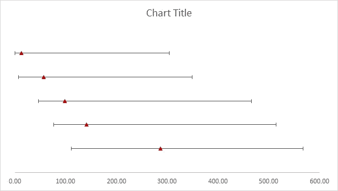

## 步骤 3:将第二个系列添加到散点图中

现在是时候添加代表正常窗口的第二个系列了。选中图表后，单击图表工具菜单中的“选择数据”。然后在“数据源”对话框中单击“添加”,添加新的一系列数据。在出现的下一个对话框中，通过单击并拖动第二个系列的 **win_mid** 和 **y 值**列下的值范围，添加这个新系列的 x 和 y 值(见下文)。您也可以从单元格 A8 中添加一个系列名称，但它以后不会显示在任何地方。现在单击确定，然后再次单击确定。

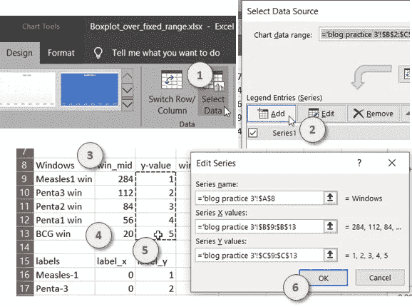

新系列应显示为代表正常范围窗口中点的点:

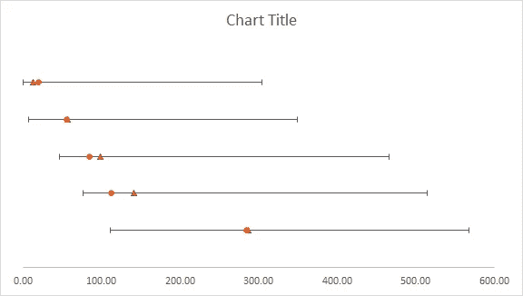

最终，我们将不再需要这些数据点，但为了便于选择，我们会暂时保留它们。对于这个系列，我们将再次使用误差线来创建一个正常的范围窗口。添加误差线的过程与我们在之前的系列中所做的完全相同。首先选择新系列的数据点，然后点击“添加图表元素”按钮，点击“误差线”选项添加误差线。然后选择垂直的并删除它们。

现在选择水平误差线，并在属性工具栏中为误差量选择“自定义”选项。然后点击“指定值”打开数值范围输入框。对于正误差，拖动第二系列数据中 **err_pos** 的值，对于负误差，使用 **err_neg** 下的值。然后单击确定。

在误差线仍处于选中状态的情况下，在误差线选项中选择“无帽”端样式。在填充和线条选项卡中，选择“实线”选项，并应用所示的绿色。然后改变透明度为 50%，宽度为 14 磅。

最后，要使中间的数据点消失，请单击任意数据点将其选中。然后在系列选项中选择“无填充”和“无线条”选项。

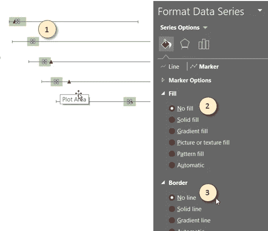

现在你应该有这样的东西:

## 步骤 4:创建标签系列

现在，我们将添加第三个也是最后一个系列，以显示图表中每个类别的标签。一般来说，这个过程与第二个系列相同，只是这里我们不使用任何误差线，而是从数据中添加标签。

选中图表后，单击图表工具菜单中的“选择数据”打开系列对话框。在这里，单击“添加”添加一个新系列。在接下来打开的范围输入框中，通过单击并拖动电子表格中第三个系列的 **label_x** 和 **label_y** 列下的值，添加适当的范围(见下图)。然后单击确定，再单击确定。

沿着图表的左边界，你会看到新的系列只是点状的小点。右键单击这些点，然后从菜单中单击“添加数据标签”来添加标签。

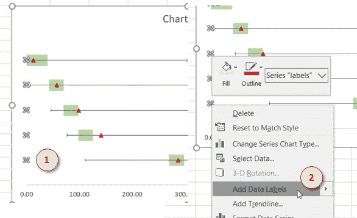

标签还没有显示任何有意义的东西，所以让我们来解决这个问题。单击任意数据标签以选择所有数据标签。然后在属性工具栏中找到“标签选项”，点击“单元格中的值”。这将打开一个范围输入框。现在单击并拖动电子表格中第三个系列的**标签**列下所有类别的名称，添加这个范围。单击确定。

要清理它，取消选中标签选项中的“Y 值”和“显示引线”选项，并选择“左”作为标签位置。要为标签留出空间，请单击中央图表区，然后向右拖动此矩形的左边界(见下图)。

最后，要删除点标记，请单击标签系列的任何数据点，然后为系列中的标记选项选择“无填充”和“无线条”选项。

至此，该图表在技术上已经完成，除了一些调整:

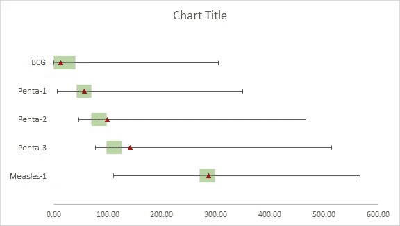

## 第五步:简化和美化

在这最后一步，我们将做一些最后的润色，使图表看起来更加专业和完善。

*   去掉 x 轴上的十进制数字:

*   添加有意义的图表标题:

*   使最小/最大条变粗并减少黑色:

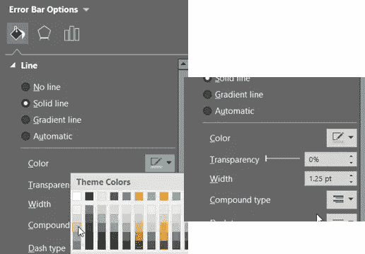

*   添加横轴标题，并将其命名为“Days”。
*   最后，让字体稍微大一点，让文字更易读。

恭喜你！现在您已经准备好了最终的图表:

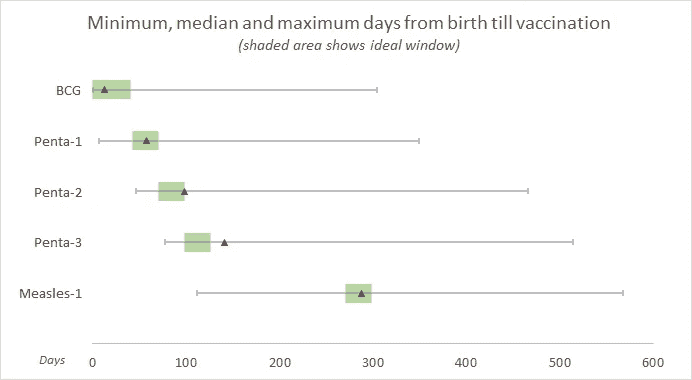

我个人喜欢做灰度图表，这里有一个灰度版本，可以获得更多灵感:

[在此下载完整的教程文件](https://drive.google.com/file/d/1E1adQDxbUt8PJMd1kpGrpEZXq7zfWJM5/view?usp=sharing)。