# 如何在 5 分钟内创建一个天气机器人

> 原文：<https://towardsdatascience.com/how-to-create-a-weather-bot-in-5-minutes-7d83b1052269?source=collection_archive---------12----------------------->

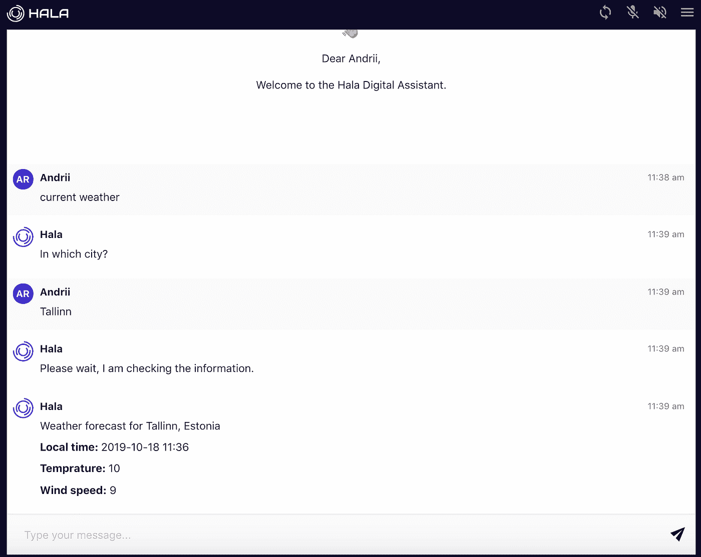

创建天气机器人来获取 Hala.ai 聊天中的天气信息。在本教程中，我们将使用服务[https://weatherstack.com](https://weatherstack.com/)来获取当前天气的信息。

**第一步。**去[https://weatherstack.com](https://weatherstack.com/)注册一个免费账户

**第二步。**注册后，转到[https://weatherstack.com/quickstart](https://weatherstack.com/quickstart)并复制为您的帐户生成的 API 访问密钥和基本 URL

**第三步。**转到 [Hala 平台](https://platform.hala.ai/)上的`Integration`部分，添加新的 integration REST API，并传递您在上一步中复制的值。保存您的结果。

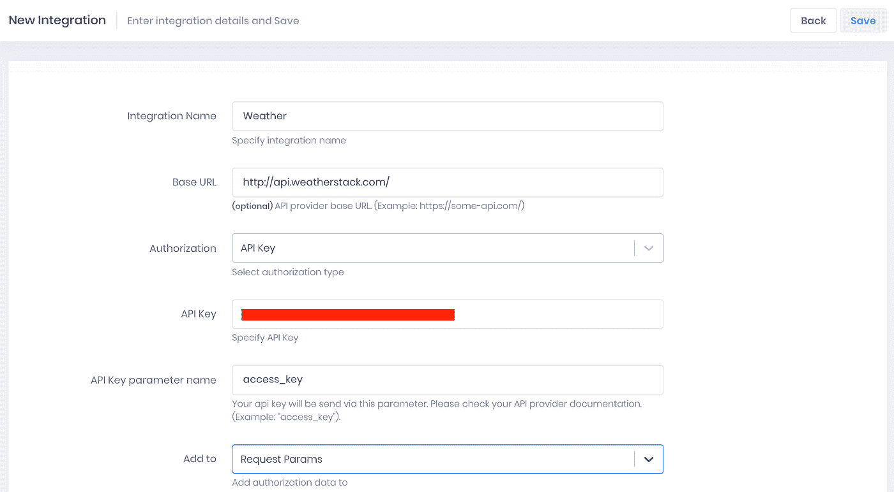

**第四步。**转到[哈拉平台](https://platform.hala.ai/)上的`Actions`段，新建一个`action`。提供操作的名称并选择集成。

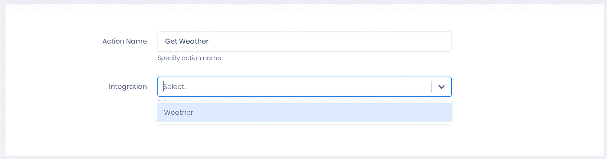

**第五步。**对你的 API 服务进行配置。您可以在 API 提供者的文档中找到关于构建 API 的更多信息。在我们的例子中，你可以在这里阅读这个服务的 API 文档。完成后，保存您的更改。

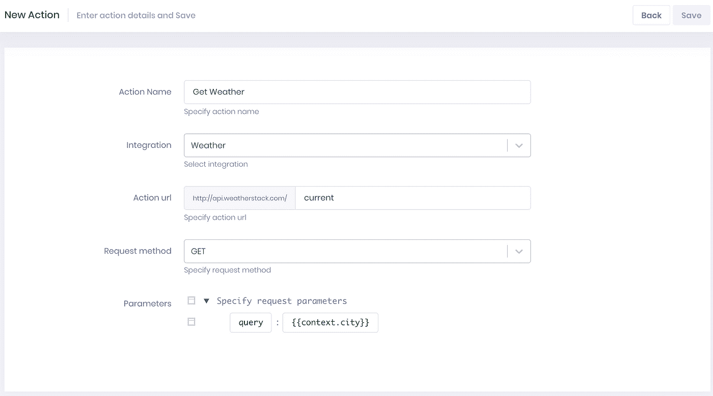

**第六步。**您已经设置了整合和行动。现在，您需要创建一个意图来识别关于获取天气的用户输入。转到[哈拉平台](https://platform.hala.ai/)上的`Intents`部分，按下`New Utterance`

**步骤 7。**要更改意向的默认名称，点击默认值旁边的铅笔图标，或者您可以点击默认值，然后您将能够修改它。


**步骤 8。**指定意图的名称并回车


**步骤九。**现在你需要提供最终用户如何撰写天气预报的例子。你需要提供至少五个例子。

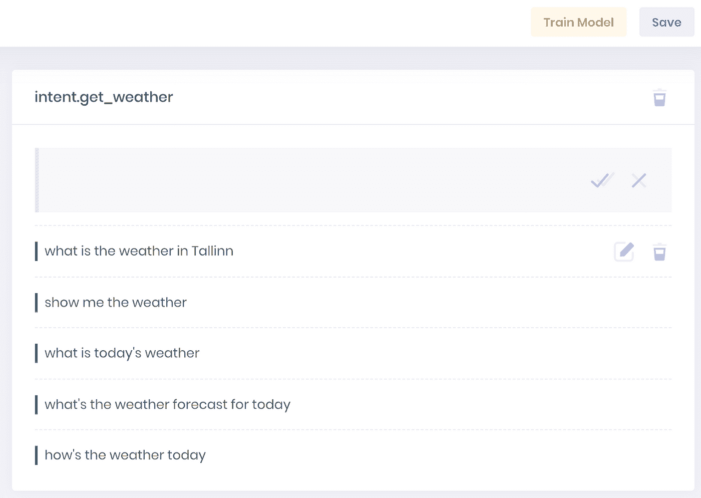

**第十步。** `Save`你的变化和`train model`

**第 11 步。**现在，您需要创建一个实体来识别我们需要提供天气的城市。转到[平台](https://platform.hala.ai/)上的`Entities`部分，按下`New Entity`

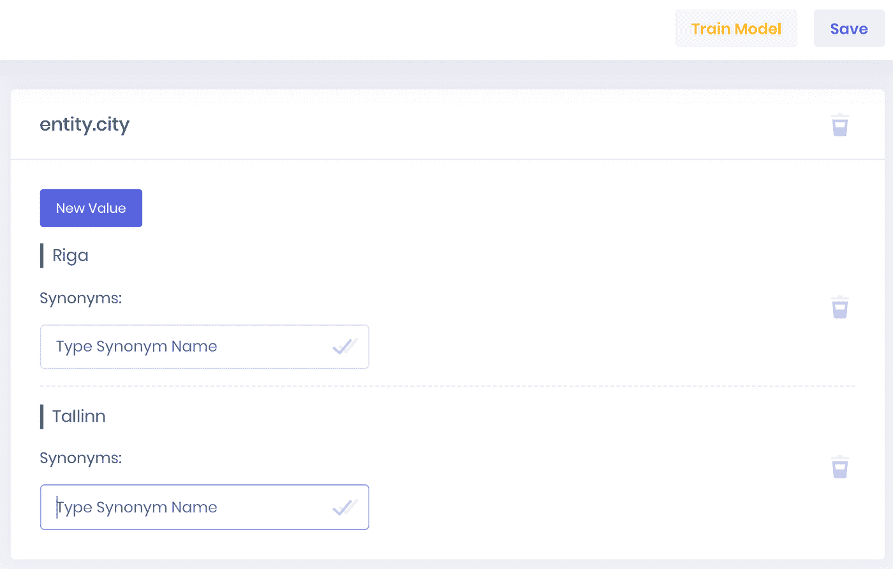

`Save`你的变化和`train model`

**第十二步。**进入[哈拉平台](https://platform.hala.ai/)的`Skill Kit`部分，按下`Create skill`按钮创建技能

**第十三步。**提供技能的名称、描述和标签(最后两个是可选的)。按“下一步”创建对话流。

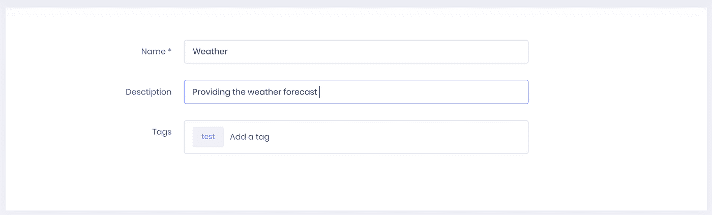

**第十四步。**你将进入创建对话流程界面。按下按钮`Add new`创建第一个根节点

**第十五步。**打开已创建的对话框节点并填充。

*   字段名称—您可以输入任何值，例如“用户询问天气预报”
*   条件——这里需要指定创建意图`intent.get_weather`

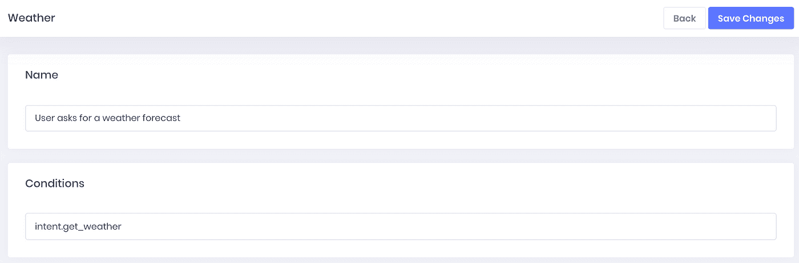

*   操作—跳过此部分
*   上下文—跳过此部分
*   输出—这里我们需要询问用户我们需要为哪个城市提供天气预报

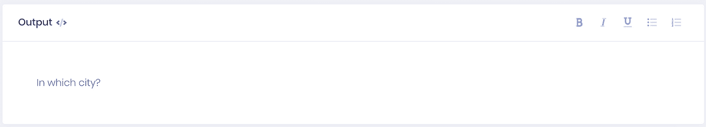

**第十六步。**现在您需要创建一个子节点来识别用户关于城市的输入。

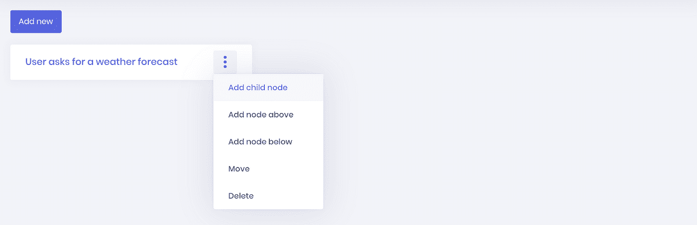

**第十七步。**打开子节点，填充。

*   字段名称—您可以输入任何值，例如“表单成功”
*   条件—这里需要指定实体`entity.city`

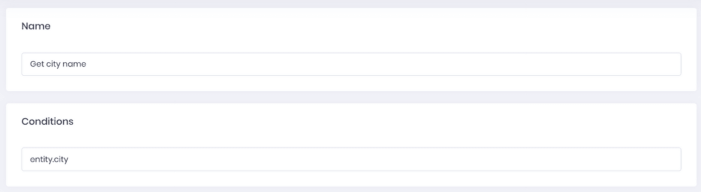

*   动作——当我们获得关于城市的信息时，我们可以向气象服务发送 API 请求。我们需要添加之前创建的操作。

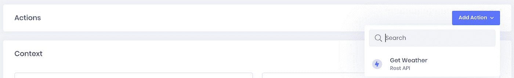

查找并添加操作

当您添加操作时，您需要指定存储天气服务响应的上下文变量，例如`context.weatherResponse`

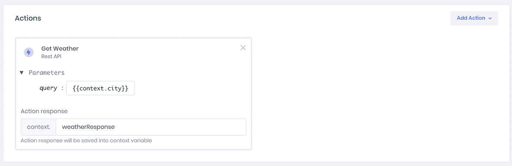

*   上下文—这里我们需要将城市名保存到上下文变量中，该变量将被发送到天气服务。

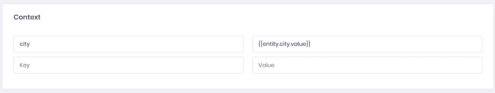

*   Output —在 Output 中，您可以这样写“请稍候，我正在检查信息。”

**第十八步。**创建一个新的子节点来处理来自天气服务的 API 响应。

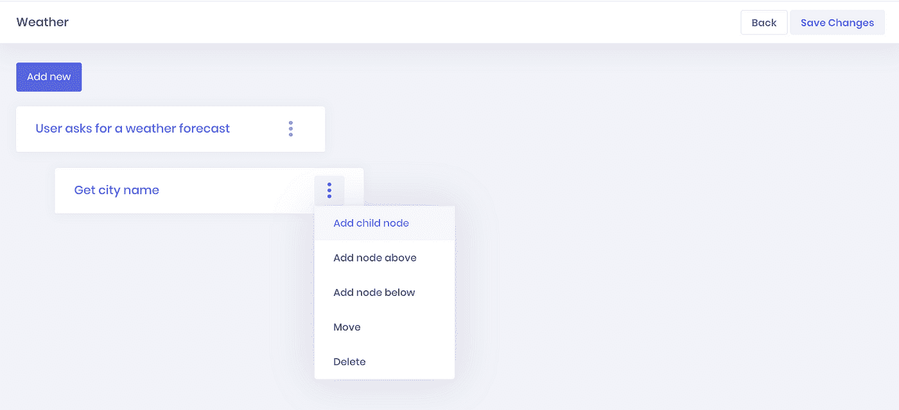

打开创建的节点并填充它:

*   字段名称—您可以输入任何值，例如“提供结果”
*   条件—指定在先前步骤中为动作响应创建的上下文变量:`context.weatherResponse`

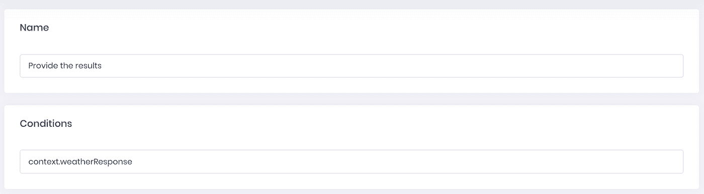

*   操作—跳过此部分
*   上下文—跳过此部分
*   输出—在输出中，我们需要提供关于天气的信息。要从 API 响应中访问数据，您需要使用下一个前缀`context.weatherResponse.`，然后指定所需数据的路径。所有的 API 提供者都有关于使用他们的 API 的信息。您可以阅读这些信息来创建正确的数据提取路径。

你可以使用下一段文字:

```
Weather forecast for {{context.weatherResponse.request.query}}Local time: {{context.weatherResponse.location.localtime}}Temprature: {{context.weatherResponse.current.temperature}}Wind speed: {{context.weatherResponse.current.wind_speed}}
```

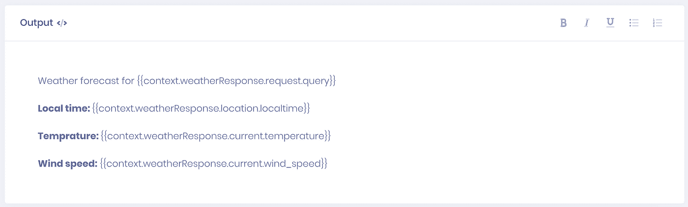

**第 19 步。**按下“保存更改”按钮保存更改。现在，您已经创建了具有一个对话框节点的简单技能。

请记住保存您的更改。

**第二十步。**检验结果。使用下一个链接[https://chat.hala.ai/](https://chat.hala.ai/)进入[哈拉网络聊天](https://chat.hala.ai/)，并在聊天中键入第一条消息。您可以键入一个经过训练的短语，也可以使用未在意向训练中指定的新短语。


恭喜你！您已经创建了技能(机器人)并测试了它。