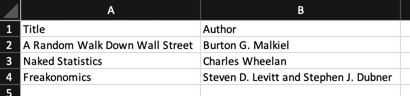

# 如何在 R 中创建一个带有自动 Amazon 附属链接的交互式书单

> 原文：<https://towardsdatascience.com/how-to-create-an-interactive-booklist-with-automatic-amazon-affiliate-links-in-r-7c1304dec43?source=collection_archive---------24----------------------->


Photo by [Piotr Cichosz](https://unsplash.com/@ptrc?utm_source=medium&utm_medium=referral)

# 介绍

B 书目是分享你读过的书籍、推荐给其他读者和/或推广你所写的书籍的有用方式。它可以简单到在你的个人网站或博客上显示的一系列书名。然而，你可能希望以一种更复杂的方式来呈现这份书单，比如在一个表格中列出书名、作者和购买链接。

在这篇博文中，我将向你展示如何在 r 中创建一个带有自动 Amazon 附属链接的交互式书单。此外，我所说的自动亚马逊联盟链接指的是直接重定向到亚马逊网上商店中有问题的书的 URL(当然是你的联盟链接),而不是手动为每本书创建一个链接。

这种技术对那些列表中有数百本书的人特别有用，因为你只需要创建一次 URL，它就会自动适应所有的书。如果这还不清楚，请看这里的一个[实例](https://www.antoinesoetewey.com/files/booklist.html)。

# 要求

为了用你的会员链接建立这个扩充的书单，你需要:

*   一个亚马逊协会的账户。如果您还没有帐户，请在此注册
*   书单(你推荐和/或你写的)

# 创建书单

你有两个选择:

1.  在 Excel 中创建它，然后导入到 R
2.  直接在 R 中创建它

# 在 Excel 中创建它，然后导入它

最简单的方法是遵循以下步骤:

1.  打开一个 Excel 文件，用两列填写:(I)一列是标题，(ii)第二列是作者(见下图)
2.  以. csv 格式保存(在 Excel 中，文件>另存为…>选择 CSV 文件格式并保存)
3.  将其导入到 R 中(如果您在导入过程中遇到困难，请参见[如何导入. csv 文件](https://www.statsandr.com/blog/how-to-import-an-excel-file-in-rstudio/))
4.  (如果您以后需要编辑该列表，请直接在。csv 文件而不是 Excel 文件)

下面是你在 Excel 中创建的书单的样子(你的书单里应该有更多的书):



Step 1: Booklist created in Excel

我们现在将它导入 RStudio，并将数据集重命名为`dat`(参见[这里的](https://www.statsandr.com/blog/how-to-import-an-excel-file-in-rstudio/#user-friendly-way)为什么我总是使用通用名称而不是更具体的名称):

```
dat <- read.csv("booklist.csv", # name of your file with .csv extension
  header = TRUE, # names of variables are present
  sep = ","
) # values are separated by a comma
```

您可以通过运行`head(name_of_dataset)`或`View(name_of_dataset)`来检查您的书目是否被正确导入。

# 直接在 R 中创建它

您可以使用命令`data.frame()`直接在 R 中创建您的图书列表:

```
# Create the data frame named dat
dat <- data.frame(
  "Title" = c(
    "A Random Walk Down Wall Street",
    "Naked Statistics",
    "Freakonomics"
  ),
  "Author" = c(
    "Burton G. Malkiel",
    "Charles Wheelan",
    "Steven D. Levitt and Stephen J. Dubner"
  ),
  stringsAsFactors = FALSE
)
# Print the data frame
dat##                            Title                                 Author
## 1 A Random Walk Down Wall Street                      Burton G. Malkiel
## 2               Naked Statistics                        Charles Wheelan
## 3                   Freakonomics Steven D. Levitt and Stephen J. Dubner
```

# 让它互动

为了能够按作者或书名搜索书籍，我们使用 DT 包中的`datatable()`命令。下面的代码为带有默认选项的表格:

```
library(DT)
datatable(dat)
```


Example of interactive table with the {DT} package

让我们通过以下方式改进此表:

*   删除行号
*   在“标题”和“作者”列上添加过滤器
*   增加了复制或下载表格的可能性
*   仅显示前 5 个条目，而不是 10 个
*   按书名升序排列书籍

```
datatable(dat,
  rownames = FALSE, # remove row numbers
  filter = "top", # add filter on top of columns
  extensions = "Buttons", # add download buttons
  options = list(
    autoWidth = TRUE,
    dom = "Blfrtip", # location of the download buttons
    buttons = c("copy", "csv", "excel", "pdf", "print"), # download buttons
    pageLength = 5, # show first 5 entries, default is 10
    order = list(0, "asc") # order the title column by ascending order
  )
)
```


Improved interactive table

# 将带有代销商链接的 URL 添加到表格中

我们现在要在上面的互动表格中添加取决于书名和作者的网址(包括你的会员链接)。为此，我们首先需要提取作为 URL 基础的附属链接，然后在 URL 末尾添加书名和作者。事实上，我们在 URL 的末尾添加了书名和作者，这使得它是自动的。事实上，最终的 URL 将重定向到该书的搜索页面(由于书名和作者作为关键字)，并包括您的附属链接(因为我们使用附属链接作为基本 URL)。

# 提取附属链接

要提取代销商链接，请遵循以下步骤(参见下图获取帮助):

1.  转到您的亚马逊协会帐户
2.  点击产品链接>链接到任何页面
3.  点击“搜索结果链接”选项卡
4.  为产品系列选择“书籍和教科书”
5.  输入你想要的任何关键字和你的链接的名称(这两个将在以后改变，所以你输入什么并不重要)
6.  点击“获取 HTML”按钮
7.  将预览(右窗格)中显示的代码复制到剪贴板中(Windows 上为 CTRL+c，Mac 上为 cmd+c)


Step 2: Link to Any Page on Amazon associates account


Step 3 to 7: Create Amazon affiliate link for a search page

您刚才复制的代码应该是这样的(虽然不完全相同，因为它包括您的个人会员链接):

`<a target="_blank" href="https://www.amazon.com/gp/search?ie=UTF8&tag=antoinesoetew-20&linkCode=ur2&linkId=a587bdd780cbbfb6d3f4569f7fb358fc&camp=1789&creative=9325&index=books&keywords=BOOK TITLE">BOOK TITLE</a>`

从这段长代码中，删除所有跟在`keywords=`后面的内容，但保留`keywords=`(这就是为什么你在上面的步骤 5 中键入的内容并不重要)。按照我们的示例，我们只剩下这段代码:

`<a target="_blank" href="https://www.amazon.com/gp/search?ie=UTF8&tag=antoinesoetew-20&linkCode=ur2&linkId=a587bdd780cbbfb6d3f4569f7fb358fc&camp=1789&creative=9325&index=books&keywords=`

复制这个缩短的代码。

# 追加书名和作者使其自动化

我们现在将连接(即，将几个字符串附加在一起)Amazon affiliate 链接(我们刚刚复制的代码)、书名和作者，然后是一个带有`paste0()`命令的结束 HTML 标记。结果将是一个 URL，它以附属链接为基础，以书名和作者为关键词，使它自动适应你书单上的每本书。为此，在 R 中运行以下命令:

```
# Do not mix " and ', they are different in this case!
link <- paste0(
  '<a target="_blank" href="https://www.amazon.com/gp/search?ie=UTF8&tag=antoinesoetew-20&linkCode=ur2&linkId=a587bdd780cbbfb6d3f4569f7fb358fc&camp=1789&creative=9325&index=books&keywords=', # affiliate link
  dat$Title, " + ", dat$Author, # book title and author
  '">Amazon</a>' # closing HTML tag
)
```

你的链接应该看起来像这样，所有的书都有相同的附属链接和结束标签，但有不同的关键字，对应于书名和作者:

```
head(link)## [1] "<a target=\"_blank\" href=\"https://www.amazon.com/gp/search?ie=UTF8&tag=antoinesoetew-20&linkCode=ur2&linkId=a587bdd780cbbfb6d3f4569f7fb358fc&camp=1789&creative=9325&index=books&keywords=A Random Walk Down Wall Street + Burton G. Malkiel\">Amazon</a>"   
## [2] "<a target=\"_blank\" href=\"https://www.amazon.com/gp/search?ie=UTF8&tag=antoinesoetew-20&linkCode=ur2&linkId=a587bdd780cbbfb6d3f4569f7fb358fc&camp=1789&creative=9325&index=books&keywords=Naked Statistics + Charles Wheelan\">Amazon</a>"                   
## [3] "<a target=\"_blank\" href=\"https://www.amazon.com/gp/search?ie=UTF8&tag=antoinesoetew-20&linkCode=ur2&linkId=a587bdd780cbbfb6d3f4569f7fb358fc&camp=1789&creative=9325&index=books&keywords=Freakonomics + Steven D. Levitt and Stephen J. Dubner\">Amazon</a>"
```

# 向交互式表格添加链接

既然 URL 是特定于每本书的，我们可以将它们添加到前面构建的交互式表格中:

```
dat$Link <- link
```

最后，我们可以显示带有标题、作者及其 URL 的交互式表格:

```
datatable(dat,
  rownames = FALSE, # remove row numbers
  filter = "top", # add filter on top of columns
  extensions = "Buttons", # add download buttons
  options = list(
    autoWidth = TRUE,
    dom = "Blfrtip", # location of the download buttons
    buttons = c("copy", "csv", "excel", "pdf", "print"), # download buttons
    pageLength = 5, # show first 5 entries, default is 10
    order = list(0, "asc") # order the title column by ascending order
  ),
  escape = FALSE # to make URLs clickable
)
```

这与之前的代码完全相同，只是我们需要添加`escape = FALSE`来使 URL 可点击。

# 决赛成绩


Final result of the interactive booklist with affiliate links

通过点击不同的链接来检查一切是否正常。如果您没有错过任何步骤，它会将您重定向到亚马逊商店，在搜索栏中显示书名和作者，从而在搜索结果中显示有问题的书。

感谢阅读。我希望这篇文章能帮助你建立一个交互式书单，并自动链接到你书单上的每本书。如果你想看一个活生生的例子，请看[我的个人书单](https://www.antoinesoetewey.com/files/booklist.html)。

和往常一样，如果您有与本文主题相关的问题或建议，请将其添加为评论，以便其他读者可以从讨论中受益。

**相关文章:**

*   一种安装和加载 R 包的有效方法
*   我的数据符合正态分布吗？关于最广泛使用的分布以及如何检验 R 中的正态性的注释
*   [R 中的 Fisher 精确检验:小样本的独立性检验](https://www.statsandr.com/blog/fisher-s-exact-test-in-r-independence-test-for-a-small-sample/)
*   [R 中独立性的卡方检验](https://www.statsandr.com/blog/chi-square-test-of-independence-in-r/)
*   [如何在简历中创建简历时间线](https://www.statsandr.com/blog/how-to-create-a-timeline-of-your-cv-in-r/)

*原载于 2019 年 12 月 26 日*[*【https://statsandr.com】*](https://statsandr.com/blog/how-to-create-an-interactive-booklist-with-automatic-amazon-affiliate-links-in-r/)*。*