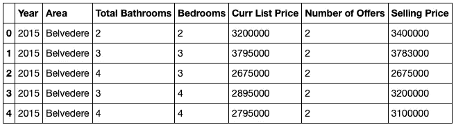
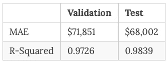

# 如何创建交互式 Dash Web 应用程序

> 原文：<https://towardsdatascience.com/how-to-create-an-interactive-dash-web-application-11ea210aa6d9?source=collection_archive---------22----------------------->


## 使用 Dash、Heroku、XGBoost 和 Pickling 创建预测性 Web 应用程序

您已经完成了数据科学，现在您需要向全世界展示结果！ [Dash](https://dash.plot.ly/introduction) 是一个用于构建 web 应用的 python 框架。Dash 基于 Flask、Plotly.js 和 React.js 编写，非常适合快速构建定制的 web 应用程序。一旦构建完成，网络应用程序可以很容易地部署在云平台上，如 [Heroku](https://www.heroku.com/what) 。

先说最终产品。下面这个简单的 web 应用程序使用户能够确定一个面临竞价大战的房屋的预计价格。预测价格基于 2015 年至 2019 年在加利福尼亚州马林县出售的所有单户住宅的历史数据，收到两个或更多报价。用户可以选择面积，卧室数量，浴室数量，预期报价和上市价格的数量，应用程序将提供预测的销售价格。

要使用 web 应用程序，只需选择预测选项卡，选择标准，应用程序将返回预测的报价。有关目标、数据、评估协议和模型选择的说明，请使用解释选项卡。“评估”选项卡提供了用于评估预测相对于实际中标报价的准确性的指标。

[预测竞价战中标价格的互动网络应用](https://multiple-offers.herokuapp.com)

如果您想了解如何开发自己的交互式 web 应用程序，请跟随我一步一步地指导您完成这个过程。

**关于代码的一句话**

该项目的所有代码、数据和相关文件都可以在 my [GitHub](https://github.com/JimKing100/Multiple_Offers) 访问。安装 Dash 后，从代码所在的目录运行本地计算机上的代码，并从您的终端运行 **python app.py** 。这将在您的本地主机(127.0.0.1:8050)上运行应用程序。

**数据科学**

由于本文的重点是交互式 web 应用程序的创建，我将简要描述用于预测最佳投标价格的数据科学。详情请看 colab 笔记本[这里](https://github.com/JimKing100/Multiple_Offers/blob/master/model/XGBoost.ipynb)。

原始数据是 2015 年至 2019 年在加利福尼亚州马林县出售的所有收到两个或更多报价的单户住宅的历史数据。导入原始数据并将区域映射到城市名称后，数据如下所示:



All Multiple Offer Sales in Marin County, CA 2015–2019

数据分为培训(2015 年至 2017 年)和验证(2018 年)以及测试(2019 年)，培训和验证分别涉及 2，973 次销售和 991 次销售，测试涉及 776 次销售。该测试集包含 2019 年约 11 个月的数据。

```
# Split into train and test - 2015-2018 in train, 2019 in test
low_cutoff = 2015
high_cutoff = 2019
train = df[(df['Year'] >= low_cutoff) & (df['Year'] < high_cutoff)]
test  = df[df['Year'] >= high_cutoff]# Split train into train and validation - 2015-2017 in train and 2018 in validation
cutoff = 2018
temp=train.copy()
train = temp[temp['Year'] < cutoff]
val  = temp[temp['Year'] >= cutoff]
```

最初进行了简单的线性回归，结果非常好。然后运行一个 XGBoost 模型，它有稍微好一点的指标，因此被选为模型。



XGBoost Metrics

**腌制**

Pickling 用于序列化和反序列化 Python 对象(也称为编组或扁平化)。当您想要保存过程以便在以后进行预测而不必重新训练您的模型时，Pickling 在使用机器学习算法时非常有用。在我们的例子中，我们将清理管道，并在我们的 web 应用程序中使用它来进行预测。

首先，我们从 joblib 导入 dump:

```
from joblib import dump
```

接下来，我们运行 XGBoost 模型并转储管道。这实际上是将管道保存到本地磁盘上一个名为 pipeline.joblib 的文件中。然后，这个文件被加载到 GitHub 中，并在 web 应用程序的 predict.py 代码中使用。

```
# Encode and fit a XGBoost model
target = 'Selling Price'features = train.columns.drop(target)
X_train = train[features]
y_train = train[target]
X_val = val[features]
y_val = val[target]
X_test = test[features]
y_test = test[target]pipeline = make_pipeline(
    ce.OneHotEncoder(use_cat_names=True), 
    XGBRegressor(n_estimators=200, n_jobs=-1)
)pipeline.fit(X_train, y_train)
dump(pipeline, 'pipeline.joblib')
y_pred = pipeline.predict(X_val)
```

**Dash App**

Dash 应用由定义应用外观的“布局”和创建交互性的“回调”组成。我们的基本 Dash 应用程序由 app.py 和 index.py 文件组成。如果你用过[烧瓶](https://flask.palletsprojects.com/en/1.1.x/)，那么这段代码看起来会很熟悉！

**app.py**

```
import dashexternal_stylesheets = ['[https://codepen.io/chriddyp/pen/bWLwgP.css'](https://codepen.io/chriddyp/pen/bWLwgP.css')]app = dash.Dash(__name__, external_stylesheets=external_stylesheets)
app.config.suppress_callback_exceptions = True
server = app.server
```

app.py 文件只是初始化和实例化 Dash 应用程序。

**index.py**

```
from dash.dependencies import Input, Output
import dash_core_components as dcc
import dash_html_components as htmlfrom app import app, server
from tabs import intro, predict, explain, evaluatestyle = {'maxWidth': '960px', 'margin': 'auto'}app.layout = html.Div([
    dcc.Markdown('# Multiple Offer Calculator'),
    dcc.Tabs(id='tabs', value='tab-intro', children=[
        dcc.Tab(label='Intro', value='tab-intro'),
        dcc.Tab(label='Predict', value='tab-predict'),
        dcc.Tab(label='Explain', value='tab-explain'),
        dcc.Tab(label='Evaluate', value='tab-evaluate'),
    ]),
    html.Div(id='tabs-content'),
], style=style)[@app](http://twitter.com/app).callback(Output('tabs-content', 'children'),
              [Input('tabs', 'value')])
def render_content(tab):
    if tab == 'tab-intro': return intro.layout
    elif tab == 'tab-predict': return predict.layout
    elif tab == 'tab-explain': return explain.layout
    elif tab == 'tab-evaluate': return evaluate.layoutif __name__ == '__main__':
    app.run_server(debug=True)
```

index.py 文件是应用程序的主要可执行文件。它分为两个主要部分:布局和回调。我们先来看一下布局。

**布局**

Dash 提供了两套可视化组件: **dash_html_components** 和 **dash_core_components** 。dash_hml_components 库为每个 HTML 标签提供了一个组件。dash_core_components 库是更高级别的组件，如选项卡、下拉列表、降价模块、图表等。

对于我们的应用程序的布局，我们将使用 html 保持简单。dcc 部门。app.layout 定义了我们在 html 中的布局。Div(在 HTML 文档中定义一个部分)dcc。Markdown 使用 [Markdown](https://commonmark.org/help/) 和 dcc 创建标题。Tab 创建四个标签，标签在标签中可见，一个值用于编码。就这样——我们基本上已经创建了主页！

**回调**

Dash 使用 **@app.callback** decorator 告诉应用程序如何处理输入和输出。在我们的应用程序中，输入是布局 dcc 中定义的 **id='tabs** 。有四个子项的选项卡—介绍、预测、解释和评估。输出是在 html.Div 中定义的 **id='tabs-content** '。当用户单击一个选项卡时，输入识别该选项卡，调用 **render_content(tab)** 构造函数(函数)将选项卡更改为被单击的选项卡，然后结果输出到 html.Div。就这样——一个非常简单的回调！

**预测选项卡**

了解了基础知识之后，让我们用预测选项卡来看看一个更复杂的例子。在 predict.py 代码中，我们将使用一个下拉菜单和四个滑动标签来获取我们的预测输入。然后，输入将用于运行我们的 pickled 预测并输出结果。

```
style = {'padding': '1.5em'}layout = html.Div([
    dcc.Markdown("""
        ### Predict
        Use the controls below to update your predicted offer, based on city,
        beds, baths, number of offers, and list price.
    """),html.Div(id='prediction-content', style={'fontWeight': 'bold'}),html.Div([
        dcc.Markdown('###### Area'),
        dcc.Dropdown(
            id='area',
            options=[{'label': city, 'value': city} for city in cities],
            value=cities[10]
        ),
    ], style=style),html.Div([
        dcc.Markdown('###### Bedrooms'),
        dcc.Slider(
            id='bedrooms',
            min=1,
            max=7,
            step=1,
            value=3,
            marks={n: str(n) for n in range(1, 7, 1)}
        ),
    ], style=style),html.Div([
        dcc.Markdown('###### Baths'),
        dcc.Slider(
            id='baths',
            min=1,
            max=9,
            step=1,
            value=2,
            marks={n: str(n) for n in range(1, 9, 1)}
        ),
    ], style=style),html.Div([
        dcc.Markdown('###### Number of Offers'),
        dcc.Slider(
            id='offers',
            min=2,
            max=15,
            step=1,
            value=3,
            marks={n: str(n) for n in range(2, 15, 1)}
        ),
    ], style=style),html.Div([
        dcc.Markdown('###### Listing Price'),
        dcc.Slider(
            id='list_price',
            min=1000000,
            max=3000000,
            step=100000,
            value=1500000,
            marks={n: f'{n/1000:.0f}k' for n in range(1000000, 3000000, 100000)}
        ),
    ], style=style),])[@app](http://twitter.com/app).callback(
    Output('prediction-content', 'children'),
    [Input('area', 'value'),
     Input('bedrooms', 'value'),
     Input('baths', 'value'),
     Input('offers', 'value'),
     Input('list_price', 'value')])
def predict(area, bedrooms, baths, offers, list_price):year = 2019
    df = pd.DataFrame(
        columns=['Year', 'Area', 'Total Bathrooms', 'Bedrooms', 'Curr List Price', 'Number of Offers'],
        data=[[year, area, baths, bedrooms, list_price, offers]]
    )pipeline = load('model/pipeline.joblib')
    y_pred_log = pipeline.predict(df)
    y_pred = y_pred_log[0]
    percent_over = ((y_pred - list_price) / list_price) * 100
    per_offer = percent_over / offers
    results = f'The predicted winning bid is ${y_pred:,.0f} which is {percent_over:.2f}% over the asking price or \
                {per_offer:.2f}% per offer.'return results
```

虽然这看起来可能有很多代码，但实际上非常简单。该布局仅由四个组件组成——html。dcc 部门。降价，dcc。我们的布局由六个 html 组成。Div (sections ),预测在第一节，组件在接下来的五节。五个组件提供输入。

每当任何单个输入发生变化时，都会调用回调函数，调用预测函数并将结果输出到第一部分。

注意在预测函数中:

**pipeline = load(' model/pipeline . joblib ')** 
这将加载转储的管道，允许使用很少的代码非常快速地进行预测。

这是对 Dash 的一个非常简单的介绍。如需了解更多详情，请查看 Dash 文档[此处](https://dash.plot.ly/introduction)。

**Heroku 部署**

一旦你让交互式网络应用在本地运行，你就可以让其他人通过使用公共托管服务(比如 Heroku)来访问它。Heroku 将托管该应用程序，允许您链接到它或使用 iframe。

在 Heroku 上托管的基本步骤是:

1.创建一个 Procfile 和 requirements.txt 文件。在我的[GitHub][4]里看到我的。

2.创建一个 Heroku 应用程序并连接到您的 GitHub 存储库。

3.运行应用程序！

我欢迎建设性的批评和反馈，请随时给我发私信。

有关 web 应用程序的更多背景信息，请参见配套文章“[如何赢得房地产投标战](/how-to-win-a-bidding-war-in-real-estate-49ef50903449)”。

这篇文章最初出现在我的 GitHub Pages 网站上。

在推特上关注我

*马林房地产数据来源:马林 MLS (BAREIS)，2015–2019 数据*