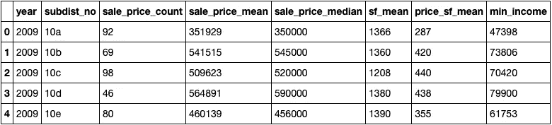
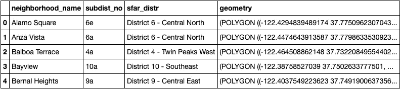
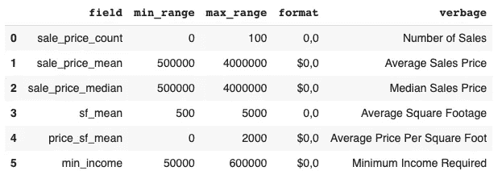
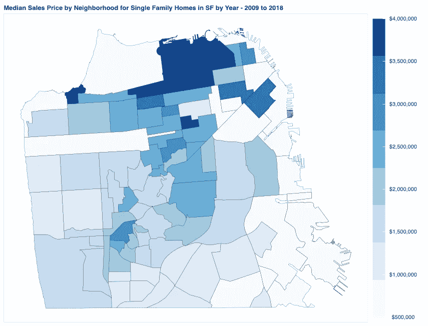

# 如何使用 Python 和 Bokeh 创建交互式地理地图

> 原文：<https://towardsdatascience.com/how-to-create-an-interactive-geographic-map-using-python-and-bokeh-12981ca0b567?source=collection_archive---------4----------------------->


## **使用 Choropleth 地图进行交互式数据可视化**

如果你正在寻找一种强大的方法来可视化地理数据，那么你应该学会使用交互式 Choropleth 地图。Choropleth 地图通过预定地理区域(例如国家、州或县)上的各种阴影图案或符号来表示统计数据。静态 Choropleth 图对于显示数据的一个视图很有用，但是交互式 Choropleth 图更强大，并且允许用户选择他们更喜欢查看的数据。

下面的互动图表提供了旧金山独栋房屋销售的细节。该图表按中位数销售价格、最低收入要求、平均销售价格、每平方英尺平均销售价格、平均平方英尺和销售数量(10 年的数据)对单户家庭房屋销售进行了细分。

[2009-2018 年旧金山独栋住宅销售互动图](https://sf-real-estate.herokuapp.com/SF_Real_Estate_Project)

如果您想了解如何开发自己的交互式地图，请跟随我一步一步地指导您完成这个过程。

**关于代码的一句话**

该项目的所有代码、数据和相关文件都可以在 my [GitHub](https://github.com/JimKing100/SF_Real_Estate_Live) 访问。在 Bokeh 服务器上运行的最终 Colab 代码可以在[这里](https://github.com/JimKing100/SF_Real_Estate_Live/blob/master/SF_Map_Code_Final.ipynb)找到。跳过数据清理和争论步骤的 Colab 代码的测试版本可以在[这里](https://github.com/JimKing100/SF_Real_Estate_Live/blob/master/SF_Map_Code_Test.ipynb)找到。

**使用 Python 和散景**

在探索了几种不同的方法之后，我发现 Python 和 Bokeh 的结合是创建交互式地图的最直接、最有据可查的方法。

让我们从图表所需的安装和导入开始。Pandas、numpy 和 math 是用于清理和争论数据的标准 Python 库。geopandas、json 和 bokeh 导入是映射所需的库。

我在 Colab 工作，需要安装 fiona 和 geopandas。

```
!pip install fiona
!pip install geopandas
```

**进口**

```
*# Import libraries*
**import** **pandas** **as** **pd**
**import** **numpy** **as** **np**
**import** **math**

**import** **geopandas**
**import** **json**

**from** **bokeh.io** **import** output_notebook, show, output_file
**from** **bokeh.plotting** **import** figure
**from** **bokeh.models** **import** GeoJSONDataSource, LinearColorMapper, ColorBar, NumeralTickFormatter
**from** **bokeh.palettes** **import** brewer

**from** **bokeh.io.doc** **import** curdoc
**from** **bokeh.models** **import** Slider, HoverTool, Select
**from** **bokeh.layouts** **import** widgetbox, row, column
```

**数据加载、清理和争论**

因为本文的重点是交互式地图的创建，所以我将简要描述用于加载、清理和争论数据的步骤。有兴趣可以在这里查看完整的清洗和角力[。](https://github.com/JimKing100/SF_Real_Estate_Live/blob/master/SF_Map_Code_Final.ipynb)

由于我有房地产许可证，我可以访问旧金山 MLS，我过去常常将 10 年(2009 年至 2018 年)的单户住宅销售数据下载到 **sf_data** 数据框架中。

一个重要的数据，房屋面积，大约 16%的数据为零。填充数据的一个合理方法是使用旧金山所有单户家庭卧室的平均房屋面积。例如，所有价值为零的一居室房屋都用旧金山所有一居室房屋销售的平均平方英尺来填充。

数据的关键列是邻居代码，它需要匹配邻居的映射代码。这将允许我们将数据与地图合并。字典用于更改数据中的邻域代码以匹配地图中的邻域代码。

最后，将年份和每平方英尺价格列添加到 **sf_data** 中，并使用 groupby 和聚合函数对 **sf_data** 进行汇总，以创建最终的 **neighborhood_data** 数据帧，其中所有数值字段都转换为整数值，以便于显示数据:



neighborhood_data DataFrame

**neighborhood_data** 数据框显示了按街区汇总的单户住宅销售情况。现在我们需要将这些数据映射到旧金山的社区地图上。

以下是已清理数据的快捷方式:

```
neighborhood_data = pd.read_csv('https://raw.githubusercontent.com/JimKing100/SF_Real_Estate_Live/master/data/neighborhood_data.csv')
```

**准备测绘数据和地理数据框架**

Bokeh 提供了几种处理地理数据的方法，包括切片提供商地图、Google 地图和 GeoJSON 数据。我们将使用 GeoJSON，这是一个流行的开放标准，用于用 JSON 表示地理特征。JSON (JavaScript Object Notation)是一种最小的、可读的数据结构化格式。散景使用 JSON 在散景服务器和 web 应用程序之间传输数据。

在典型的散景交互式图形中，数据源需要是 ColumnDataSource。这是散景中的一个关键概念。但是，在使用地图时，您可以使用 GeoJSONDataSource。

为了使我们在 Python 中处理地理空间数据更容易，我们使用了 GeoPandas。它结合了 pandas 和 shapely 的功能，在 pandas 中提供地理空间操作，并为 shapely 提供多种几何图形的高级接口。我们将使用 GeoPandas 创建地理数据框架，这是创建 GeoJSONDataSource 的前奏。

最后，我们需要一张 geojson 格式的地图。旧金山，通过他们的 DataSF 网站，有一个 geojson 格式的可导出的[邻居地图](https://data.sfgov.org/Geographic-Locations-and-Boundaries/Realtor-Neighborhoods/5gzd-g9ns)。

让我们通过以下代码展示如何创建地理数据框架。

```
*# Read the geojson map file for Realtor Neighborhoods into a GeoDataframe object*
sf = geopandas.read_file('https://raw.githubusercontent.com/JimKing100/SF_Real_Estate_Live/master/data/Realtor%20Neighborhoods.geojson')

*# Set the Coordinate Referance System (crs) for projections*
*# ESPG code 4326 is also referred to as WGS84 lat-long projection*
sf.crs = {'init': 'epsg:4326'}

*# Rename columns in geojson map file*
sf = sf.rename(columns={'geometry': 'geometry','nbrhood':'neighborhood_name', 'nid': 'subdist_no'}).set_geometry('geometry')

*# Change neighborhood id (subdist_no) for correct code for Mount Davidson Manor and for parks*
sf.loc[sf['neighborhood_name'] == 'Mount Davidson Manor', 'subdist_no'] = '4n'
sf.loc[sf['neighborhood_name'] == 'Golden Gate Park', 'subdist_no'] = '12a'
sf.loc[sf['neighborhood_name'] == 'Presidio', 'subdist_no'] = '12b'
sf.loc[sf['neighborhood_name'] == 'Lincoln Park', 'subdist_no'] = '12c'

sf.sort_values(by=['subdist_no'])
```

我们使用 geopandas 将 geojson 地图读入地理数据框架 **sf** 。然后，我们将坐标参考系统设置为经纬度投影。接下来，我们重命名几个列，并使用 set_geometry 将地理数据框设置为包含活动几何(要绘制的形状的描述)的“几何”列。最后，我们清理一些邻居 id 来匹配**邻居数据**。



sf GeoDataFrame

我们现在在 **neighborhood_data** 中有我们的邻居数据，在 **sf** 中有我们的映射数据。请注意，它们都有共同的列 subdist_no(邻域标识符)。

**为 GeoJSONDataSource 创建 JSON 数据**

我们现在需要创建一个函数，将我们的邻居数据与我们的地图数据合并，并将其转换为 Bokeh 服务器的 JSON 格式。

```
*# Create a function the returns json_data for the year selected by the user*
**def** json_data(selectedYear):
    yr = selectedYear

    *# Pull selected year from neighborhood summary data*
    df_yr = neighborhood_data[neighborhood_data['year'] == yr]

    *# Merge the GeoDataframe object (sf) with the neighborhood summary data (neighborhood)*
    merged = pd.merge(sf, df_yr, on='subdist_no', how='left')

    *# Fill the null values*
    values = {'year': yr, 'sale_price_count': 0, 'sale_price_mean': 0, 'sale_price_median': 0,
              'sf_mean': 0, 'price_sf_mean': 0, 'min_income': 0}
    merged = merged.fillna(value=values)

    *# Bokeh uses geojson formatting, representing geographical features, with json*
    *# Convert to json*
    merged_json = json.loads(merged.to_json())

    *# Convert to json preferred string-like object* 
    json_data = json.dumps(merged_json)
    **return** json_data
```

我们向 json_data 函数传递我们希望加载的数据年份(例如 2018 年)。然后，我们从 **neighborhood_data** 中提取所选年份的数据，并将其与 **sf** 中的映射数据合并。在用零填充空值(没有销售的街区，比如金门公园)之后，我们使用 json.loads 和 json.dumps 将合并的文件转换成 json 格式，在 **json_data** 中返回 JSON 格式的数据。

**互动地图主要代码**

我们仍然需要几段代码来制作交互式地图，包括彩条、散景小部件和工具、绘图功能和更新功能，但在我们详细讨论这些部分之前，让我们先看看主要代码。

```
*# Input geojson source that contains features for plotting for:*
*# initial year 2018 and initial criteria sale_price_median*
geosource = GeoJSONDataSource(geojson = json_data(2018))
input_field = 'sale_price_median'

*# Define a sequential multi-hue color palette.*
palette = brewer['Blues'][8]

*# Reverse color order so that dark blue is highest obesity.*
palette = palette[::-1]

*# Add hover tool*
hover = HoverTool(tooltips = [ ('Neighborhood','@neighborhood_name'),
                               ('# Sales', '@sale_price_count'),
                               ('Average Price', '$@sale_price_mean{,}'),
                               ('Median Price', '$@sale_price_median{,}'),
                               ('Average SF', '@sf_mean{,}'),
                               ('Price/SF ', '$@price_sf_mean{,}'),
                               ('Income Needed', '$@min_income{,}')])

*# Call the plotting function*
p = make_plot(input_field)

*# Make a slider object: slider* 
slider = Slider(title = 'Year',start = 2009, end = 2018, step = 1, value = 2018)
slider.on_change('value', update_plot)

*# Make a selection object: select*
select = Select(title='Select Criteria:', value='Median Sales Price', options=['Median Sales Price', 'Minimum Income Required',
                                                                               'Average Sales Price', 'Average Price Per Square Foot',
                                                                               'Average Square Footage', 'Number of Sales'])
select.on_change('value', update_plot)

*# Make a column layout of widgetbox(slider) and plot, and add it to the current document*
*# Display the current document*
layout = column(p, widgetbox(select), widgetbox(slider))
curdoc().add_root(layout)
```

让我们来分解代码:

1.  用我们 2018 年的初始数据创建我们的 GeoJSONDataSource 对象。
2.  定义用于颜色条和邻域映射值的调色板。
3.  添加一个 Bokeh HoverTool，当鼠标悬停在某个邻域上时显示数据。
4.  调用绘图函数，使用 sale_price_median 作为 initial_data(中间销售价格)来创建地图绘图。
5.  添加一个 Bokeh Slider 小部件，使用户能够根据年份更改数据。
6.  添加一个 Bokeh Select 小部件，使用户能够根据标准(例如，中等销售价格或最低收入要求)选择数据。
7.  在列中布局地图地块和微件，并将结果输出到由散景服务器显示的文档中。

**彩条**

彩条比我想象的要更有挑战性。原来，彩条是“附加”在绘图上的，当要求更改标准时，整个绘图都需要刷新。每个标准都有自己独特的最小和最大范围、显示格式和描述。例如,“销售额”的范围为 0-100，格式为整数，名称“销售额”需要在图的标题中更改。所以我创建了一个 **format_df** ,它详细描述了颜色栏和标题中需要的数据。

```
# This dictionary contains the formatting for the data in the plots
format_data = [('sale_price_count', 0, 100,'0,0', 'Number of Sales'),
               ('sale_price_mean', 500000, 4000000,'$0,0', 'Average Sales Price'),
               ('sale_price_median', 500000, 4000000, '$0,0', 'Median Sales Price'),
               ('sf_mean', 500, 5000,'0,0', 'Average Square Footage'),
               ('price_sf_mean', 0, 2000,'$0,0', 'Average Price Per Square Foot'),
               ('min_income', 50000, 600000,'$0,0', 'Minimum Income Required')
              ]

#Create a DataFrame object from the dictionary 
format_df = pd.DataFrame(format_data, columns = ['field' , 'min_range', 'max_range' , 'format', 'verbage'])
```



format_df DataFrame

**悬浮工具**

HoverTool 是一个相当简单的散景工具，允许用户将鼠标悬停在某个项目上并显示值。在主代码中，我们插入 HoverTool 代码，告诉它使用基于 neighborhood_name 的数据，并显示六个标准，使用“@”来表示列值。

```
*# Add hover tool*
hover = HoverTool(tooltips = [ ('Neighborhood','@neighborhood_name'),
                               ('# Sales', '@sale_price_count'),
                               ('Average Price', '$@sale_price_mean{,}'),
                               ('Median Price', '$@sale_price_median{,}'),
                               ('Average SF', '@sf_mean{,}'),
                               ('Price/SF ', '$@price_sf_mean{,}'),
                               ('Income Needed', '$@min_income{,}')])
```

**Widgets 和回调函数**

我们使用两个散景部件，滑块对象和选择对象。在我们的示例中，Slider 对象允许用户选择要显示的年份(或行), select 对象允许用户选择标准(或列)。

这两个小部件的工作原理相同——回调。在下面的代码中，小部件传递一个“值”并调用一个名为 update_plot 的函数。调用 on_change 方法(当使用小部件(事件处理程序)进行更改时)。

```
*# Make a slider object: slider* 
slider = Slider(title = 'Year',start = 2009, end = 2018, step = 1, value = 2018)
slider.on_change('value', update_plot)

*# Make a selection object: select*
select = Select(title='Select Criteria:', value='Median Sales Price', options=['Median Sales Price', 'Minimum Income Required',
                                                                               'Average Sales Price', 'Average Price Per Square Foot',
                                                                               'Average Square Footage', 'Number of Sales'])
select.on_change('value', update_plot)
```

回调函数 update_plot 有三个参数。attr 参数只是您传递的“值”(例如 slider.value 或 select.value)，新旧参数是散景使用的内部参数，您不需要处理它们。

根据所使用的小部件，我们或者基于年份(yr)选择 new_data (Slider ),或者基于条件(cr)重新设置 input_field (Select)。然后，我们根据当前的 input_field 重新设置绘图。

最后，我们布局图和小部件，清除旧文档并输出包含新数据的新文档。

```
*# Define the callback function: update_plot*
**def** update_plot(attr, old, new):
    *# The input yr is the year selected from the slider*
    yr = slider.value
    new_data = json_data(yr)

    *# The input cr is the criteria selected from the select box*
    cr = select.value
    input_field = format_df.loc[format_df['verbage'] == cr, 'field'].iloc[0]

    *# Update the plot based on the changed inputs*
    p = make_plot(input_field)

    *# Update the layout, clear the old document and display the new document*
    layout = column(p, widgetbox(select), widgetbox(slider))
    curdoc().clear()
    curdoc().add_root(layout)

    *# Update the data*
    geosource.geojson = new_data
```

**创建绘图功能**

地图的最后一部分是 make_plot，绘图函数。让我们来分解一下:

1.  我们将 field_name 传递给它，以指示我们要绘制哪一列数据(例如，销售价格中值)。
2.  使用 format_df，我们为颜色条提取最小范围、最大范围和格式。
3.  我们调用 Bokeh 的 LinearColorMapper 来设置调色板和颜色条的范围。
4.  我们使用 Bokeh 的 NumeralTickFormatter 和 ColorBar 创建了 ColorBar。
5.  我们创建具有适当标题的绘图图形。
6.  我们使用 Bokeh 的 p.patches 字形和 geosource 中的数据创建“面片”，在我们的例子中是邻域多边形。
7.  我们将 colorbar 和 HoverTool 添加到绘图中，并返回绘图 p。

```
*# Create a plotting function*
**def** make_plot(field_name):    
  *# Set the format of the colorbar*
  min_range = format_df.loc[format_df['field'] == field_name, 'min_range'].iloc[0]
  max_range = format_df.loc[format_df['field'] == field_name, 'max_range'].iloc[0]
  field_format = format_df.loc[format_df['field'] == field_name, 'format'].iloc[0]

  *# Instantiate LinearColorMapper that linearly maps numbers in a range, into a sequence of colors.*
  color_mapper = LinearColorMapper(palette = palette, low = min_range, high = max_range)

  *# Create color bar.*
  format_tick = NumeralTickFormatter(format=field_format)
  color_bar = ColorBar(color_mapper=color_mapper, label_standoff=18, formatter=format_tick,
  border_line_color=**None**, location = (0, 0))

  *# Create figure object.*
  verbage = format_df.loc[format_df['field'] == field_name, 'verbage'].iloc[0]

  p = figure(title = verbage + ' by Neighborhood for Single Family Homes in SF by Year - 2009 to 2018', 
             plot_height = 650, plot_width = 850,
             toolbar_location = **None**)
  p.xgrid.grid_line_color = **None**
  p.ygrid.grid_line_color = **None**
  p.axis.visible = **False**

  *# Add patch renderer to figure.* 
  p.patches('xs','ys', source = geosource, fill_color = {'field' : field_name, 'transform' : color_mapper},
          line_color = 'black', line_width = 0.25, fill_alpha = 1)

  *# Specify color bar layout.*
  p.add_layout(color_bar, 'right')

  *# Add the hover tool to the graph*
  p.add_tools(hover)
  **return** p
```

**将所有这些放在一起**

[测试代码](https://github.com/JimKing100/SF_Real_Estate_Live/blob/master/SF_Map_Code_Test.ipynb)将所有这些放在一起，用 Colab 笔记本中的 ColorBar 和 HoverTool 打印出一个静态地图。为了使用滑块和选择来查看交互式组件，您需要在接下来的步骤中使用散景服务器。(您将需要 fiona 和 geopandas 导入来运行下面的代码)

**带彩条和悬浮工具的静态地图**



**散景服务器**

我使用 2018 年的数据和 Colab 中的中值销售价格开发了静态地图，以便在添加互动部分之前让大部分代码工作。为了测试和查看散景的交互式组件，您需要遵循以下步骤。

1.  在电脑上安装散景服务器。
2.  下载。ipynb 文件复制到计算机上的本地目录中。
3.  从终端将目录更改为带有。ipynb 文件。
4.  从终端运行以下命令:bokeh serve(两个破折号)show filename.ipynb
5.  这将在您的浏览器上打开一个本地主机，并输出您的交互式图形。如果有错误，应该可以在终端中看到。

**公众通过 Heroku 进入互动图表**

一旦你让交互式图形在本地工作，你就可以让其他人通过使用一个公共的散景托管服务(比如 Heroku)来访问它。Heroku 将托管交互式图形，允许您链接到它(如本文中所示)或使用 iframe，如在我的 [GitHub Pages](https://jimking100.github.io/2019-09-04-Post-3/) 站点上。

在 Heroku 上托管的基本步骤是:

1.  更改 Colab 笔记本，注释掉 fiona 和 geopandas 的安装。Heroku 拥有这些项目，如果它们出现在代码中，构建将会失败。
2.  更改 Colab 笔记本，注释掉最后两行(output_notebook()和 show(p))。
3.  将 Colab 笔记本下载为. py 文件，并上传到 GitHub 存储库。
4.  创建一个 Heroku 应用程序并连接到包含您的。py 文件。
5.  创建一个 Procfile 和 requirements.txt 文件。在我的 [GitHub](https://github.com/JimKing100/SF_Real_Estate_Live) 里看到我的。
6.  运行应用程序！

我欢迎建设性的批评和反馈，请随时给我发私信。

在推特上关注我

这篇文章最初出现在我的 [GitHub Pages](https://jimking100.github.io/2019-09-04-Post-3/) 网站上，交互图也可以在*走向数据科学*文章[旧金山理工就业？先查房价！](https://medium.com/p/san-francisco-tech-job-check-home-prices-first-8ef0367b31b?source=email-607257182a94--writer.postDistributed&sk=a5ff66505407932f3727ad3c0480234a)